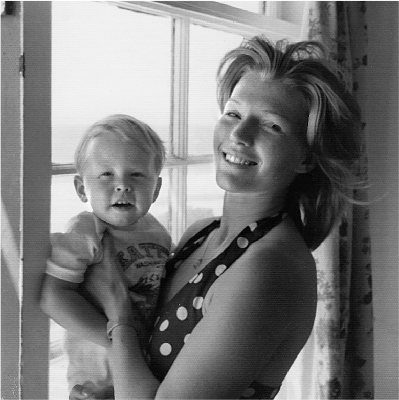
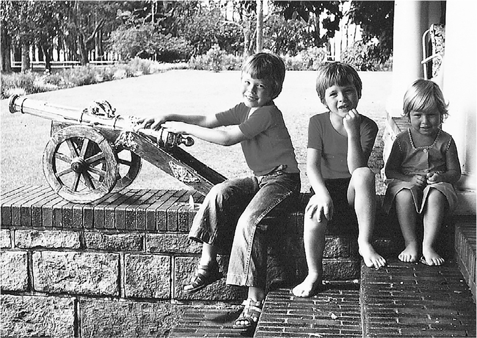
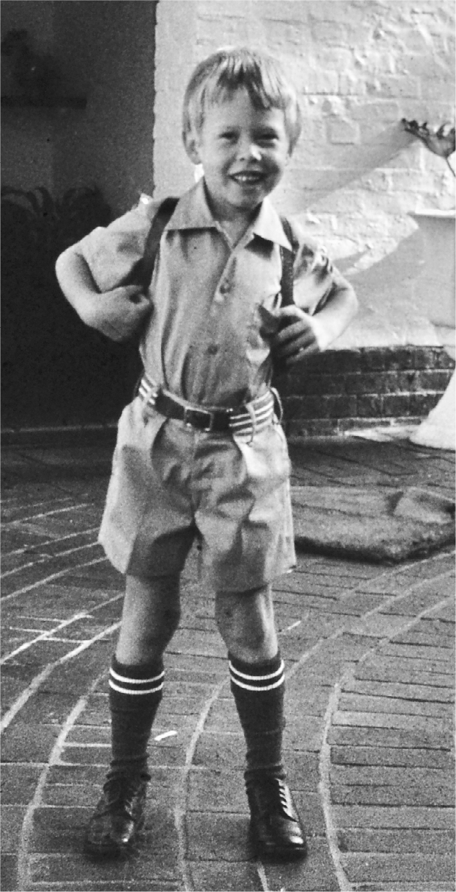
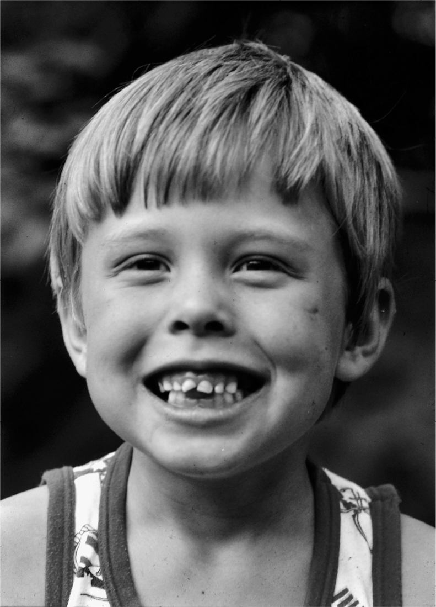

# Chapter 2: A Mind of His Own: Pretoria, the 1970s

# 2 A Mind of His Own Pretoria, the 1970s

Elon and Maye Musk

Elon, Kimbal, and Tosca

Elon ready for school

[*OceanofPDF.com*](https://oceanofpdf.com)

## Lonely and determined

At 7:30 on the morning of June 28, 1971, Maye Musk gave birth to an eight-pound, eight-ounce boy with a very large head.

At first she and Errol were going to name him Nice, after the town in France where he was conceived. History may have been different, or at least amused, if the boy had to go through life with the name Nice Musk. Instead, in the hope of making the Haldemans happy, Errol agreed that the boy would have names from that side of the family: Elon, after Maye’s grandfather J. Elon Haldeman, and Reeve, the maiden name of Maye’s maternal grandmother.

Errol liked the name Elon because it was biblical, and he later claimed that he had been prescient. As a child, he says, he heard about a science fiction book by the rocket scientist Wernher von Braun called *Project Mars*, which describes a colony on the planet run by an executive known as “the Elon.”

Elon cried a lot, ate a lot, and slept little. At one point Maye decided to just let him cry until he fell asleep, but she changed her mind after neighbors called the police. His moods switched rapidly; when he wasn’t crying, his mother says, he was really sweet.

Over the next two years, Maye had two more children, Kimbal and Tosca. She didn’t coddle them. They were allowed to roam freely. There was no nanny, just a housekeeper who paid little attention when Elon began experimenting with rockets and explosives. He says he’s surprised he made it through childhood with all of his fingers intact.

When he was three, his mother decided that because he was so intellectually curious he should be in nursery school. The principal tried to dissuade her, pointing out that being younger than anyone else in the class would present social challenges. They should wait another year. “I can’t do that,” Maye said. “He needs someone besides me to talk to. I really have this genius child.” She prevailed.

It was a mistake. Elon had no friends, and by the time he was in second grade he was tuning out. “The teacher would come up to me and yell at me, but I would not really see or hear her,” he says. His parents got called in to see the principal, who told them, “We have reason to believe that Elon is retarded.” He spent most of his time in a trance, not listening, one of his teachers explained. “He looks out of the window all the time, and when I tell him to pay attention he says, ‘The leaves are turning brown now.’ ” Errol replied that Elon was right, the leaves were turning brown.

The impasse was broken when his parents agreed that Elon’s hearing should be tested, as if that might be the problem. “They decided it was an ear problem, so they took my adenoids out,” he says. That calmed down the school officials, but it did nothing to change his tendency to zone out and retreat into his own world when thinking. “Ever since I was a kid, if I start to think about something hard, then all of my sensory systems turn off,” he says. “I can’t see or hear or anything. I’m using my brain to compute, not for incoming information.” The other kids would jump up and down and wave their arms in his face to see if they could summon back his attention. But it didn’t work. “It’s best not to try to break through when he has that vacant stare,” his mother says.

Compounding his social problems was his unwillingness to suffer politely those he considered fools. He used the word “stupid” often. “Once he started going to school, he became so lonely and sad,” his mother says. “Kimbal and Tosca would make friends on the first day and bring them home, but Elon never brought friends home. He wanted to have friends, but he just didn’t know how.”

As a result, he was lonely, very lonely, and that pain remained seared into his soul. “When I was a child, there’s one thing I said,” he recalled in an interview with *Rolling Stone* during a tumultuous period in his love life in 2017. “ ‘I never want to be alone.’ That’s what I would say. ‘I don’t want to be alone.’ ”

One day when he was five, one of his cousins was having a birthday party, but Elon was punished for getting into a fight and told to stay home. He was a very determined kid, and he decided to walk on his own to his cousin’s house. The problem was that it was on the other side of Pretoria, a walk of almost two hours. Plus, he was too young to read the road signs. “I kind of knew what the route looked like because I had seen it from a car, and I was determined to get there, so I just started walking,” he says. He managed to arrive just as the party was ending. When his mother saw him coming down the road, she freaked out. Fearing he would be punished again, he climbed a maple tree and refused to come down. Kimbal remembers standing beneath the tree and staring at his older brother in awe. “He has this fierce determination that blows your mind and was sometimes frightening, and still is.”

When he was eight, he focused his determination on getting a motorcycle. Yes, at age eight. He would stand next to his father’s chair and make his case, over and over. When his father picked up a newspaper and ordered him to be quiet, Elon would continue to stand there. “It just was extraordinary to watch,” Kimbal says. “He would stand there silently, then resume his argument, then stand silent.” This happened every evening for weeks. His father finally caved and got Elon a blue-and-gold 50cc Yamaha.

Elon also had a tendency to be spacey and wander off on his own, oblivious to what others were doing. On a family trip to Liverpool to see some of their relatives when he was eight, his parents left him and his brother in a park to play by themselves. It was not in his nature to stay put, so he started wandering the streets. “Some kid found me crying and took me to his mom, who gave me milk and biscuits and called the police,” he recalls. When he was reunited with his parents at the police station, he was unaware that anything was amiss.

“It was insane to leave me and my brother alone in a park at that age,” he says, “but my parents weren’t overprotective like parents are today.” Years later, I watched him at a solar roof construction site with his two-year-old boy, known as X. It was 10 p.m., and there were forklifts and other moving equipment lit by two spotlights that cast big shadows. Musk put X on the ground so the boy could explore on his own, which he did without fear. As he poked around amid the wires and cables, Musk glanced at him occasionally, but refrained from intervening. Finally, after X started to climb on a moving spotlight, Musk walked over and picked him up. X squirmed and squealed, unhappy about being restrained.

---

Musk would later talk about—even joke about—having Asperger’s, a common name for a form of autism-spectrum disorder that can affect a person’s social skills, relationships, emotional connectivity, and self-regulation. “He was never actually diagnosed as a kid,” his mother says, “but he says he has Asperger’s, and I’m sure he’s right.” The condition was exacerbated by his childhood traumas. Whenever he would later feel bullied or threatened, his close friend Antonio Gracias says, the PTSD from his childhood would hijack his limbic system, the part of the brain that controls emotional responses.

As a result, he was bad at picking up social cues. “I took people literally when they said something,” he says, “and it was only by reading books that I began to learn that people did not always say what they really meant.” He had a preference for things that were more precise, such as engineering, physics, and coding.

Like all psychological traits, Musk’s were complex and individualized. He could be very emotional, especially about his own children, and he felt acutely the anxiety that comes from being alone. But he didn’t have the emotional receptors that produce everyday kindness and warmth and a desire to be liked. He was not hardwired to have empathy. Or, to put it in less technical terms, he could be an asshole.

## The divorce

Maye and Errol Musk were at an Oktoberfest celebration with three other couples, drinking beer and having fun, when a guy at another table whistled at Maye and called her sexy. Errol was furious, but not at the guy. The way Maye remembers it, he lunged and was about to hit her, and a friend had to restrain him. She fled to her mother’s house. “Over time, he had gotten crazier,” Maye later said. “He would hit me when the kids were around. I remember that Elon, who was five, would hit him on the backs of his knees to try to stop him.”

Errol calls the accusations “absolute rubbish.” He claims he adored Maye, and over the years he tried to win her back. “I’ve never laid a hand on a woman in my life, and certainly none of my wives,” he says. “That’s one of women’s weapons is to cry that the man abused her, to cry and to lie. And a man’s weapons are to buy and to sign.”

On the morning after the Oktoberfest altercation, Errol came over to Maye’s mother’s house, apologized, and asked Maye to come back. “Don’t you dare touch her again,” Winnifred Haldeman said. “If you do, she’s coming to live with me.” Maye said that he never hit her after that, but his verbal abuse continued. He would tell her that she was “boring, stupid, and ugly.” The marriage never recovered. Errol later admitted it was his fault. “I had a very pretty wife, but there were always prettier, younger girls,” he said. “I really loved Maye, but I screwed up.” They divorced when Elon was eight.

Maye and the children moved to a house on the coast near Durban, about 380 miles south of the Pretoria-Johannesburg area, where she juggled jobs as a model and dietician. There was little money. She bought her kids secondhand books and uniforms. On some weekends and holidays the boys (but usually not Tosca) would take the train to see their father in Pretoria. “He would send them back without any clothes or bags, so I had to buy them new clothes every time,” she says. “He said that I would eventually return to him, because I would be so poverty-stricken and wouldn’t be able to feed them.”

Often she would have to travel on a modeling job or to give a nutrition lecture, leaving the kids at home. “I never felt guilty about working full-time, because I didn’t have a choice,” she says. “My children had to be responsible for themselves.” The freedom taught them to be self-reliant. When they faced a problem, she had a stock response: “You’ll figure it out.” As Kimbal recalls, “Mom wasn’t soft and cuddly, and she was always working, but that was a gift for us.”

Elon developed into a night person, staying up until dawn reading books. When he saw his mother’s light go on at 6 a.m., he would crawl into bed and fall asleep. That meant she had trouble getting him up in time for school, and on nights when she was away, he would sometimes not get to class until 10 a.m. After getting calls from the school, Errol launched a custody battle and had subpoenas issued for Elon’s teachers, Maye’s modeling agent, and their neighbors. Right before going to trial, Errol dropped the case. Every few years, he would initiate another court action and then drop it. When Tosca recounts these tales, she begins to cry. “I remember Mom just sitting there, sobbing on the couch. I didn’t know what to do. All I could do was to hold her.”

Maye and Errol were each drawn to dramatic intensity rather than domestic bliss, a trait they would pass on. After her divorce, Maye began dating another abusive man. The children hated him and would occasionally put tiny firecrackers in his cigarettes that would explode when he lit up. Soon after the man proposed marriage, he got another woman pregnant. “She had been a friend of mine,” Maye says. “We had modeled together.”

With broken tooth and scar

[*OceanofPDF.com*](https://oceanofpdf.com)
