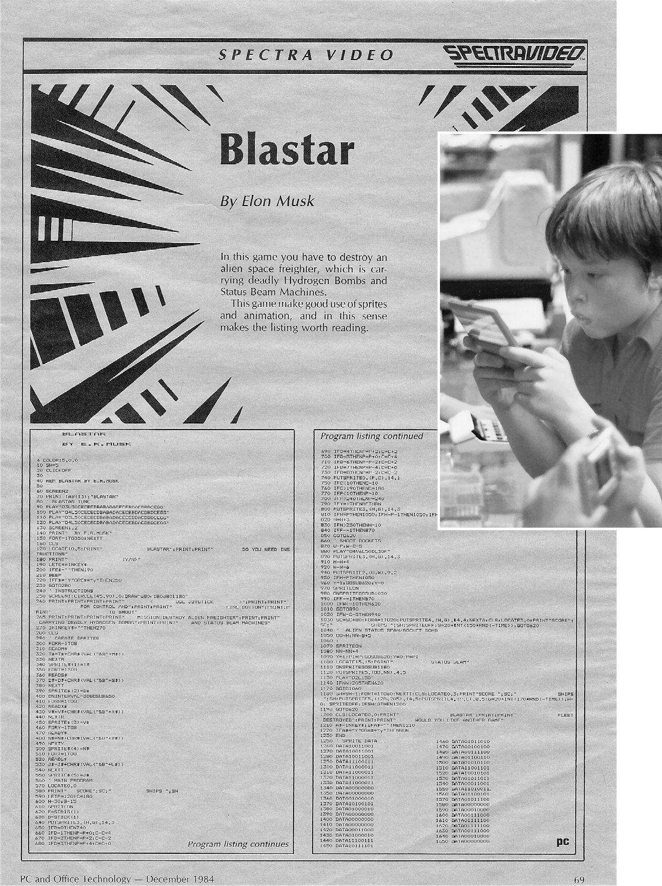

# Chapter 4: The Seeker: Pretoria, the 1980s

# 4 The Seeker Pretoria, the 1980s

## Existential crisis

When Musk was young, his mother started taking him to Sunday school at the local Anglican Church, where she was a teacher. It did not go well. She would tell her class stories from the Bible, and he would question them. “What do you mean, the waters parted?” he asked. “That’s not possible.” When she told the story of Jesus feeding the crowd with loaves and fishes, he countered that things cannot materialize out of nothing. Having been baptized, he was expected to take communion, but he began questioning that as well. “I took the blood and body of Christ, which is weird when you’re a kid,” he says. “I said, ‘What the hell is this? Is this a weird metaphor for cannibalism?’ ” Maye decided to let Elon stay home and read on Sunday mornings.

His father, who was more God-fearing, told Elon that there were things that could not be known through our limited senses and minds. “There are no atheist pilots,” he would say, and Elon would add, “There are no atheists at exam time.” But Elon came to believe early on that science could explain things and so there was no need to conjure up a Creator or a deity that would intervene in our lives.

When he reached his teens, it began to gnaw at him that something was missing. Both the religious and the scientific explanations of existence, he says, did not address the really big questions, such as *Where did the universe come from, and why does it exist?* Physics could teach everything about the universe except why. That led to what he calls his adolescent existential crisis. “I began trying to figure out what the meaning of life and the universe was,” he says. “And I got real depressed about it, like maybe life may have no meaning.”

Like a good bookworm, he addressed these questions through reading. At first, he made the typical mistake of angsty adolescents and read existential philosophers, such as Nietzsche, Heidegger, and Schopenhauer. This had the effect of turning confusion into despair. “I do not recommend reading Nietzsche as a teenager,” he says.

Fortunately, he was saved by science fiction, that wellspring of wisdom for game-playing kids with intellects on hyperdrive. He plowed through the entire sci-fi section in his school and local libraries, then pushed the librarians to order more.

One of his favorites was Robert Heinlein’s *The Moon Is a Harsh Mistress*, a novel about a lunar penal colony. It is managed by a supercomputer, nicknamed Mike, that is able to acquire self-awareness and a sense of humor. The computer sacrifices its life during a rebellion at the penal colony. The book explores an issue that would become central to Musk’s life: Will artificial intelligence develop in ways that benefit and protect humanity, or will machines develop intentions of their own and become a threat to humans?

That topic is central to what became another of his favorites, Isaac Asimov’s robot stories. The tales formulate laws of robotics that are designed to make sure robots do not get out of control. In the final scene of his 1985 novel *Robots and Empire*, Asimov expounds the most fundamental of these rules, dubbed the Zeroth Law: “A robot may not harm humanity, or, through inaction, allow humanity to come to harm.” The heroes of Asimov’s *Foundation* series of books develop a plan to send settlers to distant regions of the galaxy to preserve human consciousness in the face of an impending dark age.

More than thirty years later, Musk unleashed a random tweet about how these ideas motivated his quest to make humans a space-faring species and to harness artificial intelligence to be at the service of humans: “Foundation Series & Zeroth Law are fundamental to creation of SpaceX.”

## The Hitchhiker’s Guide

The science fiction book that most influenced his wonder years was Douglas Adams’s *The Hitchhiker’s Guide to the Galaxy*. The jaunty and wry tale helped shape Musk’s philosophy and added a dollop of droll humor to his serious mien. “*The Hitchhiker’s Guide*,” he says, “helped me out of my existential depression, and I soon realized it was amazingly funny in all sorts of subtle ways.”

The story involves a human named Arthur Dent who is rescued by a passing spaceship seconds before the Earth is destroyed by an alien civilization that is building a hyperspace highway. Along with his alien rescuer, Dent explores various nooks and crannies of the galaxy, which is run by a two-headed president who “had turned unfathomability into an art form.” The denizens of the galaxy are trying to figure out the “Answer to The Ultimate Question of Life, the Universe, and Everything.” They build a supercomputer that after seven million years spouts out the answer: 42. When that provokes a befuddled howl, the computer replies, “That quite definitely is the answer. I think the problem, to be quite honest with you, is that you’ve never actually known what the question is.” That lesson stuck with Musk. “I took from the book that we need to extend the scope of consciousness so that we are better able to ask the questions about the answer, which is the universe,” he says.

*The Hitchhiker’s Guide*, combined with Musk’s later immersion into video and tabletop simulation games, led to a lifelong fascination with the tantalizing thought that we might merely be pawns in a simulation devised by some higher-order beings. As Douglas Adams writes, “There is a theory which states that if ever anyone discovers exactly what the Universe is for and why it is here, it will instantly disappear and be replaced by something even more bizarre and inexplicable. There is another theory which states that this has already happened.”

## Blastar

In the late 1970s, the role-playing game *Dungeons & Dragons* became a popular obsession among the global tribe of geeks. Elon, Kimbal, and their Rive cousins immersed themselves in the game, which involves sitting around a table and, guided by character sheets and the roll of dice, embarking on fantasy adventures. One of the players serves as the Dungeon Master, refereeing the action.

Elon usually played the Dungeon Master and, surprisingly, did it with gentleness. “Even as a kid, Elon had a whole bunch of different demeanors and moods,” says his cousin Peter Rive. “As a Dungeon Master, he was incredibly patient, which is not, in my experience, always his default personality, if you know what I mean. It happens sometimes, and it’s so beautiful when it does.” Instead of pressuring his brother and cousins, he would turn very analytical to describe the options they had in each situation.

Together they entered a tournament in Johannesburg, at which they were the youngest players. The tournament’s Dungeon Master assigned their mission: you have to save this woman by figuring out who in the game is the bad guy and killing him. Elon looked at the Dungeon Master and said, “I think you’re the bad guy.” And so they killed him. Elon was right, and the game, which was supposed to last a few hours, was over. The organizers accused them of somehow cheating and at first tried to deny them the prize. But Musk prevailed. “These guys were idiots,” he says. “It was so obvious.”

Musk saw his first computer around the time he turned eleven. He was in a shopping mall in Johannesburg, and he stood there for minutes just staring at it. “I had read computer magazines,” he says, “but I had never actually seen a computer before.” As with the motorcycle, he hounded his father to get him one. Errol was bizarrely averse to computers, claiming they were good only for time-wasting games, not engineering. So Elon saved his money from odd jobs and bought a Commodore VIC-20, one of the earliest personal computers. It could play games such as *Galaxian* and *Alpha Blaster*, in which a player attempts to protect Earth from alien invaders.

The computer came with a course in how to program in BASIC that involved sixty hours of lessons. “I did it in three days, barely sleeping,” he remembers. A few months later, he tore out an ad for a conference on personal computers at a university and told his father he wanted to attend. Again, his father balked. It was an expensive seminar, about $400, and not meant for children. Elon replied that it was “essential” and just stood next to his father staring. Over the next few days, Elon would pull the ad out of his pocket and renew his demand. Finally his father was able to talk the university into giving a discounted price for Elon to stand in the back. When Errol came to pick him up at the end, he found Elon engaging with three of the professors. “This boy must get a new computer,” one of them declared.

After he aced a programming skills test at his school, he got an IBM PC/XT and taught himself to program using Pascal and Turbo C++. At age thirteen, he was able to create a video game, which he named *Blastar*, using 123 lines of BASIC and some simple assembly language to get the graphics to work. He submitted it to *PC and Office Technology* magazine, and it appeared in the December 1984 issue with a short introduction explaining, “In this game, you have to destroy an alien space freighter, which is carrying deadly Hydrogen Bombs and Status Beam Machines.” Although it’s unclear what a Status Beam Machine is, the concept sounds cool. The magazine paid him $500, and he proceeded to sell it two other games, one like *Donkey Kong* and the other simulating roulette and blackjack.

Thus began a lifelong addiction to video games. “If you’re playing with Elon, you play pretty much nonstop until finally you have to eat,” Peter Rive says. On one trip to Durban, Elon figured out how to hack the games in a mall. He was able to hotwire the system so that they could play for hours without using any coins.

He then came up with a grander idea: the cousins could create a video-game arcade of their own. “We knew exactly which games were the most popular, so it seemed like a sure thing,” Elon says. He figured out how the cash flow could finance the machines. But when the boys tried to get the city permits, they were told they needed someone over eighteen to sign the application. Kimbal, who had filled out the thirty pages of forms, decided that they couldn’t ask Errol. “He was just too hard of a human,” Kimbal says. “So we went to Russ and Pete’s dad, and he flipped out. That basically shut the whole thing down.”

