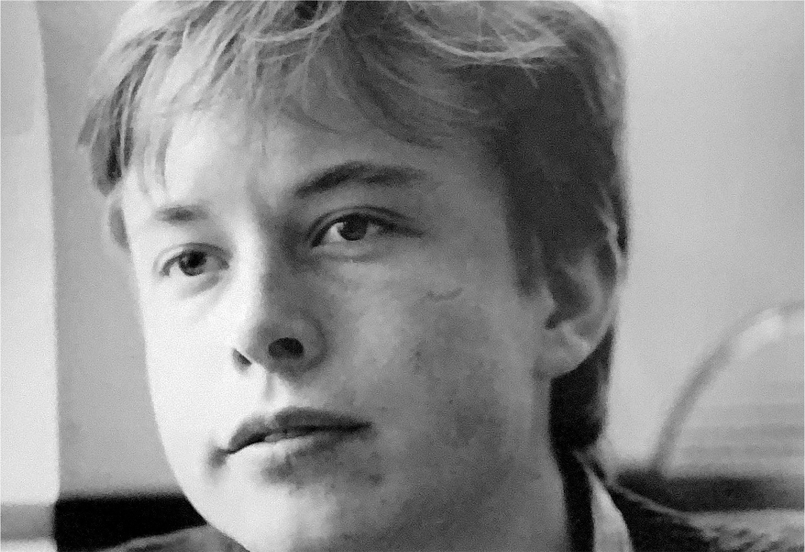

# Chapter 5: Escape Velocity: Leaving South Africa, 1989

# 5 Escape Velocity Leaving South Africa, 1989

## Jekyll and Hyde

At age seventeen, after seven years of living with his father, Elon realized that he would have to escape. Life with him had become increasingly unnerving.

There were times when Errol would be jovial and fun, but occasionally he would become dark, verbally abusive, and possessed by fantasies and conspiracies. “His mood could change on a dime,” Tosca says. “Everything could be super, then within a second he would be vicious and spewing abuse.” It was almost as if he had a split personality. “One minute he would be super friendly,” Kimbal says, “and the next he would be screaming at you, lecturing you for hours—literally two or three hours while he forced you to just stand there—calling you worthless, pathetic, making scarring and evil comments, not allowing you to leave.”

Elon’s cousins became reluctant to visit. “You never knew what you were in for,” Peter Rive says. “Sometimes Errol would be like, ‘I just got us some new motorbikes so let’s jump on them.’ At other times he would be angry and threatening and, oh fuck, make you clean the toilets with a toothbrush.” When Peter tells me this, he pauses for a moment and then, a bit hesitantly, notes that Elon sometimes has similar mood swings. “When Elon’s in a good mood, it’s like the coolest, funnest thing in the world. And when he’s in a bad mood, he goes really dark, and you’re just walking on eggshells.”

One day Peter came over to the house and found Errol sitting in his underwear at the kitchen table with a plastic roulette wheel. He was trying to see whether microwaves could affect it. He would spin the wheel, mark down the result, then spin it and put it in a microwave oven and record the result. “It was nuts,” Peter says. Errol had become convinced that he could find a system for beating the game. He dragged Elon to the Pretoria casino many times, dressing him up so that he looked older than sixteen, and had him write down the numbers while Errol used a calculator hidden under a betting card.

Elon went to the library and read a few books on roulette and even wrote a roulette simulation program on his computer. He then tried to convince his father that none of his schemes would work. But Errol believed that he had found a deeper truth about probability and, as he later described it to me, an “almost total solution to what is called randomness.” When I asked him to explain it, he said, “There are no ‘random events’ or ‘chance.’ All events follow the Fibonacci Sequence, like the Mandelbrot Set. I went on to discover the relationship between ‘chance’ and the Fibonacci Sequence. This is the subject for a scientific paper. If I share it, all activities relying on ‘chance’ will be ruined, so I am in doubt as to doing that.”

I’m not quite sure what all that means. Neither is Elon: “I don’t know how he went from being great at engineering to believing in witchcraft. But he somehow made that evolution.” Errol can be very forceful and occasionally convincing. “He changes reality around him,” Kimbal says. “He will literally make up things, but he actually believes his own false reality.”

Sometimes Errol would make sweeping assertions to his kids that were unconnected to facts, such as insisting that in the United States the president is considered divine and cannot be criticized. At other times he would weave fanciful tales that cast himself as either the hero or the victim. All would be asserted with such conviction that Elon and Kimbal would find themselves questioning their own view of reality. “Can you imagine growing up like that?” Kimbal asks. “It was mental torture, and it infects you. You end up asking, ‘What is reality?’ ”

I found myself getting caught up in Errol’s tangled web. In a series of calls and emails over the course of two years, he gave me varying accounts of his relationship with, and his feelings for, his kids, Maye, and his stepdaughter, with whom he would have two children (more on that later). “Elon and Kimbal have developed their own narrative about what I was like, and it doesn’t accord with the facts,” he claims. Their tales about him being psychologically abusive, he insists, are told to please their mother. But when I press him, he tells me to go with their version. “I don’t care if they choose a different narrative, as long as they are happy. I have no desire for it to be my word versus theirs. Let them have the floor.”

---

When talking about his father, Elon will sometimes let loose a laugh, a somewhat harsh and bitter one. It’s similar to the laugh that his father has. Some of the words Elon uses, the way he stares, his sudden transitions from light to dark to light, remind his family members of the Errol simmering inside of him. “I would see shades of these horrible stories Elon told me surface in his own behavior,” says Justine, Elon’s first wife. “It made me realize how difficult it is not to be shaped by what we grew up with, even when that’s not what we want.” Every now and then, she dared to say something like “You’re turning into your father.” She explains, “It was our code phrase to warn him that he was going into the realm of darkness.”

But Justine says that Elon, who was always emotionally invested in their children, is different from his father in a fundamental way: “With Errol, there was a sense that really bad things could happen around him. Whereas if the zombie apocalypse happened, you’d want to be on Elon’s team, because he would figure out a way to get those zombies in line. He can be very harsh, but at the end of the day, you can trust him to find a way to prevail.”

In order for that to happen, he had to move on. It was time to leave South Africa.

## A one-way ticket

Musk began pushing both his mother and father, trying to convince them to move to the United States and take him and his siblings. Neither was interested. “So then I was like, ‘Well, I’m just going to go by myself,’ ” he says.

He first tried to get U.S. citizenship on the grounds that his mother’s father had been born in Minnesota, but that failed because his mother had been born in Canada and had never claimed U.S. citizenship. So he concluded that getting to Canada might be an easier first step. He went to the Canadian consulate on his own, got application forms for a passport, and filled them out not only for himself but for his mother, brother, and sister (but not father). The approvals came through in late May 1989.

“I would have left the next morning, but airline tickets were cheaper back then if you bought them fourteen days in advance,” he says, “so I had to wait those two weeks.” On June 11, 1989, about two weeks shy of his eighteenth birthday, he had dinner at Pretoria’s finest restaurant, Cynthia’s, with his father and siblings, who then drove him to the Johannesburg airport.

“You’ll be back in a few months,” Elon says his father told him contemptuously. “You’ll never be successful.”

As usual, Errol has his own version of the story, in which he was the action hero. According to him, Elon became seriously depressed during his senior year of high school. His despair reached a head on Republic Day, May 31, 1989. His family was preparing to watch the parade, but Elon refused to get out of bed. His father leaned against the big desk in Elon’s room, with its well-used computer, and asked, “Do you want to go and study in America?” Elon perked up. “Yes,” he answered. Errol claims, “It was my idea. Up until then, he had never said that he wanted to go to America. So I said, ‘Well, tomorrow you should go and see the American cultural attaché,’ who was a friend of mine from Rotary.”

His father’s account, Elon says, was just another of his elaborate fantasies casting him as the hero. In this case, it was provably false. By Republic Day 1989, Elon had already gotten a Canadian passport and purchased his airline ticket.

