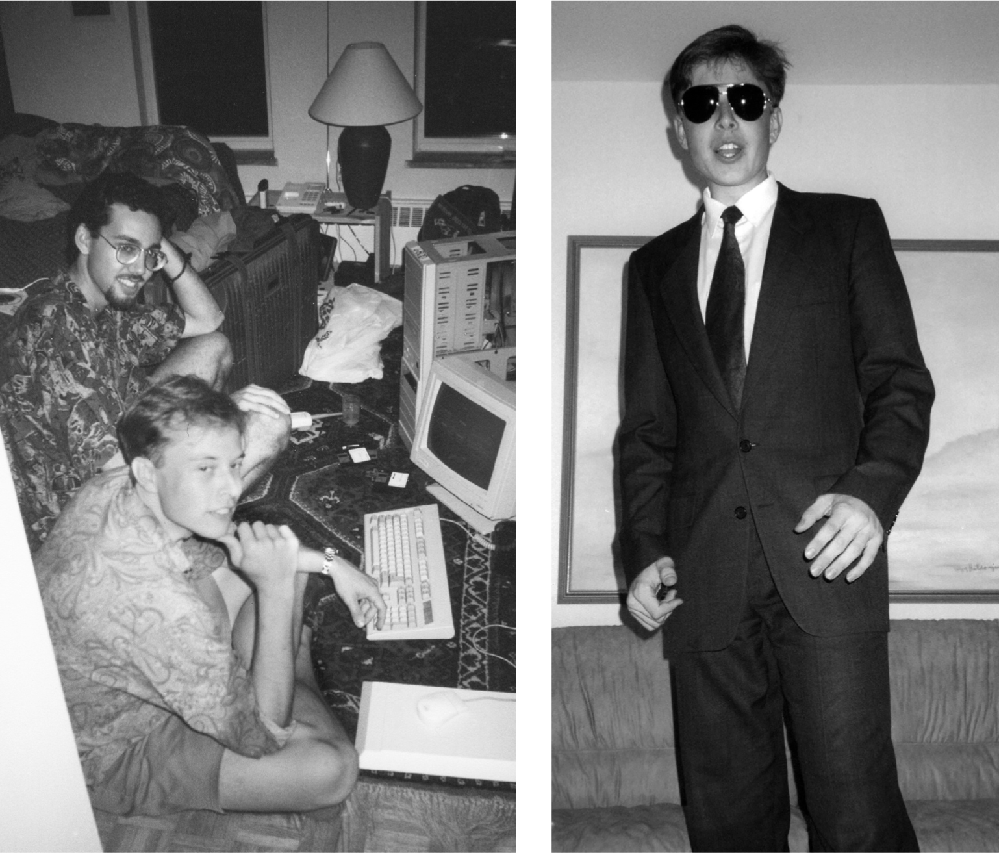

# Chapter 7: Queen’s: Kingston, Ontario, 1990–1991

# 7 Queen’s Kingston, Ontario, 1990–1991

With Navaid Farooq at Queen’s and with his new suit

## Industrial relations

Musk’s college-admissions test scores were not especially notable. On his second round of the SAT tests, he got a 670 out of 800 on his verbal exam and a 730 on math. He narrowed his choices to two universities that were an easy drive from Toronto: Waterloo and Queen’s. “Waterloo was definitely better for engineering, but it didn’t seem great from a social standpoint,” he says. “There were few girls there.” He felt he knew computer science and engineering as well as any of the professors at both places, but he desperately desired a social life. “I didn’t want to spend my undergraduate time with a bunch of dudes.” So in the fall of 1990 he enrolled at Queen’s.

He was placed on the “international floor” of one of the dorms, where, on the first day, he met a student named Navaid Farooq, who became his first real and lasting friend outside of his family. Farooq’s father was Pakistani and his mother Canadian, and he was raised in Nigeria and Switzerland, where his parents worked for United Nations organizations. Like Elon, he had made no close friends in high school. At Queen’s, he and Musk quickly bonded over their interests in computer and board games, obscure history, and science fiction. “For me and Elon,” Farooq says, “it was probably the first place we were socially accepted and could be ourselves.”

During his first year, Musk got A’s in Business, Economics, Calculus, and Computer Programming, but he got B’s in Accounting, Spanish, and Industrial Relations. The following year, he took another course in Industrial Relations, which studies the dealings between workers and management. Again, he got a B. He later told the Queen’s alumni magazine that the most important thing he learned during his two years there was “how to work collaboratively with smart people and make use of the Socratic method to achieve commonality of purpose,” a skill, like those of industrial relations, that future colleagues would notice had been only partly honed.

He was more interested in late-night philosophy discussions about the meaning of life. “I was really hungry for that,” he says, “because until then I had no friends I could talk to about these things.” But most of all, he became immersed, with Farooq at his side, in the world of board and computer games.

## Strategy games

“What you’re doing is not rational,” Musk explained in his flat monotone. “You’re actually hurting yourself.” He and Farooq were playing the strategy board game *Diplomacy* with friends in their dorm, and one of the players was allying himself with another against Musk. “If you do this, I will turn your allies against you and inflict pain on you.” Musk tended to win, Farooq says, by being convincing in his negotiations and threats.

Musk had enjoyed all types of video games as a teenager in South Africa, including first-person shooters and adventure quests, but at college he became more focused on the genre known as strategy games, ones that involve two or more players competing to build an empire using high-level strategy, resource management, supply-chain logistics, and tactical thinking.

Strategy games—those played on a board and then those for computers—would become central to Musk’s life. From *The Ancient Art of War,* which he played as a teen in South Africa, to his addiction to *The Battle of Polytopia* three decades later, he relished the complex planning and competitive management of resources that are required to prevail. Immersing himself in these games for hours became the way he relaxed, escaped stress, and honed his tactical skills and strategic thinking for business.

While he was at Queen’s, the first great computer-based strategy game was released: *Civilization*. In it, players compete to build a society from prehistory to the present by choosing what technologies to develop and production facilities to build. Musk moved his desk so that he could sit on his bed and Farooq on a chair to face off and play the game. “We completely entered a zone for hours until we were exhausted,” Farooq says. They moved on to *Warcraft: Orcs and Humans*, where a key part of the strategy is to develop a sustainable supply of resources, such as metals from mines. After hours of playing, they would take a break for a meal, and Elon would describe the moment in the game when he knew he was going to win. “I am wired for war,” he told Farooq.

One class at Queen’s used a strategy game in which teams competed in a simulation of growing a business. The players could decide the prices of their products, the amount spent on advertising, what profits to plow back into research, and other variables. Musk figured out how to reverse-engineer the logic that controlled the simulation, so he was able to win every time.

## Bank trainee

When Kimbal moved to Canada and joined Elon as a student at Queen’s, the brothers developed a routine. They would read the newspaper and pick out the person they found most interesting. Elon was not one of those eager-beaver types who liked to attract and charm mentors, so the more gregarious Kimbal took the lead in cold-calling the person. “If we were able to get through on the phone, they usually would have lunch with us,” he says.

One they picked was Peter Nicholson, the executive in charge of strategic planning at Scotiabank. Nicholson was an engineer with a master’s degree in physics and a PhD in math. When Kimbal got through to him, he agreed to have lunch with the boys. Their mother took them shopping at Eaton’s department store, where the purchase of a $99 suit got you a free shirt and tie. At lunch they discussed philosophy and physics and the nature of the universe. Nicholson offered them summer jobs, inviting Elon to work directly with him on his three-person strategic planning team.

Nicholson, then forty-nine, and Elon had fun together solving math puzzles and weird equations. “I was interested in the philosophical side of physics and how it related to reality,” Nicholson says. “I didn’t have a lot of other people to talk to about these things.” They also discussed what had become Musk’s passion: space travel.

When Elon went with Nicholson’s daughter, Christie, to a party one evening, his first question was “Do you ever think about electric cars?” As he later admitted, it was not the world’s best come-on line.

---

One topic Musk researched for Nicholson was Latin American debt. Banks had made billions in loans to countries such as Brazil and Mexico that could not be repaid, and in 1989 the U.S. Treasury secretary, Nicholas Brady, packaged these debt obligations into tradable securities known as “Brady Bonds.” Because these bonds were backed by the U.S. government, Musk believed that they would always be worth 50 cents on the dollar. However, some were selling as low as 20 cents.

Musk figured that Scotiabank could make billions by buying the bonds at that cheap price, and he called the Goldman Sachs trading desk in New York to make sure they were available. “Yeah, how much you want?” the gruff trader on the phone responded. “Would it be possible to get five million?” Musk asked, putting on a deep and serious voice. When the trader said that would be no problem, Musk quickly hung up. “I was like, ‘Jackpot, no-lose proposition here,’ ” he says. “I ran to tell Peter about it and thought they would give me some money to do it.” But the bank rejected the idea. The CEO said it already held too much Latin American debt. “Wow, this is just insane,” Musk said to himself. “Is this how banks think?”

Nicholson says that Scotiabank was navigating the Latin American debt situation using its own methods, which worked better. “He came away with an impression that the bank was a lot dumber than in fact it was,” Nicholson says. “But that was a good thing, because it gave him a healthy disrespect for the financial industry and the audacity to eventually start what became PayPal.”

Musk also drew another lesson from his time at Scotiabank: he did not like, nor was he good at, working for other people. It was not in his nature to be deferential or to assume that others might know more than he did.

