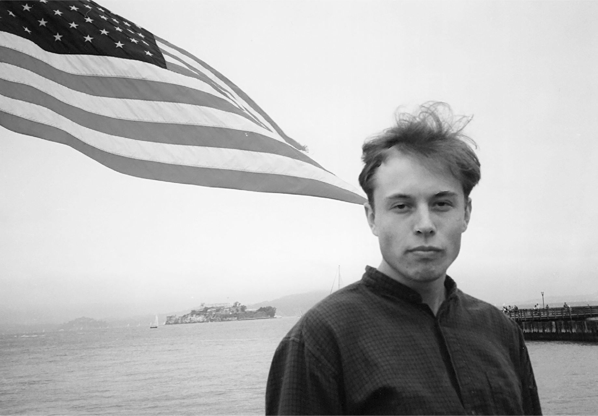
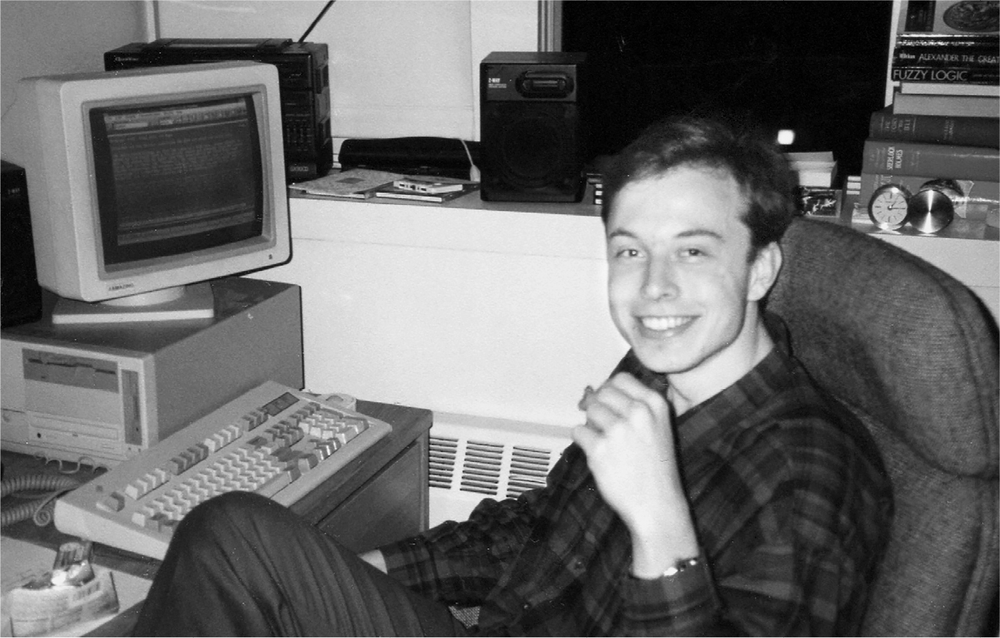

# Chapter 9: Go West: Silicon Valley, 1994–1995

# 9 Go West Silicon Valley, 1994–1995

July 1994

[*OceanofPDF.com*](https://oceanofpdf.com)

## Summer intern

At Ivy League schools in the 1990s, ambitious students were tugged either east toward the gilded realms of Wall Street banking or west toward the tech utopianism and entrepreneurial zeal of Silicon Valley. At Penn, Musk received some internship offers from Wall Street, all lucrative, but finance did not interest him. He felt that bankers and lawyers did not contribute much to society. Besides, he disliked the students he met in business classes. Instead, he was drawn to Silicon Valley. It was the decade of rational exuberance, when one could just slap a .*com* onto any fantasy and wait for the thunder of Porsches to descend from Sand Hill Road with venture capitalists waving checks.

He got his opportunity in the summer of 1994, between his junior and senior years at Penn, when he scored two internships that allowed him to indulge his passions for electric vehicles, space, and video games.

By day he worked at Pinnacle Research Institute, a twenty-person group that had modest Defense Department contracts to study a “supercapacitor” developed by its founder. A capacitor is a device that can briefly hold an electric charge and discharge it quickly, and Pinnacle thought that it could make one that was powerful enough to provide energy for electric cars and space-based weapons. In a paper he wrote at the end of the summer, Musk declared, “It is important to note that the Ultracapacitor is not simply an incremental improvement, but a radically new technology.”

In the evening he worked at a small Palo Alto company called Rocket Science, which made video games. When he showed up at their building one night and asked for a summer job, they gave him a problem they hadn’t been able to solve: how to coax a computer to multitask by reading graphics that were stored on a CD-ROM while simultaneously moving an avatar on the screen. He went on internet message boards to ask other hackers how to bypass the BIOS and joystick reader using DOS. “None of the senior engineers had been able to solve this problem, and I solved it in two weeks,” he says.

They were impressed and wanted him to work full-time, but he needed to graduate in order to get a U.S. work visa. In addition, he came to a realization: he had a fanatic love of video games and the skills to make money creating them, but that was not the best way to spend his life. “I wanted to have more impact,” he says.

## King of the road

One unfortunate trend in the 1980s was that cars and computers became tightly sealed appliances. It was possible to open up and fiddle with the innards of the Apple II that Steve Wozniak designed in the late 1970s, but you couldn’t do that with the Macintosh, which Steve Jobs in 1984 made almost impossible to open. Similarly, kids in the 1970s and earlier grew up rummaging under the hoods of cars, tinkering with the carburetors, changing spark plugs, and souping up the engines. They had a fingertip-feel for valves and Valvoline. This hands-on imperative and Heathkit mindset even applied to radios and television sets; if you wanted, you could change the tubes and later the transistors and have a feel for how a circuit board worked.

This trend toward closed and sealed devices meant that most techies who came of age in the 1990s gravitated to software more than hardware. They never knew the sweet smell of a soldering iron, but they could code in ways that made circuits sing. Musk was different. He liked hardware as well as software. He could code, but he also had a feel for physical components, such as battery cells and capacitors, valves and combustion chambers, fuel pumps and fan belts.

In particular, Musk loved fiddling with cars. At the time, he owned a twenty-year-old BMW 300i, and he spent Saturdays rummaging around junkyards in Philadelphia to score the parts he needed to soup it up. It had a four-speed transmission, but he decided to upgrade it when BMW started making a five-speed. Borrowing the lift at a local repair shop, he was able, with a couple of shims and a little bit of grinding, to jam a five-speed transmission into what had been a four-speed car. “It was really able to haul ass,” he recalls.

He and Kimbal drove the car from Palo Alto back to Philadelphia at the end of the summer of internships in 1994. “We both were, like, university sucks, there’s no hurry to get back,” Kimbal recalls, “so we did a three-week road trip.” The car broke down repeatedly. On one occasion, they were able to get it to a dealership in Colorado Springs, but after the repairs it failed again. So they pushed it to a truck stop where Elon successfully reworked everything the professional mechanic had done.

Musk also took the BMW on a trip with his college girlfriend at the time, Jennifer Gwynne. Over Christmas break in 1994, they drove from Philadelphia to Queen’s University, where Kimbal was still studying, and then to Toronto to see his mother. There he gave Jennifer a small gold necklace with a smooth green emerald. “His mom had a number of these necklaces in a case in her bedroom, and Elon told me they were from his father’s emerald mine in South Africa—he pulled one from the case,” Jennifer noted twenty-five years later, when she auctioned it online. In fact, the long-bankrupt mine had not been in South Africa and was not owned by his father, but at the time Musk didn’t mind giving that impression.

When he graduated in the spring of 1995, Musk decided to take another cross-country trip to Silicon Valley. He brought along Robin Ren, after teaching him how to drive a stick shift. They stopped at the just-opened Denver airport because Musk wanted to see the baggage-handling system. “He was fascinated by how they designed the robotic machines to handle the luggage without human intervention,” Ren says. But the system was a mess. Musk took away a lesson he would have to relearn when he built highly robotic Tesla factories. “It was over-automated, and they underestimated the complexity of what they were building,” he says.

## The internet wave

Musk planned to enroll at Stanford at the end of the summer to study material science as a graduate student. Still fascinated by capacitors, he wanted to research how they might power electric cars. “The idea was to leverage advanced chip-making equipment to make a solid state ultracapacitor with enough energy density to give a car long range,” he says. But as he got closer to enrolling, he began to worry. “I figured I could spend several years at Stanford, get a PhD, and my conclusion on capacitors would be that they aren’t feasible,” he says. “Most PhDs are irrelevant. The number that actually move the needle is almost none.”

He had conceived by then a life vision that he would repeat like a mantra. “I thought about the things that will truly affect humanity,” he says. “I came up with three: the internet, sustainable energy, and space travel.” In the summer of 1995, it became clear to him that the first of these, the internet, was not going to wait for him to finish graduate school. The web had just been opened up for commercial use, and that August the browser startup Netscape went public, soaring within a day to a market value of $2.9 billion.

Musk had come up with an idea for an internet company during his final year at Penn, when an executive from NYNEX came to speak about the phone company’s plans to launch an online version of the Yellow Pages. Dubbed “Big Yellow,” it would have interactive features so that users could tailor the information to their personal needs, the executive said. Musk thought (correctly, as it turned out) that NYNEX had no clue how to make it truly interactive. “Why don’t we do it ourselves?” he suggested to Kimbal, and he began writing code that could combine business listings with map data. They dubbed it the Virtual City Navigator.

Just before the enrollment deadline for Stanford, Musk went to Toronto to get advice from Peter Nicholson of Scotiabank. Should he pursue the idea for the Virtual City Navigator, or should he start the PhD program? Nicholson, who had a PhD from Stanford, did not equivocate. “The internet revolution only comes once in a lifetime, so strike while the iron is hot,” he told Musk as they walked along the shore of Lake Ontario. “You will have lots of time to go to graduate school later if you’re still interested.” When Musk got back to Palo Alto, he told Ren he had made up his mind. “I need to put everything else on hold,” he said. “I need to catch the internet wave.”

He actually hedged his bets. He officially enrolled at Stanford and then immediately requested a deferral. “I’ve written some software with the first internet maps and Yellow Pages directory,” he told Bill Nix, the material science professor. “I will probably fail, and if so I would like to come back.” Nix said it would not be a problem for Musk to defer his studies, but he predicted that he would never come back.

May 1995

[*OceanofPDF.com*](https://oceanofpdf.com)
