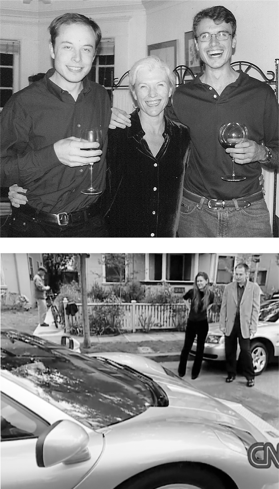

# Chapter 10: Zip2: Palo Alto, 1995–1999

# 10 Zip2 Palo Alto, 1995–1999

Celebrating the sale of Zip2 with Maye and Kimbal; taking delivery of the McLaren with Justine

[*OceanofPDF.com*](https://oceanofpdf.com)

## Map quests

Some of the best innovations come from combining two previous innovations. The idea that Elon and Kimbal had in early 1995, just as the web was starting to grow exponentially, was simple: put a searchable directory of businesses online and combine it with map software that would give users directions to them. Not everyone saw the potential. When Kimbal had a meeting at the *Toronto Star*, which published the Yellow Pages in that city, the president picked up a thick edition of the directory and threw it at him. “Do you honestly think you’re ever going to replace this?” he asked.

The brothers rented a tiny office in Palo Alto that had room for two desks and futons. For the first six months, they slept in the office and showered at the YMCA. Kimbal, who would later become a chef and restaurateur, got an electric coil and cooked meals occasionally. But mainly they ate at Jack in the Box, because it was cheap, open twenty-four hours, and just a block away. “I can still tell you every single menu item,” Kimbal says. “It’s just seared into my brain.” Elon became a fan of the teriyaki bowl.

After a few months, they rented an unfurnished apartment that stayed that way. “All it had was two mattresses and lots of Cocoa Puffs boxes,” says Tosca. Even after they moved in, Elon spent many nights in the office, crashing under his desk when he was exhausted from coding. “He had no pillow, he had no sleeping bag. I don’t know how he did it,” says Jim Ambras, an early employee. “Once in a while, if we had a customer meeting in the morning, I’d have to tell him to go home and shower.”

Navaid Farooq came from Toronto to work with them, but he soon found himself in fights with Musk. “If you want your friendship to last,” his wife Nyame told him, “this is not for you.” So he quit after six weeks. “I knew that I could either be working with him or be his friend, but not both, and the latter seemed more enjoyable.”

Errol Musk, not yet estranged from his sons, visited from South Africa and gave them $28,000 plus a beat-up car he bought for $500. Their mother, Maye, came from Toronto more often, bringing food and clothes. She gave them $10,000 and let them use her credit card because they had not been approved for one.

They got their first break when they visited Navteq, which had a database of maps. The company agreed to license it to the Musks for free until they started making a profit. Elon wrote a program that merged the maps with a listing of businesses in the area. “You could use your cursor and zoom in and move around the map,” says Kimbal. “That stuff is totally normal today, but it was mind-blowing to see that at the time. I think Elon and I were the first humans to see it work on the internet.” They named the company Zip2, as in “Zip to where you want to go.”

Elon was granted a patent for the “interactive network directory service” that he had created. “The invention provides a network accessible service which integrates both a business directory and a map database,” the patent stated.

For their first meeting with potential investors, they had to take a bus up Sand Hill Road because the car their dad had given them broke down. But after word spread about the company, the VCs were asking to come to them. They bought a big frame for a computer rack and put one of their small computers inside, so that visitors would think they had a giant server. They named it “The Machine That Goes Ping,” after a *Monty Python* sketch. “Every time investors would come in, we showed them the tower,” Kimbal says, “and we would laugh because it made them think we were doing hardcore stuff.”

Maye flew from Toronto to help prepare for the meetings with venture capitalists, often staying up all night at Kinko’s to print the presentations. “It was a dollar a page for color, which we could barely afford,” she says. “We would all be exhausted except Elon. He was always up late doing the coding.” When they got their first proposals from potential investors in early 1996, Maye took her boys to a nice restaurant to celebrate. “That’s the last time we’ll have to use my credit card,” she said when she paid the bill.

And it was. They were soon astounded by an offer from Mohr Davidow Ventures to invest $3 million in the company. The final presentation to the firm was scheduled for a Monday, and that weekend Kimbal decided to make a quick trip to Toronto to fix their mother’s computer, which had broken. “We love our mom,” he explains. As he was leaving on Sunday to fly back to San Francisco, he got stopped by U.S. border officials at the airport who looked in his luggage and saw the pitch deck, business cards, and other documents for the company. Because he did not have a U.S. work visa, they wouldn’t let him board the plane. He had a friend pick him up at the airport and drive him across the border, where he told a less vigilant border officer that they were heading down to see the David Letterman show. He managed to catch the late plane from Buffalo to San Francisco, and made it in time for the pitch.

Mohr Davidow loved the presentation and finalized the investment. The firm also found an immigration lawyer to help the two Musks get work visas and gave them each $30,000 to purchase cars. Elon bought a 1967 Jaguar E-type. As a kid in South Africa, he had seen a picture of the car in a book on the best convertibles ever made, and he had vowed to buy one if he ever struck it rich. “It was the most beautiful car you could imagine,” he says, “but it broke down at least once a week.”

The venture capitalists soon did what they often do: bring in adult supervision to take over from the young founders. It had happened to Steve Jobs at Apple and to Larry Page and Sergey Brin at Google. Rich Sorkin, who had run business development for an audio equipment company, was made the CEO of Zip2. Elon was moved aside to chief technology officer. At first, he thought the change would suit him; he could focus on building the product. But he learned a lesson. “I never wanted to be a CEO,” he says, “but I learned that you could not truly be the chief technology or product officer unless you were the CEO.”

With the changes came a new strategy. Instead of marketing its product directly to businesses and their customers, Zip2 focused on selling its software to big newspapers so they could make their own local directories. This made sense; newspapers already had sales forces that were knocking on the doors of businesses to sell them advertising and classifieds. Knight-Ridder, the *New York Times*, Pulitzer, and Hearst newspapers signed up. Executives from the first two joined the Zip2 board. *Editor & Publisher* magazine ran a cover story titled “Newspaperdom’s New Superhero: Zip2,” reporting that the company had created “a new suite of software structures that would enable individual newspapers to quickly mount large-scale city guide-type directories.”

By 1997, Zip2 had been hired by 140 newspapers at licensing fees ranging from $1,000 to $10,000. The president of the *Toronto Star*, who had thrown a Yellow Pages book at Kimbal, called him to apologize and ask if Zip2 would be its partner. Kimbal said yes.

## Hardcore

From the very beginning of his career, Musk was a demanding manager, contemptuous of the concept of work-life balance. At Zip2 and every subsequent company, he drove himself relentlessly all day and through much of the night, without vacations, and he expected others to do the same. His only indulgence was allowing breaks for intense video-game binges. The Zip2 team won second place in a national *Quake* competition. They would have come in first, he says, but one of them crashed his computer by pushing it too hard.

When the other engineers went home, Musk would sometimes take the code they were working on and rewrite it. With his weak empathy gene, he didn’t realize or care that correcting someone publicly—or, as he put it, “fixing their fucking stupid code”—was not a path to endearment. He had never been a captain of a sports team or the leader of a gang of friends, and he lacked an instinct for camaraderie. Like Steve Jobs, he genuinely did not care if he offended or intimidated the people he worked with, as long as he drove them to accomplish feats they thought were impossible. “It’s not your job to make people on your team love you,” he said at a SpaceX executive session years later. “In fact, that’s counterproductive.”

He was toughest on Kimbal. “I love, love, love my brother very much, but working with him was hard,” Kimbal says. Their disagreements often led to rolling-on-the-office-floor fights. They fought over major strategy, minor slights, and the name Zip2. (Kimbal and a marketing firm came up with it; Elon hated it.) “Growing up in South Africa, fighting was normal,” Elon says. “It was part of the culture.” They had no private offices, just cubicles, so everyone had to watch. In one of their worst fights, they wrestled to the floor and Elon seemed ready to punch Kimbal in the face, so Kimbal bit his hand and tore off a hunk of flesh. Elon had to go to the emergency room for stitches and a tetanus shot. “When we had intense stress, we just didn’t notice anyone else around us,” says Kimbal. He later admitted that Elon was right about Zip2. “It was a shitty name.”

---

True product people have a compulsion to sell directly to consumers, without middlemen muddying things up. Musk was that way. He became frustrated by Zip2’s strategy of relegating itself to being an unbranded vendor to the newspaper industry. “We wound up beholden to the papers,” Musk says. He wanted to buy the domain name “[city.com](http://city.com)” and become a consumer destination again, competing with Yahoo and AOL.

The investors were also having second thoughts about their strategy. City guides and internet directories were proliferating by the fall of 1998, and none had shown a profit. So CEO Rich Sorkin decided to merge with one of them, CitySearch, in the hope that together they could succeed. But when Musk met with the CEO of CitySearch, the man made him uneasy. With the help of Kimbal and some of the engineers, Elon led a rebellion that scuttled the merger. He also demanded that he be made CEO again. Instead, the board removed him as chair and diminished his role.

“Great things will never happen with VCs or professional managers,” Musk told *Inc. Magazine*. “They don’t have the creativity or the insight.” One of the Mohr Davidow partners, Derek Proudian, was installed as interim CEO and tasked with selling the company. “This is your first company,” he told Musk. “Let’s find an acquirer and make some money, so you can do your second, third, and fourth company.”

## The millionaire

In January 1999, less than four years after Elon and Kimbal launched Zip2, Proudian called them into his office and told them that Compaq Computer, which was seeking to juice up its AltaVista search engine, had offered $307 million in cash. The brothers had split their 12 percent ownership stake 60–40, so Elon at age twenty-seven walked away with $22 million and Kimbal with $15 million. Elon was astonished when the check arrived at his apartment. “My bank account went from, like, $5,000 to $22,005,000,” he says.

The Musks gave their father $300,000 out of the proceeds and their mother $1 million. Elon bought an eighteen-hundred-square-foot condo and splurged on what for him was the ultimate indulgence: a $1 million McLaren F1 sports car, the fastest production car in existence. He agreed to allow CNN to film him taking delivery. “Just three years ago I was showering at the Y and sleeping on the office floor, and now I’ve got a million-dollar car,” he said as he hopped around in the street while the car was unloaded from a truck.

After the impulsive outburst, he realized that the giddy display of his newfound taste for wealth was unseemly. “Some could interpret the purchase of this car as behavior characteristic of an imperialist brat,” he admitted. “My values may have changed, but I’m not consciously aware of my values having changed.”

Had they changed? His new wealth allowed his desires and impulses to be subject to fewer restraints, which was not always a pretty sight. But his earnest, mission-driven intensity remained intact.

The writer Michael Gross was in Silicon Valley reporting a piece for Tina Brown’s glossy *Talk* magazine on newly rich techno-brats. “I was looking for an ostentatious lead character who might warrant skewering,” Gross recalled years later. “But the Musk I met in 2000 was bursting with joie de vivre, too likable to skewer. He had the same insouciance and indifference to expectations he does now, but he was easy, open, charming, and funny.”

Celebrity was enticing for a kid who had grown up with no friends. “I’d like to be on the cover of *Rolling Stone*,” he told CNN. But he would end up having a conflicted relationship with wealth. “I could go and buy one of the islands of the Bahamas and turn it into my personal fiefdom, but I am much more interested in trying to build and create a new company,” he said. “I haven’t spent all my winnings. I’m going to put almost all of it back to a new game.”

[*OceanofPDF.com*](https://oceanofpdf.com)
