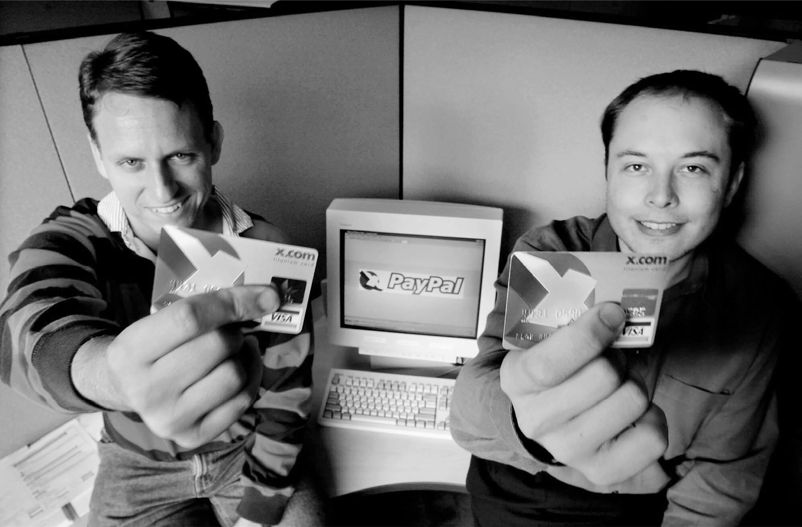

# Chapter 12: X.com: Palo Alto, 1999–2000

# 12 X.com Palo Alto, 1999–2000

With PayPal cofounder Peter Thiel

## An all-in-one bank

When his cousin Peter Rive visited in early 1999, he found Musk poring over books about the banking system. “I’m trying to think about what to start next,” he explained. His experience at Scotiabank had convinced him that the industry was ripe for disruption. So in March 1999, he founded X.com with a friend from the bank, Harris Fricker.

Musk now had the choice he had described to CNN: living like a multimillionaire or leaving his chips on the table to fund a new enterprise. The balance he struck was to invest $12 million in X.com, leaving about $4 million after taxes to spend on himself.

His concept for X.com was grand. It would be a one-stop everything-store for all financial needs: banking, digital purchases, checking, credit cards, investments, and loans. Transactions would be handled instantly, with no waiting for payments to clear. His insight was that money is simply an entry into a database, and he wanted to devise a way that all transactions were securely recorded in real time. “If you fix all the reasons why a consumer would take money out of the system,” he says, “then it will be the place where all the money is, and that would make it a multitrillion-dollar company.”

Some of his friends were skeptical that an online bank would inspire confidence if given a name that sounded like a porn site. But Musk loved the name X.com. Instead of being too clever, like Zip2, the name was simple, memorable, and easy to type. It also allowed him to have one of the coolest email addresses of the time: [e@x.com](mailto:e@x.com). “X” would become his go-to letter for naming things, from companies to kids.

---

Musk’s management style had not changed from Zip2, nor would it ever. His late-night coding binges followed by his mix of rudeness and detachment during the day led his cofounder Harris and their handful of coworkers to demand that Musk step down as CEO. At one point Musk responded with a very self-aware email. “I am by nature obsessive-compulsive,” he wrote Fricker. “What matters to me is winning, and not in a small way. God knows why… it’s probably rooted in some very disturbing psychoanalytical black hole or neural short circuit.”

Because he held a controlling interest, Musk prevailed and Fricker quit, along with most of the employees. Despite the turmoil, Musk was able to entice the influential head of Sequoia Capital, Michael Moritz, to make a major investment in X.com. Moritz then facilitated a deal with Barclay’s Bank and a community bank in Colorado to become partners, so that X.com could offer mutual funds, have a bank charter, and be FDIC-insured. At twenty-eight, Musk had become a startup celebrity. In an article titled “Elon Musk Is Poised to Become Silicon Valley’s Next Big Thing,” *Salon* called him “today’s Silicon Valley It guy.”

One of Musk’s management tactics, then as later, was to set an insane deadline and drive colleagues to meet it. He did that in the fall of 1999 by announcing, in what one engineer called “a dick move,” that X.com would launch to the public on Thanksgiving weekend. In the weeks leading up to that, Musk prowled the office each day, including Thanksgiving, in a nervous and nervous-making frenzy, and slept under his desk most nights. One of the engineers who went home at 2 a.m. Thanksgiving morning got a call from Musk at 11 a.m. asking him to come back in because another engineer had worked all night and was “not running on full thrusters anymore.” Such behavior produced drama and resentments, but also success. When the product went live that weekend, all the employees marched to a nearby ATM, where Musk inserted an X.com debit card. Cash whirred out and the team celebrated.

Believing that Musk needed adult supervision, Moritz convinced him to step aside the following month and allow Bill Harris, the former head of Intuit, to become CEO. In a reprise of what had happened at Zip2, Musk remained as chief product officer and board chair, maintaining his frenzied intensity. After one meeting with investors, he went down to the cafeteria, where he had set up some arcade video games. “There were several of us playing *Street Fighter* with Elon,” says Roelof Botha, the chief financial officer. “He was sweating, and you could see that he was a bundle of energy and intensity.”

Musk developed viral marketing techniques, including bounties for users who signed up friends, and he had a vision of making X.com both a banking service and a social network. Like Steve Jobs, he had a passion for simplicity when it came to designing user interface screens. “I honed the user interface to get the fewest number of keystrokes to open an account,” he says. Originally there were long forms to fill out, including providing a social security number and home address. “Why do we need that?” Musk kept asking. “Delete!” One important little breakthrough was that customers didn’t need to have user names; their email address served that purpose.

One driver of growth was a feature that they originally thought was no big deal: the ability to send money by email. That became wildly popular, especially on the auction site eBay, where users were looking for an easy way to pay strangers for purchases.

## Max Levchin and Peter Thiel

As Musk monitored the names of new customers signing up, one caught his eye: Peter Thiel. He was one of the founders of a company named Confinity that had been located in the same building as X.com and was now just down the street. Both Thiel and his primary cofounder Max Levchin were as intense as Musk, but they were more disciplined. Like X.com, their company offered a person-to-person payment service. Confinity’s version was called PayPal.

By the beginning of 2000, amid the first signs that the air might be coming out of the internet bubble, X.com and PayPal were engaged in a race to sign up new customers. “It was this crazy competition where we both had insane dollar bonuses to get customers to sign up and refer friends,” says Thiel. As Musk later put it, “It was a race to see who would run out of money last.”

Musk was drawn to the fight with the intensity of a video-gamer. Thiel, on the contrary, liked to coolly calculate and mitigate risk. It soon became clear to both of them that the network effect—whichever company got bigger first would then grow even faster—meant that only one would survive. So it made sense to merge rather than turning the competition into a game of *Mortal Kombat*.

Musk and his new CEO Bill Harris scheduled a meeting with Thiel and Levchin in the back room of Evvia, a Greek restaurant in Palo Alto. The two sides traded notes about how many users each had, with Musk engaging in some of his usual exaggerations. Thiel asked him how he envisioned potential merger terms. “We would own ninety percent of the merged company and you would own ten percent,” Musk replied. Levchin was not quite sure what to make of Musk. Was he serious? They had roughly equal user bases. “He had an extremely serious I’m-not-joking look on his face, but underneath there seemed to be an ironic streak,” Levchin says. As Musk later conceded, “We were playing a game.”

After the PayPal team left the lunch, Levchin told Thiel, “This will never hunt, so let’s move on.” Thiel, however, was better at reading people. “This is just an opening,” he told Levchin. “You just have to be patient with a guy like Elon.”

The courtship continued through January 2000, causing Musk to postpone his honeymoon with Justine. Michael Moritz, X.com’s primary investor, arranged a meeting of the two camps in his Sand Hill Road office. Thiel got a ride with Musk in his McLaren.

“So, what can this car do?” Thiel asked.

“Watch this,” Musk replied, pulling into the fast lane and flooring the accelerator.

The rear axle broke and the car spun around, hit an embankment, and flew in the air like a flying saucer. Parts of the body shredded. Thiel, a practicing libertarian, was not wearing a seatbelt, but he emerged unscathed. He was able to hitch a ride up to the Sequoia offices. Musk, also unhurt, stayed behind for a half-hour to have his car towed away, then joined the meeting without telling Harris what had happened. Later, Musk was able to laugh and say, “At least it showed Peter I was unafraid of risks.” Says Thiel, “Yeah, I realized he was a bit crazy.”

---

Musk remained resistant to a merger. Even though both companies had about 200,000 customers signed up to make electronic payments on eBay, he believed that X.com was a more valuable company because it offered a broader array of banking services. That put him at odds with Harris, who at one point threatened to resign if Musk tried to scuttle merger talks. “If he quit, that would have been a disaster,” Musk says, “because we were trying to raise more financing just as the internet market was weakening.”

A break came when Musk had a bonding experience with Thiel and Levchin at another lunch, this one at Il Fornaio, a white-tablecloth Italian restaurant in Palo Alto. They had waited a long time without being served, so Harris barged into the kitchen to see what dishes he could extract. Musk, Thiel, and Levchin looked at each other and exchanged glances. “Here was this extreme extrovert business-development type acting like he had an S on his chest, and the three of us are all very nerdy,” Levchin says. “We bonded over being the type of people who would never do what Bill did.”

They agreed to a merger in which X.com would get 55 percent of the combined company, but Musk almost ruined things soon after by telling Levchin he was getting a steal. Infuriated, Levchin threatened to pull out. Harris drove to his home and helped him fold laundry as he calmed down. The terms were revised once again, to basically a 50-50 merger, but with X.com as the surviving corporate entity. In March 2000, the deal was consummated, and Musk, the largest stockholder, became the chairman. A few weeks later, he joined with Levchin to force Harris out and regain the role of CEO as well. Adult supervision was no longer welcome.

## PayPal

The electronic payment systems of both companies were folded together and marketed under the brand name PayPal. That became the company’s primary offering, and it continued to grow rapidly. But it was not in Musk’s nature to make niche products. He wanted to remake entire industries. So he refocused on his original goal of creating a social network that would disrupt the whole banking industry. “We have to decide whether we are going to aim big,” he told his troops. Some believed Musk’s framing was flawed. “We had a vast amount of traction on eBay,” says Reid Hoffman, an early employee who later cofounded LinkedIn. “Max and Peter thought we should focus entirely on that and become a master merchant service.”

Musk insisted that the company’s name should be X.com, with PayPal as merely one of its subsidiary brands. He even tried to rebrand the payment system X-PayPal. There was a lot of pushback, especially from Levchin. PayPal had become a trusted brand name, like a good pal who is helping you get paid. Focus groups showed that the name X.com, on the contrary, conjured up visions of a seedy site you would not talk about in polite company. But Musk was unwavering, and remains so to this day. “If you want to just be a niche payment system, PayPal is better,” he said. “But if you want to take over the world’s financial system, then X is the better name.”

Musk and Michael Moritz went to New York to see if they could recruit Rudy Giuliani, who was just ending his tenure as mayor, to be a political fixer and guide them through the policy intricacies of being a bank. But as soon as they walked into his office, they knew it would not work. “It was like walking into a mob scene,” Moritz says. “He was surrounded by goonish confidantes. He didn’t have any idea whatsoever about Silicon Valley, but he and his henchmen were eager to line their pockets.” They asked for 10 percent of the company, and that was the end of the meeting. “This guy occupies a different planet,” Musk told Moritz.

Musk restructured the company so that there was not a separate engineering department. Instead, engineers would team up with product managers. It was a philosophy that he would carry through to Tesla, SpaceX, and then Twitter. Separating the design of a product from its engineering was a recipe for dysfunction. Designers had to feel the immediate pain if something they devised was hard to engineer. He also had a corollary that worked well for rockets but less so for Twitter: engineers rather than the product managers should lead the team.

## Arm wrestling with Levchin

Peter Thiel drifted away from active involvement in the company, leaving his Confinity cofounder Max Levchin, a low-key and super-sharp Ukrainian-born software wizard, to be the chief technology officer and counterbalance to Musk. Levchin and Musk soon clashed on an issue that sounded technical but was also theological: whether to use Microsoft Windows or Unix as the main operating system. Musk admired Bill Gates, loved Windows NT, and thought Microsoft would be a more reliable partner. Levchin and his team were appalled, feeling that Windows NT was insecure, buggy, and uncool. They preferred using various flavors of Unix-like operating systems, including Solaris and the open-source Linux.

One night well after midnight, Levchin was working alone in a conference room when Musk walked in primed to continue the argument. “Eventually you will see it my way,” Musk said. “I know how this movie ends.”

“No, you’re wrong,” Levchin replied in his flat monotone. “It just isn’t going to work in Microsoft.”

“You know what,” said Musk. “I will arm-wrestle you for it.”

Levchin thought, correctly, that this was the stupidest imaginable way to settle a software-coding disagreement. Plus, Musk was almost twice his size. But he was loopy from working late hours and agreed to arm-wrestle. He put all his weight into it and promptly lost. “Just to be clear,” Levchin told him, “I’m not going to use your physical weight as any sort of a technical decision input.”

Musk laughed and said, “Yeah, I get it.” But he prevailed. He spent a year having his own team of engineers rewrite the Unix coding that Levchin had written for Confinity. “We wasted a year doing these technical tap dances instead of building new features,” Levchin says. The recoding effort also prevented the company from focusing on the growing amount of fraud that was plaguing the service. “The only reason we remained successful was because there were no other companies being funded during that time.”

---

Levchin had trouble knowing what to make of Musk. Was his arm-wrestling gambit serious? Were his bouts of maniacal intensity punctuated by goofball humor and game-playing calculated or crazed? “There’s irony in everything he does,” says Levchin. “He operates on an irony setting that goes up to eleven but never goes below four.” One of Musk’s powers was to entice other people into his irony circle so they could share an inside joke. “He turns on his irony flamethrower and creates this sense of exclusive Elon Club membership.”

That didn’t work well on Levchin, who was shielded from irony flamethrowers by his earnestness. He had a good radar for detecting Musk’s exaggerations. During the merger, Musk kept insisting that X.com had close to twice as many users, and Levchin would check with its engineers and get the real number. “Elon didn’t just exaggerate, he made it up,” Levchin says. It was what his father would have done.

And yet, Levchin began to marvel at the counterexamples, such as when Musk astounded him by knowing things. At one point Levchin and his engineers were wrestling with a difficult problem involving the Oracle database they were using. Musk poked his head in the room and, even though his expertise was with Windows and not Oracle, immediately figured out the context of the conversation, gave a precise and technical answer, and walked out without waiting for confirmation. Levchin and his team went back to their Oracle manuals and looked up what Musk had described. “One by one, we all said, ‘Shit, he’s right,’ ” Levchin recalls. “Elon will say crazy stuff, but every once in a while, he’ll surprise you by knowing way more than you do about your own specialty. I think a huge part of the way he motivates people are these displays of sharpness, which people just don’t expect from him, because they mistake him for a bullshitter or goofball.”

