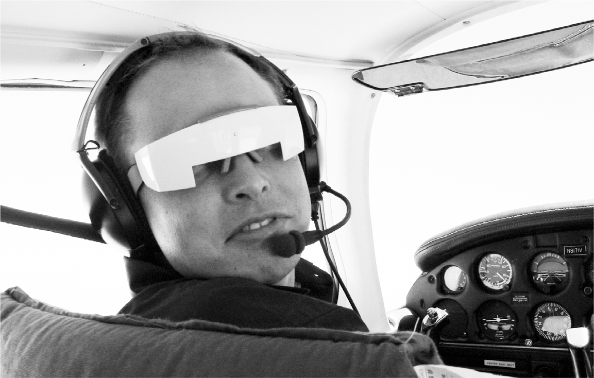
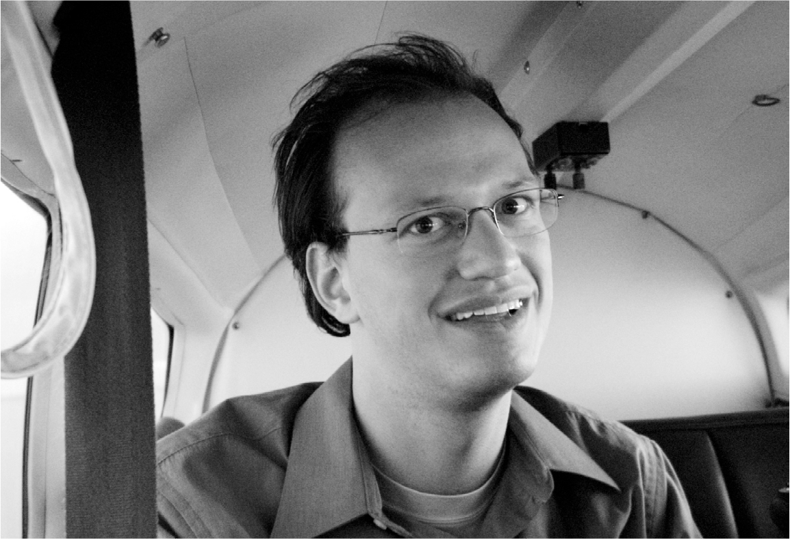

# Chapter 14: Mars: SpaceX, 2001

# 14 Mars SpaceX, 2001

Learning to fly

Adeo Ressi

## Flying

After his ouster from PayPal, Musk bought a single-engine turboprop and decided to learn how to fly, like his father and grandparents had done. In order to get his pilot’s license, he needed fifty hours of training, which he crammed into two weeks. “I tend to do things very intensely,” he says. He had an easy time with the Visual Flight Rules test, but he failed his first Instrument Flight Rules test. “You have a hood on, so you can’t see outside, and you have half your instruments covered,” he says. “Then they shut down one engine, and you have to land the plane. I landed it, but the instructor said, ‘Not good enough. Fail.’ ” On the second try, he passed.

That emboldened him to take the crazy step of buying a Soviet Bloc military jet built in Czechoslovakia called the Aero L-39 Albatros. “It’s what they used to train their fighter pilots, so it’s incredibly acrobatic,” he says. “But it’s a bit dicey, even for me.” At one point he and his trainer took it on a low-altitude flight over Nevada. “It was just like in *Top Gun*. You’re no more than a couple of hundred feet above the ground, following the contour of the mountains. We did a vertical climb up the side of a mountain and then turned upside down.”

The flying appealed to his daredevil gene. It also helped him visualize aerodynamics better. “It’s not just a simple Bernoulli’s principle,” he says as he launches into an explanation of how wings lift a moving plane. After about five hundred hours of flying in the L-39 and other planes, he got a bit bored with it. But the allure of flight remained.

## Red planet

On Labor Day weekend of 2001, soon after he had recovered from malaria, Musk went to visit his party pal from Penn, Adeo Ressi, in the Hamptons. Afterward, driving back to Manhattan on the Long Island Expressway, they talked about what Musk would do next. “I’ve always wanted to do something in space,” he told Ressi, “but I don’t think there’s anything that an individual can do.” It was too expensive, of course, for a private person to build a rocket.

Or was it? Exactly what were the basic physical requirements? All that was needed, Musk figured, was metal and fuel. Those didn’t really cost that much. “By the time we reached the Midtown Tunnel,” Ressi says, “we decided that it was possible.”

When he got to his hotel that evening, Musk logged onto the NASA website to read about its plans for going to Mars. “I figured it had to be soon, because we went to the moon in 1969, so we must be about to go to Mars.” When he couldn’t find the schedule, he rummaged deeper on the site, until he realized that NASA had no plans for Mars. He was shocked.

In his Google searches for more information, he happened across an announcement for a dinner in Silicon Valley hosted by an organization called the Mars Society. That sounds cool, he said to Justine, and he bought a pair of $500 tickets. In fact, he ended up sending in a check for $5,000, which caught the attention of Robert Zubrin, the society’s president. Zubrin sat Elon and Justine at his table, along with the film director James Cameron, who had directed the space-war thriller *Aliens* as well as *The Terminator* and *Titanic*. Justine sat next to him: “It was a big thrill for me because I was a huge fan, but he mainly talked to Elon about Mars and why humans would be doomed if they didn’t colonize other planets.”

Musk now had a new mission, one that was loftier than launching an internet bank or digital Yellow Pages. He went to the Palo Alto public library to read about rocket engineering and started calling experts, asking to borrow their old engine manuals.

At a gathering of PayPal alumni in Las Vegas, he sat in a cabana by the pool reading a tattered manual for a Russian rocket engine. When one of the alums, Mark Woolway, asked him what he planned to do next, Musk answered, “I’m going to colonize Mars. My mission in life is to make mankind a multiplanetary civilization.” Woolway’s reaction was unsurprising. “Dude, you’re bananas.”

Reid Hoffman, another PayPal veteran, had a similar reaction. After listening to Musk describe his plan to send rockets to Mars, Hoffman was puzzled. “How is this a business?” he asked. Later Hoffman would realize that Musk didn’t think that way. “What I didn’t appreciate is that Elon starts with a mission and later finds a way to backfill in order to make it work financially,” he says. “That’s what makes him a force of nature.”

## Why?

It’s useful to pause for a moment and note how wild it was for a thirty-year-old entrepreneur who had been ousted from two tech startups to decide to build rockets that could go to Mars. What drove him, other than an aversion to vacations and a childlike love of rockets, sci-fi, and *A Hitchhiker’s Guide to the Galaxy*? To his bemused friends at the time, and consistently in conversations over the ensuing years, he gave three reasons.

He found it surprising—and frightening—that technological progress was not inevitable. It could stop. It could even backslide. America had gone to the moon. But then came the grounding of the Shuttle missions and an end to progress. “Do we want to tell our children that going to the moon is the best we did, and then we gave up?” he asks. Ancient Egyptians learned how to build the pyramids, but then that knowledge was lost. The same happened to Rome, which built aqueducts and other wonders that were lost in the Dark Ages. Was that happening to America? “People are mistaken when they think that technology just automatically improves,” he would say in a TED Talk a few years later. “It only improves if a lot of people work very hard to make it better.”

Another motivation was that colonizing other planets would help ensure the survival of human civilization and consciousness in case something happened to our fragile planet. It may someday be destroyed by an asteroid or climate change or nuclear war. He had become fascinated by Fermi’s Paradox, named after the Italian American physicist Enrico Fermi, who in a discussion of alien life in the universe said, “But where is everyone?” Mathematically it seemed logical there were other civilizations, but the lack of any evidence raised the uncomfortable possibility that the Earth’s human species might be the only example of consciousness. “We’ve got this delicate candle of consciousness flickering here, and it may be the only instance of consciousness, so it’s essential we preserve it,” Musk says. “If we are able to go to other planets, the probable lifespan of human consciousness is going to be far greater than if we are stuck on one planet that could get hit by an asteroid or destroy its civilization.”

His third motivation was more inspirational. It came from his heritage in a family of adventurers and his decision as a teenager to move to a country that had bred into its essence the spirit of pioneers. “The United States is literally a distillation of the human spirit of exploration,” he says. “This is a land of adventurers.” That spirit needed to be rekindled in America, he felt, and the best way to do that would be to embark on a mission to colonize Mars. “To have a base on Mars would be incredibly difficult, and people will probably die along the way, just as happened in the settling of the United States. But it will be incredibly inspiring, and we must have inspiring things in the world.” Life cannot be merely about solving problems, he felt. It also had to be about pursuing great dreams. “That’s what can get us up in the morning.”

Faring to other planets would be, Musk believed, one of the significant advances in the story of humanity. “There are only a handful of really big milestones: single-celled life, multicellular life, differentiation of plants and animals, life extending from the oceans to land, mammals, consciousness,” he says. “On that scale, the next important step is obvious: making life multiplanetary.” There was something exhilarating, and also a bit unnerving, about Musk’s ability to see his endeavors as having epoch-making significance. As Max Levchin drily puts it, “One of Elon’s greatest skills is the ability to pass off his vision as a mandate from heaven.”

## Los Angeles

Musk decided that, if he wanted to start a rocket company, it was best to move to Los Angeles, which was home to most of the aerospace companies, including Lockheed and Boeing. “The probability of success for a rocket company was quite low, and it was even lower if I did not move to Southern California, where the critical mass of aerospace engineering talent was.” He didn’t explain the move to Justine, who thought it was because he was attracted to the celebrity glamour of the city. Because of their marriage, he was eligible to become a U.S. citizen, which he did in early 2002 at an oath-taking ceremony with thirty-five hundred other immigrants at the Los Angeles County Fairgrounds.

Musk began gathering rocket engineers for meetings at a hotel near the Los Angeles airport. “My initial thought was not to create a rocket company, but rather to have a philanthropic mission that would inspire the public and lead to more NASA funding.”

His first plan was to build a small rocket to send mice to Mars. “But I became worried that we would end up with a tragicomic video of mice slowly dying on a tiny spaceship.” That would not be good. “So then it came down to, ‘Let’s send a little greenhouse to Mars.’ ” The greenhouse would land on Mars and send back photographs of green plants growing on the red planet. The public would be so excited, the theory went, that it would clamor for more missions to Mars. The proposal was called Mars Oasis, and Musk estimated he could pull it off for less than $30 million.

He had the money. The biggest challenge was getting an affordable rocket that could take the greenhouse to Mars. There was, it turned out, a place where he might be able to get one cheaply, or so he thought. Through the Mars Society, Musk heard of a rocket engineer named Jim Cantrell, who had worked on a U.S.–Russian program to decommission missiles. A month after his Long Island Expressway ride with Adeo Ressi, Musk gave Cantrell a call.

Cantrell was driving in Utah with the top down on his convertible, “so all I could make out was that some guy named Ian Musk was saying that he was an internet millionaire and needed to talk to me,” he later told *Esquire*. When Cantrell got home and was able to call him back, Musk explained his vision. “I want to change mankind’s outlook on being a multiplanetary species,” he said. “Can we meet this weekend?” Cantrell had been leading a cloak-and-dagger life because of his dealings with Russian authorities, so he wanted to meet in a safe place without guns. He suggested they meet at the Delta Air Lines club at the Salt Lake City airport. Musk brought Ressi, and they came up with a plan to go to Russia to see if they could buy some launch slots or rockets.

