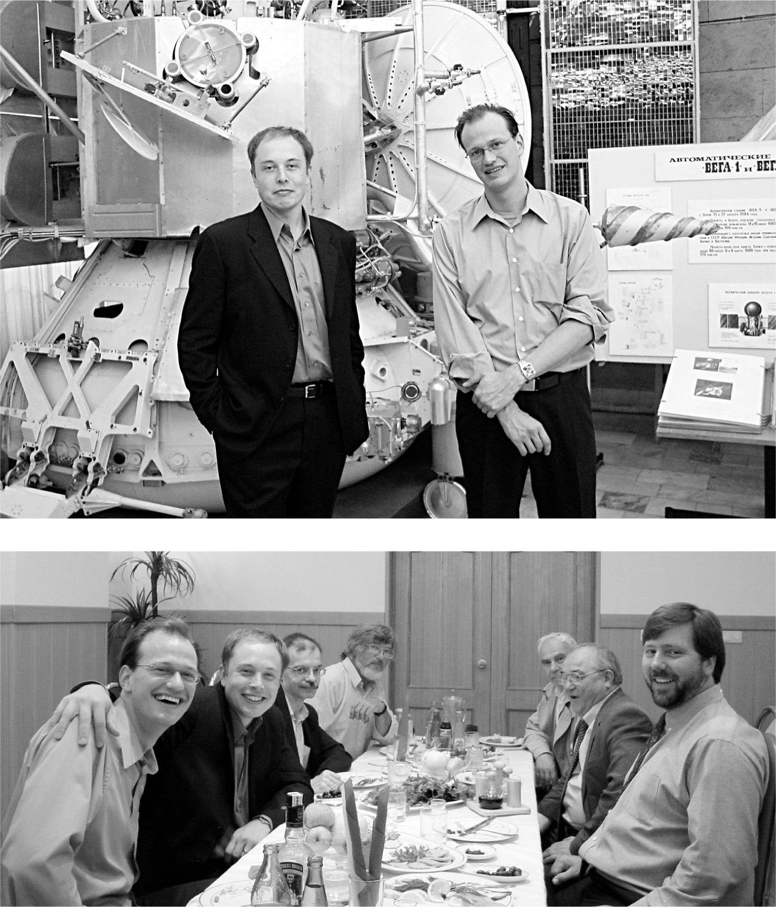

# Chapter 15: Rocket Man: SpaceX, 2002

# 15 Rocket Man SpaceX, 2002

With Adeo Ressi at a rocket facility and a dinner with Russians in Moscow

[*OceanofPDF.com*](https://oceanofpdf.com)

## Russia

The lunch in the back room of a drab Moscow restaurant consisted of small bites of food interspersed with large shots of vodka. Musk had arrived that morning with Adeo Ressi and Jim Cantrell on their quest to buy a used Russian rocket for their mission to Mars, and he was ragged after a late night of partying during a stopover in Paris. Plus, he was not an experienced drinker, so he didn’t fare well. “I calculated the weight of the food and the weight of the vodka, and they were roughly equal,” he recalls. After many toasts to friendship, the Russians gave the Americans gifts of vodka bottles with labels that had each person’s image on a rendering of Mars. Musk, who was holding his head up with his hand, passed out, and his head slammed into the table. “I don’t think I impressed the Russians,” he says.

That evening, slightly recovered, Musk and his companions met with another group in Moscow that purported to be selling decommissioned missiles. That encounter turned out to be equally bizarre. The Russian in charge was missing a front tooth, so whenever he spoke loudly, which was often, spit would fly out in Musk’s direction. At one point, when Musk started his talk about the need to make humans multiplanetary, the Russian got visibly upset. “This rocket was never meant for capitalists to use it for going to Mars on a bullshit mission,” he shouted. “Who’s your chief engineer?” Musk allowed that he was. At that point, Cantrell recalls, the Russian spit at them.

“Did he just spit on us?” Musk asked.

“Yeah, he did,” Cantrell answered. “I think it’s a sign of disrespect.”

Despite the clown show, Musk and Cantrell decided to return to Russia in early 2002. Ressi didn’t come, but Justine did. So did a new member of the team, Mike Griffin, an aerospace engineer who later became the administrator of NASA.

This time Musk focused on buying two Dnepr rockets, which were old missiles. The more he negotiated, the higher the price went. He finally thought he had a deal to pay $18 million for two Dneprs. But then they said no, it was $18 million for each. “I’m like, ‘Dude, that’s insane,’ ” he says. The Russians then suggested maybe it would be $21 million each. “They taunted him,” Cantrell recalls. “They said, ‘Oh, little boy, you don’t have the money?’ ”

It was fortunate that the meetings went badly. It prodded Musk to think bigger. Rather than merely using a secondhand rocket to put a demonstration greenhouse on Mars, he would conceive a venture that was far more audacious, one of the most audacious of our times: privately building rockets that could launch satellites and then humans into orbit and eventually send them to Mars and beyond. “I was pretty mad, and when I get mad I try to reframe the problem.”

## First principles

As he stewed about the absurd price the Russians wanted to charge, he employed some first-principles thinking, drilling down to the basic physics of the situation and building up from there. This led him to develop what he called an “idiot index,” which calculated how much more costly a finished product was than the cost of its basic materials. If a product had a high idiot index, its cost could be reduced significantly by devising more efficient manufacturing techniques.

Rockets had an extremely high idiot index. Musk began calculating the cost of carbon fiber, metal, fuel, and other materials that went into them. The finished product, using the current manufacturing methods, cost at least fifty times more than that.

If humanity was going to get to Mars, the technology of rockets must radically improve. And relying on used rockets, especially old ones from Russia, was not going to push the technology forward.

So on the flight home, he pulled out his computer and started making spreadsheets that detailed all of the materials and costs for building a midsize rocket. Cantrell and Griffin, sitting in the row behind him, ordered drinks and laughed. “What the fuck do you think that idiot-savant is doing up there?” Griffin asked Cantrell.

Musk turned around and gave them an answer. “Hey, guys,” he said, showing them the spreadsheet, “I think we can build this rocket ourselves.” When Cantrell looked at the numbers, he said to himself, “I’ll be damned—that’s why he’s been borrowing all my books.” Then he asked the flight attendant for another drink.

## SpaceX

When Musk decided he wanted to start his own rocket company, his friends did what true friends do in such a situation: they staged an intervention.

“Whoa, dude, ‘I got screwed by the Russians’ does not equal ‘create a launch company,’ ” Adeo Ressi told him. Ressi made a highlight reel of dozens of rockets blowing up, and he corralled friends to fly to Los Angeles, where they gathered with Musk to talk him out of it. “They made me watch a reel of rockets exploding, because they wanted to convince me that I would lose all my money,” Musk says.

The arguments about the risk served to strengthen Musk’s resolve. He liked risk. “If you’re trying to convince me this has a high probability of failure, I am already there,” he told Ressi. “The likeliest outcome is that I will lose all my money. But what’s the alternative? That there be no progress in space exploration? We’ve got to give this a shot, or we’re stuck on Earth forever.”

It was a rather grandiose mandate-from-heaven assessment of how indispensable he was to the progress of humankind. But like many of Musk’s most laughable assertions, it contained a kernel of truth. “I wanted to hold out hope that humans could be a space-faring civilization and be out there among the stars,” he says. “And there was no chance of that unless a new company was started to create revolutionary rockets.”

Musk’s space adventure had begun as a nonprofit endeavor to inspire interest in a mission to Mars, but now he had the combination of motivations that would mark his career. He would do something audacious that was driven by a grand idea. But he also wanted it to be practical and profitable, so that it could sustain itself. That meant using the rockets to launch commercial and government satellites.

He decided to start with a smaller rocket that would not be too costly. “We’re going to be doing dumb things, but let’s just not do dumb things on a large scale,” he told Cantrell. Instead of launching large payloads, as Lockheed and Boeing did, Musk would create a less expensive rocket for the smaller satellites that were being made possible by advances in microprocessors. He focused on one key metric: what it cost to get each pound of payload into orbit. That goal of maximizing boost for the buck would guide his obsession with increasing the thrust of the engines, reducing the mass of the rockets, and making them reusable.

Musk tried to recruit the two engineers who had accompanied him to Moscow. But Mike Griffin did not want to move to Los Angeles. He was working for In-Q-Tel, a CIA-funded venture firm based in the Washington, DC, area, and he was looking at a promising future in science policy. Indeed, President George W. Bush appointed him to be NASA administrator in 2005. Jim Cantrell considered joining, but he asked for a lot of job guarantees that Musk was unwilling to meet. So Musk ended up being, by default, the company’s chief engineer.

Musk incorporated Space Exploration Technologies in May 2002. At first he called the company by its initials, SET. A few months later, he highlighted his favorite letter by moving to a more memorable moniker, SpaceX. Its goal, he said in an early presentation, was to launch its first rocket by September 2003 and to send an unmanned mission to Mars by 2010. Thus continued the tradition he had established at PayPal: setting unrealistic timelines that transformed his wild notions from being completely insane to being merely very late.

[*OceanofPDF.com*](https://oceanofpdf.com)
