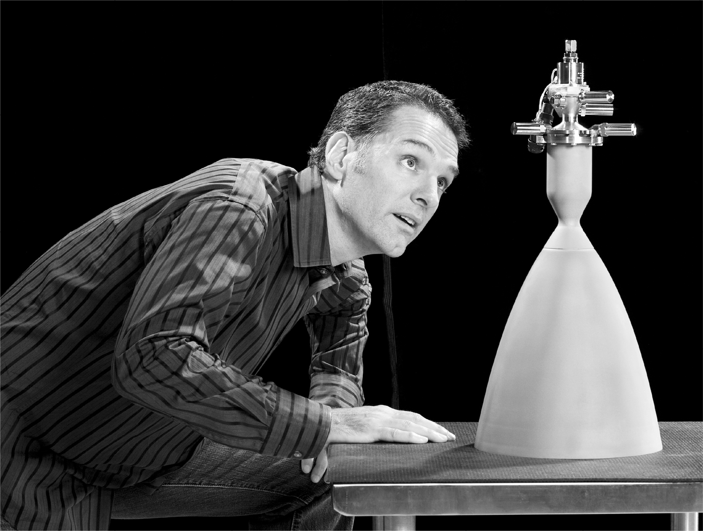

# Chapter 17: Revving Up: SpaceX, 2002

# 17 Revving Up SpaceX, 2002

Tom Mueller

[*OceanofPDF.com*](https://oceanofpdf.com)

## Tom Mueller

As a kid growing up in rural Idaho, Tom Mueller loved playing with model rockets. “I made dozens. Of course, they didn’t last long, because I’d always crash them or blow them up.”

His hometown of Saint Maries (population 2,500) was a logging village about a hundred miles south of the Canadian border. His father worked as a lumberjack. “As a kid, I was always helping Dad work on his log truck, using the welders and other tools,” Mueller says. “Being hands-on gave me a feel for what would work and what wouldn’t.”

Lanky and sinewy with a dimpled chin and jet-black hair, Mueller had the rough-hewn look of a future lumberjack. But inside he was studious like Musk. He immersed himself in the local library devouring science fiction. For a middle-school project, he put crickets inside a model rocket and blasted it off from his backyard to see what affect acceleration would have on them. He learned another lesson instead. The parachutes failed, the rocket smashed to Earth, and the crickets died.

At first, he bought rocket kits through the mail, but then he began making his own from scratch. When he was fourteen, he converted his father’s welding torch into an engine. “I injected water into it to see what affect doing that had on its performance,” he says. “That’s kind of a crazy thing—adding water gives you more thrust.”

The project won him second prize at a regional science fair, which qualified him to go to the international finals in Los Angeles. It was the first time he had been on an airplane. “I didn’t come close to winning,” he says. “There were robots and stuff that the other kids’ fathers had built. At least I had done my project myself.”

He worked his way through the University of Idaho by spending summers and weekends as a logger. When he graduated, he moved to Los Angeles to seek work in aerospace. His grades had not been great, but his enthusiasm was infectious, and that helped get him a job at TRW, which built the rocket engine that took Neil Armstrong and Buzz Aldrin to the moon. On weekends he would go to the Mojave Desert to test big homemade rockets with fellow members of the Reaction Research Society, a club of rocket enthusiasts founded in 1943. There he partnered with a fellow member, John Garvey, to build what became the world’s most powerful amateur rocket engine, weighing eighty pounds.

One Sunday in January 2002, while they were working in a rented warehouse on their amateur engine, Garvey mentioned to Mueller that an internet millionaire named Elon Musk wanted to meet him. When Musk arrived accompanied by Justine, Mueller was shouldering the suspended eighty-pound engine as he tried to bolt it to a frame. Musk began peppering him with questions. How much thrust did it have? Thirteen thousand pounds, Mueller answered. Have you ever made anything bigger? Mueller explained that at TRW he had been working on the TR-106, which had 650,000 pounds of thrust. What were its propellant fuels? Musk asked. Mueller finally quit bolting his engine so he could concentrate on Musk’s rapid-shot questions.

Musk asked Mueller whether he could build an engine as big as TRW’s TR-106 on his own. Mueller allowed that he had designed the injector and igniter himself, knew the pump system well, and with a team could figure out the rest. How much, Musk asked, would it cost? Mueller replied that TRW was doing it for $12 million. Musk repeated his question. How much would it cost? “Oh, my Lord, that’s a tough one,” answered Mueller, who was surprised by how fast the conversation had gotten into specifics.

At that point Justine, who was wearing a full-length leather coat, nudged Musk and said it was time to go. He asked Mueller if they could meet the following Sunday. Mueller was reluctant. “It was Super Bowl Sunday, and I had just gotten a widescreen TV and wanted to watch the game with some friends.” But he sensed it was futile to resist, so he agreed to have Musk over.

“We watched like maybe one play, because we were so engaged in talking about building a launch vehicle,” Mueller says. Along with a few other engineers there, they sketched plans for what became the first SpaceX rocket. The first stage, they decided, would be propelled by engines using liquid oxygen and kerosene. “I know how to make that work easy,” Mueller said. Musk suggested hydrogen peroxide for the upper stage, which Mueller thought would be difficult to handle. He countered by suggesting nitrogen tetroxide, which Musk considered too expensive. They ended up agreeing to do liquid oxygen and kerosene on the second stage as well. The football game was forgotten. The rocket was more interesting.

Musk offered Mueller the job of head of propulsion, in charge of designing the rocket’s engines. Mueller, who had been complaining about the risk-averse culture at TRW, consulted with his wife. “You’ll kick yourself if you don’t do this,” she told him. Mueller thus became SpaceX’s first hire.

One thing that Mueller insisted on was that Musk put two years’ worth of compensation into escrow. He was not an internet millionaire, and he did not want to take the chance of being unpaid if the venture failed. Musk agreed. It did, however, cause him to consider Mueller an employee rather than a cofounder of SpaceX. It was a fight he had regarding PayPal and would have again involving Tesla. If you’re unwilling to invest in a company, he felt, you shouldn’t qualify as a founder. “You cannot ask for two years of salary in escrow and consider yourself a cofounder,” he says. “There’s got to be some combination of inspiration, perspiration, and risk to be a cofounder.”

## Ignition

Once Musk was able to enlist Mueller and a few other engineers, he needed a headquarters and factory. “We had been meeting in hotel conference rooms,” Musk says, “so I started driving through the neighborhoods where most of the aerospace companies are, and I found an old warehouse right near the L.A. airport.” (The SpaceX headquarters and the adjoining Tesla design studio are technically in Hawthorne, a town within Los Angeles County next to the airport, but I will refer to the location as Los Angeles.)

In laying out the factory, Musk followed his philosophy that the design, engineering, and manufacturing teams would all be clustered together. “The people on the assembly line should be able to immediately collar a designer or engineer and say, ‘Why the fuck did you make it this way?’ ” he explained to Mueller. “If your hand is on a stove and it gets hot, you pull it right off, but if it’s someone else’s hand on the stove, it will take you longer to do something.”

As his team grew, Musk infused it with his tolerance for risk and reality-bending willfulness. “If you were negative or thought something couldn’t be done, you were not invited to the next meeting,” Mueller recalls. “He just wanted people who would make things happen.” It was a good way to drive people to do what they thought was impossible. But it was also a good way to become surrounded by people afraid to give you bad news or question a decision.

Musk and the other young engineers would work late into the night and then fire up a multiplayer shooter game, such as *Quake III Arena*, on their desktop computers, conference together their cell phones, and plunge into death matches that could last until 3 a.m. Musk’s handle was Random9, and he was (of course) the most aggressive. “We’d be screaming and yelling at each other like a bunch of lunatics,” said one employee. “And Elon was right there in the thick of it with us.” He was usually triumphant. “He’s alarmingly good at these games,” said another. “He has insanely fast reactions and knew all the tricks and how to sneak up on people.”

Musk named the rocket they were building Falcon 1, after the spacecraft from *Star Wars*. He left it to Mueller to name its engines. He wanted cool names, not just letters and numbers. An employee at one of the contractors was a falconer, and she listed the different species of that bird. Mueller picked “Merlin” for the engines on the first stage and “Kestrel” for those on the second stage.

[*OceanofPDF.com*](https://oceanofpdf.com)
