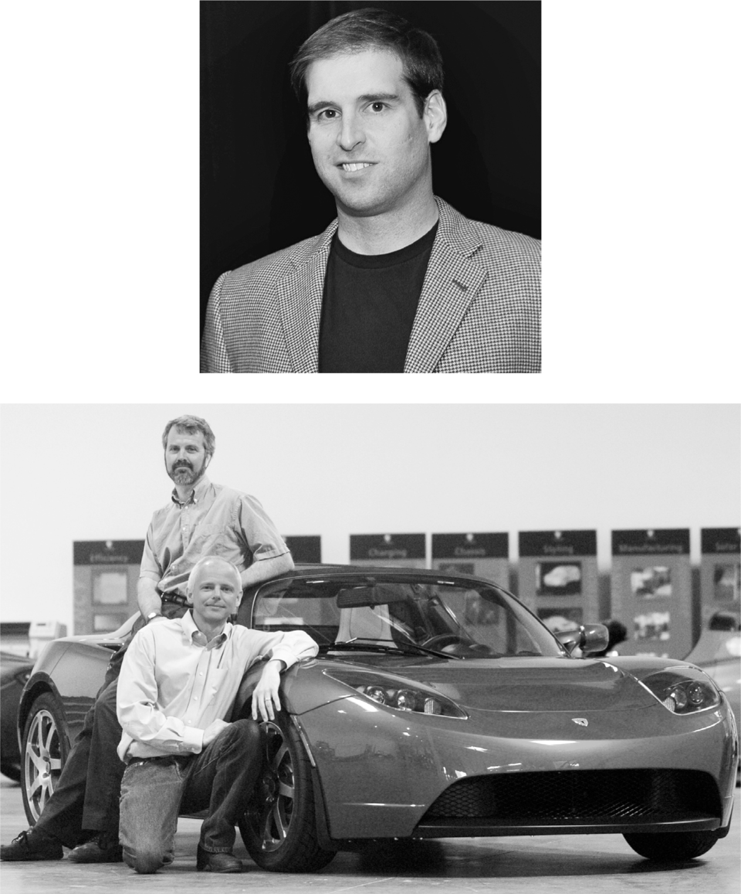

# Chapter 20: Founders: Tesla, 2003–2004

# 20 Founders Tesla, 2003–2004

JB Straubel, with his scar; Martin Eberhard and Marc Tarpenning

[*OceanofPDF.com*](https://oceanofpdf.com)

## JB Straubel

Jeffrey Brian Straubel—known as JB—was a corn-fed and clean-cut Wisconsin kid with a chipmunk-cheek smile who, as a thirteen-year-old car nerd, refurbished the motor of a golf cart and fell in love with electric vehicles. He also liked chemistry. In high school he did an experiment with hydrogen peroxide that blew up in his family basement, leaving a permanent scar on his otherwise cherubic face.

While studying energy systems at Stanford, he interned with a high-spirited and puckish New Orleans–born entrepreneur, Harold Rosen, who designed the geostationary satellite Syncom for Hughes Aircraft. Rosen and his brother Ben were trying to build a hybrid car with a flywheel that would generate electricity. Straubel tried something simpler. He converted an old Porsche into an all-electric vehicle powered by traditional lead-acid car batteries. It had head-snapping acceleration, but its range was only thirty miles.

After Rosen’s electric car company failed, Straubel moved to Los Angeles. One night in the late summer of 2003, he played host to six exhausted and smelly students from Stanford’s solar car team, who had just completed a Chicago-to–Los Angeles race in a car powered by solar panels.

They ended up talking most of the night, and their discussion turned to lithium-ion batteries, which were used in laptops. They packed a lot of power and could be strung together in large numbers. “What if we could put a thousand or ten thousand together?” Straubel asked. They figured out that a lightweight car with a half-ton of batteries might just be able to make it across America. As dawn broke, they went into the backyard with some lithium-ion cells and hit them with hammers so they would explode. It was a celebration of the future, and they made a pact. “We’ve got to do this,” Straubel said.

Unfortunately, no one was interested in funding him. Until he met Elon Musk.

In October 2003, Straubel attended a seminar at Stanford where Musk, who had started SpaceX the year before, was a speaker. His talk touted the need for entrepreneurial space activities “led by the spirit of free enterprise.” That prompted Straubel to push forward at the end and offer to arrange a meeting with Harold Rosen. “Harold was a legend in the space industry, so I invited them to come visit the SpaceX factory,” Musk says.

The factory tour did not go well. Rosen, then seventy-seven, was jovial and self-assured as he pointed out the parts of Musk’s design that would fail. When they went to lunch at a nearby McCormick and Schmick’s seafood restaurant, Musk reciprocated by denouncing as “stupid” Rosen’s latest idea, which was building electric drones to deliver internet service. “Elon is quick to form opinions,” Straubel says. Musk remembers the intellectual sparring fondly. “It was a great conversation because Harold and JB are very interesting people, even though the idea was dumb.”

Eager to keep the conversation going, Straubel changed the topic to his idea for building an electric vehicle using lithium-ion batteries. “I was looking for funding and being rather shameless,” he says. Musk expressed surprise when Straubel explained how good the batteries had become. “I was going to work on high-density energy storage at Stanford,” Musk told him. “I was trying to think of what would have the most effect on the world, and energy storage along with electric vehicles were high on my list.” His eyes lit up as he processed Straubel’s calculations. “Count me in,” he said, committing to provide $10,000 in funding.

Straubel suggested that Musk talk to Tom Gage and Alan Cocconi, who had cofounded a small company, AC Propulsion, that was pursuing the same idea. They had built a fiberglass prototype, which they dubbed the tzero, and Straubel called to urge them to give Musk a ride. Sergey Brin, a cofounder of Google, also suggested that they talk to Musk. So in January 2004, Gage sent Musk an email. “Sergei Brin and JB Straubel both suggested you might be interested in driving our tzero sports car,” he wrote. “We ran it against a Viper last Monday and it won 4 of 5 sprints on a ⅛ mile track. I lost one because I was carrying a 300 lb cameraman. Do you have time for me to bring it by?”

“Sure,” Musk responded. “I would really enjoy seeing it. Don’t think it could beat my McLaren (yet), though.”

“Hmm, a McLaren, boy that would be a feather in my cap,” Gage wrote back. “I can have it there on Feb 4th.”

Musk was blown away by the tzero, even though it was a rough prototype without doors or a roof. “You have to turn this into a real product,” he told Gage. “That could really change the world.” But Gage wanted to start by building a cheaper, boxier, slower car. That made no sense to Musk. Any initial version of an electric car would be expensive to build, at least $70,000 apiece. “Nobody is going to pay anywhere near that for something that looks like crap,” he argued. The way to get a car company started was to build a high-priced car first and later move to a mass-market model. “Gage and Cocconi were sort of madcap inventors,” he laughs. “Common sense was not their strong suit.”

For weeks Musk badgered them to build a fancy roadster. “Everyone thinks electric cars suck, but you can show that they don’t,” he implored. But Gage resisted. “Okay, if you guys don’t want to commercialize tzero, do you mind if I do?” Musk asked.

Gage assented. He also made a fateful suggestion: Musk should partner with a pair of car enthusiasts down the street who had a similar idea. And that was how Musk ended up meeting with two people who had gone through a comparable experience with AC Propulsion and had decided to start their own car company, which they had registered under the name Tesla Motors.

## Martin Eberhard

When Martin Eberhard, a lanky Silicon Valley entrepreneur with a lean face and high-voltage personality, was getting over a bad divorce in 2001, he decided he should, as he described it, “be like every other guy going through a midlife crisis and buy myself a sports car.” He could afford a nice one because he had started and sold a company that made the first popular Kindle predecessor, the Rocket eBook. But he didn’t want a car that burned gasoline. “Climate change had become real to me,” he says, “plus I felt we kept fighting wars in the Middle East because of our need for oil.”

Being methodical, he created a spreadsheet that calculated the energy efficiency of different types of cars, starting with the raw fuel source. He compared gasoline, diesel, natural gas, hydrogen, and electricity from various sources. “I worked through the exact math each step of the way, from when fuels come out of the ground to when they power the car.”

He discovered that electric cars, even in places where the electricity was generated from coal, were the best for the environment. So he decided to buy one. But California had just gutted its mandate that auto companies offer some zero-emission vehicles, and General Motors quit making its EV1. “That really shook me up,” he says.

Then he read about the tzero prototype made by Tom Gage and AC Propulsion. After seeing it, he told Gage he would invest $150,000 in the company if they would switch from lead-acid batteries to lithium-ion. The result was that Gage had a prototype tzero in September 2003 that could accelerate from zero to sixty in 3.6 seconds and had a range of three hundred miles.

Eberhard tried to convince Gage and the others at AC Propulsion to start manufacturing the car, or at least build him one. But they didn’t. “They were smart people, but I soon realized that they were incapable of actually building cars,” Eberhard says. “That’s when I decided I had to start a car company of my own.” He made a deal to license the electric motors and drivetrain from AC Propulsion.

He enlisted his friend Marc Tarpenning, a software engineer who had been his partner at Rocket eBook. They devised a plan to start with a high-end, open-body, two-seat roadster and later build cars for the mass market. “I wanted to make a sporty roadster that would absolutely change the way that people think about electric cars,” Eberhard said, “and then use it to build a brand.”

But what should that brand be? One night, while on a dinner-date at Disneyland, he was obsessing, somewhat unromantically, about what to name the new company. Because the car was going to use what was called an induction motor, he came up with the idea of naming it after the inventor of that device, Nikola Tesla. The next day, he had coffee with Tarpenning and asked his opinion. Tarpenning whipped out his laptop, went online, and registered the name. In July 2003, they incorporated the company.

## Chairman Musk

Eberhard faced a problem. He had an idea and a name, but he had no funding. Then, in March 2004, he got a call from Tom Gage. The two had made an agreement that they would not compete for each other’s investors. When it became clear that Musk was not going to invest in AC Propulsion, Gage offered him to Eberhard. “I’m giving up on Elon,” he said. “You should give him a call.”

Eberhard and Tarpenning had met Musk earlier, when they had gone to hear him speak at a Mars Society meeting in 2001. “I buttonholed him afterwards just to say hi, like a fanboy,” Eberhard recalls.

He mentioned that encounter in an email to Musk asking for a meeting. “We would love to talk to you about Tesla Motors, particularly if you might be interested in investing,” he wrote. “I believe that you have driven AC Propulsion’s tzero car. If so, you already know that a high-performance electric car can be made. We would like to convince you that we can do so profitably.”

That evening Musk replied, “Sure.”

Eberhard came down from Palo Alto to Los Angeles that week, accompanied by a colleague, Ian Wright. The meeting, in Musk’s cubicle at SpaceX, was supposed to last a half-hour, but Musk kept peppering them with questions while occasionally shouting over to his assistant to cancel his next meeting. For two hours they shared their visions for a supercharged electric car, discussing the details of everything from the drivetrain and motor to the business plan. At the end of the meeting, Musk said he would invest. When they got outside the SpaceX building, Eberhard and Wright exchanged high-fives. After a follow-up meeting that included Tarpenning, they agreed that Musk would lead the initial financing round with a $6.4 million investment and become chair of the board.

What struck Tarpenning was that Musk focused on the importance of the mission rather than the potential of the business: “He clearly had already come to the conclusion that to have a sustainable future we had to electrify cars.” Musk had a couple of requests. The first was that the paperwork had to be done quickly, because his wife Justine was pregnant with twins, and a C-section had been scheduled for a week later. He also asked Eberhard to get in touch with JB Straubel. Having invested in both Straubel’s enterprise and Eberhard’s, Musk thought they should work together.

Straubel, who had never heard of Eberhard or his fledgling Tesla enterprise, rode his bicycle over and came away skeptical. But Musk called him and urged him to join forces. “Come on, you’ve got to do this,” Musk told him. “It will be a perfect fit.”

The pieces thus came together for what would become the world’s most valuable and transformative automobile company: Eberhard as CEO, Tarpenning as president, Straubel as chief technology officer, Wright as chief operating officer, and Musk as the chair of the board and primary funder. Years later, after many bitter disputes and a lawsuit, they agreed that all five of them would be called cofounders.

[*OceanofPDF.com*](https://oceanofpdf.com)
