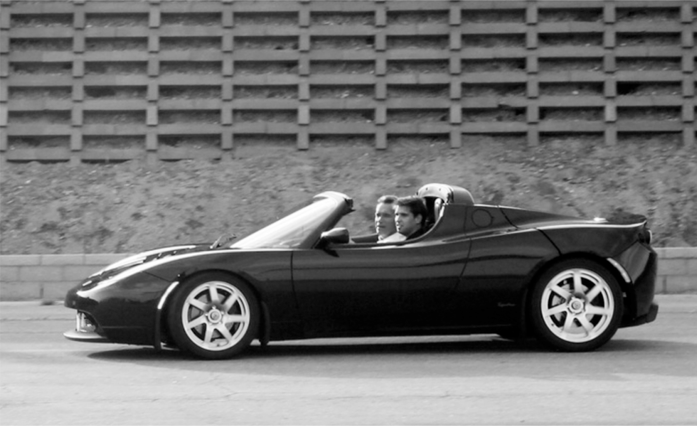

# Chapter 21: The Roadster: Tesla, 2004–2006

# 21 The Roadster Tesla, 2004–2006

Straubel takes Governor Arnold Schwarzenegger for a test drive in a Roadster

## Cobbling together pieces

One of the most important decisions that Elon Musk made about Tesla—the defining imprint that led to its success and its impact on the auto industry—was that it should make its own key components, rather than piecing together a car with hundreds of components from independent suppliers. Tesla would control its own destiny—and quality and costs and supply chain—by being vertically integrated. Creating a good car was important. Even more important was creating the manufacturing processes and factories that could mass-produce them, from the battery cells to the body.

But that’s not the way the company began. Just the opposite.

When producing their Rocket eBook, Martin Eberhard and Marc Tarpenning had outsourced the manufacturing process. Likewise, when it came time to make Tesla’s first car, the Roadster, they decided to cobble it together from components made by outside suppliers. In a decision that would come to haunt Tesla, Eberhard decided that Tesla would get batteries in Asia and car bodies in England and drivetrains from AC Propulsion and a transmission from Detroit or Germany.

This was in line with the prevailing trends in the auto industry. In the early days of Henry Ford and other pioneers, carmakers did most of the work in-house. But beginning in the 1970s, the companies spun off their parts-makers and upped their reliance on suppliers. From 1970 to 2010, they went from producing 90 percent of the intellectual property in their vehicles to about 50 percent. That made them dependent on far-flung supply chains.

After Eberhard and Tarpenning decided to outsource the building of the car’s body and chassis, they went to the Los Angeles Auto Show, invited themselves into the booth of the boutique British sports car maker Lotus, and cornered one of the executives. “He was a polite British guy and couldn’t find a way to tell us to go away,” Eberhard says. “When we were done, he was intrigued enough to invite us to the U.K.” They eventually agreed to a deal in which Lotus would supply a slightly modified version of the body of its spritely Elise roadster, and then Tesla would equip it with an electric engine and powertrain from AC Propulsion.

By January 2005, the eighteen engineers and mechanics at Tesla had cobbled together by hand what was known as a development mule, a vehicle that could be shown off and tested before being put into production. “To make a mule required a lot of hacking and slashing in order to jam our batteries and the AC Propulsion powertrain into a Lotus Elise,” Musk says. “But at least we had a thing that looked like a real car. It actually had doors and a roof, unlike the tzero.”

Straubel got to take the first test ride. When he touched the accelerator, it bolted forward like a startled horse, amazing even its engineers. Eberhard’s turn came next, and tears came to his eyes as he gripped the wheel. After Musk took his turn zipping around and marveling at the car’s super-quick but silent acceleration, he agreed to invest $9 million more in the company.

## Whose company?

One issue with startups, especially those with multiple founders and funders, is who should be in charge. Sometimes the alpha male wins, as when Steve Jobs marginalized Steve Wozniak and when Bill Gates did the same to Paul Allen. At other times it’s messier, especially when different players feel that they are the founder of a company.

Both Eberhard and Musk considered themselves to be the main founder of Tesla. In Eberhard’s mind, he had come up with the idea, enlisted his friend Tarpenning, registered a company, chosen a name, and gone out and found funders. “Elon called himself the chief architect and all kinds of things, but he wasn’t,” Eberhard says. “He was just a board member and investor.” But in Musk’s mind, he was the one who put Eberhard together with Straubel and provided the funding needed to start the company. “When I met Eberhard and Wright and Tarpenning, they had no intellectual property, no employees, nothing. All they had was a shell corporation.”

At first this difference in perspective was not a big problem. “I was running SpaceX,” Musk says, “and I had no desire to also run Tesla.” He was happy, at least initially, to be the board chair and let Eberhard be CEO. But as the person who owned most of the equity, Musk had ultimate authority, and it was not in his nature to defer. Especially when it came to engineering decisions, he became increasingly involved. Tesla’s leadership team thus became an inherently unstable molecule.

For the first year or so, Musk and Eberhard got along. Eberhard handled the daily management of Tesla at its headquarters in Silicon Valley. Musk spent most of his time in Los Angeles and made visits only about once a month for board meetings or important design reviews. His questions tended to be technical, probing into the details of the battery pack, motor, and materials. He was not known for gushing emails, but one night early in their relationship, after working on a problem together, he sent one to Eberhard: “The number of great product people in the world is tiny and I think you are one of them.” They talked most days, exchanged emails at night, and occasionally socialized. “I was never his drinking buddy,” Eberhard says, “but we were in each other’s houses every now and then and went out to eat.”

Alas, they were too much alike for the buddy movie to last. Both were hard-driving, high-strung, detail-oriented engineers who could be brutally dismissive of those they considered fools. The problems began when Eberhard had a falling-out with Ian Wright, who had been part of the founding team. Their disagreements became so intense that each tried to convince Musk to fire the other. It was a tacit acknowledgment by Eberhard that Musk had the ultimate say. “Martin and Ian were telling me why the other one is a demon and needs to be thrown out,” Musk says. “They are saying, ‘Elon, you must make a choice.’ ”

Musk called Straubel for advice. “Okay, who should we pick here?” he asked. Straubel replied that neither choice was great, but when pressed he advised, “Maybe Martin is the lesser of two evils.” Musk ended up firing Wright, but the situation deepened his doubts about Eberhard. It also prompted him to become more involved in the management of Tesla.

## Design decisions

As Musk began to pay more attention to Tesla, he could not refrain from getting involved in design and engineering decisions. He would fly up from Los Angeles every couple of weeks, chair a design review meeting, inspect models, and suggest improvements. Being Musk, however, he did not consider his ideas to be mere suggestions. He bristled when they were not carried out. This was a problem, because the company’s business plan called for cobbling together a body from Lotus and other suppliers without making major changes. “We had planned to do the minimal possible modifications,” Tarpenning says, “at least until Elon got more involved.”

Eberhard tried to resist most of Musk’s suggestions, even if they would make the car better, because he knew they would increase costs and cause delays. But Musk argued that the only way to jump-start Tesla was to roll out a roadster that wowed customers. “We only get to release our first car once, so we want it to be as good as it can be,” he told Eberhard. At one of the review meetings, Musk’s face darkened, his stare turned cold, and he declared that the car looked cheap and ugly. “We couldn’t have a crappy-looking car and sell it for around a hundred thousand dollars,” he later said.

Although his expertise was computer software, not industrial design, he began putting a lot of time into the aesthetics of the Roadster. “I had never designed a car before, so I was studying every great car and trying to understand what made it special,” he says. “I agonized over all the details. He would later proudly note that he was honored by the ArtCenter College of Design in Pasadena for his work on the Roadster.

One major design revision that Musk made was to insist that the door of the Roadster be enlarged. “In order to get in the car, you had to be a dwarf mountain climber or a master contortionist,” he says. “It was insane, farcical.” The six-foot-two-inch Musk found he had to swing his rather large butt into the seat, fold himself into nearly a fetal position, then try to swing his legs in. “If you’re going on a date, how is a woman even going to get in the car?” he asked. So he ordered that the bottom of the door’s frame be lowered three inches. The resulting redesign of the chassis meant that Tesla could not use the crash-test certification that Lotus had, which added $2 million to the production costs. Like many of Musk’s revisions, it was both correct and costly.

Musk also ordered that the seats be made wider. “My original idea was to use the same seat structures that Lotus used,” Eberhard says. “Otherwise, we would have to redo all the testing. But Elon felt that the seats were too narrow for his wife’s butt or something. I got a skinny butt, and I kind of miss the narrow seats.”

Musk also decided that the original Lotus headlights were ugly because they had no cover or shield. “It made the car look bug-eyed,” he says. “The lights are like the eyes of a car, and you have to have beautiful eyes.” That change would add another $500,000 to the production costs, he was told. But he was adamant. “If you’re buying a sports car, you’re buying it because it’s beautiful,” he told the team. “So this is not a small deal.”

Instead of the fiberglass composite material that Lotus used, Musk decided that the Roadster body should be made from stronger carbon fiber. That made it costlier to paint, but it also made it lighter while feeling more solid. Over the years, Musk was able to use techniques learned at SpaceX and apply them to Tesla, and vice versa. When Eberhard pushed back on the cost of carbon fiber, Musk sent him an email. “Dude, you could make the body panels for at least 500 cars worth per year if you bought the soft oven we have at SpaceX!” he wrote. “If someone tells you this is hard, they are full of shit. You can make high quality composites in the oven in your home.”

No detail was too small to escape Musk’s meddling. The Roadster originally had ordinary door handles, the kind that click open a latch. Musk insisted on electric handles that would operate with a simple touch. “Somebody who’s buying a Tesla Roadster will buy it whether it has ordinary door latches or electric ones,” Eberhard argued. “It’s not going to add a single unit to our sales.” It was an argument he had made about most of Musk’s design changes. Musk prevailed, and electric door handles became a cool feature that helped define the magic of Tesla. But as Eberhard warned, it added yet another cost.

Eberhard finally got pushed to despair when, near the end of the design process, Musk decided that the dashboard was ugly. “This is a major issue and I’m deeply concerned that you do not recognize it as such,” Musk wrote. Eberhard tried to put him off, begging that they deal with the issue later. “I just don’t see a path—any path at all—to fixing it prior to start of production without a significant cost and schedule hit,” he wrote. “I stay up at night worrying about simply getting the car into production sometime in 2007…. For my own sanity’s sake and for the sanity of my team, I am not spending a lot of cycles thinking about the dashboard.” Many people over the years would make similar pleas to Musk, few of them successfully. In this case, Musk relented. Improving the dashboard could wait until after the first cars entered production. But it didn’t help Musk and Eberhard’s relationship.

By modifying so many elements, Tesla lost the cost advantages that came from simply using a crash-tested Lotus Elise body. It also added to the supply-chain complexity. Instead of being able to rely on Lotus’s existing suppliers, Tesla became responsible for finding new sources for hundreds of components, from the carbon fiber panels to the headlights. “I was driving the Lotus people crazy,” Musk says. “They kept asking me why I was being so hardcore about every little curve of this car. And what I told them was, ‘Because we have to make it beautiful.’ ”

## Raising more capital

Musk’s modifications may have made the car more beautiful, but they also burned through the company’s cash. In addition, he repeatedly pushed Eberhard to hire more people so that the company could move faster. By May 2006, it had seventy employees, and it needed another round of financing from investors.

Tarpenning was acting as the company’s chief financial officer, even though his expertise was in computer software and not finance. He had the unenviable task of telling Musk at a board meeting that they were running out of money. “This was sooner than we had originally planned, largely because we had been making these hires that Elon pushed for,” Tarpenning recalls. “So Elon totally loses it.”

During the tirade, Elon’s brother Kimbal, who was on the board, reached into his satchel and looked through the budget presentations from the previous five meetings. “Elon,” he quietly interjected, “if you take away the costs of the six unbudgeted new hires that you pushed for, then they would actually still be right on target.” Musk paused, looked at the spreadsheets, and conceded the point. “Okay,” he said, “I guess we should figure out how to raise more financing.” Tarpenning says he felt like hugging Kimbal.

In Silicon Valley at the time, there was a tight-knit and hard-partying community of young entrepreneurs and tech bros who had become startup millionaires, and Musk had become one of its stars. He enlisted some of his friends to invest, including Antonio Gracias, Sergey Brin, Larry Page, Jeff Skoll, Nick Pritzker, and Steve Jurvetson. But board members encouraged him to broaden the network and seek financing from one of the major venture capital firms, such as those that gilded Palo Alto’s Sand Hill Road. That would provide not just money but a stamp of legitimacy on Tesla.

First he approached Sequoia Capital, which had become king of the valley by being early backers of Atari, Apple, and Google. It was run by Michael Moritz, the wry and literate Welsh-born former journalist who had helped guide Musk and Thiel on the tumultuous ride of PayPal. Musk took him for a drive in a mocked-up Lotus prototype. “It was an absolutely bone-jarring ride with Elon at the wheel in this tiny car with no suspension that went from zero to sixty in less time than it takes to blink,” Moritz says. “How much more terrifying can that be?” After Moritz recovered, he called Musk and said he wasn’t going to invest. “I really admired that ride, but we’re not going to compete against Toyota,” he said. “It’s mission impossible.” Years later Moritz conceded, “I didn’t appreciate the strength of Elon’s determination.”

Instead, Musk turned to VantagePoint Capital, led by Alan Salzman and Jim Marver. It became the lead investor in a $40 million financing round that closed in May 2006. “The duality of the management with Eberhard and Musk concerned me,” Salzman says, “but I realized it was just the nature of this beast.”

The duality was not evident in the press release announcing the funding round, which Musk did not see before it went out. It did not list Musk as one of the company’s founders. “Tesla Motors was founded in June 2003 by Martin Eberhard and Marc Tarpenning,” it declared. Eberhard was quoted politely thanking Musk for being an investor: “We are proud of Mr. Musk’s continued confidence in Tesla Motors expressed through his strong participation in every round of financing and his leadership on the Board of Directors.”

## Getting credit

Musk, who had pushed to remain as spokesman for PayPal even after he had been ousted as CEO, had an enthusiastic but awkward attraction to publicity. He would never become an on-air pitchman for his products, like Lee Iacocca or Richard Branson, nor be a moth attracted to TV interviews. He would occasionally appear at conferences and sit still for magazine profiles, but he felt more comfortable spouting off on Twitter or holding court on a podcast. A master of memes, he had a clever instinct about how to garner free publicity by courting controversy and jousting on social media, though he could brood for years about slights.

One constant was his sensitivity about getting credit. His blood boiled if anyone falsely implied that he had succeeded because of inherited wealth or claimed that he didn’t deserve to be called a founder of one of the companies he helped to start. That is what happened at PayPal and was now happening with Tesla, and both cases would lead to lawsuits.

Eberhard in 2006 had become a bit of a celebrity and enjoyed it. He was described in his frequent television interviews and conference appearances as Tesla’s founder, and that year he appeared in an advertisement for the BlackBerry personal digital assistant (a precursor to the smartphone) which said that he “created the first electric sports car.”

After the press release that May on Tesla’s funding round, which referred only to Eberhard and Tarpenning as the company’s founders, Musk moved forcefully to make sure that his own role was never again minimized. He began conducting interviews without clearing them with the company’s public relations chief, Jessica Switzer, who had been hired by Eberhard. She found it problematic that Musk was making pronouncements about the strategy of the company. “Why is Elon doing these interviews?” she asked Eberhard one day when they were riding in a car. “You’re the CEO.”

“He wants to do them,” Eberhard replied, “and I don’t want to be arguing with him.”

## The unveiling

The issue came to a head in July 2006, when Tesla was ready to unveil a prototype of the Roadster. The team had hand-crafted a black one and a red one, each with the ability to go from zero to sixty in about four seconds. They still had not yet changed the skinny seats and ugly dashboard that Musk hated, but otherwise they were pretty close to what Tesla planned to put into production.

An important element in launching a new product, as Steve Jobs had shown with his dramatic announcement events, is creating a buzz that transforms it into an object of desire. This was especially true for an electric car, which needed to overcome the golf-cart image. Switzer came up with plans to hold a celebrity-studded party at the Santa Monica airport where guests would be given a ride in one of the prototypes.

Eberhard and Switzer flew down to Los Angeles to show Musk the plans. “Things went really badly,” she recalls. “He went into every detail, including how much we planned to spend on catering. When I fought back, his whole body jerked away, and he stood up and walked out of the room.” As Eberhard put it, “He shit all over her ideas and then told me to fire her.”

Musk personally took over planning the event. He oversaw the guest list, chose the menu, and even approved the cost and design of the napkins. A smattering of celebrities showed up, including California governor Arnold Schwarzenegger, who was taken on a test drive by Straubel.

Both Eberhard and Musk spoke. “You can have a car that’s quick, and you can have a car that’s electric, but having one that’s both is how you make electric cars popular,” Eberhard said in his confident and polished talk. Musk was awkward, displaying his tendency to repeat words tentatively and stammer slightly. But his lack of slickness charmed the reporters. “Until today, all electric cars sucked,” he declared. Buying the Roadster, he said, would help fund Tesla so that it could make a mass-market vehicle. “Tesla executives are not paid high salaries, and we don’t issue dividends. All free cash flow goes completely into driving the technology to lower costs and make cars that are more affordable.”

The event got glowing coverage. “This is not your father’s electric car,” the *Washington Post* raved. “The $100,000 vehicle, with its sports car looks, is more Ferrari than Prius—and more about testosterone than granola.”

There was, however, one problem. Eberhard got almost all the credit. “He set out to build a sleek, battery-powered performance machine,” *Wired* gushed about him in a lavishly illustrated story. “After reading biographies of John DeLorean and Preston Tucker, and reminding himself that launching a car company was a crazy idea, he did just that.” Musk was mentioned as merely one of the investors Eberhard was able to enlist.

Musk sent a sharp email to Tesla’s vice president, who had the misfortune of taking on the publicity portfolio from the fired Switzer. “The way that my role has been portrayed to date, where I am referred to merely as ‘an early investor,’ is outrageous,” he wrote. “That would be like Martin being called an ‘early employee.’ My influence on the car itself runs from the headlights to the styling to the door sill to the trunk, and my strong interest in electric transport predates Tesla by a decade. Martin should certainly be the front and center guy, but the portrayal of my role to date has been incredibly insulting.” He added that he would “like to talk with every major publication within reason.”

The next day, the *New York Times* wrote a paean to Tesla, headlined “Zero to 60 in 4 Seconds,” that did not even mention Musk. Worse yet, Eberhard was described as Tesla’s chairman, and the only picture was one of him standing with Tarpenning. “I was incredibly insulted and embarrassed by the NY Times article,” Musk wrote to Eberhard and to the public relations firm, PCGC, that they had hired. “I am not merely unmentioned, but Martin is actually referred to as the chairman. If anything like this happens again, please consider the PCGC relationship with Tesla to end immediately.”

In an effort to assert his own central role, Musk published on Tesla’s website a little essay that outlined the company’s strategy. Cheekily titled “The Secret Tesla Motors Master Plan (just between you and me),” it declared:

> The overarching purpose of Tesla Motors (and the reason I am funding the company) is to help expedite the move from a mine-and-burn hydrocarbon economy towards a solar electric economy…. Critical to making that happen is an electric car without compromises, which is why the Tesla Roadster is designed to beat a gasoline sports car like a Porsche or Ferrari in a head-to-head showdown…. Some may question whether this actually does any good for the world. Are we really in need of another high-performance sports car? Will it actually make a difference to global carbon emissions? Well, the answers are no and not much. However, that misses the point, unless you understand the secret master plan alluded to above. Almost any new technology initially has high unit cost before it can be optimized, and this is no less true for electric cars. The strategy of Tesla is to enter at the high end of the market, where customers are prepared to pay a premium, and then drive down market as fast as possible to higher unit volume and lower prices with each successive model.

Musk also propelled himself toward celebrity by giving a tour of the SpaceX factory to the actor Robert Downey Jr. and director Jon Favreau, who were making the superhero movie *Iron Man*. Musk became a model for the title character Tony Stark, a celebrity industrialist and engineer who is able to transform himself into an iron man with a mechanized suit of armor he designed. “My mind is not easily blown, but this place and this guy were amazing,” Downey later said. He asked that a Tesla Roadster be put in the movie set depicting Stark’s workshop. Musk later appeared briefly as himself in *Iron Man 2*.

---

The prototype of the Roadster unveiled in 2006 accomplished the first step Musk had outlined: shattering the illusion that electric cars were destined to be boxy versions of a golf cart. Governor Schwarzenegger plunked down a $100,000 deposit for one, as did the actor George Clooney. Musk’s neighbor in Los Angeles, Joe Francis, who produced the *Girls Gone Wild* television series, sent an armored truck with his $100,000 deposit in cash. Steve Jobs, who loved cars, showed a picture of a Roadster to one of his board members, Mickey Drexler, then the CEO of J.Crew. “Creating engineering this good is the beautiful part,” Jobs said.

GM had recently discontinued its own lame version of an electric car, the EV1, and the filmmaker Chris Paine came out with a scathing documentary titled *Who Killed the Electric Car?* Now Musk and Eberhard and their plucky team at Tesla were poised to revive the future.

One evening, Eberhard was driving his Roadster around Silicon Valley when a kid in a super-pimped Audi pulled up beside him at a stoplight and revved his engine to challenge him to a drag. When the light changed, Eberhard left him in the dust. The same thing happened at the next two lights. Finally the kid rolled down his window and asked Eberhard what he was driving. “It’s electric,” Eberhard said. “There’s no way you can beat it.”

