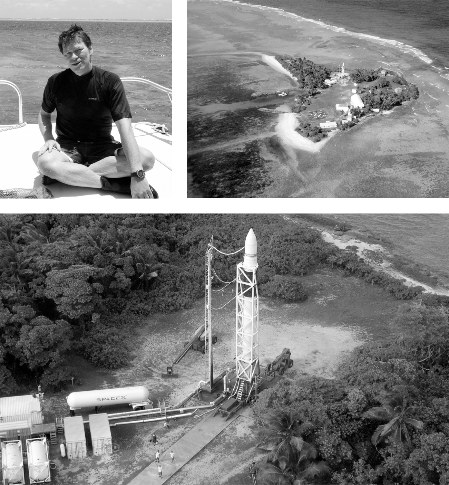

# Chapter 22: Kwaj: SpaceX, 2005–2006

# 22 Kwaj SpaceX, 2005–2006

Hans Koenigsmann and Omelek Island in the Kwajalein Atoll

## Catch-22

Musk had planned to launch SpaceX’s rockets from one of the most convenient possible locations: Vandenberg Air Force Base, a 100,000-acre facility on the California coast near Santa Barbara. Rockets and other equipment could easily be driven there from the SpaceX headquarters and factory in Los Angeles, about 160 miles to the south.

The problem was that the base was run by the Air Force, which treated rules and requirements as sacred. This did not sit well with Musk, who was instilling a culture based on questioning every rule and assuming that every requirement was dumb until proven otherwise. “The Air Force and us were such a mismatch,” says Hans Koenigsmann, who was then SpaceX’s chief launch engineer. “They had some requirements that Elon and I laughed about so hard that we would have to catch our breath.” After a moment’s reflection, he adds, “They probably laughed at us the same way.”

Making matters worse, Vandenberg was scheduled to be used to launch a super-secret $1 billion spy satellite. In the spring of 2005, just as SpaceX’s Falcon 1 was getting ready, the Air Force decreed that SpaceX would not be able to use its pad until the satellite was safely launched, and they could offer no timetable when that might happen.

SpaceX had no one covering its expenses. It did not have a cost-plus contract, and it got paid only when it launched or delivered on certain milestones. Lockheed, on the other hand, profited whenever there was a delay. After a conference call with the Air Force bureaucrats in May 2005, during which he realized that SpaceX would not get permission to launch anytime soon, Musk called Tim Buzza and told him to start packing. They were going to move the rocket to another site. Fortunately, they had one available. Unfortunately, it was as inconvenient as Vandenberg was convenient.

---

Gwynne Shotwell had scored for SpaceX a $6 million deal in 2003 to launch a communications satellite for Malaysia. The problem was the satellite was so heavy that it had to be launched near the equator, where the faster rotation of the Earth’s surface would provide the extra thrust that was needed.

Shotwell invited Koenigsmann into her cubicle at SpaceX, spread out a map of the world, and moved her finger west along the equator. There was nothing to be found until halfway across the Pacific: the Marshall Islands, about forty-eight hundred miles from Los Angeles. It was near the international date line, but nothing else. Once a U.S. territory that was used as an atomic weapon and missile test site, the Marshall Islands had become an independent republic but remained closely aligned with the U.S., which maintained military bases there. One of them was on a string of tiny coral-and-sand islets known as the Kwajalein Atoll.

Kwajalein Island, known as Kwaj, is the largest speck in the atoll. It’s home to a U.S. Army base with fraying hotel facilities that resemble dormitories and a landing strip that tries to pass for an airport. Three days a week, there was a flight from Honolulu. Factoring in layovers, it took close to twenty hours to get from Los Angeles to Kwaj.

When Shotwell researched Kwaj, she found that the facilities were run by the Army’s Space and Missile Defense Command, headquartered in Huntsville, Alabama. The person in charge was Major Tim Mango, a name that made Musk laugh. “It’s like something out of *Catch-22*,” he says. “A person at the Pentagon decides to pick someone named Major Mango to run a tropical island base.”

Musk called Mango out of the blue and explained that he had been a founder of PayPal and had gone into the rocket-launching business. Mango listened for a couple of minutes and hung up on him. “I thought he was nuts,” Mango told Eric Berger of *Ars Technica*. Mango then did a Google search on Musk, saw a picture of him next to his million-dollar McLaren, read that he had started a company called SpaceX, and realized that he was for real. Scrolling through the SpaceX website, Mango found the company’s phone number and dialed it. The same person with the slight South African accent answered. “Hey, did you just hang up on me?” Musk asked.

Mango agreed to visit Musk in Los Angeles. After they talked for a while in his cubicle, he invited Mango to a nice restaurant for dinner. Mango checked with his government ethics officer, who told him he would have to pick up the tab, so they went to Applebee’s instead. Musk and some of his team reciprocated by flying a month later to Huntsville to meet with Mango and his team. This time they ate better, going to a local roadside joint that featured catfish served fried with the head on. Musk ate one, along with some hush puppies. He wanted to make a deal.

So did Major Mango. His base at Kwaj, like many such installations, was expected to hustle for commercial contracts to cover up to half of their budget. “So Major Mango was rolling out the red carpet for us, while the Air Force was giving us the cold shoulder at Vandenberg,” Musk says. On the flight from Huntsville, Musk told his team, “Let’s go to Kwaj.” A few weeks later, they flew on his jet to the remote atoll, took a tour in an open-door Huey helicopter, and decided to move their launch site there.

## This side of paradise

Years later, Musk would admit that moving to Kwaj was a mistake. He should have waited for Vandenberg to become available. But that would have required patience, a virtue that he lacked. “I did not realize what a shitshow it would be dealing with the logistics and the salt air,” he says of Kwaj. “Every now and then you shoot yourself in the foot. If you had to pick a path that reduced the probability of success, it would be to launch from an inaccessible tropical island.” Then he laughs. Now that the scars have healed, he realizes that Kwaj was a memorable adventure. As his chief launch engineer Koenigsmann explains, “Those four years on Kwaj forged us, bonded us, and taught us to work as a team.”

A hardy band of SpaceX engineers moved to the barracks on Kwajalein Island. The launch site itself was twenty miles away on an even tinier island in the atoll, known as Omelek. About seven hundred feet wide and uninhabited, it was accessible by a forty-five-minute catamaran ride, a trip that could cause a sunburn even through a T-shirt in the early morning. There the SpaceX team set up a double-wide trailer as an office and poured concrete for a launchpad.

After a few months, some of the crew decided it was easier to sleep on Omelek rather than make the trip across the lagoon each morning and night. They outfitted the trailer with mattresses, a small refrigerator, and a grill on which a jovial goateed SpaceX engineer from Turkey named Bülent Altan perfected a way to cook ground-beef-and-yogurt goulash. The atmosphere was a cross between *Gilligan’s Island* and *Survivor*, but with a rocket pad. Each time a newbie stayed overnight, they were awarded a T-shirt imprinted with the mantra “Outsweat, Outdrink, Outlaunch.”

At Musk’s insistence, the crew devised ways to save money. Instead of paving the 150-yard path between the hangar and the launchpad, they rigged up a cradle on wheels to transport the rocket, laid pieces of plywood on the ground, rolled the rocket a few feet, then moved the plywood to smooth the way for rolling the next few feet.

How scrappy and non-Boeing-like were the crew on Kwaj? In early 2006, they planned to conduct a static fire test, one that ignites the engines briefly while the rocket stays attached to the launchpad. But when they began the test, they discovered that not enough electrical power was reaching the second stage. It turned out that the power boxes designed by Altan, the goulash-cooking engineer, had capacitors that could not handle the juiced-up voltage the launch team had decided to use. Altan was horrified because the window the Army had given them for the static test ended four days later. He scrambled to put together a save.

The capacitors were available in an electronics supply house in Minnesota. An intern in Texas was dispatched there. Meanwhile, Altan removed the power boxes from the rocket on Omelek, jumped on a boat to Kwaj, slept on a concrete slab outside of the airport waiting for the early-morning flight to Honolulu, and made the connection to Los Angeles, where he was picked up by his wife, who drove him to SpaceX headquarters. There he met the intern, who had arrived from Minnesota with the new capacitors. He swapped them into the faulty power boxes and rushed home to change clothes during the two hours it took for the boxes to be tested. Then he and Musk jumped into Musk’s jet for the dash back to Kwaj, taking the intern with them as his reward. Altan hoped to sleep on the plane—he had been awake for most of forty hours—but Musk bombarded him with questions on every detail of the circuitry. A helicopter whisked them from the Kwaj airstrip to Omelek, where Altan put the repaired boxes onto the rocket. They worked. The three-second static fire test was a success, and the first full launch attempt of Falcon 1 was scheduled for a few weeks later.

