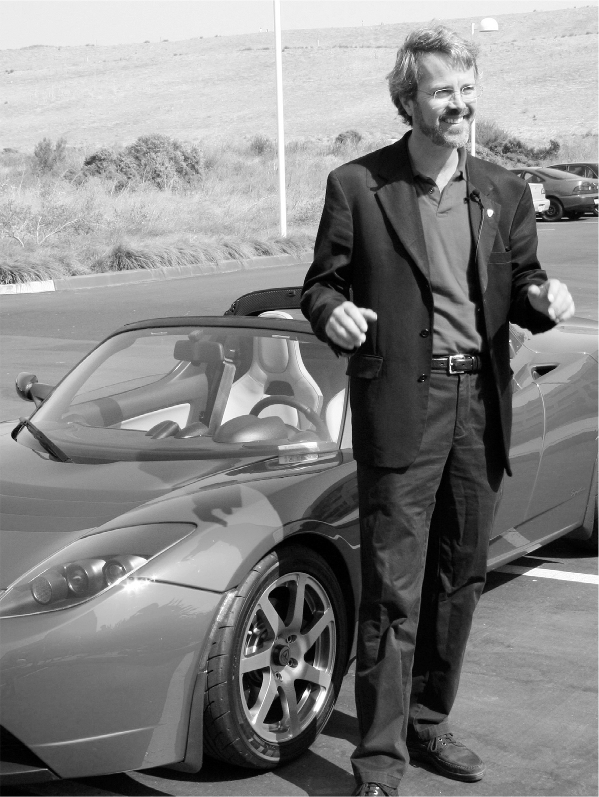

# Chapter 25: Taking the Wheel: Tesla, 2007–2008

# 25 Taking the Wheel Tesla, 2007–2008

Martin Eberhard and the Roadster

[*OceanofPDF.com*](https://oceanofpdf.com)

## Eberhard’s ouster

Soon after he learned about Musk’s secret trip to England, Eberhard asked him to dinner in Palo Alto. “Let’s start a search to find someone who can replace me,” he said. Later, Musk would be brutal about him, but that evening he was supportive. “Nobody will be able to take from you the importance of what you’ve done by being a founder of this company,” he said. At a board meeting the next day, Eberhard described his plan to step aside, and everyone approved.

The search for a successor went slowly, mainly because Musk was not satisfied with any of the candidates. “Tesla’s sheer number of problems was so high that it was nearly impossible to try to find a decent CEO,” Musk says. “It’s hard to find a buyer for a house that’s on fire.” By July 2007, they had not come close to finding one. That is when Gracias and Watkins came in with their report, and Musk’s mood changed.

Musk called a meeting of the Tesla board for early August 2007. “What’s your best estimate for the cost of the car?” he asked Eberhard. When Musk launches into such a grilling, it’s not likely to end happily. Eberhard had trouble giving a precise answer, and Musk became convinced that he was lying. It’s a word Musk uses a lot, often rather loosely. “He lied to me and said the cost would be no problem,” Musk says.

“That’s slanderous,” Eberhard responds when I quote Musk’s accusations. “I wouldn’t lie to anybody. Why would I do that? The true cost is going to come out eventually.” His voice rises in anger, but there is an undertone of pain and sorrow. He cannot figure out why Musk, after fifteen years, is still so fervent about disparaging him. “This is the richest man in the world beating on somebody who can’t touch him.” His original partner Marc Tarpenning admits that they badly miscalculated the pricing, but he defends Eberhard against Musk’s allegation of lying. “Certainly, it wasn’t deliberate,” he says. “We were dealing with the pricing information that we had. We weren’t lying.”

A few days after the board meeting, Eberhard was on his way to a conference in Los Angeles when his phone rang. It was Musk, who informed him that he was being ousted as CEO immediately. “It was like getting hit by a brick on the side of the head, something I never saw coming,” says Eberhard, who should have seen it coming. Even though he had suggested a search for a new CEO, he did not expect to be unceremoniously ousted before one was found. “They had had a meeting without me to vote me off the island.”

He tried to reach some board members, but none would take his call. “It was unanimous board agreement that Martin had to go, including the members Martin had put on the board,” Musk says. Tarpenning soon left as well.

Eberhard launched a little website called *Tesla Founders Blog*, where he vented his frustrations about Musk and accused the company of “trying to root out and destroy any of its heart that might still be beating.” Board members asked him to tone it down, which didn’t work, and then Tesla’s lawyer threatened to withdraw his stock options, which did. There are certain people who occupy a demon’s corner of Musk’s headspace. They trigger him, turn him dark, and rouse a cold anger. His father is number one. But somewhat oddly, Martin Eberhard, who is hardly a household name, is second. “Getting involved with Eberhard was the worst mistake I ever made in my career,” Musk says.

Musk unleashed a barrage of attacks on Eberhard in the summer of 2008, as Tesla’s production woes mounted, and Eberhard responded by suing him for libel. “Musk has set out to re-write history,” the lawsuit began. He still bristles at Musk’s accusations that he lied. “What the fuck?” he says. “The company that Marc and I started turned him into the richest man in the world. Isn’t that enough already?”

They finally reached an uneasy legal settlement in 2009 in which they agreed not to disparage each other and that henceforth both of them would be referred to as cofounders of Tesla, along with JB Straubel, Marc Tarpenning, and Ian Wright. In addition, Eberhard got a Roadster, which he had been promised. They each then issued nice statements about the other that they did not believe.

Despite the no-disparagement clause, Musk would not be able to stop himself from bursting out in anger every few months. In 2019, he tweeted, “Tesla is alive in spite of Eberhard, but he seeks credit constantly & fools give it him.” The following year he declared, “He is literally the worst person I have ever worked with.” Then in late 2021, “Founding story of Tesla as portrayed by Eberhard is patently false. I wish I had never met him.”

## Michael Marks and the asshole question

Musk should have learned by this point that he was not good at sharing power with a CEO. But he still resisted becoming Tesla’s CEO himself. Sixteen years later, he would be the self-installed chief of five major companies, but in 2007 he thought that he should be like almost every other CEO and stick to one company, in his case SpaceX. So he tapped a Tesla investor, Michael Marks, to be interim CEO.

Marks had been the CEO of Flextronics, an electronics manufacturing services company, which he turned into a highly profitable industry leader by pushing a strategy that Musk liked: vertical integration. His company took end-to-end control of multiple steps in the process.

Musk and Marks got along well at first. Musk, who had the odd habit of being the world’s wealthiest couch surfer, would stay at Marks’s home when he visited Silicon Valley. “We’d have some wine and shoot the breeze,” Marks said. But then, Marks made the mistake of believing he could steer the company rather than just carry out Musk’s wishes.

The first clash came when Marks concluded that Musk’s devotion to reality-defying schedules meant that supplies were ordered and paid for, even though there was no chance they would be used to build a car anytime soon. “Why are we bringing all these materials in?” Marks asked at one of his first meetings. A manager replied, “Because Elon keeps insisting that we will be shipping cars in January.” The cash flow for these parts was bleeding Tesla’s coffers, so Marks canceled most of the orders.

Marks also pushed back on Musk’s harsh way of dealing with people. A naturally friendly person, Marks was known for his polite and respectful manner toward colleagues, from the janitor to top executives. “Elon is just not a very nice person and didn’t treat people well,” says Marks, who was appalled that Musk had not even read most of his wife Justine’s novels. This wasn’t just a matter of niceties, it was affecting Musk’s ability to know where the problems were. “I told him that people won’t tell him the truth, because he intimidates people,” Marks says. “He could be a bully and brutal.”

Marks still wrestles with whether Musk’s brain wiring—his ingrained personality and what he calls his Asperger’s—can explain or even excuse some of his behavior. Might it even be beneficial in some ways, when it comes to running companies where the mission is more important than individual sensitivities? “He’s somewhere on the spectrum, so I think he honestly doesn’t have any connection with people at all,” Marks says.

Musk counters that being at the other extreme can be debilitating for a leader. Wanting to be everyone’s friend, he told Marks, leads you to care too much about the emotions of the individual in front of you rather than caring about the success of the whole enterprise—an approach that can lead to a far greater number of people being hurt. “Michael Marks would not fire anyone,” Musk says. “I would tell him, Michael, you can’t tell people they have to get their shit together, and then when they don’t get their shit together nothing happens to them.”

A difference in strategy also emerged. Marks decided that Tesla should partner with an experienced automaker to handle the assembly of the Roadster. That flew in the face of Musk’s fundamental instincts. He aspired to build Gigafactories where raw materials would go in one end and cars would come out the other.

During their debates over Marks’s proposal to outsource assembly of the Tesla, Musk became increasingly angry, and he had no natural filter to restrain his responses. “That’s just the stupidest thing I’ve ever heard,” he said at a couple of meetings. That was a line that Steve Jobs used often. So did Bill Gates and Jeff Bezos. Their brutal honesty could be unnerving, even offensive. It could constrict rather than encourage honest dialogue. But it was also effective, at times, in creating what Jobs called a team of A players who didn’t want to be around fuzzy thinkers.

Marks was too accomplished and proud to put up with Musk’s behavior. “He treated me like a child, and I’m not a child,” he says. “I’m older than he is. I had also run a twenty-five-billion-dollar company.” He soon left.

Marks concedes that Musk turned out to be right about the benefits of controlling all aspects of the manufacturing process. In a more conflicted way, he also wrestles with the core question about Musk: whether his bad behavior can be separated from the all-in drive that made him successful. “I’ve come to put him in the same category as Steve Jobs, which is that some people are just assholes, but they accomplish so much that I just have to sit back and say, ‘That seems to be a package.’ ” Does that, I ask, excuse Musk’s behavior? “Maybe if the price the world pays for this kind of accomplishment is a real asshole doing it, well, it’s probably a price worth paying. That’s how I’ve come to think about it, anyway.” Then, after a pause, he adds, “But I wouldn’t want to be that way.”

---

When Marks left, Musk recruited a CEO he felt would be tougher: Ze’ev Drori, a combat-tested Israeli paratroop officer who had become a successful entrepreneur in the semiconductor business. “The only person who would actually agree to be CEO of Tesla was someone who was afraid of nothing, because there was a lot to be afraid of,” Musk says. But Drori did not know anything about making cars. After a few months, a delegation of senior executives led by JB Straubel said that they would have trouble continuing to work for him, and Ira Ehrenpreis, a board member, helped convince Musk to take over himself. “I’ve got to have both hands on the steering wheel,” Musk told Drori. “I can’t have two of us driving.” Drori gracefully stepped aside, and Musk became the official CEO of Tesla (and the fourth with that title in about a year) in October 2008.

[*OceanofPDF.com*](https://oceanofpdf.com)
