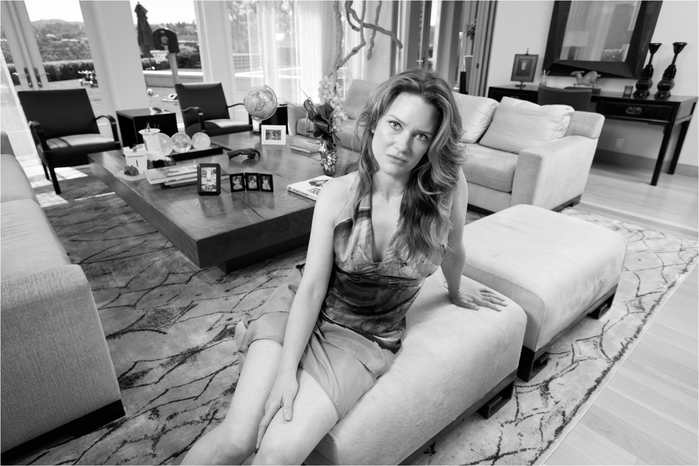

# Chapter 26: Divorce: 2008

# 26 Divorce 2008

Justine

[*OceanofPDF.com*](https://oceanofpdf.com)

After the death of their son Nevada, Justine and Elon decided to get pregnant again as soon as possible. They went to an in vitro fertilization clinic, and in 2004 she gave birth to twins, Griffin and Xavier. Two years later, again through IVF, they had triplets: Kai, Saxon, and Damian.

They had begun the marriage living together in a small apartment in Silicon Valley they shared with three roommates and a miniature dachshund who was not housebroken, Justine recalls, and now they were living in a six-thousand-square-foot mansion in the Bel Air hills section of Los Angeles with five quirky boys, a staff of five nannies and housekeepers, and a miniature dachshund who still was not housebroken.

Despite their tumultuous natures, there were times when their relationship was tender. They would walk to Kepler’s Books near Palo Alto, arms around each other’s waists, take their purchases to a café, and read over coffee. “I get choked up talking about it,” Justine says. “There were moments of being just totally content, like totally.”

Musk was awkward socially, but he liked to go to celebrity-studded parties and hang out until dawn. “We went to black-tie fundraisers and got the best tables at elite Hollywood nightclubs, with Paris Hilton and Leonardo DiCaprio partying next to us,” Justine says. “When Google cofounder Larry Page got married on Richard Branson’s private Caribbean island, we were there, hanging out in a villa with John Cusack and watching Bono pose with swarms of adoring women.”

But through it all, they fought. He was addicted to storm and stress, and she was swept into the turbulence. During their worst arguments, Justine would express how much she hated him, and he would respond by saying such things as “If you were my employee, I would fire you.” Sometimes he would call her “a moron” and “an idiot,” chillingly channeling his father. “When I spent some time with Errol,” Justine says, “I realized that’s where he’d gotten the vocabulary.”

Kimbal, who used to fight physically with his brother, found it difficult to watch him fight verbally with Justine. “Elon fights in a high-intensity way,” Kimbal says. “And Justine could go to the mat as well. You watch it and you’re like, holy moly, this is brutal. I ended up distancing myself from him for years because of Justine. I just could not be around it.”

The entire unsettled lifestyle led to a downward spiral. “It was basically a massive cluster fuck of disruptive things,” says Justine. She felt herself turning into, or being turned into, a “trophy wife,” and, she says, “I sucked at it.” He pushed her to dye her hair blonder. “Go platinum,” he said. But she resisted and began retreating. “I met him when he didn’t have much at all,” she says. “The accumulation of wealth and fame changed the dynamic.”

As he would do with his colleagues at work, Musk could flip instantly from light to dark to light. He would hurl some insults, pause, then his face would melt into an amused grin, and he would make some oddball jokes. “He’s strong-willed and powerful, like a bear,” Justine told *Esquire*’s Tom Junod. “He can be playful and funny and romp around with you, but in the end you’re still dealing with a bear.”

When Musk was focused on a work issue, he went into a zone, like he had back in grade school, where he was completely unresponsive. Later, when I recounted to Justine all the calamities at SpaceX and Tesla that were hitting him in 2008, she started to cry. “He didn’t share these things with me,” she says. “I don’t think it occurred to him that maybe it would’ve been very helpful. He was in such a combative relationship with the world. All he had to do was clue me in.”

The main thing she missed in him was empathy. “He’s a great man in a lot of ways,” she says, “but it’s that lack of empathy that always gives me pause.” During a drive one day, she tried to explain to him the concept of true empathy. He kept making it something cerebral, and he explained how, with his Asperger’s, he had taught himself to be more psychologically astute. “No, it has nothing to do with thinking or analysis or reading the other person,” she said. “It involves *feeling*. You *feel* the other person.” He conceded that was important in relationships, but he suggested that his brain wiring was an advantage in running a high-performance company. “The strong will and emotional distance that makes him difficult as a husband,” Justine concedes, “may be reasons for his success in running a business.”

Elon would get annoyed when Justine pushed him to try psychotherapy. She had started going to a therapist after Nevada’s death and developed a deep interest in the field. It led her, she says, to the insight that Elon’s rough childhood and his brain wiring allowed him to shut down emotions. Intimacy was hard. “When you’re from a dysfunctional background or have a brain wired like his,” she says, “intensity takes the place of intimacy.”

That’s not exactly right. Especially with his kids, Musk can feel strongly and be emotionally needy. He craves having someone around, even former girlfriends. But it’s true that what he lacks in daily intimacy he makes up for in intensity.

Justine’s dissatisfaction with the marriage deepened her depression and made her angry. “She went from having some highs and lows to just being angry every day,” Elon says. He blamed it on Adderall, a cognitive enhancer that her psychiatrist had prescribed, and he would go around the house throwing away the pills. Justine agrees that she was both depressed and reliant on Adderall. “I was diagnosed with Attention Deficit Disorder, and Adderall was an amazing help for me,” she says. “But it wasn’t the reason I was angry. I was angry because Elon shut me out.”

In the spring of 2008, amid the exploding rockets and turmoil at Tesla, Justine was in a car accident. Afterward, she sat on their bed with her knees pulled up to her chest and tears in her eyes. She told Elon that their relationship had to change. “I didn’t want to be a sideline player in the multimillion-dollar spectacle of my husband’s life,” she says. “I wanted to love and be loved, the way we had before he made all his millions.”

Elon agreed to enter counseling, but after a month and three sessions, the marriage broke up. Justine’s version is that Elon gave her an ultimatum: either she accept the marriage for what it was or he would file for divorce. His version is that she had repeatedly said she wanted to get divorced, and he finally said, “I’m willing to stay married, but you have to promise not to be mean to me all the time.” When Justine made it clear that the current situation was unacceptable to her, he filed for divorce. “I felt numb,” she recalls, “but strangely relieved.”

[*OceanofPDF.com*](https://oceanofpdf.com)
