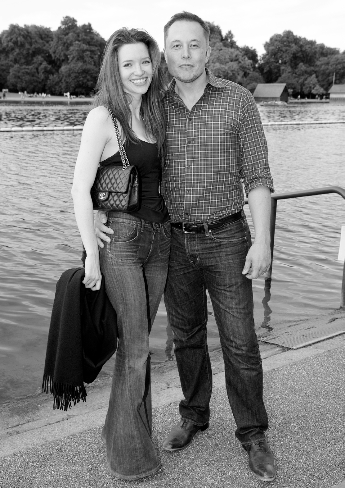

# Chapter 27: Talulah: 2008

# 27 Talulah 2008

With Talulah Riley in Hyde Park, London

[*OceanofPDF.com*](https://oceanofpdf.com)

In July 2008, after breaking up with Justine, Musk was scheduled to give a speech to the Royal Aeronautical Society in London. It was not a propitious time to be talking about rockets. Two of his had blown up, and the third attempt was supposed to launch in three weeks. Tesla’s kludgy production chain was sucking up cash, and the early signs of a global economic meltdown were making new financing difficult. Plus his divorce wranglings with Justine threatened his ability to control his Tesla stock. Nevertheless, he went.

In his speech, he argued that commercial space ventures, such as SpaceX, were more innovative than government programs and were necessary if humans wanted to colonize other planets. He then went to visit the CEO of Aston Martin, who dumped all over the electric car movement and dismissed worries about climate change.

The next day, Musk awoke with stomach pains, which was not unusual. He can pretend to like stress, but his stomach can’t. He was traveling with his friend Bill Lee, a successful entrepreneur, who took him to a clinic. When the doctor determined that he did not have appendicitis or anything worse, Lee insisted that they go let off some steam, and he called a friend, Nick House, who owned the hot nightclub Whisky Mist. “I was trying to snap Elon out of his mood,” Lee says. Musk kept trying to leave, but House convinced them to come to a VIP room in the basement. A few moments later, an actress wearing an eye-catching evening gown walked in.

Talulah Riley, then twenty-two, grew up in a picture-book English village in Hertfordshire and, by the time she met Musk, had distinguished herself in some small but well-played roles, most notably as the tone-deaf middle Bennet sister, Mary, in an adaptation of Jane Austen’s *Pride and Prejudice*. Tall and beautiful with long, flowing hair and a sharp mind and personality, she was very much Musk’s type.

Introduced by Nick House and another friend, James Fabricant, she ended up sitting with Musk. “He seemed quite shy and slightly awkward,” she says. “He was talking about rockets, and at first I didn’t realize they were his rockets.” At one point he asked, “May I put my hand on your knee?” She was a bit taken aback, but nodded her assent. At the end, he said to her, “I’m very bad at this, but please may I have your phone number because I would like to see you again.”

Riley had only recently moved out of her parents’ home, and she called the next morning to tell them about the man she had just met. As they were speaking, her father did a Google search. “This man is married and has five children,” he reported. “You’ve been taken in by some playboy.” Furious, she called her friend Fabricant, who calmed her down and assured her that Musk had broken up with his wife.

“We ended up having breakfast together,” Riley says, “and at the end he said, ‘I’d really like to see you for lunch.’ And then after lunch that day, he said, ‘Well, that was really wonderful. Now I’d like to see you for dinner.’ ” Over the next three days, they had almost every meal together and went shopping at Hamleys toy store to get gifts for his five kids. “They were love birds, holding hands the entire time,” Lee says. At the end of the trip, he invited her to fly back to Los Angeles with him. She couldn’t, because she had to go to Sicily for a photo shoot for a *Tatler* article about a movie she had just made, *St. Trinian’s*. But from there she flew to Los Angeles.

Rather than moving in with Musk—which she believed was improper—she took a room for a week at the Peninsula Hotel. At the end of the visit, he proposed. “I’m really sorry I don’t have a ring,” he said. She suggested they shake hands on it, which they did. “I remember swimming around with him in the rooftop pool, very giddy, talking about how strange it was that we had known each other for about two weeks and were now engaged.” Riley said she felt sure things would work out. “What’s the worst that could happen to us?” she joked. Musk, suddenly in earnest mode, replied, “One of us could die.” Somehow, in the moment, she found that very romantic.

When her parents flew from London to meet Musk a few weeks later, he asked her father if he could marry her. “I know my daughter very well, and I trust her judgment, so off you go,” he replied. Maye flew to Los Angeles and, for once, approved of one of her son’s partners. “She was an absolute delight, funny and loving and successful,” she says. “And her parents were so nice, a really good English couple.” But on the advice of his brother Kimbal, he decided, and Talulah concurred, that they should wait a couple of years before getting married.

[*OceanofPDF.com*](https://oceanofpdf.com)
