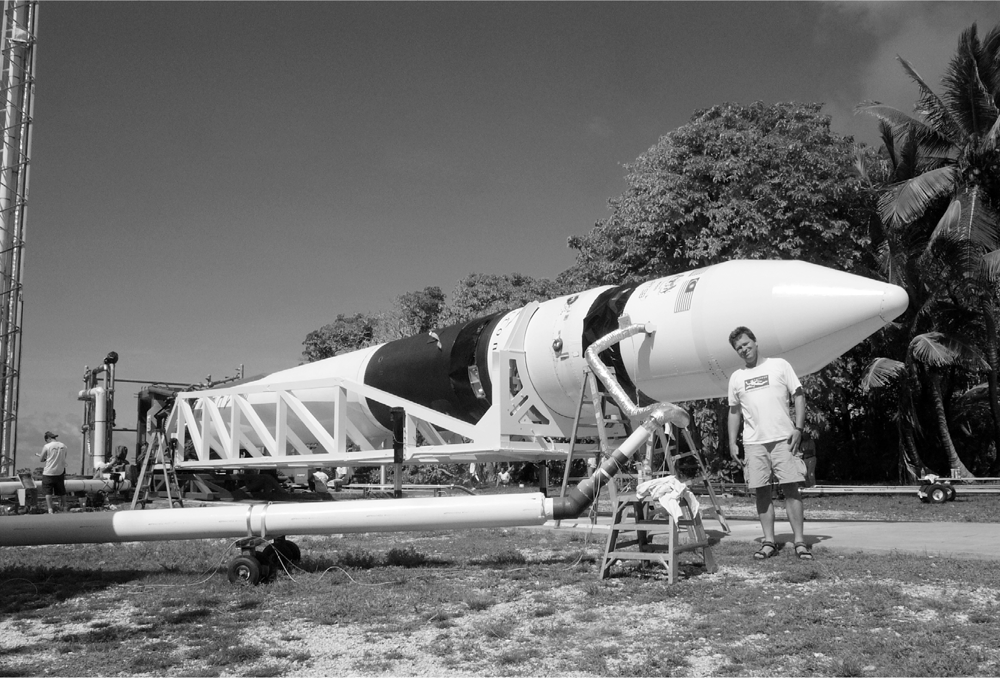

# Chapter 28: Strike Three: Kwaj, August 3, 2008

# 28 Strike Three Kwaj, August 3, 2008

Hans Koenigsmann with a Falcon 1

After two failed launches from the remote atoll of Kwajalein, the third attempt of the Falcon 1 rocket would make or break SpaceX, or at least that’s what everyone, including Musk, thought. He told his team he had money for only three tries. “I believed that if we couldn’t do it in three,” he says, “we deserved to die.”

For the second flight, SpaceX had not put a real satellite on top of the rocket because it did not want to lose a valuable payload if it crashed. But for this third attempt, Musk was all in, gambling on success. The rocket would carry an expensive 180-pound Air Force satellite, two smaller satellites from NASA, and the cremated remains of James Doohan, the actor who played Scotty on *Star Trek*.

The liftoff went beautifully, and the control room in Los Angeles, where Musk was watching, erupted in cheers as the rocket ascended. After two minutes and twenty seconds, the upper stage detached from the booster, as scheduled. The payload seemed to be headed for orbit. “Third time a charm!” one engineer shouted.

Then, once again, there was a gasp from Mueller seated in his usual spot next to Musk. One second after the booster started descending back to Earth, as it was supposed to do, it spurted up briefly and bumped into the second stage. The video feed went blank, and Musk and his team immediately knew that both stages, along with the remains of dear Scotty, were now crashing down.

The problem was that they had redesigned the cooling system for the Merlin engine, and that caused it to have a little bit of thrust even after it shut down. Mueller’s team had tested the new system on the ground, and it worked fine under sea-level conditions. But in the vacuum of space, the tiny spurt of the residual fuel burn nudged the booster up a foot or so.

---

Musk had run out of money, Tesla was hemorrhaging cash, and SpaceX had crashed three rockets in a row. But he was not ready to give up. Instead, he would go for broke, literally. “SpaceX will not skip a beat in execution going forward,” he announced a few hours after the failure. “There should be absolutely zero question that SpaceX will prevail in reaching orbit. I will never give up, and I mean never.”

In the SpaceX conference room the next day, Musk got on a conference call with Koenigsmann, Buzza, and the launch team on Kwaj. They went over the data and figured out ways to allow more separation time so the bump would not happen again. Musk was in a somber mood. “It was the shittiest period of my life, given what was happening with my marriage, SpaceX, and Tesla,” he says. “I didn’t even have a house. Justine had it.” The team worried that he would, as he often did, try to single out people to blame. They prepared for a cold eruption.

Instead, he told them that there were components for a fourth rocket in the Los Angeles factory. Build it, he said, and transport it to Kwaj as soon as possible. He gave them a deadline that was barely realistic: launch it in six weeks. “He told us to go for it,” says Koenigsmann, “and it blew me away.”

A jolt of optimism spread through headquarters. “I think most of us would have followed him into the gates of hell carrying suntan oil after that,” says Dolly Singh, the human resources director. “Within moments, the energy of the building went from despair and defeat to a massive buzz of determination.”

Carl Hoffman, a *Wired* reporter who had watched the failure of the second launch with Musk, reached him to ask how he maintained his optimism. “Optimism, pessimism, fuck that,” Musk answered. “We’re going to make it happen. As God is my bloody witness, I’m hell-bent on making it work.”

