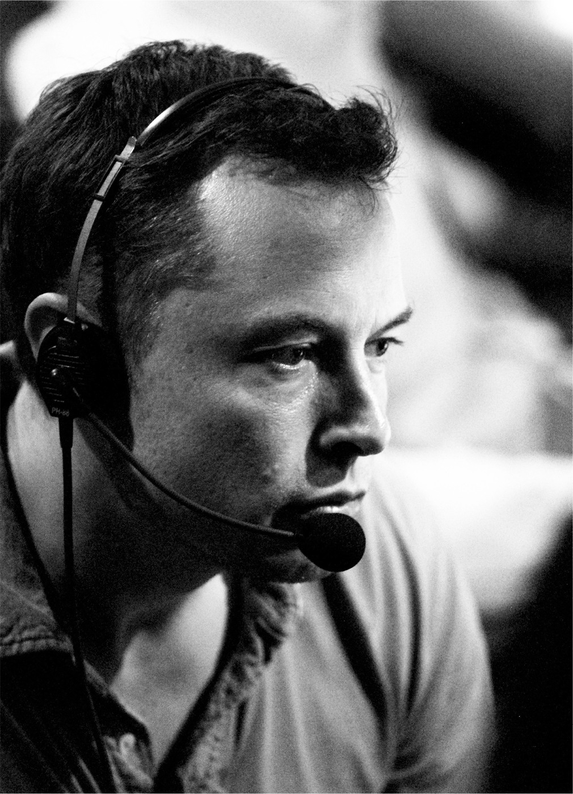

# Chapter 29: On the Brink: Tesla and SpaceX, 2008

# 29 On the Brink Tesla and SpaceX, 2008

In the SpaceX control room

On February 1, 2008, an email went out to employees at Tesla headquarters. “P1 arriving now!” it announced. “P1” was the codename for the first Roadster to make it through the production process. Musk spoke briefly and then took the Roadster on a victory lap around Palo Alto.

This rollout of a few vehicles, which had all been fitted by hand, was only a small triumph. Many car companies, long bankrupt and forgotten, had done similar things. The next challenge was to have a manufacturing process that could churn out the cars profitably. In the past century, only one American car company (Ford) had managed to do that without going through bankruptcy.

At that moment, it was unclear that Tesla would become the second. A subprime mortgage meltdown had begun, which would lead to the most severe global recession since the Great Depression. Tesla’s supply chain was unwieldy, and the company was running out of money. In addition, SpaceX had yet to get a rocket into orbit. “Even though I now had a Roadster,” Musk says, “it was the beginning of the most painful year of my life.”

Musk often skated close to the edge of legality. He kept Tesla afloat through the first half of 2008 by dipping into the deposits made by customers for Roadsters that had not yet been built. Some Tesla executives and board members felt that the deposits should have been kept in escrow rather than tapped for operating expense, but Musk insisted, “We either do this or we die.”

As the situation got more desperate in the fall of 2008, Musk pleaded for money from friends and family to meet Tesla’s payroll. Kimbal had lost most of his money in the recession and, like his brother, was close to bankruptcy. He had been clinging to $375,000 in Apple stock, which he said he needed to cover loans he had taken from his bank. “I need you to put it into Tesla,” Elon said. Kimbal, ever supportive, sold the stock and did as Elon asked. He got an angry call from his banker at Colorado Capital warning that he was destroying his credit. “Sorry, but I have to do it,” Kimbal replied. When the banker called again a few weeks later, Kimbal braced for an argument. But the banker cut him short with the news that Colorado Capital itself had just gone under. “That’s how bad 2008 was,” Kimbal says.

Musk’s friend Bill Lee invested $2 million, Sergey Brin of Google invested $500,000, and even regular Tesla employees wrote checks. Musk borrowed personally to cover his expenses, which included paying $170,000 per month for his own divorce lawyers and (as California law requires of the wealthier spouse) those of Justine. “God bless Jeff Skoll, who gave Elon money to see him through,” Talulah says of Musk’s friend, who was the first president of eBay. Antonio Gracias also stepped up, loaning him $1 million. Even Talulah’s parents offered to help. “I was very upset and called Mommy and Daddy, and they said they would remortgage their house and try to help,” she recalls. That offer Musk declined. “Your parents shouldn’t lose their house just because I put in everything I had,” he told her.

Talulah watched in horror as, night after night, Musk had mumbling conversations with himself, sometimes flailing his arms and screaming. “I kept thinking he was going to have a heart attack,” she says. “He was having night terrors and just screaming in his sleep and clawing at me. It was horrendous. I was really scared, and he was just desperate.” Sometimes he would go to the bathroom and start vomiting. “It would go to his gut, and he would be screaming and retching,” she says. “I would stand by the toilet and hold his head.”

Musk’s tolerance for stress is high, but 2008 almost pushed him past his limits. “I was working every day, all day and night, in a situation that required me to pull a rabbit out of the hat, now do it again, now do it again,” he says. He gained a lot of weight, and then suddenly lost it all and more. His posture became hunched, and his toes stayed stiff when he walked. But he became energized and hyperfocused. The threat of the hangman’s noose concentrated his mind.

---

There was one decision that everyone around Musk thought he would have to make. As 2008 careened toward a close, it seemed that he would have to choose between SpaceX and Tesla. If he focused his dwindling resources on one, he could be pretty sure it would survive. If he tried to split his resources, neither might. One day his high-spirited soulmate Mark Juncosa walked into his cubicle at SpaceX. “Dude, why don’t you fucking just give up on one of these two things?” he asked. “If SpaceX speaks to your heart, throw Tesla away.”

“No,” Musk said, “that would be another notch in the signpost of ‘Electric cars don’t work,’ and we’d never get to sustainable energy.” Nor could he abandon SpaceX. “We might then never be a multiplanetary species.”

The more people pressed him to choose, the more he resisted. “For me emotionally, this was like, you got two kids and you’re running out of food,” he says. “You can give half to each kid, in which case they might both die, or give all the food to one kid and increase the chance that at least one kid survives. I couldn’t bring myself to decide that one was going to die, so I decided I had to give my all to save both.”

