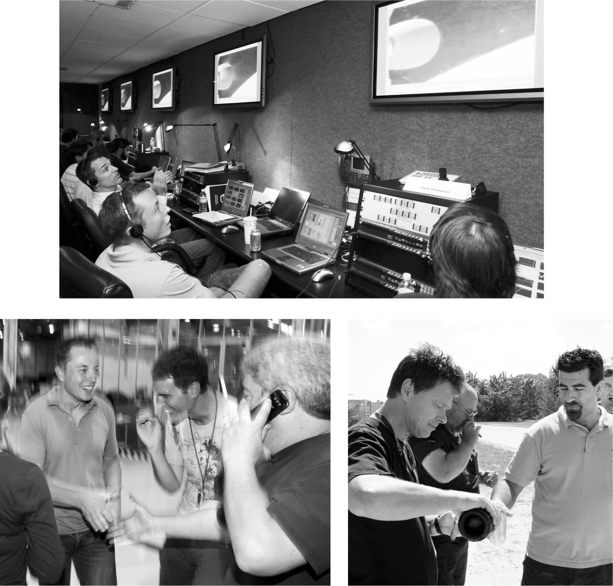

# Chapter 30: The Fourth Launch: Kwaj, August–September 2008

# 30 The Fourth Launch Kwaj, August–September 2008

Musk in the control room and with engineers; Koenigsmann pouring champagne on Kwaj

[*OceanofPDF.com*](https://oceanofpdf.com)

## Founders to the rescue

Musk had budgeted for three launch attempts of the Falcon 1, and all had exploded before they could get to orbit. Facing personal bankruptcy and with Tesla in a financial crisis, it was hard to see how he was going to raise money for a fourth attempt. Then a surprising group came to the rescue: his fellow cofounders of PayPal, who had ejected him from the role of CEO eight years earlier.

Musk had taken his ouster with unusual calm, and he stayed friendly with the coup leaders, including Peter Thiel and Max Levchin. The old PayPal mafia, as they called themselves, were a tight-knit crowd. They helped finance their former colleague David Sacks—the friend who took notes for Antonio Gracias in law school—when he produced the satirical movie *Thank You for Smoking*. Thiel teamed up with two other PayPal alums, Ken Howery and Luke Nosek, to form the Founders Fund, which invested mainly in internet startups.

Thiel was, he says, “categorically skeptical about clean tech,” so the fund had not invested in Tesla. Nosek, who had become close to Musk, suggested that they invest in SpaceX. Thiel agreed to a conference call with Musk to discuss the idea. “At one point I asked Elon whether we could speak to the company’s chief rocket engineer,” Thiel says, “and Elon replied, ‘You’re speaking to him right now.’ ” That did not reassure Thiel, but Nosek pushed hard to make the investment. “I argued that what Elon was trying to do was amazing, and we should be a part of it,” he says.

Eventually Thiel relented and agreed that the fund could put in $20 million. “Part of my thinking was that it would be a way to patch things up from the PayPal saga,” he says. The investment was announced on August 3, 2008, just after the third launch attempt failed. It served as a lifeline that allowed Musk to declare that he was going to fund a fourth launch.

“It was an interesting exercise in karma,” Musk says. “After I got assassinated by the PayPal coup leaders, like Caesar being stabbed in the Senate, I could have said ‘You guys, you suck.’ But I didn’t. If I’d done that, Founders Fund wouldn’t have come through in 2008 and SpaceX would be dead. I’m not into astrology or shit like that. But karma may be real.”

## Crunch time

Musk had jolted his team, right after the third failed flight in August 2008, with his deadline of getting a new rocket to Kwaj in six weeks. That seemed like a Musk reality-distortion ploy. It had taken them twelve months between the first and second failed launches, and another seventeen months between the second and the third. But because the rocket did not need any fundamental design changes to correct the problems that caused the third failure, he calculated that a six-week deadline was doable and would energize his team. Also, given his rapid cash burn, he had no other choice.

SpaceX had components for that fourth rocket in its Los Angeles factory, but shipping it by sea to Kwaj would take four weeks. Tim Buzza, SpaceX’s launch director, told Musk that the only way to meet his deadline would be to charter a C-17 transport plane from the Air Force. “Well, then, just do it,” Musk replied. That’s when Buzza knew that Musk was willing to put all his chips on the table.

Twenty SpaceX employees rode with the rocket in the hold of the C-17, strapped into jump seats along the wall. The mood was festive. The work-crazed crew members were about to pull off, they thought, a hardcore miracle.

As they flew over the Pacific, a young engineer named Trip Harriss pulled out a guitar and started playing. His parents were music professors from Tennessee, and he had trained to become a classical musician. But one Christmas, he was watching *Star Trek* and decided that he wanted to be a rocket scientist instead. “I ended up figuring out how to change my brain from doing music to doing engineering,” which was not as much of a transition as he thought. After a year at Purdue, he was scrambling for a summer internship, but kept bombing interviews. He had resigned himself to working at a local Ace Hardware when his professor got a call from a friend at SpaceX saying it needed interns. Without waiting for any paperwork, Harriss got into his car the next morning, left his girlfriend behind, and drove from Indiana to Los Angeles.

As they started to descend for refueling in Hawaii, there was a loud popping sound. And another. “We’re like looking at each other, like, this seems weird,” Harriss says. “And then we get another bang, and we saw the side of the rocket tank crumpling like a Coke can.” The rapid descent of the plane caused the pressure in the hold to increase, and the valves of the tank weren’t letting in air fast enough to allow the pressure inside to equalize.

There was a mad scramble as the engineers pulled out their pocket knives and began cutting away the shrink wrapping and trying to open the valves. Bülent Altan ran to the cockpit to try to stop the descent. “Here’s this big Turkish guy screaming at the Air Force pilots, who were the whitest Americans you have ever seen, to go back higher,” Harriss says. Astonishingly, they did not dump the rocket, or Altan, into the ocean. Instead, they agreed to ascend, but warned Altan that they had only thirty minutes of fuel. That meant in ten minutes they would need to start descending again. One of the engineers climbed inside the dark area between the rocket’s first and second stage, found the large pressurization line, and managed to twist it open, allowing air to rush into the rocket and equalize the pressure as the cargo plane again started to descend. The metal began popping back close to its original shape. But damage had been done. The exterior was dented, and one of the slosh baffles had been dislodged.

They called Musk in Los Angeles to tell him what happened and suggest that they bring the rocket back. “All of us standing there could just hear this pause,” says Harriss. “He is silent for a minute. Then he’s like, ‘No, you’re going to get it to Kwaj and fix it there.’ ” Harriss recalls that when they got to Kwaj their first reaction was, “Man, we’re doomed.” But after a day, the excitement kicked in. “We began telling ourselves, ‘We’re going to make this work.’ ”

Buzza and the chief of rocket structures, Chris Thompson, rustled up the equipment they needed at SpaceX headquarters, including new baffles to prevent slosh in the tanks, and loaded it onto Musk’s jet for the trip from Los Angeles to Kwaj. There they found a hive of engineers scurrying around in the middle of the night working frantically on the stripped rocket, as if they were doctors in an emergency room trying to save a patient.

After SpaceX’s first three failures, Musk had imposed more quality controls and risk-reduction procedures. “So we were now used to moving a little bit slower, with more documentation and checks,” Buzza says. He told Musk that if they followed all these new requirements, it would take five weeks to repair the rocket. If they jettisoned the requirements, they could do it in five days. Musk made the expected decision. “Okay,” he said. “Go as fast as you can.”

Musk’s decision to reverse his orders about quality controls taught Buzza two things: Musk could pivot when situations changed, and he was willing to take more risk that anyone. “This is something that we had to learn, which was that Elon would make a statement, but then time would go on and he would realize, ‘Oh no, actually we can do it this other way,’ ” Buzza says.

As they scrambled in the brutal Kwaj sun, they were watched by an abnormally large coconut crab that was close to three feet long. They named it Elon, and under its gaze, they were able to complete the repairs in the allotted five days. “It was unlike anything that the bloated companies in the aerospace industry could possibly have imagined,” Buzza says. “Sometimes his insane deadlines make sense.”

## “Fourth time’s a charm!”

Unless this fourth launch attempt succeeded, it would be the end of SpaceX and probably of the wacky notion that space pioneering could be led by private entrepreneurs. It might also be the end of Tesla. “We wouldn’t be able to get any new funding for Tesla,” Musk says. “People would be like, ‘Look at that guy whose rocket company failed, he’s a loser.’ ”

The launch was scheduled for September 28, 2008, and Musk planned to watch from the command van at SpaceX headquarters in Los Angeles. To relieve tension, Kimbal suggested that they take their kids to Disneyland that morning. It was a crowded Sunday, and they had not arranged for VIP access, but waiting in the long lines was a blessing because it had a calming effect on Elon. Fittingly, they rode the Space Mountain roller coaster, which was such an obvious metaphor that it would seem trite were it not true.

Dressed in the beige polo shirt and faded jeans he had worn to Disneyland, Musk arrived at the command van just as the launch window was opening at 4 p.m. On one of the monitors, he could see the Falcon 1 on the Kwaj launchpad. There was silence in the control room as a woman’s voice intoned the countdown.

When the rocket cleared the tower, the cheering began, but Musk stared silently at the data streaming onto his computer and at the monitor on the wall showing video from the rocket’s cameras. After sixty seconds, the video showed the plume from the engine darkening. This was fine; it was because the rocket had reached more rarefied air with less oxygen. The islets of Kwajalein Atoll receded, looking like a strand of pearls in the turquoise sea.

After two minutes, it was time for the stages to separate. The booster engine shut down, and this time there was a five-second delay before the second stage was unleashed, to prevent the bumping that had doomed the third launch. When the second stage slowly pulled away, Musk finally allowed himself to let out a whoop of joy.

The Kestrel engine on the second stage performed perfectly. Its nozzle glowed a dull red from the heat, but Musk knew the material could get white-hot and survive. Finally, nine minutes after liftoff, the Kestrel engine cut off as planned and its payload was released into orbit. By now the cheers were deafening, and Musk was pumping his arms into the air. Kimbal, standing next to him, started to cry.

Falcon 1 had made history as the first privately built rocket to launch from the ground and reach orbit. Musk and his small crew of just five hundred employees (Boeing’s comparable division had fifty thousand) had designed the system from the ground up and done all the construction on its own. Little had been outsourced. And the funding had also been private, largely out of Musk’s pocket. SpaceX had contracts to perform missions for NASA and other clients, but they would get paid only if and when they succeeded. There were no subsidies or cost-plus contracts.

“That was frigging awesome,” Musk yelled as he walked onto the factory floor. He did a little jig in front of cheering employees gathered near the canteen. “Fourth time’s a charm!” As the cheers rose again, he began stuttering a bit more than usual. “My mind is kind of frazzled, so it’s hard for me to say anything,” he murmured. But then he pronounced his vision for the future: “This is just the first step of many. We’re going to get Falcon 9 to orbit next year, get the Dragon spacecraft going, and take over from the Space Shuttle. We’re going to do a lot of things, even getting to Mars.”

Despite his stony appearance, Musk’s stomach had been wrenched during the launch, almost to the point of throwing up. Even after the success, he had trouble feeling joy. “My cortisol levels, my stress hormones, the adrenaline, they were just so high that it was hard for me to feel happy,” he says. “There was a sense of relief, like being spared from death, but no joy. I was way too stressed for that.”

## “ilovenasa”

The successful launch saved the future of entrepreneurial space endeavors. “Like Roger Bannister besting the four-minute mile, SpaceX made people recalibrate their sense of limitation when it came to getting to space,” wrote the author Ashlee Vance.

That led to a major change in direction for NASA. The impending end of its Space Shuttle program meant that the U.S. would no longer have any capacity to send crews or cargo to the International Space Station. So the agency announced a competition for a contract to fly cargo missions there. The success of the fourth Falcon 1 flight allowed Musk and Gwynne Shotwell to fly to Houston in late 2008 to meet with NASA and push their case.

When they got off his jet, Musk pulled her aside for a chat on the tarmac. “NASA is worried that I have to split my time between SpaceX and Tesla,” he told her. “I kind of need a partner.” It was not an idea that came easily to him; he was better at commanding than partnering. Then he made her an offer. “Do you want to be president of SpaceX?” He would remain the CEO, and they would divide responsibilities. “I’ll focus on engineering and product development,” he said, “and I want you to focus on customer management, human resources, government affairs, and a lot of the finance.” She accepted right away. “I love working with people, and he loves working with hardware and designs,” she explains.

On December 22, as if to ring down the curtain on the horrible year of 2008, Musk got a call on his cell phone. NASA spaceflight chief Bill Gerstenmaier, who would later end up at SpaceX, gave him the news: SpaceX was going to be awarded a $1.6 billion contract to make twelve round trips to the Space Station. “I love NASA,” Musk responded. “You guys rock.” Then he changed his password for his computer login to “ilovenasa.”

[*OceanofPDF.com*](https://oceanofpdf.com)
