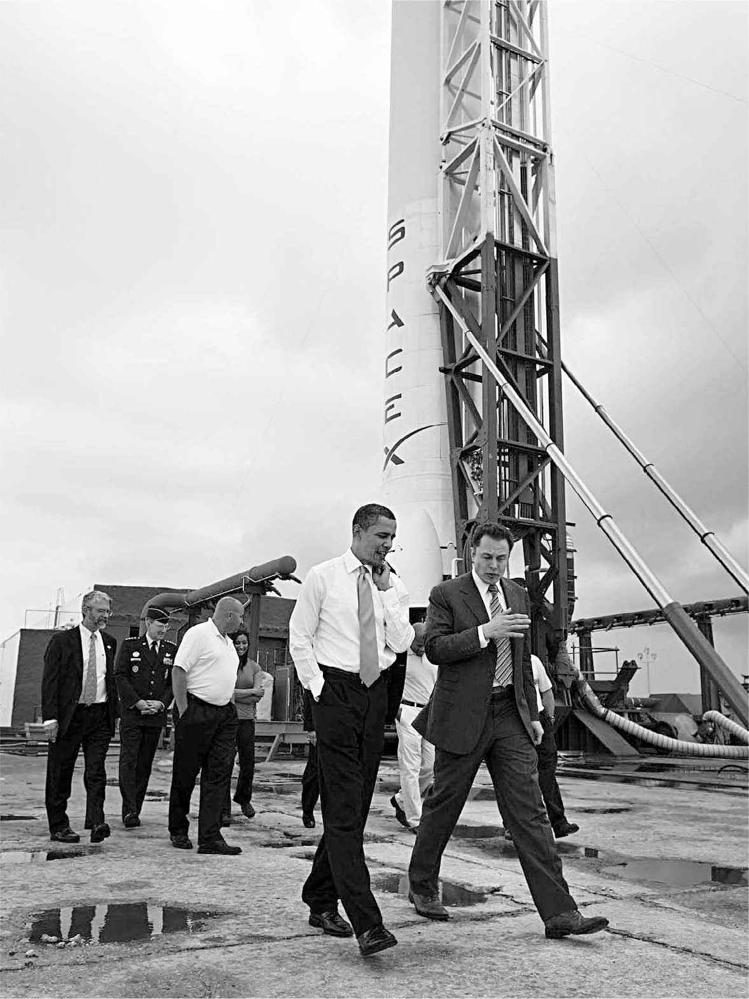

# Chapter 33: Private Space: SpaceX, 2009–2010

# 33 Private Space SpaceX, 2009–2010

At Cape Canaveral with President Obama, 2010

## Falcon 9, Dragon, and Pad 40

When SpaceX won the NASA contract to send cargo to the International Space Station, it came with a challenge. It would require a rocket that was much more powerful than the Falcon 1.

Musk initially planned that this next rocket would have five engines rather than one, and thus be called the Falcon 5. It would also need a more powerful engine. But Tom Mueller worried that it would take too long to build a new engine, and he persuaded Musk to accept a revised idea: a rocket with nine of the original Merlin engines. Thus was born the Falcon 9, a rocket that would become the workhorse of SpaceX for more than a decade. At 157 feet, it was more than twice as tall as the Falcon 1, ten times more powerful, and twelve times heavier.

In addition to the new rocket, they needed a space capsule, the module that is launched atop the rocket and carries a payload of cargo (or astronauts) into orbit and can dock with the Space Station and return back to Earth. Musk worked with his engineers in a series of Saturday-morning meetings to design one from scratch, which he dubbed Dragon, after *Puff the Magic Dragon*.

And finally, they needed a place—not Kwaj!—where they could regularly launch the new rocket. It would be too hard to ship the big Falcon 9 halfway across the Pacific. Instead, SpaceX made a deal to use part of the Kennedy Space Center at Cape Canaveral, which has close to seven hundred buildings, pads, and launch complexes spread out over 144,000 acres on Florida’s Atlantic coast. SpaceX leased Launchpad 40, which since the 1960s had been used for the Air Force’s Titan rocket launches.

To rebuild the complex, Musk hired an engineer named Brian Mosdell, who worked for the Lockheed-Boeing joint venture United Launch Alliance. Musk’s job interviews can be disconcerting. He multitasks, stares blankly, and sometimes pauses silently for a full minute or more. (Applicants are warned in advance to just sit there and not try to fill the silence.) But when he is engaged and wants to truly get a bead on an applicant, he dives into detailed technical discussions. What were the scientific reasons to use helium rather than nitrogen? What were the best methods to do pump shaft seals and labyrinth purges? “I have a good neural net when it comes to assessing with just a few questions a person’s ability to perform,” Musk says. Mosdell got the job.

Regularly prodded by Musk, Mosdell rebuilt the area in SpaceX’s typical scrappy way, literally. He and his boss, Tim Buzza, scavenged for components that could be cheaply repurposed. Buzza was driving down a road at Cape Canaveral and saw an old liquid oxygen tank. “I asked the general if we could buy it,” he says, “and we got a $1.5 million pressure vessel for scrap. It’s still at Pad 40.”

Musk also saved money by questioning requirements. When he asked his team why it would cost $2 million to build a pair of cranes to lift the Falcon 9, he was shown all the safety regulations imposed by the Air Force. Most were obsolete, and Mosdell was able to convince the military to revise them. The cranes ended up costing $300,000.

Decades of cost-plus contracts had made aerospace flabby. A valve in a rocket would cost thirty times more than a similar valve in a car, so Musk constantly pressed his team to source components from non-aerospace companies. The latches used by NASA in the Space Station cost $1,500 each. A SpaceX engineer was able to modify a latch used in a bathroom stall and create a locking mechanism that cost $30. When an engineer came to Musk’s cubicle and told him that the air-cooling system for the payload bay of the Falcon 9 would cost more than $3 million, he shouted over to Gwynne Shotwell in her adjacent cubicle to ask what an air-conditioning system for a house cost. About $6,000, she said. So the SpaceX team bought some commercial air-conditioning units and modified their pumps so they could work atop the rocket.

When Mosdell worked for Lockheed and Boeing, he rebuilt a launchpad complex at the Cape for the Delta IV rocket. The similar one he built for the Falcon 9 cost one-tenth as much. SpaceX was not only privatizing space; it was upending its cost structure.

## Obama at SpaceX

“I’ve been told we should extend the Space Shuttle program. Is that right?” Barack Obama asked his campaign advisor on space issues, Lori Garver, in early September 2008.

“No,” she answered. “The private sector should do this.” It was a risky piece of advice. SpaceX had failed three times to launch a satellite into orbit and was just about to make what might be its final attempt.

Garver, a NASA veteran, was trying to convince the Democratic nominee for president that America’s approach to rocket-building needed to change. NASA was planning to ground the Space Shuttle and hoped to replace it with a new rocket program it called Constellation. It was being run in the traditional way: NASA awarded cost-plus contracts to the Lockheed-Boeing United Launch Alliance to build most of the components. But the projected cost of the program had more than doubled, and it was nowhere near completion. Garver recommended that Obama scuttle it and instead allow private companies, such as SpaceX, to develop rockets that could take astronauts into space.

That is why she, like Musk, had a lot riding on the fourth launch attempt of the Falcon 1 from Kwaj that September. When it was a success, she received congratulatory calls from Obama’s top staffers, and Obama ended up appointing her the deputy administrator of NASA.

Unfortunately for Garver, Obama chose as her boss Charlie Bolden, a former Marine Corps pilot and NASA astronaut, who did not share her enthusiasm for partnering with the commercial sector. “I was not an ideologue like many around me who felt that all we need to do is take NASA’s budget, take everything for human spaceflight, and give it to Elon Musk and SpaceX,” Bolden says.

Garver also had to fight those in Congress who had Boeing facilities in their states and, despite being Republicans, were opposed to private enterprise taking over what they felt should be run by a government bureaucracy. “Senior industry and government officials took pleasure deriding SpaceX and Elon,” Garver says. “It didn’t help that Elon was younger and richer than they were, with a Silicon Valley disrupter mentality and lack of deference toward the traditional industry.”

Garver won the argument at the end of 2009. Obama canceled NASA’s Constellation program after his science advisor and budget director said that it was “over budget, behind schedule, off course, and unexecutable.” NASA traditionalists, including the revered astronaut Neil Armstrong, denounced the decision. “The president’s proposed NASA budget begins the death march for the future of U.S. human spaceflight,” said Senator Richard Shelby of Alabama. Former NASA administrator Michael Griffin, who had traveled with Musk to Russia seven years earlier, charged, “Essentially the U.S. has decided that they’re not going to be a significant player in human space flight.” They were wrong. Over the next decade, relying mainly on SpaceX, the U.S. would send more astronauts, satellites, and cargo to space than any other country.

---

Obama decided to travel to Cape Canaveral in April 2010 to make the case that relying on private companies such as SpaceX did not mean that the U.S. was abandoning space exploration. “Some have said it is unfeasible or unwise to work with the private sector in this way,” he said in his speech. “I disagree. By buying the services of space transportation—rather than the vehicles themselves—we can continue to ensure rigorous safety standards are met. But we will also accelerate the pace of innovations as companies—from young startups to established leaders—compete to design and build and launch new means of carrying people and materials out of our atmosphere.”

The president’s team had decided that he would go to one of the launchpads after the speech and have a photo op in front of a rocket. The way the story was reported, the president planned to go to a pad used by the United Launch Alliance, but it was preparing to launch a secret intelligence satellite, so that idea was nixed. Lori Garver says that wasn’t the true story: “All of us at the White House were in agreement that we wanted to go to the SpaceX pad.”

The televised image was priceless for both Obama and Musk: the young president, who was born the year that John Kennedy pledged America would send a man to the moon, walking alongside the risk-taking entrepreneur, chatting casually as they circled the gleaming Falcon 9. Musk liked Obama. “I thought he was a moderate but also someone willing to force change,” he says. He got the impression that Obama was trying to size him up. “I think he wanted to get a sense if I was dependable or a little nuts.”

