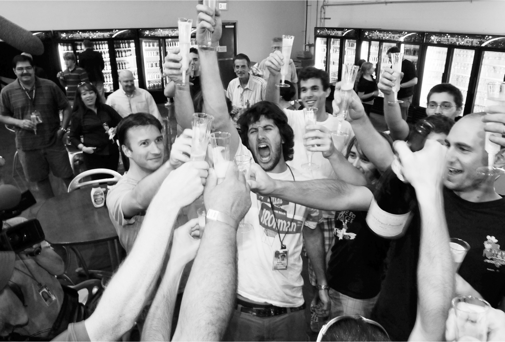

# Chapter 34: Falcon 9 Liftoff: Cape Canaveral, 2010

# 34 Falcon 9 Liftoff Cape Canaveral, 2010

Marc Juncosa, center, leading a toast to the Falcon 9 liftoff

## Into orbit…

Musk’s chance to prove that he was not “a little nuts,” or at least that he was also dependable, came two months later, in June 2010, when Falcon 9 attempted its first unmanned test voyage into orbit. The Falcon 1 had failed three times before being successful, and this rocket was far bigger and more complex. Musk thought it was unlikely to succeed on its first try, but there was a lot of pressure now that the president had made it America’s policy to depend on such commercial launches. As the *Wall Street Journal* wrote, “A dramatic launch failure could further undercut an already faltering campaign by the White House to persuade Congress to spend billions to help SpaceX and perhaps two other rivals to develop commercial replacements for NASA’s retiring Space Shuttle fleet.”

The chances for success were not helped when a storm rolled in and soaked the rocket. “Our antenna got wet,” Buzza recalls, “and we weren’t getting a good telemetry signal.” They lowered the rocket from the launchpad, and Musk came out with Buzza to inspect the damage. Bülent Altan, the goulash-cooking hero of Kwaj, climbed a ladder, looked at the antennas, and confirmed that they were too wet to work. A typical SpaceX fix was improvised: they fetched a hair dryer, and Altan waved it over the antennas until the moisture was gone. “You think it is good enough to fly tomorrow?” Musk asked him. Altan replied, “It should do the trick.” Musk stared at him silently for a while, assessing him and his answer, then said, “Okay, let’s do it.”

The next morning, the radio frequency checks were still not perfect. “It wasn’t the right sort of pattern,” Buzza says. So he told Musk there might be another delay. Musk looked at the data. As usual, he was willing to tolerate more risk than others. “It’s good enough,” he said. “Let’s launch.” Buzza assented. “The important thing with Elon,” he says, “is that if you told him the risks and showed him the engineering data, he would make a quick assessment and let the responsibility shift from your shoulders to his.”

The launch went perfectly. Musk, who joined his jubilant team at an all-night party on Cocoa Beach pier, called it “a vindication of what the president has proposed.” It was also a vindication of SpaceX. Less than eight years from its founding, and two years from facing bankruptcy, it was now the most successful private rocket company in the world.

## … and return

The next big test, scheduled for later in 2010, was to show that SpaceX could not only launch an unmanned capsule into orbit but also return it to Earth safely. No private company had done that. In fact, only three governments had: the United States, Russia, and China.

Once again, Musk showed a willingness, bordering on the reckless, to take the risks that separated his programs from those run by NASA. The day before the planned December launch, a final pad inspection revealed two small cracks in the engine skirt of the rocket’s second stage. “Everyone at NASA assumed we’d be standing down from the launch for a few weeks,” says Garver. “The usual plan would have been to replace the entire engine.”

“What if we just cut the skirt?” Musk asked his team. “Like, literally cut around it?” In other words, why not just trim off a tiny bit of the bottom that had the two cracks? The shorter skirt would mean the engine would have slightly less thrust, one engineer warned, but Musk calculated that there would still be enough to do the mission. It took less than an hour to make the decision. Using a big pair of shears, the skirt was trimmed, and the rocket launched on its critical mission the next day, as planned. “NASA couldn’t do anything but accept SpaceX’s decisions and watch in disbelief,” Garver recalls.

The rocket was able, as Musk predicted, to lift the Dragon capsule into orbit. It then performed its assigned maneuvers and fired its braking rockets so that it would return to Earth, parachuting gently down to the water just off the coast of California.

As awesome as it was, Musk had a sobering realization. The Mercury program had accomplished similar feats fifty years earlier, before either he or Obama had been born. America was just catching up with its older self.

---

SpaceX repeatedly proved that it could be nimbler than NASA. One example came during a mission to the Space Station in March 2013, when one of the valves in the engine of the Dragon capsule stuck shut. The SpaceX team started scrambling to figure out how to abort the mission and return the capsule safely before it crashed. Then they came up with a risky idea. Perhaps they could build up the pressure in front of the valve to a very high level. Then if they suddenly released the pressure, it might cause the valve to burp open. “It’s like the spacecraft equivalent of the Heimlich maneuver,” Musk later told the *Washington Post*’s Christian Davenport.

The top two NASA officials in the control room stood back and watched as the young SpaceX engineers hatched the plan. One of SpaceX’s software engineers churned out the code that would instruct the capsule to build up pressure, and they transmitted it as if it were a software update for a Tesla car.

Boom, pop. It worked. The valve burped open. Dragon docked with the Space Station and then returned home safely.

That paved the way for SpaceX’s next great challenge, one even grander and riskier. Prodded by Garver, the Obama administration decided that, once the Space Shuttle was retired, the U.S. would rely on private companies, most notably SpaceX, to launch not only cargo but humans into orbit. Musk was prepared for that. He had already told the SpaceX engineers to build into the Dragon capsule an element that was not necessary for the transport of cargo: a window.

