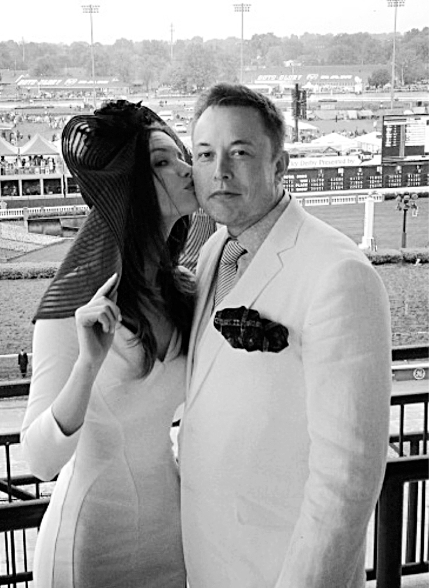

# Chapter 35: Marrying Talulah: September 2010

# 35 Marrying Talulah September 2010

With Talulah at the Kentucky Derby

## “I can take a hard path”

Musk had proposed to Talulah Riley weeks after they met in the summer of 2008, but they both agreed they should wait about two years before they actually got married.

Musk’s emotional settings range from callous to needy to exuberant, the last one most evident when he falls in love. Riley went back to England in July 2009 to star in *St. Trinian’s 2*, a sequel to the girls’-boarding-school comedy she had done two years earlier, and on her first day of filming, at a manor house near her childhood home north of London, she received five hundred roses from Musk. “When he’s angry, he’s angry, and when he’s joyful, he’s joyful, and he’s almost childlike in his enthusiasms,” she says. “He can be very cold, but he feels things in a very pure way, with a depth that most people don’t get.”

What struck Riley most was what she calls “the child within the man.” When he’s happy, this childlike inner self can manifest in a manic way. “When we went to the cinema, he would get so caught up with a silly movie that he would stare in rapture at the screen with his mouth slightly open laughing, then he would actually end up on the floor rolling around, holding his belly.”

But she also noticed that the child within the man could be expressed in a darker way. Early on in their relationship, he would stay up late at night and tell Riley about his father. “I remember one of those nights, he began crying, and it was really horrendous for him,” she says.

During those conversations, Musk would sometimes lapse into a trancelike state and recount things that his father used to say. “He was almost not conscious, not in the room with me, when he told me these things,” she recalls. Hearing the phrases that Errol had used in berating Elon shocked her, not only because they were brutal but because she had heard Elon use some of the same phrases when he was angry.

A quiet and polite girl from the bucolic English countryside, she knew that marriage to Musk would be challenging. He was thrilling and mesmerizing, but also brooding and encrusted with layers of complexity. “Being with me can be difficult,” he told her. “This will be a hard path.”

She decided to go along for the ride. “Okay,” she told him one day. “I can take a hard path.”

They wed in September 2010 at Dornoch Cathedral, a thirteenth-century church in the Scottish Highlands. “I’m Christian, and Elon is not, but he very kindly agreed to get married in a cathedral,” Riley says. She wore a “full-on princess dress from Vera Wang,” and she gave Musk a top hat and cane so he could dance around like Fred Astaire, whose movies she had turned him on to. His five boys, dressed in tailor-made tuxedos, were supposed to share the duties of ring bearer and attendants, but Saxon, his autistic son, bowed out, the other boys began fighting, and only Griffin actually made it to the end of the aisle. But the drama added to the fun, Riley recalled.

The party afterward was at nearby Skibo Castle, also built in the thirteenth century. When Riley asked Musk what he wanted, he replied, “There shall be hovercraft and eels.” It was a reference to a Monty Python skit in which John Cleese plays a Hungarian who tries to speak English using a flawed phrasebook and tells a shopkeeper, “My hovercraft is full of eels.” (It’s actually funnier than I’ve made it sound.) “It was quite difficult,” Riley says, “because you need permits to transport eels between England and Scotland, but in the end we did have an amphibious little hovercraft and eels.” There was also an armed personnel carrier that Musk and his friends used to crush three junked cars. “We all got to be young boys again,” Navaid Farooq says.

## The Orient Express

Riley liked to throw creative parties, and Musk, despite being socially awkward (or perhaps because of it), had an odd enthusiasm for them. They allowed him to let loose, especially during times of tension, which, for him, were most of the time. “So I used to throw very theatrical parties just to keep him entertained,” she says.

The most lavish was for his fortieth birthday in June 2011, less than a year after their wedding. Along with three dozen friends, he and Talulah rented cars on the Orient Express train from Paris to Venice.

They met at the Hotel Costes, an opulent establishment near the Place Vendôme. A few of them, led by Elon and Kimbal, went to a fine restaurant, and as they were heading back to the hotel they decided on a lark to rent some bicycles and dash around the town. They biked until 2 a.m., then bribed the hotel to keep the bar open for them. After an hour of drinking, they got back on the bikes and ended up at an underground lounge called Le Magnifique, where they stayed until 5 a.m.

They didn’t get up until 3 p.m. the next day, just in time to catch the train. Dressed in tuxedos, they had a formal dinner on the Orient Express, with caviar and champagne, followed by their own private entertainment by the Lucent Dossier Experience, a steampunky performance troupe featuring avant-garde music, aerial arts, and fire, somewhat like Cirque du Soleil, but more erotic. “People were hanging from the ceiling,” Kimbal says, “which was a bizarre scene in the very traditional Orient Express train car.” Riley would sometimes privately sing to Elon a song called “My Name Is Tallulah” from the movie *Bugsy Malone*. He said his one wish for his birthday was that she would perform it for the whole party. “I don’t really sing, so it was traumatic for me, but I did it for him,” she says.

Musk did not have many stable and grounded relationships, nor did he have many stable and grounded periods in his life. No doubt those two things were related. Among his few such relationships was the one he had with Riley, and the years he would spend with her—from their meeting in 2008 to their second divorce in 2016—would end up being the longest stretch of relative stability in his life. If he had liked stability more than storm and drama, she would have been perfect for him.

