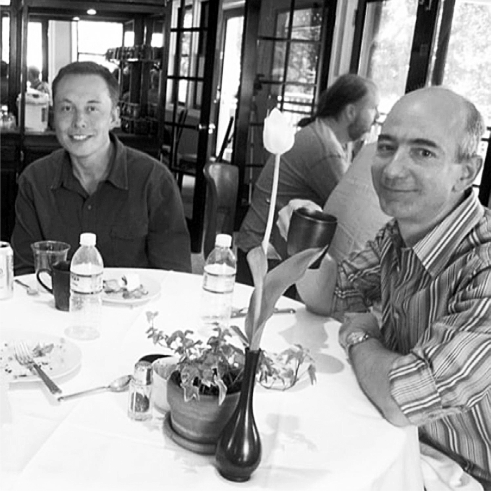

# Chapter 37: Musk and Bezos: SpaceX, 2013–2014

# 37 Musk and Bezos SpaceX, 2013–2014

Having dinner in 2004

## Jeff Bezos

Jeff Bezos, the supercharged Amazon billionaire with a boisterous laugh and boyish enthusiasms, pursues his passions with a talent for being, at the same time, both exuberant and methodical. Like Musk, he was a childhood addict of science fiction, racing through the shelves of Isaac Asimov and Robert Heinlein books at his local library.

As a five-year-old in July 1969, he watched television coverage of the Apollo 11 mission that culminated with Neil Armstrong walking on the moon. He calls it “a seminal moment” for him. Later, he would fund a series of missions that recovered from the Atlantic Ocean the Apollo 11 rocket engine, which he installed in a niche off the living room of his house in Washington, DC.

His exhilaration about space turned him into one of those hardcore *Star Trek* fans who knows every episode. As the valedictorian of his high-school class, his speech was about how to colonize planets, build space hotels, and save our planet by finding other places to do manufacturing. “Space, the final frontier, meet me there!” he concluded.

In 2000, after making Amazon the world’s dominant online retailer, Bezos quietly launched a company called Blue Origin, named after the pale blue planet where humans originated. Like Musk, he focused on the idea of building reusable rockets. “How is the situation in the year 2000 different from 1960?” he asks. “What’s different is computer sensors, cameras, software. Being able to land vertically is the kind of problem that can be addressed by technologies that didn’t exist in 1960.”

Like Musk, he embarked on space endeavors as a missionary rather than a mercenary. There are easier ways to make money. Human civilization, he felt, will soon strain the resources of our small planet. That will confront us with a choice: accept static growth or expand to places beyond Earth. “I don’t think stasis is compatible with liberty,” he says. “We can fix that problem in exactly one way: by moving out into the solar system.”

They met in 2004 when Bezos accepted Musk’s invitation to take a tour of SpaceX. Afterward, he was surprised to get a somewhat curt email from Musk expressing annoyance that Bezos had not reciprocated by inviting him to Seattle to see Blue Origin’s factory, so Bezos promptly did. Musk flew up with Justine, toured Blue Origin, then they had dinner with Bezos and his wife MacKenzie. Musk was filled with advice, expressed with his usual intensity. He warned Bezos that he was heading down the wrong path with one idea: “Dude, we tried that and that turned out to be really dumb, so I’m telling you don’t do the dumb thing we did.” Bezos recalls feeling that Musk was a bit too sure of himself, given that he had not yet successfully launched a rocket. The following year, Musk asked Bezos to have Amazon do a review of Justine’s new book, an urban horror thriller about demon-human hybrids. Bezos explained that he did not tell Amazon what to review, but said that he would personally post a customer review. Musk sent back a brusque reply, but Bezos posted a nice personal review anyway.

## Pad 39A

Beginning in 2011, SpaceX won a series of contracts from NASA to develop rockets that could take humans to the International Space Station, a task made crucial by the retirement of the Space Shuttle. To fulfill that mission, it needed to add to its facilities at Cape Canaveral’s Pad 40, and Musk set his sights on leasing the most storied launch facility there, Pad 39A.

Pad 39A had been center stage for America’s Space Age dreams, burned into the memories of a television generation that held its collective breath when the countdowns got to “Ten, nine, eight…” Neil Armstrong’s mission to the moon that Bezos watched as a kid blasted off from Pad 39A in 1969, as did the last manned moon mission, in 1972. So did the first Space Shuttle mission, in 1981, and the last, in 2011.

But by 2013, with the Shuttle program grounded and America’s half-century of space aspirations ending with bangs and whimpers, Pad 39A was rusting away and vines were sprouting through its flame trench. NASA was eager to lease it. The obvious customer was Musk, whose Falcon 9 rockets had already launched on cargo missions from the nearby Pad 40, where Obama had visited. But when the lease was put out for bids, Jeff Bezos—for both sentimental and practical reasons—decided to compete for it.

When NASA ended up awarding the lease to SpaceX, Bezos sued. Musk was furious, declaring that it was ridiculous for Blue Origin to contest the lease “when they haven’t even gotten so much as a toothpick to orbit.” He ridiculed Bezos’s rockets, pointing out that they were capable only of popping up to the edge of space and then falling back; they lacked the far greater thrust necessary to break the Earth’s gravity and go into orbit. “If they do somehow show up in the next five years with a vehicle qualified to NASA’s human rating standards that can dock with the Space Station, which is what Pad 39A is meant to do, we will gladly accommodate their needs,” Musk said. “Frankly, I think we are more likely to discover unicorns dancing in the flame duct.”

The battle of the sci-fi barons had blasted off. One SpaceX employee bought dozens of inflatable toy unicorns and photographed them in the pad’s flame duct.

Bezos was eventually able to lease a nearby launch complex at Cape Canaveral, Pad 36, which had been the origin of missions to Mars and Venus. So the competition of the boyish billionaires was set to continue. The transfer of these hallowed pads represented, both symbolically and in practice, John F. Kennedy’s torch of space exploration being passed from government to the private sector—from a once-glorious but now sclerotic NASA to a new breed of mission-driven pioneers.

## Reusable rockets

Both Musk and Bezos had a vision for what would make space travel feasible: rockets that were reusable. Bezos’s focus was on creating the sensors and software to guide a rocket to a soft landing on Earth. But that was only part of the challenge. The greater difficulty was to put all of those features on a rocket that was still light enough, and whose engines had enough thrust, to make it into orbit. Musk focused obsessively on this physics problem. He liked to muse, half-jokingly, that we Earthlings live in a gamelike simulation created by clever overlords with a sense of humor. They made gravity on Mars and the moon weak enough that launching into orbit would be easy. But on Earth, the gravity seems perversely calibrated to make reaching orbit just barely possible.

Like a mountain climber paring the contents of his knapsack, Musk obsessed over reducing the weight of his rockets. That has a multiplier effect: removing a bit of weight—by deleting a part, using a lighter material, making simpler welds—results in less fuel needed, which further reduces the mass the engines have to lift. When he walked through SpaceX’s assembly lines, Musk would pause at each station, stare silently, and challenge the team to delete or trim some part. At almost every encounter, he maniacally hammered home the message: “A fully reusable rocket is the difference between being a single-planet civilization and being a multiplanet one.”

Musk brought this message to the 2014 annual black-tie dinner of the century-old Explorers Club in New York City, where he was given the President’s Award. He shared the stage with Bezos, who accepted an award for the work of his team in recovering the engine of Neil Armstrong’s Apollo 11 spacecraft. The dinner featured dishes designed to appeal to the overly adventurous, such as scorpions, maggot-covered strawberries, sweet-and-sour cow penis, goat-eyeball martinis, and whole alligators carved tableside.

Musk was introduced with a video showing his successful rocket launches. “You are kind enough not to show our first three launches,” he said. “We’ll have to have a blooper reel at some point.” Then he gave his sermon about the need for a fully reusable rocket. “That’s the thing that will allow us to establish life on Mars,” he said. “Our upcoming launch will have landing legs on the rocket for the first time.” Reusable rockets could someday get the cost of taking a person to Mars down to $500,000. Most people would not make the trip, he conceded, “but I suspect there are people in this room who would.”

Bezos applauded, but at that moment he was quietly pursuing an unexpected attack. He and Blue Origin had applied for a U.S. patent titled “Sea landing of space launch vehicles,” and a few weeks after the dinner it was granted. The ten-page application described “methods for landing and recovering a booster stage and/or other portions thereof on a platform at sea.” Musk was livid. The idea of landing on ships at sea “is something that’s been discussed for, like, half a century,” he said. “It’s in fictional movies; it’s in multiple proposals; there’s so much prior art, it’s crazy. So, trying to patent something that people have been discussing for half a century is obviously ridiculous.”

The following year, after SpaceX sued, Bezos agreed to have the patent canceled. But the dispute heightened the rivalry between the two rocket entrepreneurs.

