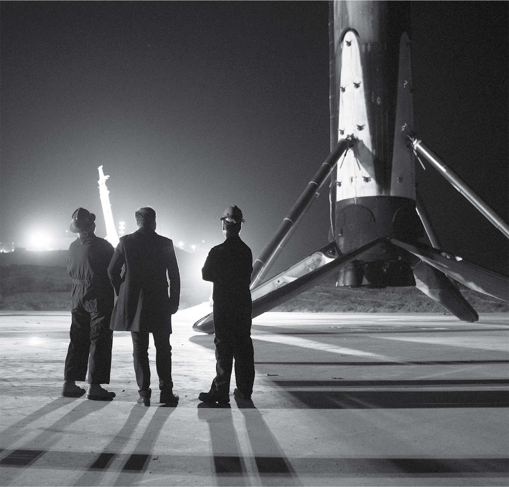

# Chapter 38: The Falcon Hears the Falconer: SpaceX, 2014–2015

# 38 The Falcon Hears the Falconer SpaceX, 2014–2015

Viewing a landed booster

[*OceanofPDF.com*](https://oceanofpdf.com)

## Grasshopper

Musk’s quest to build a reusable rocket led to the development of an experimental Falcon 9 prototype dubbed “Grasshopper.” It had landing legs and steerable grid fins and could take slow hops up and down to about three thousand feet at the SpaceX test facility in McGregor, Texas. Excited by the progress they were making, Musk invited the SpaceX board there in August 2014 to see the future in action.

It was the second day on the job for Sam Teller, a 240-volt Harvard grad and venture seeker, who had signed on to be Musk’s de facto chief of staff. With a trimmed beard that accentuated his wide smile and alert eyes, he had the emotional receptors and eagerness to please that were missing in his boss. As a former business manager of *The Harvard Lampoon*, he knew how to harness Musk’s humor and manic intensity (and even brought Musk to a party at the *Lampoon*’s castle soon after going to work for him).

At its meeting at the McGregor test facility, the SpaceX board discussed designs for the space suits the company was developing, even though they were years away from flying humans. “They’re sitting around seriously discussing plans to build a city on Mars and what people will wear there,” Teller later marveled, “and everyone’s just acting like this is a totally normal conversation.”

The main event for the board was watching the test of a Falcon 9 landing. It was a sun-blasted August day in the Texas desert, with giant crickets swarming, and the board members huddled under a small tent. The rocket was supposed to rise to about three thousand feet, activate its reentry rockets, hover above a pad, and then land erect. But it didn’t. Shortly after liftoff, one of the three engines malfunctioned and the rocket exploded.

After a few moments of silence, Musk reverted to adventure-boy mode. He told the site manager to get the van so they could drive over to the smoldering debris. “You can’t,” the manager said. “Too dangerous.”

“We’re going,” Musk said. “If it’s going to explode, we might as well walk through burning debris. How often do you get to do that?”

Everyone laughed nervously and followed along. It was like a set from a Ridley Scott movie, with craters in the ground, the scrub grass on fire, and charred pieces of metal. Steve Jurvetson asked Musk if they could grab some pieces as souvenirs. “Sure,” he said, collecting some himself. Antonio Gracias tried to cheer everyone up by saying how the best lessons in life come from failures. “Given the options,” Musk replied, “I prefer to learn from success.”

It was the beginning of a bad stretch not just for SpaceX but for the entire industry. A rocket made by Orbital Sciences exploded on a mission to deliver cargo to the Space Station. Then a Russian cargo mission failed. The astronauts on the Space Station were in danger of running out of food and supplies. So a lot was riding on SpaceX’s Falcon 9 cargo mission scheduled for June 28, 2015, Musk’s forty-fourth birthday.

But two minutes after liftoff, a strut in the second stage that held a helium tank buckled, and the rocket exploded. After seven years of successful launches, it was the first time that a Falcon 9 failed.

---

In the meantime, Bezos was making some progress. In November 2015, he launched a rocket on an eleven-minute, sixty-two-mile up-and-down hop to the altitude that is considered the beginning of outer space. Guided by a GPS system and steering fins, the rocket returned to Earth and its booster engine reignited to slow the descent. With its landing legs deployed, it hovered just above the ground, adjusted its coordinates, and landed gently.

Bezos announced the success on a press call the next day. “Full reuse is a game changer,” he said. Then he unleashed his first-ever tweet: “The rarest of beasts—a used rocket. Controlled landing not easy but done right can look easy.”

Musk was annoyed. It was, he felt, just a suborbital hop, not what he considered the true holy grail of launching a payload into orbit. So he unleashed a rejoinder on Twitter: “[@JeffBezos](http://www.twitter.com/JeffBezos) Not quite ‘rarest.’ SpaceX Grasshopper rocket did 6 suborbital flights 3 years ago & is still around.”

In fact, the Grasshopper had flown only about three thousand feet up, which was one-hundredth as far as Blue Origin’s rocket. But Musk was right in the distinction he made. Rockets that could hop up and back to the edge of space might be fun for space tourists, but it would take rockets with the power of the Falcon 9 to do missions such as launching satellites and reaching the International Space Station. Landing and reusing such a rocket would be an accomplishment of a different order of magnitude.

## “The Falcon has landed”

Musk’s opportunity to do that came on December 21, 2015, just four weeks after Bezos’s suborbital flight.

In his relentless quest to conquer gravity, Musk had redesigned the Falcon 9. The new version packed more liquid oxygen fuel onto the rocket by supercooling it to minus 350 degrees Fahrenheit, which made it much more dense. As always, he was looking for every way possible to cram more power into a rocket without significantly increasing its size or mass. “Elon kept hammering at us to eke out a tiny percent more efficiency by chilling down the fuel more and more,” says Mark Juncosa. “It was ingenious, but it was giving us a real pain in the ass.” A few times Juncosa pushed back, saying it would present challenges with valves and leaks, but Musk was unrelenting. “There is no first-principles reason this can’t work,” he said. “It’s extraordinarily difficult, I know, but you just have to muscle through.”

“I was just crapping in my pants during the countdown,” Juncosa says. Suddenly he noticed something worrisome on the video feed from the cavity between the first and second stages. There were some drips, and he didn’t know whether they were liquid nitrogen, which would be okay, or liquid oxygen from the supercooled tank, which might be a problem. “I was scared as hell,” Juncosa recalls. “If it was my company, I would have shut it down.”

“You got to call this one,” Juncosa told Musk as the countdown got down to the final minute.

Musk paused for a few seconds. How risky would it be if there was some liquid oxygen in the interstage? Risky, but only a small risk. “Fuck it,” he said. “Let’s just go.”

Years later, Juncosa watched footage of the moment Musk made that decision. “I thought he had done some complex quick calculations to decide what to do, but in fact he just shrugged his shoulders and gave the order. He had an intuition of what the physics were.”

He was right. The liftoff went flawlessly.

---

Then came the ten-minute wait to see if the booster would return and land safely on the landing pad that SpaceX had built about a mile from Pad 39A. Just after the second stage separated, the booster fired its thrusters to flip around, head back toward the Cape, point its bottom downward, and slow its descent. With its GPS and sensors guiding it and its grid fins helping to steer, it eased down toward the landing pad. (Pause for a second and think how amazing all that is.)

Musk bolted out of the control room and ran across the highway, staring into the dark to watch the rocket reappear. “Come on down, come on down slowly,” he whispered as he stood by the highway, arms akimbo. Then there was a boom. “Oh shit,” he said, turning around and walking dejectedly back across the highway.

But inside the control room, there were loud cheers. The monitors were showing the rocket erect on the pad, and the launch announcer echoed the words that had been used by Neil Armstrong on the moon: “The Falcon has landed.” The loud sound, it turned out, was the sonic boom from the rocket’s reentry into the upper atmosphere.

One of the flight engineers ran out of the control room with the news. “It’s standing on the pad!” she shouted. Musk turned around and did his fast lumber back toward the pad. “Holy fucking shit,” he kept saying to himself. “Holy fucking shit.”

That night, they all went to a waterfront bar called Fishlips to party. Musk hoisted a beer. “We just launched and landed the biggest rocket in the world!” he shouted to the hundred or so employees and other amazed onlookers. As the crowd chanted “USA, USA,” he jumped up and down, pumping his fists into the air.

---

“Congrats @SpaceX on landing Falcon’s suborbital booster stage,” Bezos wrote in a tweet. “Welcome to the club!” Swaddled in his gauze of graciousness was a stiletto jab: the claim that the booster SpaceX landed was “suborbital,” putting it in the same club as the booster that Blue Origin had landed. Technically he was right. The SpaceX booster had never gone into orbit itself, just boosted a payload that did. But Musk was furious. The ability to send a payload into orbit put the SpaceX rocket, he believed, in a different league.

[*OceanofPDF.com*](https://oceanofpdf.com)
