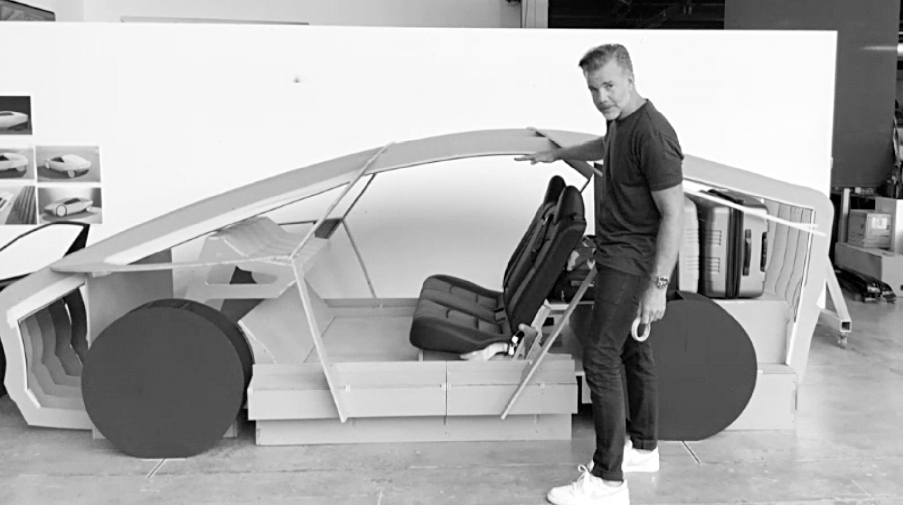

# Chapter 41: The Launch of Autopilot: Tesla, 2014–2016

# 41 The Launch of Autopilot Tesla, 2014–2016

Franz von Holzhausen with an early “Robotaxi”

[*OceanofPDF.com*](https://oceanofpdf.com)

## Radar

Musk had discussed with Larry Page the possibility of Tesla and Google working together to build an autopilot system that would allow cars to be self-driving. But their falling-out over artificial intelligence spurred Musk to accelerate plans for Tesla to build a system on its own.

Google’s autopilot program, eventually named Waymo, used a laser-radar device known as LiDAR, an acronym for “light detection and ranging.” Musk resisted the use of LiDAR and other radar-like instruments, insisting that a self-driving system should use only visual data from cameras. It was a case of first principles: humans drove using only visual data; therefore machines should be able to. It was also an issue of cost. As always, Musk focused not just on the design of a product but also on how it would be manufactured in large numbers. “The problem with Google’s approach is that the sensor system is too expensive,” he said in 2013. “It’s better to have an optical system, basically cameras with software that is able to figure out what’s going on just by looking at things.”

Over the next decade, Musk would engage in a tug-of-war with his engineers, many of whom wanted to include some form of radar in Tesla’s self-driving cars. Dhaval Shroff, a sparky young engineer from Mumbai who joined Tesla’s Autopilot team in 2014 after graduating from Carnegie Mellon, remembers one of his first meetings with Musk. “Back then we had radar hardware in the car, and we told Elon that it was best safety-wise to use it,” says Shroff. “He agreed to let us keep radar in, but it was clear that he thought we should eventually be able to rely on camera vision only.”

By 2015, Musk was spending hours each week working with the Autopilot team. He would drive from his home in the Bel Air neighborhood of Los Angeles to the SpaceX headquarters near the airport, where they would discuss the problems his Autopilot system encountered. “Every meeting started with Elon saying, ‘Why can’t the car drive itself from my home to work?’ ” says Drew Baglino, one of Tesla’s senior vice presidents.

This sometimes led the Tesla team to do some Keystone Kops scrambling. There was a curve on Interstate 405 that always caused Musk trouble because the lane markings were faded. The Autopilot would swerve out of the lane and almost hit oncoming cars. Musk would come into the office furious. “Do something to program this right,” he kept demanding. This went on for months as the team tried to improve the Autopilot software.

In desperation, Sam Teller and others came up with a simpler solution: ask the transportation department to repaint the lanes of that section of the highway. When they got no response, they came up with a more audacious plan. They decided to rent a line-painting machine of their own, go out at 3 a.m., shut the highway down for an hour, and redo the lanes. They had gone as far as tracking down a line-painting machine when someone finally got through to a person at the transportation department who was a Musk fan. He agreed to have the lines repainted if he and a few others at the department could get a tour of SpaceX. Teller gave them a tour, they posed for a picture, and the highway lines got repainted. After that, Musk’s Autopilot handled the curve well.

Baglino was among the Tesla engineers who wanted to continue to use radar to supplement camera vision. “There was just such a gulf between Elon’s goal and the possible,” says Baglino. “He just wasn’t aware enough of the challenges.” At one point Baglino’s team did an analysis of the distance perception an autopilot system would need for situations such as at a stop sign. How far left and right did the car need to see in order to know when it could safely cross? “We’re trying to have those conversations with Elon to establish what the sensors would need to do,” Baglino says. “And they were really difficult conversations, because he kept coming back to the fact that people have just two eyes and they can drive the car. But those eyes are attached to a neck, and the neck can move, and people can position those eyes all over the place.”

Musk relented for the time being. Each new Model S, he conceded, would be equipped not only with eight cameras but also with twelve ultrasonic sensors plus a forward-facing radar that was able to see through rain and fog. “Together, this system provides a view of the world that a driver alone cannot access, seeing in every direction simultaneously and on wavelengths that go far beyond the human senses,” the Tesla website announced in 2016. But even as Musk made this concession, it was clear that he would not give up pushing to make a camera-only system work.

## Accidents

As Musk pursued his autonomous-vehicle ideas, he stubbornly and repeatedly exaggerated the Autopilot capability of Tesla cars. That was dangerous; it led some drivers to think they could ride in a Tesla without paying much attention. Even as Musk was making his grand promises in 2016, Tesla was being dropped by one of its camera suppliers, Mobileye. Tesla was “pushing the envelope in terms of safety,” its chairman said.

It was inevitable that there would be some fatal accidents involving Autopilot, just as there were without Autopilot. Musk insisted that the system should be judged not on whether it prevented accidents but instead on whether it led to fewer accidents. It was a logical stance, but it ignored the emotional reality that a person killed by an Autopilot system would provoke a lot more horror than a hundred deaths caused by driver error.

The first reported case of a fatal accident involving Autopilot in the U.S. came in May 2016. A driver was killed in Florida when a tractor-trailer truck made a left turn in front of his Tesla. “Neither Autopilot nor the driver noticed the white side of the tractor-trailer against a brightly lit sky, so the brake was not applied,” Tesla said in a statement. Investigators found evidence that, at the time of the crash, the driver was watching a Harry Potter movie on a computer propped on the dashboard. The National Transportation Safety Board concluded that “the driver neglected to maintain complete control of the Tesla leading up to the crash.” Tesla had oversold its Autopilot capabilities, and the driver likely surmised that he did not have to pay close attention. There were reports of another fatal accident, involving a Tesla that was probably in Autopilot mode, that had occurred in China earlier that year.

The news about the Florida crash broke when Musk was on his first visit back to South Africa in sixteen years. He immediately flew back to the United States, but he did not make any public statement. He had the mind of an engineer rather than a feel for human emotions. He could not understand why one or two deaths caused by Tesla Autopilot created an outcry when there were more than 1.3 million traffic deaths annually. Nobody was tallying the accidents prevented and lives saved by Autopilot. Nor were they assessing whether driving with Autopilot was safer than driving without it.

Musk held a conference call with reporters in October 2016, and he got angry when the first questions were about the two deaths. If they wrote stories that dissuaded people from using autonomous driving systems, or regulators from approving them, “then you are killing people.” He paused and then barked, “Next question.”

## Promises, promises

Musk’s grand vision—sometimes akin to a mirage that kept receding into the horizon—was that Tesla would build a completely autonomous car that would drive itself without any human intervention. He believed that would transform our daily lives as well as make Tesla the world’s most valuable company. “Full Self-Driving,” as Tesla began to call it, would be able to function, Musk promised, not only on highways but also on city streets with pedestrians, cyclists, and complex intersections.

As with his other mission-driven obsessions, including travel to Mars, he made what would turn out to be absurd predictions about timing. On his October 2016 call with reporters, he declared that by the end of the following year, a Tesla would be able to drive from Los Angeles to New York “without the need for a single touch” on the wheel. “When you want your car to return, tap Summon on your phone,” he said. “It will eventually find you even if you are on the other side of the country.”

This could have been dismissed as an amusing fantasy, except that he began pushing the engineers working on Tesla’s Model 3 and Model Y to design versions that had no steering wheel and no pedals for acceleration and braking. Von Holzhausen pretended to comply. Beginning in late 2016, there would always be pictures and physical models of “Robotaxis” for Musk to see when he walked through the design studio. “He was convinced that by the time we got Model Y into production it would be a full-on Robotaxi, fully autonomous,” von Holzhausen says.

Almost every year, Musk would make another prediction that Full Self-Driving was just a year or two away. “When will someone be able to buy one of your cars and literally just take the hands off the wheel and go to sleep and wake up and find that they’ve arrived?” Chris Anderson asked him at a TED Talk in May 2017. “That’s about two years,” Musk replied. In an interview with Kara Swisher at a Code Conference at the end of 2018, he said Tesla was “on track to do it next year.” In early 2019, he doubled down. “I think we will be feature complete, Full Self-Driving, this year,” he declared on a podcast with ARK Invest. “I would say I am certain of that. That is not a question mark.”

“If he lets up and admits that it’s going to take a long time,” von Holzhausen said at the end of 2022, “then nobody will rally around it and we won’t design vehicles that require autonomy.” On an earnings call with analysts that year, Musk admitted that the process had been harder than he expected back in 2016. “Ultimately, what it comes down to,” he said, “is that to solve Full Self-Driving, you actually have to solve real-world artificial intelligence.”

[*OceanofPDF.com*](https://oceanofpdf.com)
