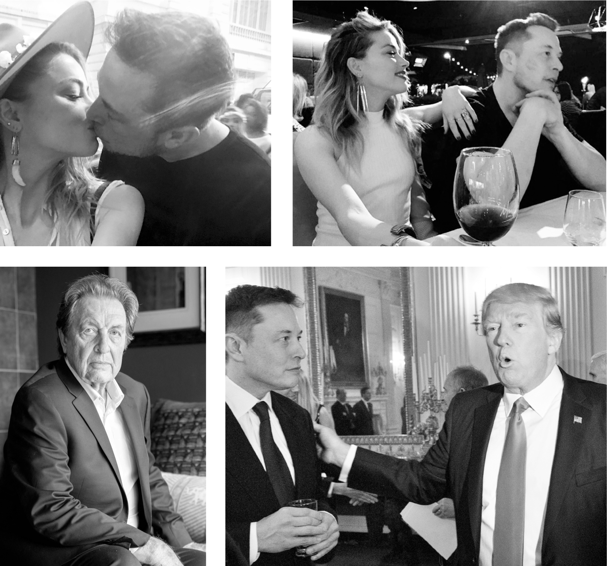

# Chapter 44: Rocky Relationships: 2016–2017

# 44 Rocky Relationships 2016–2017

With Amber Heard, who left a kiss mark on his cheek; with Donald Trump; Errol Musk

[*OceanofPDF.com*](https://oceanofpdf.com)

## Trump

Musk had never been very political. Like many techies, he was liberal on social issues but with a dollop of libertarian resistance to regulations and political correctness. He contributed to the presidential campaigns of Barack Obama and then Hillary Clinton, and he was a vocal critic of Donald Trump in the 2016 election. “He doesn’t seem to have the sort of character that reflects well on the United States,” he told CNBC.

But after Trump won, Musk became cautiously optimistic that he might govern as a renegade independent rather than a resentful right-winger. “I thought that maybe some of the crazier stuff he said during the campaign was just a performance and he would land in a more sensible place,” he says. So at the urging of his friend Peter Thiel, a Trump supporter, Musk agreed to join a gathering of tech CEOs who were meeting with the president-elect in New York in December 2016.

On the morning of the meeting, Musk visited the editorial boards of the *New York Times* and *Wall Street Journal* and then, because traffic was bad, took the Lexington Avenue subway to Trump Tower. In addition to Thiel, the two dozen tech CEOs at the meeting included Larry Page of Google, Satya Nadella of Microsoft, Jeff Bezos of Amazon, and Tim Cook of Apple.

Afterward, Musk stayed for a private meeting with Trump. A friend had given him a Tesla, Trump said, but he’d never driven it. This baffled Musk, who said nothing. Trump then declared that he “really wanted to get NASA going again.” This baffled Musk even more. He urged Trump to set big goals—most notably sending humans to Mars—and let companies compete to fulfill them. Trump seemed amazed at the idea of sending people to Mars, then reiterated that he wanted “to get NASA going again.” Musk thought the meeting was odd, but he found Trump to be friendly. “He seems kind of nuts,” he said afterward, “but he may turn out okay.”

Later, Trump told CNBC’s Joe Kernen that he was impressed by Musk. “He likes rockets, and he does good at rockets, too, by the way,” Trump told him, then lapsed into Trumpian babble. “I never saw where the engines come down with no wings, no anything, and they’re landing, and I said, ‘I’ve never seen that before,’ and I was worried about him, because he’s one of our great geniuses, and we have to protect our genius, you know we have to protect Thomas Edison and we have to protect all of these people that came up with originally the light bulb and the wheel and all of these things.”

Juleanna Glover, a well-connected government-affairs consultant, helped set up some other meetings while they were in Trump Tower, including with vice president–elect Mike Pence and national security aides Michael Flynn and K. T. McFarland. The only one who impressed Musk was Newt Gingrich, who was a space buff and shared his enthusiasm for letting private companies bid for missions.

On Trump’s first day as president, Musk went to the White House to be part of a roundtable of top CEOs, and he returned two weeks later for a similar session. He concluded that Trump as president was no different than he was as a candidate. The buffoonery was not just an act. “Trump might be one of the world’s best bullshitters ever,” he says. “Like my dad. Bullshitting can sometimes baffle the brain. If you just think of Trump as sort of a con-man performance, then his behavior sort of makes sense.” When the president pulled the U.S. out of the Paris Accord, an international agreement to fight climate change, Musk resigned from the presidential councils.

## Amber Heard

Musk was not bred for domestic tranquility. Most of his romantic relationships involve psychological turmoil. The most agonizing of them all was with the actress Amber Heard, who drew him into a dark vortex that lasted more than a year and produced a deep-seated pain that lingers to this day. “It was brutal,” he says.

Their relationship began after she made an action movie in 2012 called *Machete Kills*, which features an inventor who wants to create a society on an orbiting space station. Musk agreed to be a consultant because he wanted to meet her, but that didn’t happen until a year later, when she asked if she could come visit SpaceX. “I guess I could be called a geek for someone who can also be called a hot chick,” she says jokingly. Musk took her for a ride in a Tesla, and she decided that he looked attractive for a rocket engineer.

She next saw him when they were in line to walk the red carpet at New York’s Metropolitan Museum gala in May 2016. Heard, then thirty, was on the brink of an explosive divorce from Johnny Depp. She and Musk talked at the dinner and then the afterparty. Reeling from her relationship with Depp, she felt that Musk was a breath of fresh air.

A few weeks later, she was working in Miami and Musk came to visit. They stayed at a poolside villa he had rented at Miami Beach’s Delano Hotel, and then he flew her and her sister up to Cape Canaveral, where a Falcon 9 launch was scheduled. She thought it was the most interesting date she had been on.

For his birthday that June, she decided to surprise him by traveling from Italy, where she was working, to the Fremont Tesla factory. As she got near, she pulled to the side of the road and picked some wild flowers. Working with his security team, she hid in the back of a Tesla and popped out with the flowers when he approached.

Their relationship deepened in April 2017 when he flew to be with her in Australia, where she was filming *Aquaman*, in which she played the princess-warrior lover of a superhero trying to save the world. They walked holding hands through a wildlife sanctuary and did the treetop rope course, after which Heard planted a kiss mark on his cheek. He told her that she reminded him of Mercy, his favorite character in the video game *Overwatch*, so she spent two months designing and commissioning a head-to-toe costume so she could role-play for him.

Her playfulness, however, was accompanied by the type of turmoil that attracted Musk. His brother and friends hated her with a passion that made their distaste for Justine pale. “She was just so toxic,” Kimbal says. “A nightmare.” Musk’s chief of staff Sam Teller compares her to a comic-book villain. “She was like the Joker in *Batman*,” he says. “She didn’t have a goal or aim other than chaos. She thrives on destabilizing everything.” She and Musk would stay up all night fighting, and then he would not be able to get up until the afternoon.

They broke up in July 2017, but then got back together for another five tumultuous months. The end finally came after a wild trip to Rio de Janeiro that December with Kimbal and his wife and some of the kids. When they got to the hotel, Elon and Amber had another of their flamethrowing fights. She locked herself in the room and started yelling that she was afraid she would be attacked and that Elon had taken her passport. The security guards and Kimbal’s wife all tried to convince her that she was safe, her passport was in her bag, and she could and should leave whenever she wanted. “She really is a very good actress, so she will say things that you’re like, ‘Wow, maybe she’s telling you the truth,’ but she isn’t,” Kimbal says. “The way she can create her own reality reminds me of my dad.” (Let that sink in.)

Amber concedes they had an argument and that she got rather dramatic. But she says that they resolved the fight that evening, which was New Year’s Eve. They went to a party and celebrated the ringing in of the new year standing on a balcony overlooking Rio, she in a low-cut white linen dress, he in a partly unbuttoned white linen shirt. Kimbal and his wife were there, along with their cousin Russ Rive and his wife. To show that they had made up, Amber sent me pictures and videos of the evening. In one of them, Elon wishes her a happy new year and kisses her passionately on the lips.

She came to the conclusion that Musk cultivated drama because he needed a lot of stimuli to keep him invigorated. Even after they broke up for good, the embers endured. “I love him very much,” she says. She also understands him well. “Elon loves fire,” she says, “and sometimes it burns him.”

The fact that Elon was attracted to Amber was part of a pattern. “It’s really sad that he falls in love with these people who are really mean to him,” Kimbal says. “They’re beautiful, no question, but they have a very dark side and Elon knows that they’re toxic.”

So why does he do it? When I ask Elon, he lets out his large laugh. “Because I’m just a fool for love,” he says. “I am often a fool, but especially for love.”

## Errol and Jana

Elon had not seen his father since the end of 2002, when Errol and his family visited after baby Nevada’s death. During that stay, Elon had become uncomfortable about Errol’s fondness for his then fifteen-year-old stepdaughter Jana, and Elon pressured him to go back to South Africa.

But in 2016, Elon and Kimbal planned a trip with their families to South Africa, and they decided that they should see their father, who was now divorced and had been having heart problems. Elon shares some things with his father, probably more than he would like to admit, including a birthday: June 28. So they scheduled a lunch to try to reconcile, at least briefly, on their birthdays, Elon’s forty-fifth and Errol’s seventieth.

They met at a restaurant in Cape Town, where Errol was then living. The group included Kimbal and his new wife Christiana, and Elon and the actress Natasha Bassett, whom he was occasionally dating. Justine had asked that their children, who were on the trip, not be exposed to Errol, so they left the restaurant just before Errol arrived. Antonio Gracias was on the trip and asked if he should leave as well. “Elon put his hand on my leg and said, ‘please stay,’ ” Gracias recalls. “It was the only time I had ever seen Elon’s hands shaking.” When Errol walked into the restaurant, he loudly praised Elon for how beautiful Natasha was, which made everyone uncomfortable. “Elon and Kimbal were totally shut down, silent,” Christiana says. After an hour, they said it was time to leave.

Elon had planned to take Kimbal, Christiana, Natasha, and the kids to Pretoria to see where he had grown up. But after the meeting with his father, he was not in the mood. He abruptly cut short the trip and flew back to the U.S., telling them and himself that he needed to get back to deal with the news of the death of the Florida driver who was using Tesla Autopilot.

---

The visit, though brief, seemed to herald a détente with his father that could, perhaps, have helped Elon tame some of the demons still haunting him. But that was not to be. Later in 2016, not long after Elon left, Errol got Jana, then thirty, pregnant. “We were lonely, lost people,” Errol later said. “One thing led to another—you can call it God’s plan or nature’s plan.”

When Elon and his siblings found out, they were creeped out and furious. “I was actually slowly making amends with my father,” Kimbal says, “but then he had a child with Jana and I said, ‘You’re done, you’re out. I never want to speak to you again.’ And I haven’t spoken to him since.”

Just after he heard the news in the summer of 2017, Musk was scheduled to give an interview to Neil Strauss for a *Rolling Stone* cover story. Strauss began with a question about Tesla’s Model 3. As often happened, Musk just sat there silently. He was brooding about Amber Heard and about his father. Without much explanation, he got up and left.

After more than five minutes, Teller went to retrieve him. When Musk returned, he explained to Strauss, “I just broke up with my girlfriend. I was really in love, and it hurt bad.” Later in the interview, he unloaded about his father, but without mentioning the child Errol had just had with Jana. “He was such a terrible human being,” Musk said, starting to cry. “My dad will have a carefully thought-out plan of evil. He will plan evil. Almost every crime you can possibly think of, he has done. Almost every evil thing you could possibly think of, he has done.” In his profile, Strauss noted that Musk would not go into specifics. “There is clearly something Musk wants to share, but he can’t bring himself to utter the words.”

[*OceanofPDF.com*](https://oceanofpdf.com)
