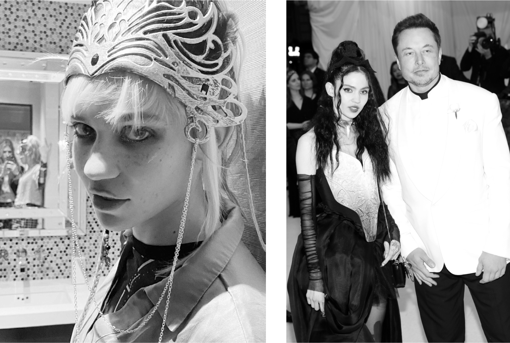

# Chapter 49: Grimes: 2018

# 49 Grimes 2018

Claire Boucher, known as Grimes, dressed for a performance; with Musk at the Metropolitan Museum gala

## EM+CB

Every now and then, often at the most complex of times, the Creators of Our Simulation—those rascals who conjure up what we are led to believe is reality—drop in a sparky new element, one that creates chaotic new subplots. And thus into Musk’s life in the spring of 2018, amid the emotional tsunami caused by his breakup with Amber Heard, came a waiflike weaver of sounds, Claire Boucher, known as Grimes, a smart and spellbinding performance artist whose appearance would lead to three new children, on-and-off domesticity, and even a public battle with an unhinged rapper.

Born in Vancouver, Grimes had produced four albums by the time she started dating Musk. Drawing on science fiction themes and memes, her mesmerizing music combined sonic texture with elements of dream pop and electronica. She had an adventuresome intellectual curiosity that led her to become interested in eclectic ideas, such as a thought experiment known as Roko’s basilisk, which posits that artificial intelligence could get out of control and torture any human who had not helped it gain power. These are the types of things that she and Musk worry about. When Musk wanted to tweet a pun about it, he Google-searched to find an image, and he discovered that Grimes had made it an element of her 2015 music video “Flesh without Blood.” She and Musk got into a Twitter exchange that led, in the modern way, to direct-messaging and texting.

They had met before and, ironically, it was when Musk was in an elevator with Amber Heard. “Remember that elevator meeting?” Grimes asked during a late-night conversation I had with her and Musk. “I mean that was super weird.”

“Of all the times to meet,” Musk agreed. “You were staring at me very intensely.”

“No,” she corrected, “you were the one giving me a weird stare.”

After they met again through the Roko’s basilisk exchange on Twitter, Musk invited her to fly up to Fremont to visit his factory, his idea of a good date. It was the end of March 2018, amid the crazed push to make five thousand cars per week. “We just walked the floor all night, and I watched him try to fix things,” Grimes says. The next night, while driving her to a restaurant, he showed how fast the car accelerated, then took his hands off the wheel, covered his eyes, and let her experience Autopilot. “I was like, oh shit, this guy is fucking crazy,” she says. “The car was signaling and changing lanes by itself. It felt like a scene out of a Marvel movie.” At the restaurant, he carved “EM+CB” on the wall.

When she compared his powers to those of Gandalf, he gave her a rapid-fire trivia test on *Lord of the Rings*. He wanted to see whether she was truly a faithful fan. She passed. “That mattered to me,” Musk says. As a gift, she gave him a box of animal bones she had collected. In the evenings, they listened to Dan Carlin’s *Hardcore History* and other history podcasts and audiobooks. “The only way I could be in a serious relationship is if the person I’m dating can also listen to an hour of, like, war history before bed,” she says. “Elon and I have gone through so many topics, like ancient Greece and Napoleon and the military strategies of World War One.”

This was all happening as Musk was going through his mental and work-related tailspins of 2018. “Man, you seem like you’re in a really rough headspace,” she said to him. “Do you want me to bring my music stuff over and I can work at your house?” He said he would like that. He did not want to be lonely. She figured that she would stay with him for a few weeks, until his emotional turmoil settled down. “But the storm just sort of never stopped, and then you’re just on the ship and on the ride, and I just stayed there.”

She accompanied him to the factory some nights when he was in battle mode. “He’s always looking out for what’s wrong with the motor, what’s wrong with the engine, the heat shield, the liquid oxygen valve,” she says. One night they went out to dinner, and Musk suddenly went silent, thinking. After a minute or two, he asked if she had a pen. She pulled an eyeliner out of her purse. He took it and began to draw on his napkin an idea for modifying an engine heat shield. “I realized that even when I was with him, there would be times when his mind would go somewhere else, usually to an issue at work,” she says.

In May, taking a brief break from the Tesla factory production hell, he flew with her to New York to attend the Metropolitan Museum’s annual gala, a glittery extravaganza featuring just-over-the-top fashion and costumes. Musk suggested ideas for her outfit, a medieval-punk black-and-white ensemble with a hard glass corset and a necklace made of spikes that resembled the Tesla logo. He even had someone from the Tesla design team help execute it. He wore a white shirt with clerical collar and a pure-white tuxedo jacket with the faint inscription *novus ordo seclorum*, a Latin phrase heralding a new order of the ages.

## Rap battle

Despite wanting to help him through his turmoil, Grimes was not a calming influence. The intensity that made her an edgy artist brought with it a messy lifestyle. She stayed up most of the night and slept most of the day. She was demanding and distrustful of Musk’s household staff, and she had a difficult relationship with his mother.

Musk was a drama addict, and Grimes had a companion trait: she was a drama magnet. Whether she intended to or not, she attracted it. Just when the Thai cave incident and the turmoil about taking Tesla private were spinning out of control in August 2018, Grimes invited the rapper Azealia Banks to stay with her at Musk’s house and collaborate on some music. She had forgotten that she and Musk had made plans to visit Kimbal in Boulder. Grimes told Banks she could stay at the guesthouse for the weekend. On that Friday morning, three days after his “take private” tweet, Musk got up, did a workout, made a few calls, and caught a short glimpse of Banks in his house. When he’s focused on other things, he doesn’t pay much attention to the things around him. He wasn’t quite sure who she was, other than a friend of Grimes.

Upset that Grimes blew off their recording session so she could be with Musk, Banks unleashed a torrent of abuse on her well-followed Instagram. “I waited around all weekend while grimes coddled her boyfriend for being too stupid to know not to go on twitter while on acid,” she posted. This was false (Musk never used acid), but it understandably piqued the interest of not only the press but also the SEC. Banks’s postings about Grimes and Musk got progressively crazier:

> LOL, Elon musk is better off hiring an escort. At least an escort would have kept her mouth shut about his business. He’s got some dirty-sneaker-inbred-out of the woods Pabst beer pussy methhead-junkie running around town telling EVERYONE EVERYTHING ABOUT HIM. All because he needed a date to the Met Gala to hide his shrinking dick from Amber Heard LOL…. He’s on the Down syndrome spectrum. There’s something not quite right about that man. I wouldn’t give him the credit of calling him an alien. He’s a mutant…. Fucking crackers. The last time I try working with a white bitch.

When *Business Insider* did a phone interview with her, Banks connected the situation to Musk’s pledge to take Tesla private, which made matters legally worse. “I saw him in the kitchen tucking his tail in between his legs scrounging for investors to cover his ass after that tweet,” she said. “He was stressed and red in the face.”

By then, wacky stories involving Musk had a short shelf life. The story was a tabloid sensation for about a week, then died down after Banks posted a letter of apology. Grimes was able to turn the tale into grist for her music. She released a song in 2021 titled “100% Tragedy,” which she said was about “having to defeat Azealia Banks when she tried to destroy my life.”

## Many shades of Musk

Despite such dramas, Grimes was a good partner for Musk. Like Amber Heard (and Musk himself), she was inclined toward chaos, but unlike Amber, hers was a chaos that was undergirded by kindness and even sweetness. “My *Dungeons and Dragons* alignment would be chaotic good,” she says, “whereas Amber’s is probably chaotic evil.” She realized that’s what made Amber enticing to Musk. “He’s attracted to chaotic evil. It’s about his father and what he grew up with, and he’s quick to fall back into being treated badly. He associates love with being mean or abusive. There’s an Errol-Amber through line.”

She enjoyed his intensity. One evening they went to see the 3D movie *Alita: Battle Angel*, but they arrived after all the 3D glasses were gone. Musk insisted they stay and watch it anyway, even though it was completely blurry. When Grimes was doing the voice recordings for the cyborg pop-star she played in the video game *Cyberpunk 2077*, he showed up at the studio wielding a two-hundred-year-old gun and insisted that they give him a cameo. “The studio guys were like sweating,” Grimes says. Adds Musk, “I told them that I was armed but not dangerous.” They relented. The cybernetic implants in the game were a sci-fi version of what he was doing at Neuralink. “It hit close to home,” he says.

Her basic insight on Musk was that he was wired differently than others. “Asperger’s makes you a very difficult person,” she says. “He’s not good at reading the room. His emotional comprehension is just very different from the average human.” People should keep his psychological makeup in mind when judging him, she argues. “If someone has depression or anxiety, we sympathize. But if they have Asperger’s we say he’s an asshole.”

She learned to navigate the many modes of his personalities. “He has numerous minds and many fairly distinct personalities,” she says. “He moves between them at a very rapid pace. You just feel the air in the room change, and suddenly the whole situation is just transferred over to his other state.” She noticed that his different personalities had different tastes, even in music and décor. “My favorite version of E is the one who’s down for Burning Man and will sleep on a couch, eat canned soup, and be chill.” Her bête noire is the Elon that’s in what she calls demon mode. “Demon mode is when he goes dark and retreats inside the storm in his brain.”

One night, when they were at dinner with a group, I watched as the clouds gathered and Musk’s mood shifted. Grimes edged away from him. “When we hang out, I make sure I’m with the right Elon,” she later explained. “There are guys in that head who don’t like me, and I don’t like them.”

Sometimes one of the Elon versions will seem not to remember what another one has done. “You will say stuff to him and then he’ll just have no memory of it whatsoever, because he was in a brain space,” Grimes says. “If he’s focused on a particular thing, he will not get stimulation, not consume any inputs from the outside world. Stuff can be right in front of his eyes and he won’t see it.” Just like what happened when he was in grade school.

During the 2018 emotional turmoil at Tesla, she tried to coax him to relax. “Everything doesn’t need to suck,” she told him one night. “You don’t need to feel stoked about everything all the time.” But she also understood, in ways that others did not, that his restlessness was a driver of his success. So, too, was his demon mode, though that took her a little longer to appreciate. “Demon mode causes a lot of chaos,” she says, “but it also gets shit done.”

