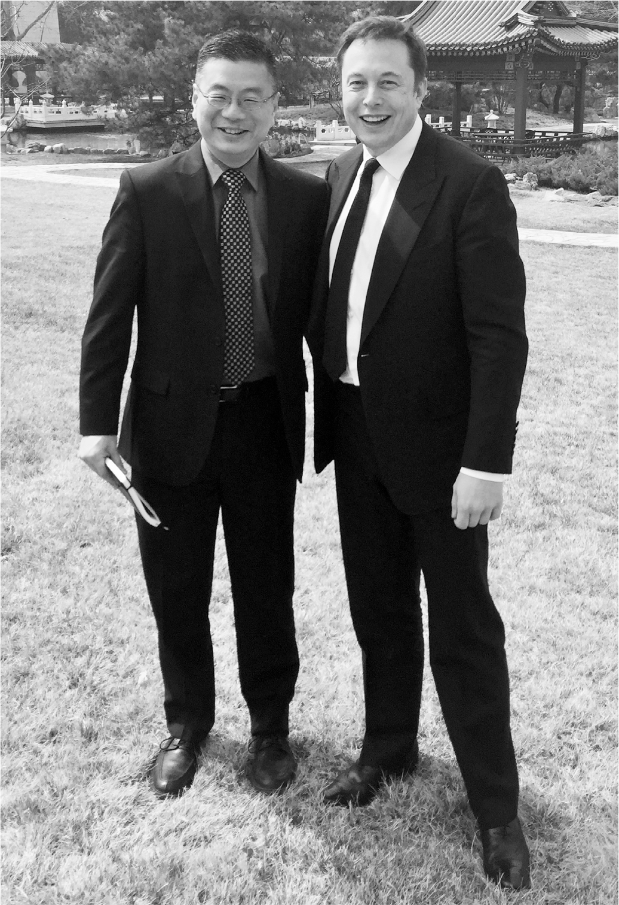

# Chapter 50: Shanghai: Tesla, 2015–2019

# 50 Shanghai Tesla, 2015–2019

With Robin Ren in Shanghai

Robin Ren, the Shanghai-born Physics Olympiad winner who had been Musk’s lab partner at Penn, did not know much about cars. In fact, almost all he knew came from the cross-country road trip that he had taken with Musk when they graduated in 1995. Musk had taught him how to deal with a broken-down BMW and how to drive a stick shift, skills he had not subsequently needed after becoming chief technology officer at Dell Computer’s flash-drive subsidiary. That is why he was surprised by the request Musk made twenty years later when he asked him to lunch in Palo Alto.

Selling cars in China was key to Tesla’s global ambitions, but things were not going well. Musk had fired two successive China managers and, after the company sold only 120 cars there one month, he was preparing to fire his whole top China-based team. “How do I fix Tesla’s business in China?” he asked Ren at the lunch. Ren expressed his ignorance of the auto industry and simply gave a few high-level thoughts about how to do business in China. “I’m going to China next week to meet the vice premier,” Musk said as they were getting up to leave. “Can you come with me?”

Ren demurred. He had just come back from a business trip to China. But he felt the tug to be part of Musk’s mission, so he emailed the next morning to say he was ready to go. They had a cordial meeting with the vice premier. Afterward, they met with a former official and other advisors, who told them that in order to succeed in selling cars in China, Tesla would have to manufacture cars there. According to Chinese law, that would require forming a joint venture with a Chinese company.

Musk was allergic to joint ventures. He didn’t share control well. So he emphasized, deploying his silly-humor mode, that Tesla did not want to get married. “Tesla is too young,” he said. “Like, we are barely a baby. Now you want to marry?” He got up and mimicked two toddlers walking down a wedding aisle, then laughed his signature cackle. Everyone else in the room laughed, the Chinese a bit hesitantly.

On the flight back on Musk’s jet, he and Ren reminisced about college and shared fun facts about physics. It was only after the jet landed, as they were walking down the stairs, that Musk popped the question: “Will you join Tesla?” Ren said yes.

---

Ren’s big challenge was to find a way to do manufacturing in China. He could either wear down Musk’s resistance and have Tesla form a joint venture, which is what every other car company had done, or he could convince China’s top leaders to change a law that had defined Chinese manufacturing growth for three decades. He discovered that the latter was easier. Month after month, he lobbied the Chinese government. Musk himself went back in April 2017 to meet with Chinese leaders again. “We kept explaining why it would help China to have Tesla build an auto factory, even if it wasn’t a joint venture,” Ren says.

As part of President Xi Jinping’s plans to make China a clean-energy innovation center, China finally agreed in early 2018 to let Tesla build a factory without having to enter into a joint venture. Ren and his team were able to negotiate a deal for more than two hundred acres near Shanghai along with low-interest loans.

Ren flew back to the U.S. to discuss the deal with Musk in February 2018. Unfortunately, that was in the midst of Musk’s production hell at the Nevada battery factory, and he was in such a frenzy walking the floor that Ren could not corner him. They flew to Los Angeles together late that night, but it was only after they landed that Ren got a chance to talk to him. Ren started to go through a slide deck with maps, financing commitments, and deal terms, but Musk did not look at them. Instead, he stared out of the window of his plane for almost a full minute. Then he looked Ren directly in the eye. “Do you believe this is the right thing?” Ren was so taken aback that he paused for a few seconds before saying yes. “Okay, let’s do it,” Musk said and left the plane.

The formal signing ceremony with the Chinese leaders came on July 10, 2018. Musk arrived in Shanghai directly from being waist-deep in water in a Thai cave after delivering the mini-sub he had built to rescue the stranded young soccer players. He changed into a dark suit and stood stiffly in a red-draped banquet hall as they all exchanged toasts. The first Teslas began rolling out of the factory in October 2019. Within two years, China would be making more than half of Tesla’s vehicles.

