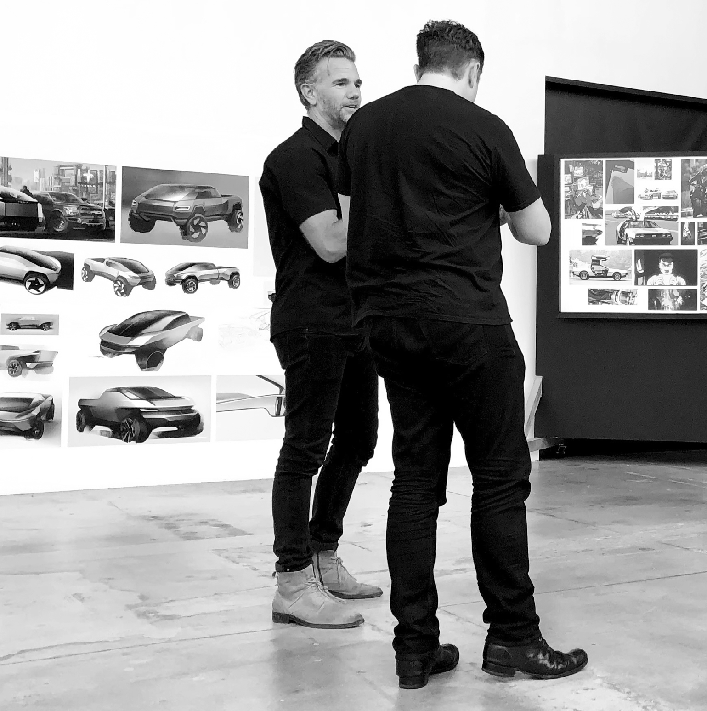

# Chapter 51: Cybertruck: Tesla, 2018–2019

# 51 Cybertruck Tesla, 2018–2019

With Franz von Holzhausen discussing Cybertruck design, 2018

[*OceanofPDF.com*](https://oceanofpdf.com)

## Steel

On almost every Friday afternoon since he created Tesla’s design studio in 2008, Musk held a product review session with his chief designer Franz von Holzhausen. These sessions, usually in the quiet white-floored design studio showroom just behind SpaceX headquarters in Los Angeles, were a calming respite, especially after tumultuous weeks. Musk and von Holzhausen would slowly meander the hangar-like room stroking prototypes and clay models of the vehicles that they envisioned for Tesla’s future.

Beginning in early 2017, they began kicking around ideas for a Tesla pickup truck.

Von Holzhausen started with traditional designs, using a Chevrolet Silverado as a model. One was placed in the middle of the studio, and they studied its proportions and components. Musk said he wanted something more exciting, perhaps even surprising. So they looked at historical vehicles with a cool vibe, most notably the El Camino, a retro-futuristic coupé made by Chevrolet in the 1960s. Von Holzhausen designed a pickup truck with a similar vibe, but as they walked around the model they agreed that it felt too soft. “It was too curved,” von Holzhausen says. “It didn’t have the authority of a pickup truck.”

Musk then added another design reference that inspired him: the Lotus Esprit of the late 1970s, a pointy, wedge-nosed British sports car. Specifically, he was enamored with a version that appeared in the 1977 James Bond movie *The Spy Who Loved Me*. Musk bought the one that was used in the movie for close to $1 million and displayed it in the Tesla design studio.

The brainstorming was fun, but it still did not lead to a concept that excited them. For inspiration, they visited the Petersen Automotive Museum, where they noticed something surprising. “We realized,” von Holzhausen says, “that pickup trucks basically haven’t changed in their form or their manufacturing process in eighty years.”

That led Musk to shift his focus to something more basic: What material should they use to build the truck’s body? By rethinking the materials and even the physics of the vehicle’s structure, it could open up the possibility of wildly new designs.

“Originally we were thinking aluminum,” von Holzhausen says. “We also kicked around titanium, because durability was really important.” But around that time, Musk became enthralled by the possibility of making a rocket ship out of glistening stainless steel. That might also work for a pickup truck, he realized. A stainless steel body would not need painting and could bear some of the vehicle’s structural load. It was a truly out-of-the-box idea, a way to rethink what a vehicle could be. One Friday afternoon, after a few weeks of discussion, Musk came in and simply announced, “We are going to do this whole thing in stainless steel.”

Charles Kuehmann was the VP for materials engineering at both Tesla and SpaceX. One of the advantages that Musk had was that his companies could share engineering knowledge. Kuehmann developed an ultra-hard stainless steel alloy that was “cold rolled” rather than requiring heat treatments, which Tesla patented. It was strong enough and cheap enough to use for both trucks and rockets.

The decision to use stainless steel for the Cybertruck had a major implication for the engineering of the vehicle. A steel body could serve as the load-bearing structure of the vehicle, rather than making the chassis play that role. “Let’s make the strength on the outside, make it an exoskeleton, and hang everything else from the inside of it,” Musk suggested.

The use of stainless steel also opened up new possibilities for the look of the truck. Instead of using stamping machines that would sculpt carbon fiber into body panels with subtle curves and shapes, stainless steel would favor straight planes and sharp angles. That allowed—and in some ways forced—the design team to explore ideas that were more futuristic, edgier, even jarring.

## “Don’t resist me”

In the fall of 2018, Musk was just emerging from Nevada and Fremont factory hell, the pedophile and “take private” tweets, and the mental turmoil of what he called the most agonizing year of his life. In times of challenge, one of his refuges is to focus on a future project. That is what he did in the serene haven of the design studio on October 5, when he turned his regular Friday visit into a brainstorming session on the design of the pickup truck.

The Chevy Silverado was still on the showroom floor for reference. In front of it were three large display boards with pictures of a wide variety of vehicles, including ones from video games and sci-fi movies. They ranged from retro to futuristic, sleek to jagged, curvaceous to jarring. With his hands casually in his pockets, von Holzhausen had the easygoing and loose-limbed manner of a surfer looking for the right wave. Musk, arms akimbo, was coiled like a bear searching for prey. After a while, Dave Morris and then a few other designers wandered in.

As he looked at the pictures on the display boards, Musk gravitated to the ones that had a futuristic, cyber look. They had recently settled on the design for the Model Y, a crossover version of the Model 3, and Musk had been talked out of some of his more radical and unconventional suggestions. Having played it safe with the Model Y, he did not want that to happen with the design of the pickup truck. “Let’s be bold,” he said. “Let’s surprise people.”

Every time someone would point to a picture that was more conventional, Musk would push back and point to the car from the video game *Halo* or in the trailer for the forthcoming game *Cyberpunk 2077* or from Ridley Scott’s movie *Blade Runner*. His son Saxon, who is autistic, had recently asked an offbeat question that resonated: “Why doesn’t the future look like the future?” Musk would quote Saxon’s question repeatedly. As he said to the design team that Friday, “I want the future to look like the future.”

There were a few dissenting voices suggesting that something too futuristic would not sell. After all, this was a pickup truck. “I don’t care if no one buys it,” he said at the end of the session. “We’re not doing a traditional boring truck. We can always do that later. I want to build something that’s cool. Like, don’t resist me.”

---

By July 2019, von Holzhausen and Morris had built a full-size mock-up of a futuristic, jarring, cyber design with sharp angles and diamond facets. One Friday they surprised Musk, who had not yet seen it, by putting it in the middle of the showroom floor next to the more traditional model they had been considering. When Musk walked in the door leading from the SpaceX factory, his reaction was instantaneous. “That’s it!” he exclaimed. “I love it. We are doing that. Yes, this is what we are going to do! Yes, okay, done.”

It became known as the Cybertruck.

“A majority of people in this studio hated it,” says von Holzhausen. “They were like, ‘You can’t be serious.’ They didn’t want to have anything to do with it. It was just too weird.” Some of the engineers started working secretly on an alternative version. Von Holzhausen, who is as gentle as Musk is brusque, spent time listening carefully to their concerns. “If you don’t have buy-in from the people around you, it’s hard to get things done,” he says. Musk was less patient. When some designers pushed him to at least do some market testing, Musk replied, “I don’t do focus groups.”

When the design of the truck was finished in August 2019, Musk told the team he wanted to reveal a working prototype publicly that November—in three months rather than the nine months it normally takes to make a running prototype. “We won’t be able to have one that we can actually drive by then,” von Holzhausen said. Musk replied, “Yes, we will.” His unrealistic deadlines usually do not pan out, but in some cases they do. “It forced the team to come together, work twenty-four-seven, and rally around that date,” von Holzhausen says.

On November 21, 2019, the truck was driven onto a stage in the design studio for a presentation to the press and invited guests. There were gasps. “Many in the crowd clearly couldn’t believe that this was actually the vehicle they’d come to see,” CNN reported. “The Cybertruck looks like a large metal trapezoid on wheels, more like an art piece than a truck.” There was also an unexpected surprise when von Holzhausen tried to show the toughness of the truck. He swung at the body with a sledgehammer, which didn’t make a dent. Then he threw a metal ball at one of the “armor glass” windows, to show it wouldn’t break. To his surprise, it cracked. “Oh my fucking God!” Musk said. “Well, maybe that was a little too hard.”

Overall, the presentation was not a great success. Tesla stock dropped 6 percent the next day. But Musk was satisfied. “Trucks have been the same for a very long time, like for a hundred years,” he told the crowd. “We want to try something different.”

Afterward, he took Grimes for a spin in the prototype to Nobu restaurant, where the valet parkers just stared at it without touching. On the way out, pursued by paparazzi, he drove over a pylon in the parking lot with a “No Left Turn” sign and turned left.

[*OceanofPDF.com*](https://oceanofpdf.com)
