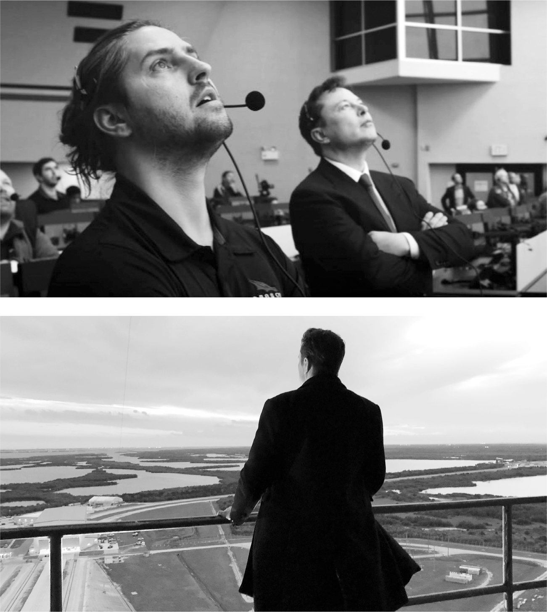

# Chapter 57: Full Throttle: SpaceX, 2020

# 57 Full Throttle SpaceX, 2020

With Kiko Dontchev, and at the Cape Canaveral launch tower

## Civilians into orbit

Beginning with the retirement of the Space Shuttle in 2011, the United States experienced a lapse in ability, will, and imagination that was astonishing for a nation that, two generations earlier, had made nine missions to the moon. For almost a decade after the last Shuttle mission, the nation had not been able to send humans into space. It was forced to rely on Russian rockets to get its astronauts to the International Space Station. In 2020, SpaceX changed that.

That May, a Falcon 9 rocket topped with a Crew Dragon capsule was ready to carry two NASA astronauts to the International Space Station—the first-ever launch of humans into orbit by a private company. President Trump and Vice President Pence flew down to Cape Canaveral and sat in the viewing stands near Pad 39A for the launch. Musk, wearing headphones and flanked by his son Kai, sat inside the control room. Ten million people watched live on television and various streaming platforms. “I’m not a religious person,” Musk later told podcaster Lex Fridman, “but I nonetheless got on my knees and prayed for that mission.”

As the rocket lifted, the control room erupted with cheers. Trump and the other politicians came in to offer congratulations. “This is the first big space message in fifty years, think of that,” Trump said. “And it is an honor to be delivering it.” Musk had little idea what the president was talking about, and he kept his distance. When Trump walked over to Musk and his team and asked, “Are you guys ready to do four more years?” Musk zoned out and turned away.

When NASA had awarded SpaceX the contract to build a rocket that would take astronauts to the Space Station, it had, on the same day in 2014, given a competing contract, with 40 percent more funding, to Boeing. By the time SpaceX succeeded in 2020, Boeing had not even been able to get an unmanned test flight to dock with the station.

To celebrate SpaceX’s successful launch, Musk went with Kimbal, Grimes, Luke Nosek, and a few others to a resort in the Everglades two hours south of Cape Canaveral. Nosek recalls that the historic “hugeness of the moment” began to hit them. They danced into the night, Kimbal jumping up at one point and shouting, “My brother has just sent astronauts up into space!”

## Kiko Dontchev

After SpaceX’s launch of astronauts to the Space Station in May 2020, it had an impressive run of eleven unmanned successful satellite launches in five months. But Musk, as always, feared complacency. Unless he maintained a maniacal sense of urgency, he worried, SpaceX could end up flabby and slow, like Boeing.

Following one of the launches that October, Musk paid a late-night visit to Pad 39A. There were only two people working. Sights like that triggered him. At all of his companies, as the employees at Twitter would discover, he expected everyone to work with an unrelenting intensity. “We have 783 employees working at the Cape,” he said in a cold rage to his launch VP there. “Why are there only two of them working now?” Musk gave him forty-eight hours to prepare a briefing on what everyone was supposed to be doing.

When he didn’t get the answers he wanted, Musk decided to find out for himself. He went into hardcore, all-in mode. As he did at the Nevada and Fremont Tesla factories, and as he would later do at Twitter, he moved into the building, in this case the hangar at Cape Canaveral, and went to work around the clock. His all-night presence was both performative and real. On his second night, he could not reach the launch VP, who had a wife and family and, in Musk’s thinking, had gone AWOL, so he asked to talk to one of the engineers who had been working alongside him at the hangar, Kiko Dontchev.

Dontchev was born in Bulgaria and emigrated to America as a young kid when his father, a mathematician, took a job at the University of Michigan. He got an undergraduate and graduate degree in aerospace engineering, which led to what he thought was his dream opportunity: an internship at Boeing. But he quickly became disenchanted and decided to visit a friend who was working at SpaceX. “I will never forget walking the floor that day,” he says. “All the young engineers working their asses off and wearing T-shirts and sporting tattoos and being really badass about getting things done. I thought, ‘These are my people.’ It was nothing like the buttoned-up deadly vibe at Boeing.”

That summer, he made a presentation to a VP at Boeing about how SpaceX was enabling the younger engineers to innovate. “If Boeing doesn’t change,” he said, “you’re going to lose out on the top talent.” The VP replied that Boeing was not looking for disrupters. “Maybe we want the people who aren’t the best, but who will stick around longer.” Dontchev quit.

At a conference in Utah, he went to a party thrown by SpaceX and, after a couple of drinks, worked up the nerve to corner Gwynne Shotwell. He pulled a crumpled résumé out of his pocket and showed her a picture of the satellite hardware he had worked on. “I can make things happen,” he told her.

Shotwell was amused. “Anyone who is brave enough to come up to me with a crumpled-up résumé might be a good candidate,” she said. She invited him to SpaceX for interviews. He was scheduled to see Musk, who was still interviewing every engineer hired, at 3 p.m. As usual, Musk got backed up, and Dontchev was told he would have to come back another day. Instead, Dontchev sat outside Musk’s cubicle for five hours. When he finally got in to see Musk at 8 p.m., Dontchev took the opportunity to unload about how his gung-ho approach wasn’t valued at Boeing.

When hiring or promoting, Musk made a point of prioritizing attitude over résumé skills. And his definition of a good attitude was a desire to work maniacally hard. Musk hired Dontchev on the spot.

---

On that October night during his work binge at the Cape, when Musk asked to speak to Dontchev, the engineer had just gotten home after three straight days of work and cracked open a bottle of wine. At first he ignored the unknown number on his phone, but then one of his colleagues called his wife. Tell Kiko to get back to the hangar right away. Musk wants him. “I’m like super tired, half-drunk, haven’t slept in days, so I got in the car, bought a pack of cigarettes to get me going, and made it back to the hangar,” he says. “I worried about getting pulled over for drunk driving, but that seemed less of a risk than ignoring Elon.”

When Dontchev got there, Musk told him to organize a “skip-level” series of meetings to talk to the engineers one level below the top managers. Out of that came a shake-up. Dontchev was elevated to chief engineer at the Cape, and his mentor Rich Morris, a calm veteran manager, was put in charge of operations. Dontchev then made a smart request. He said he wanted to report to Morris rather than directly to Musk. The result was a smooth-running team led by a manager who knew how to be a Yoda-like mentor and an engineer who was eager to match Musk’s intensity.

## Defiance

Musk’s push to move faster, take more risks, break rules, and question requirements allowed him to accomplish big feats, such as sending humans into orbit, mass-marketing electric vehicles, and getting homeowners off the electric grid. It also meant that he did things—ignoring SEC requirements, defying California COVID restrictions—that got him in trouble.

Hans Koenigsmann was one of the original SpaceX engineers recruited by Musk in 2002. He had been part of the intrepid corps on Kwaj during the failed first three flights and then the successful fourth of the Falcon 1. Musk promoted him to vice president in charge of flight reliability, making sure that flights were safe and followed regulations. It was not an easy job to have under Musk.

In late 2020, SpaceX was preparing to launch an unmanned test of the Super Heavy booster. All flights have to adhere to the requirements imposed by the Federal Aviation Administration, which include weather guidelines. That morning, the FAA inspector monitoring the launch remotely ruled that upper-level winds made it unsafe to proceed. If there was an explosion at launch, nearby houses could be impacted. SpaceX presented its own weather model saying conditions were safe and asked for a waiver, but the FAA refused.

Nobody from the FAA was actually in the control room, and it was slightly (though not very) unclear what the rules were, so the launch director turned to Elon and silently cocked his head as if asking if he should proceed. Musk gave a silent nod. The rocket took off. “It was all very subtle,” says Koenigsmann. “That’s typical Elon. A decision to take a risk signaled by a nod of the head.”

The rocket launched perfectly, without the weather being a problem, though it did fail when attempting a vertical landing six miles away. The FAA opened an investigation into why its weather ruling was ignored, and it put a two-month hold on SpaceX tests, but it ended up imposing no significant penalties.

As part of his job, Koenigsmann wrote a report on the incident, and he did not whitewash SpaceX’s behavior. “The FAA is both incompetent and conservative, which is a bad mixture, but I still needed a sign-off from them before we should have flown, and we did not have that,” he told me. “Elon had launched when the FAA said we couldn’t. So I wrote a true report that said that.” He wanted SpaceX, and Musk, to accept blame.

That was not the attitude that Musk valued. “He didn’t see it that way, and got touchy, very touchy,” Koenigsmann says.

Koenigsmann had been at SpaceX from the very rough early days, and Musk did not want to fire him on the spot. But he took away his oversight duties and eased him out in a few months. “You did an awesome job over many years, but eventually everybody’s time comes to retire,” Musk told him in an email. “Yours is now.”

