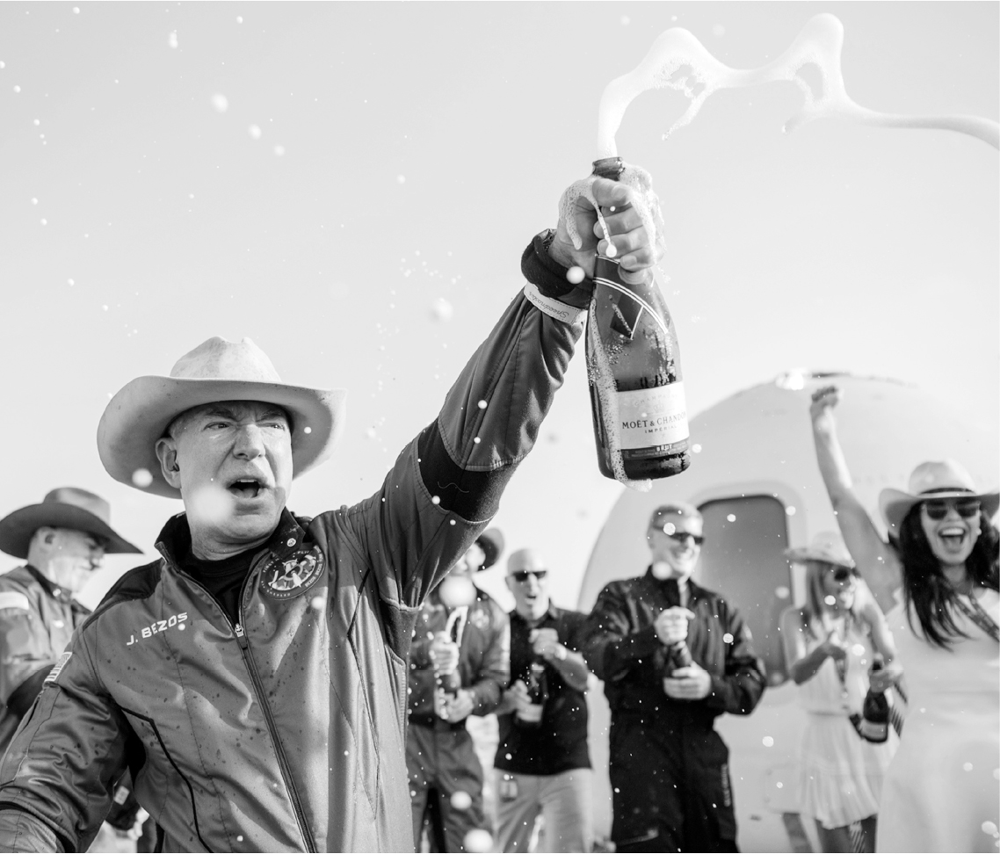
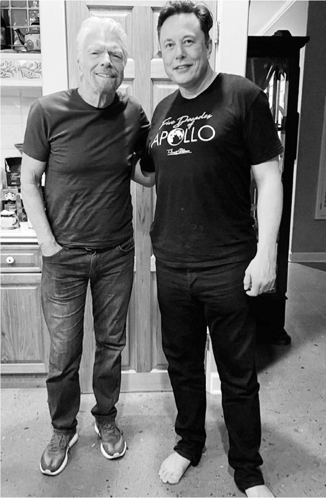

# Chapter 58: Bezos vs. Musk, Round 2: SpaceX, 2021

# 58 Bezos vs. Musk, Round 2 SpaceX, 2021

Jeff Bezos right after his trip

Richard Branson right before his

## Goading each other

Jeff Bezos and Elon Musk had tangled, beginning in 2013, over who would lease the storied Pad 39A at Cape Canaveral (Musk won), be first to land a rocket that went to the edge of space (Bezos), land a rocket that launched to orbit (Musk), and send humans into orbit (Musk). Space was a personal passion for both men, and their competition—like that of the railway barons a century earlier—would serve to push the field forward. Despite bleats about space becoming a billionaire-boys’ hobby, their vision for privatizing launches was what propelled America, which had fallen behind China and even Russia, back into the forefront of space exploration.

The rivalry reignited in April 2021, when SpaceX beat Bezos’s Blue Origin for the contract to take NASA astronauts on the final leg of a journey to the moon. Blue Origin unsuccessfully appealed the decision. Its website displayed a graphic criticizing the SpaceX plan, with big letters labeling it “immensely complex” and “high risk.” SpaceX responded by pointing out that Blue Origin “has not produced a single rocket or spacecraft capable of reaching orbit.” Musk’s Twitter fans formed a flash mob ridiculing Blue Origin, and Musk joined in. “Can’t get it up (to orbit) lol,” he tweeted.

---

Bezos and Musk were alike in some respects. They both disrupted industries through passion, innovation, and force of will. They were both abrupt with employees, quick to call things stupid, and enraged by doubters and naysayers. And they both focused on envisioning the future rather than pursuing short-term profits. When asked if he even knew how to spell “profit,” Bezos answered, “P-r-o-p-h-e-t.”

But when it came to drilling down on the engineering, they were different. Bezos was methodical. His motto was *gradatim ferociter*, or “Step by step, ferociously.” Musk’s instinct was to push and surge and drive people toward insane deadlines, even if it meant taking risks.

Bezos was skeptical, indeed dismissive of Musk’s practice of spending hours at engineering meetings making technical suggestions and issuing abrupt orders. Former employees at SpaceX and Tesla told him, he says, that Musk rarely knew as much as he claimed and that his interventions were usually unhelpful or outright problematic.

For his part, Musk felt that Bezos was a dilettante whose lack of focus on the engineering was one reason Blue Origin had made less progress than SpaceX. In an interview in late 2021, he grudgingly praised Bezos for having “reasonably good engineering aptitude,” but then added, “But he does not seem to be willing to spend mental energy getting into the details of engineering. The devil’s in the details.”

Now that Musk had sold all his homes and was living in rented quarters in Texas, he also began to disdain Bezos for his lavish multi-mansion lifestyle. “In some ways, I’m trying to goad him into spending more time at Blue Origin so they make more progress,” Musk says. “He should spend more time at Blue Origin and less time in the hot tub.”

---

Another dispute erupted over their rival satellite communications companies. By the summer of 2021, SpaceX had deployed nearly two thousand Starlinks into orbit. Its space-based internet was available in fourteen countries. Bezos had announced in 2019 plans for Amazon to create a similar constellation and internet service, called Project Kuiper. But so far, no satellites had been launched.

Musk believed that innovation was driven by setting clear metrics, such as cost per ton lifted into orbit or average number of miles driven on Autopilot without human intervention. For Starlink, he surprised Juncosa by asking how many photons were collected by the solar arrays of the satellite versus how many they could usefully shoot down to Earth. It was a huge ratio—perhaps 10,000 to 1—and Juncosa had never considered it. “I certainly never thought of this as a metric,” he says. “It forced me to try some creative thinking about how we could improve efficiency.”

This led SpaceX to develop a second version of Starlink, and it applied to get approval from the Federal Communications Commission. The application lowered the planned orbital altitude for future Starlinks, which would reduce the network’s latency.

That would put them close to the planned orbits of Bezos’s competing Kuiper constellation, so Bezos filed an objection. Once again, Musk attacked him on Twitter, misspelling his name, intentionally, as the Spanish word for “kisses”: “Turns out Besos retired to pursue a full-time job filing lawsuits against SpaceX.” The FCC ruled that Musk’s plans could proceed.

## Billionaire jaunts

One of Bezos’s dreams was to go into space himself. So in the summer of 2020, amid his tussles with Musk, he announced that he and his brother Mark were going to fly to the edge of space (though not into orbit) on an eleven-minute hop on a Blue Origin rocket. He would be the first billionaire in space.

Sir Richard Branson, the smiley British billionaire who founded Virgin Airlines and Virgin Music, also had that dream. He had created his own space-flight company, Virgin Galactic, with a business model largely dependent on taking wealthy experience-seekers on joyrides. His marketing genius included using himself as the face and spirit of the company. He knew that there was no better way to promote his space-tourism business, and have a boatload of fun himself (which he very much liked to do), than to go up on one of his rockets. So after it was too late for Bezos to change his launch date, Branson announced that he would be going up on July 11, nine days earlier. Ever the showman, he invited Stephen Colbert to host the livecast and the singer Khalid to perform a new song for the occasion.

When Branson woke up just before 1 a.m. the morning of the launch, he went into the kitchen of the house he was using and found Musk standing there with Baby X. “Elon was so sweet to turn up with his new baby to our flight,” Branson says. Musk was barefoot and wearing a black T-shirt emblazoned “Five Decades of Apollo” that celebrated the fiftieth anniversary of the moon mission. They sat down and talked for a couple of hours. “He doesn’t seem to sleep much,” Branson says.

The flight, on a suborbital winged rocket that was lifted to its launch altitude on a cargo jet, went well. Branson and five Virgin Galactic employees reached an altitude of 53.6 miles, setting off a small dispute about whether they had reached “space,” which is defined by NASA as beginning at fifty miles above Earth but by other nations as what is known as the Kármán line, at sixty-two miles up.

Bezos’s mission nine days later also succeeded. Musk, of course, did not attend that one. Bezos, his brother, and the crew reached an altitude of sixty-six miles, well above the Kármán line, giving him a dollop of added bragging rights. Their space capsule landed gently by parachute in the Texas desert, where his very anxious mother and calmer father were waiting.

Musk offered a pinch of faint praise to Bezos and Branson. “I thought it was cool that they’re spending money on the advancement of space,” he told Kara Swisher at a Code Conference in September. But he pointed out that hopping up sixty miles was a minor step. “To put things into perspective, you need about a hundred times more energy to get to orbit versus suborbit,” he explained. “And then, to get back from orbit you need to burn off that energy, so you need a heavy-duty heat shield. Orbit is roughly two orders of magnitude more difficult than suborbit.”

Musk was cursed with a conspiratorial mindset, which made him believe that much of his negative press was due to the hidden agendas or corrupt interests of the people who own the news organizations. This was particularly pronounced when Bezos bought the *Washington Post*. When the paper contacted Musk about a story it was reporting in 2021, he sent an email that simply said, “Give my regards to your puppet master.” In fact, Bezos has always been admirably hands-off when it came to news coverage in the *Post,* and its respected space reporter Christian Davenport regularly published stories that chronicled Musk’s successes, including one about his rivalry with Bezos. “For now, Musk is well ahead in virtually every area,” Davenport wrote. “SpaceX has dispatched three teams of astronauts to the International Space Station and on Tuesday is scheduled to launch a crew of civilian astronauts on a three-day trip orbiting Earth. Blue Origin has launched a single suborbital mission to space that lasted just over 10 minutes.”

