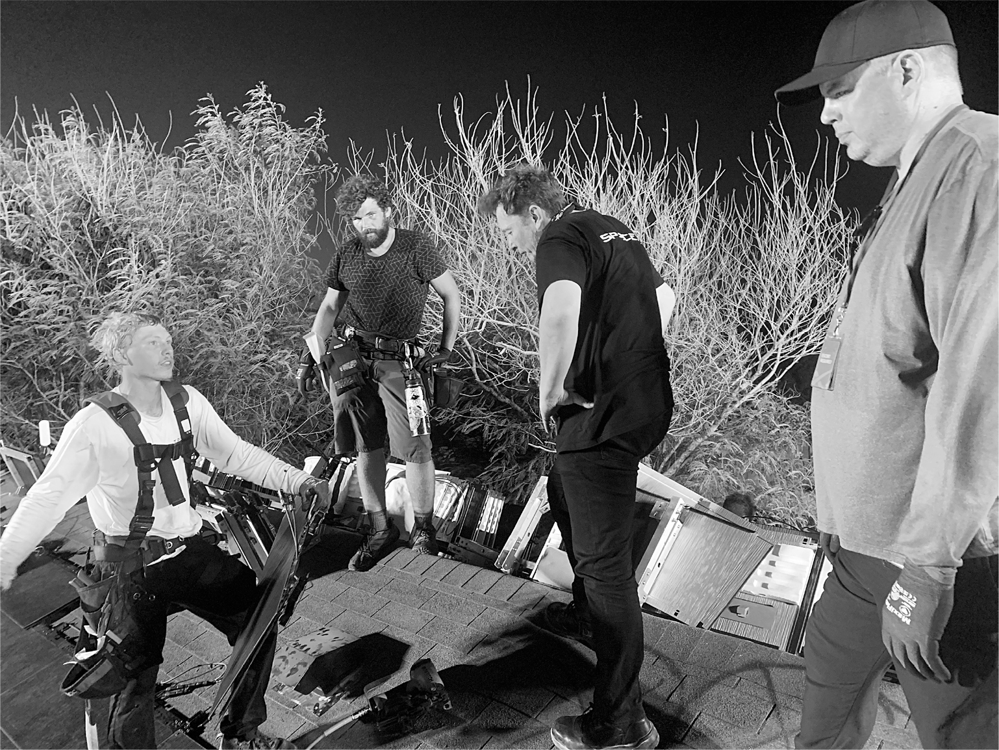

# Chapter 60: Solar Surge: Summer 2021

# 60 Solar Surge Summer 2021

Inspecting a solar roof installation with Brian Dow on the far right

[*OceanofPDF.com*](https://oceanofpdf.com)

Musk’s surges are sequential. After the Starship stacking surge of the summer of 2021, the next group in his line of fire was the solar roof team.

Musk had helped his cousins, Peter and Lyndon Rive, launch SolarCity in 2006, and he bailed it out ten years later by having Tesla purchase it for $2.6 billion. That provoked a class-action lawsuit from some Tesla shareholders, causing Musk to become obsessed with juicing up the business in order to justify the acquisition in court. He fired his cousins, who had focused on door-to-door sales schemes rather than making a good product. “I fucking hate my cousins,” he told Kunal Girotra, one of the four chiefs of Tesla Energy he hired and fired over the subsequent five years. “I don’t think I ever will ever speak to them again.”

He cycled through leaders by demanding miraculous growth in roof installations, giving them insane deadlines for delivering, and firing them when they didn’t. “Everybody was super scared of him,” says Girotra, who describes one meeting where Musk got so mad that he started banging on the table while calling him a “fucking failure.”

Girotra was replaced by a square-jawed former U.S. Army captain named RJ Johnson, who brought in no-nonsense supervisors to manage the installation crews. At the beginning of 2021, when the number of installations was not rising fast enough, Musk called Johnson in and gave him the usual ultimatum. “You have two weeks to fix this. I fired my cousins and I’ll fire you if you don’t get installations going ten times faster.” Johnson didn’t.

Next came Brian Dow, a happy warrior with a can-do enthusiasm who had served at Musk’s side during the 2017 Nevada battery factory surge. It started well. Musk, sitting at the little table in his Boca Chica living room, telephoned Dow in California to go over what he wanted. “Don’t worry about sales tactics, which is a mistake my cousins made,” he said. “Awesome products grow with word of mouth.” The main goal was to make a great solar roof that was easy to install.

As always, he invoked to Dow the steps of the algorithm and proceeded to show how they should be applied to the solar roofs. “Question every requirement.” Specifically, they should question the requirement that the installers must work around every vent and chimney pipe sticking up from a house. The pipes for dryers and ventilator fans should simply be sheared off and the solar roof tiles placed on top of them, he suggested. The air would still be able to vent under the tiles. “Delete.” The roof system had 240 different parts, from screws to clamps to rails. More than half should be deleted. “Simplify.” The website should offer just three types of roofs: small, medium, and large. After that, the goal was to “accelerate.” Install as many roofs as possible each week.

Musk decided that he needed to find out from the actual installers what could be done to speed things up. So one day in August 2021, he told Dow to come to Boca Chica with a team who could put a roof on one of the thirty-one tract homes in the subdivision next to Starbase, where he lived.

While Dow’s workers rushed to see if they could install a roof in one day, Musk spent the afternoon in the Starbase conference room going over the designs for future rockets and engines. As usual, the meetings lasted longer than planned, with Musk raising new ideas and allowing the conversation to wander off on tangents. Dow was hoping that Musk would get to the site before sundown, but it was close to 9 p.m. when he finally got into his Tesla, drove to his house to grab X, then carried him on his shoulders down the block to where the installers were working.

Even at that hour, it was a muggy 94 degrees. Eight sweat-drenched workers were swatting mosquitoes as they tried to keep their balance atop the tract house roof, which was lit by spotlights. As X meandered among the cables and equipment below, Musk clambered up a ladder to the peak of the roof, where he stood precariously. He was not happy. There were too many fasteners, he said. Each had to be nailed down, adding time to the installation process. Half should be deleted, he insisted. “Instead of two nails for each foot, try it with only one,” he ordered. “If the house has a hurricane, the whole neighborhood is fucked up, so who cares? One nail is going to be fine.” Someone protested that could lead to leaks. “Don’t worry about making it as waterproof as a submarine,” he said. “My house in California used to leak. Somewhere between sieve and submarine should be okay.” For a moment he laughed before returning to his dark intensity.

No detail was too small. The tiles and railings were shipped to the sites packed in cardboard. That was wasteful. It took time to pack things and then unpack them. Get rid of the cardboard, he said, even at the warehouses. They should send him pictures from the factories, warehouses, and sites each week showing that they were no longer using cardboard.

His face got gradually more charged and dark, like the skies heralding a storm moving in from the gulf. “We need to get the engineers who designed this system to come out here and see how hard it is to install,” he said angrily. Then he erupted. “I want to see the engineers out here installing it themselves. Not just doing it for five minutes. Up on roofs for days, for fucking days!” He ordered that, in the future, everyone on an installation team, even the engineers and managers, had to spend time drilling and hammering and sweating with the other workers.

When we finally climbed back down to the ground, Brian Dow and his deputy Marcus Mueller gathered the dozen engineers and installers in the side yard to hear Musk’s thoughts. They weren’t pleasant. Why, he asked, did it take eight times longer to install a roof of solar tiles than one with regular tiles? One of the engineers, named Tony, began showing him all the wires and electronic parts. Musk already knew the workings of each component, and Tony made the mistake of sounding both assured and condescending. “How many roofs have you done?” Musk asked him.

“I’ve got twenty years of experience in the roof business,” Tony answered.

“But how many solar roofs have you installed?”

Tony explained he was an engineer and had not actually been on a roof doing the installation. “Then you don’t fucking know what you’re fucking talking about,” Musk responded. “This is why your roofs are shit and take so long to install.”

For more than an hour, Musk’s anger ebbed and flowed, but mostly flowed. If they did not figure out ways to install roofs faster, the Tesla Energy division would keep losing money and he would shut it down. That would be a setback not just for Tesla, he said, but for the planet. “If we fail,” he said, “we will not get to a sustainable energy future.”

Dow, eager to please, agreed heartily with every pronouncement. They had set a record the previous week by installing seventy-four roofs nationwide. “Not enough,” Musk replied. “We need to increase that tenfold.” Then he strode down the block back to his little house, looking angry. When he reached his front door, he turned and said, “Solar roof meetings are like daggers in my eye.”

At high noon the next day, it reached 97 degrees in the shade, of which there was none. Dow and his installers were on top of the house next door to the one they had done the previous day. Two of the installers succumbed to the heat and started vomiting, so Dow sent them home. Some of the rest attached battery fans to their safety vests. Per Musk’s instructions, they were using only one nail to hold down each foot of the tiles, but it wasn’t working well. The tiles were popping up and rotating. So the team began using two nails again. I asked if Musk would be angry, and I was assured that if they showed him the physical evidence he would change his mind.

They turned out to be right. When Musk arrived at 9 p.m., they showed him why they needed a second nail, and he nodded. It was part of the algorithm: if you don’t end up having to restore 10 percent of the parts you deleted, then you didn’t delete enough. He was in a better mood this second night, partly because the installation process had been improved and partly just because his moods fluctuate. After a storm there is calm. “Nice work, guys,” he said. “You should stopwatch each step. That will make it more fun, like a game.”

I asked him about his anger the previous evening. “It’s not my favorite way to fix things, but it worked,” he says. “The improvement from yesterday to today was gigantic. The big difference is that today the engineers were actually on the roof installing instead of at a keyboard.”

---

Brian Dow’s eagerness never waned. “I’m a person who will literally sweep the floors if that’s going to help this company,” he told Musk. But he had an impossible task. The business of installing solar roofs is labor-intensive and doesn’t scale. Musk was a master at designing factories that could bring down the cost of physical products by churning them out in ever-increasing volumes, but the cost of each roof installation is pretty much the same whether you do ten a month or a hundred. Musk did not have the patience for such businesses.

Just three months after tapping him to run Tesla’s solar roof business, Musk summoned Dow back down to Boca Chica. It was Dow’s birthday, and he had planned to be with his family, but he scrambled to get there. When he missed his connection in Houston, he rented a car and drove the six hours down the Texas coast, arriving at 11 p.m. A crew was redoing the roof at the same house we were on in August, this time with the streamlined new methods and components. When Dow drove up, Musk was standing on top of the roof and things seemed to be going well enough. “The crew was crushing it using our new methods,” Dow says. “They were finishing up the install after just one day.”

But when Dow climbed up and joined him at the peak, Musk began grilling him about expenses. Dow is a big man, even larger than Musk, and they had trouble keeping their footing on the roof, which was slippery from the sea mist. So they sat on the peak while Dow went over financial data on his iPhone. Musk’s jaw clenched when he saw how much money they were losing on each roof they installed. “You’ve got to cut costs,” he said. “You’ve got to show me a plan by next week to cut costs in half.” As before, Dow showed his enthusiasm. “Okay, let’s do it,” he said. “We’ll kick ass and cut costs.”

He spent all weekend working on a cost-cutting plan to present to Musk that Monday. But as soon as the meeting began, Musk changed the subject and grilled Dow about how many installations had been completed in the past week and details about personnel redeployments. Dow did not know some of the answers, and he protested that he had been working since his birthday on cost-cutting plans and not the details Musk was now asking about. “Thank you for trying,” Musk finally said. “But this isn’t cutting it.”

It took Dow a while to realize that Musk was firing him. “It was just the most bizarre, weird firing you could imagine,” Dow later says. “I had so much history with him, and deep down Elon knows that I have something special. He knows that I can kick ass, because we’d done it together in the past, in the Nevada battery factory. But he thought I was losing my edge, even though I had missed my birthday with my family to be up on that roof with him.”

After Dow left, Musk was still not able to make the numbers work. A year later, Tesla Energy was installing only about thirty roofs per week, nowhere close to the one thousand that Musk kept demanding. But his fervor to solve the problem receded in April 2022, when a Delaware court ruled in his favor in the lawsuit over Tesla’s purchase of SolarCity. With that threat lifted, he no longer felt quite as desperate to show that the acquisition made financial sense.

[*OceanofPDF.com*](https://oceanofpdf.com)
