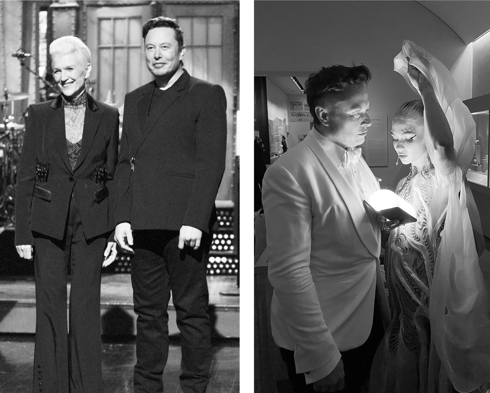

# Chapter 61: Nights Out: Summer 2021

# 61 Nights Out Summer 2021

With Maye onstage at *Saturday Night Live* and with Grimes at a party

[*OceanofPDF.com*](https://oceanofpdf.com)

## Saturday Night Live

“To anyone I’ve offended, I just want to say, I reinvented electric cars and I’m sending people to Mars in a rocket ship. Did you think I was also going to be a chill, normal dude?” Musk grinned sheepishly as he delivered his opening monologue as the guest host of *Saturday Night Live*. Shifting his weight from one leg to the other, he was doing a passable job of making his awkwardness charming.

That was his theme: showing that he could be self-aware about his emotional shortcomings. With the help of producer Lorne Michaels’s unerring sense of how to make a guest look good, he used his hosting gig in May 2021 to soften his image. “I’m actually making history tonight as the first person with Asperger’s to host *SNL*—or at least the first to admit it,” he said. “I won’t make a lot of eye contact with the cast tonight, but don’t worry, I’m pretty good at running ‘human’ in emulation mode.”

It was Mother’s Day, so Maye got a chance to come onstage. At the rehearsal on Friday, she read the cue cards and pronounced, “This isn’t funny.” She was given permission to improvise on some of her lines, which she did. “We made it more real and funnier,” she says. Grimes also appeared, in a sketch based on Super Mario Bros. One idea that they rehearsed, which played off of some of Musk’s anti-woke tweets, involved him playing a totally woke James Bond, but it didn’t gel and was cut from the show.

The afterparty was held at Ian Schrager’s downtown hot spot, the Public Hotel, which had been closed for COVID but reopened just for the event. Chris Rock, Alexander Skarsgård, and Colin Jost were there along with Grimes, Kimbal, Tosca, and Maye. Elon left around 6 a.m. and went with Kimbal and a few others to the house of Tim Urban, the internet writer, where he stayed up a few more hours talking. “He is such a nerdy guy that he didn’t really know how to party as a kid,” says Maye, “but now he’s really made up for it.”

## Fiftieth birthday

For his birthdays, Musk had often celebrated with well-crafted fantasy parties, most notably the ones that Talulah Riley choreographed. But when he reached the milestone of turning fifty on June 28, 2021, he had just undergone a third neck surgery to ease the pain from the injury that happened when he tried to take down a sumo wrestler at his forty-second birthday party. So he decided to have just a quiet gathering in Boca Chica of close friends.

On the drive down from the Brownsville airport, Kimbal bought out most of the fireworks at a roadside stand, which they shot off with Elon’s older sons, Griffin, Kai, Damian, and Saxon. They were real fireworks, not wimpy little bottle rockets, because, as Kimbal explains, “in Texas you can do whatever you want.”

In addition to the pain from his neck, Musk was exhausted by work. He had spent the day walking the production tents in Boca Chica, where he became angry about the complexity of the section that connected the Starship booster with the second-stage spaceship. “There are so many openings in the skin that it looks like Swiss cheese!” he railed in an email to Mark Juncosa. “The hole size for antennas should be tiny—just enough to fit a wire through. All loads or other design requirements must have an individual name assigned to them. No design by committee.”

For much of his birthday weekend, his friends left him alone so that he could sleep. He eventually woke up and gathered everyone for dinner at Flaps, the employee restaurant that SpaceX had built near the launchpad. Then they all went to his tiny house and gathered in the even tinier backyard studio cottage where Grimes worked. It was furnished only with big floor pillows, and they hung around—Musk lying flat on the floor with a pillow behind his neck—and talked until sunrise.

## Burning Man 2021

For Elon and Kimbal, going to Burning Man—the massive late-summer festival of art and self-expression in the Nevada desert—had been, since the late 1990s, a treasured spiritual ritual and a chance to bond, dance, and party in an encampment with Antonio Gracias, Mark Juncosa, and other friends. After the event was canceled in 2020 because of COVID, Kimbal took up the cause of raising money to make sure that it would resume at the end of summer 2021. Elon agreed to chip in $5 million, with the stipulation that Kimbal join the board.

At his first meeting in April 2021, Kimbal was shocked when the rest of the board decided to cancel that summer’s event as well. “Are you fucking kidding me?” he kept asking. He and some of the other Burning Man stalwarts organized an unauthorized “Renegade Burn” in the same desert locale. About twenty thousand attendees, rather than the usual eighty thousand, showed up, but that gave the event an intimate rebel magic, like the festival had in its earlier days. Because they had no permit, they could not do the ritual huge bonfire of the wooden effigy that gives the festival its name, so Kimbal worked with a friend to replicate the look of a burning man using lighted drones. “This is a religious experience for a loyal community,” Kimbal said. “The Man Must Burn! And it did.”

Elon came just for Saturday night and stayed in Kimbal’s encampment, which was centered around a lotus-shaped tent that provided room for forty people to dance or hang out. As was often the case, there was a ginned-up crisis—in this case, meetings about supply-chain problems at Tesla—that served as an excuse for him to not take much time off.

Grimes came with Elon, but their relationship was not going well. His romances often involved an unhealthy dose of mutual meanness, and the one with Grimes was no exception. Sometimes he would seem to thrive on the tension, demanding that Grimes do such things as shame him for being fat. When they arrived at Burning Man, they went into their trailer and didn’t emerge for hours. “I love you, but I don’t love you,” he told her. She replied that she felt the same. They were expecting another child via a surrogate at the end of the year, and they agreed that it would be easier to be co-parents if they weren’t involved romantically, so they broke up.

Grimes later expressed her feelings in a song she was working on, “Player of Games,” a fitting title on many levels for the ultimate strategy gamer:

> If I loved him any less
>
> I’d make him stay
>
> But he has to be the best
>
> Player of games….
>
> I’m in love with the greatest gamer
>
> But he’ll always love the game
>
> More than he loves me
>
> Sail away
>
> To the cold expanse of space
>
> Even love
>
> Couldn’t keep you in your place.

## Met Gala, September 2021

The breakup with Grimes did not last, or at least not totally. Instead, their relationship became a roller coaster of companionship, co-parenting, loneliness avoidance, boundary setting, estrangement, blocking, ghosting, and reembracing.

A few weeks after Burning Man, they flew from south Texas to New York for the Met Gala, the costume extravaganza that Grimes relished. They stayed with Maye in her small apartment in Greenwich Village. Musk had just sent his plane to pick up a Shiba Inu dog he had just bought, named Floki, the breed that is the face of the Dogecoin cryptocurrency. He also brought his other dog, Marvin, who did not get along with Floki. Neither were housebroken. Maye’s apartment became a two-bedroom circus.

The outfit Grimes assembled for the Gala was an homage to the sci-fi novel and movie *Dune*: a sheer gown, a gray-and-black cape, a silver face mask, and a sword. Musk was ambivalent about going and, not surprisingly, found a work excuse to avoid arriving at the beginning. A Falcon 9 rocket was launching that night, and a bureaucratic snafu caused a delay in getting permission to reenter the spacecraft over Indian air space. It was readily resolved and probably did not require his attention, but he loved throwing himself into work dramas large and small.

After the Gala, he and Grimes hosted a party at the hot club Zero Bond in Manhattan’s NoHo neighborhood. Leonardo DiCaprio and Chis Rock were among the celebrities who came. But for much of the party, Musk stayed in a back room, mesmerized by a magician performing tricks. “I went to get him so he would come up front to greet people, but he wanted to stay longer watching the magician,” Maye says.

Having reached the pinnacle of celebrity in the summer of 2021, Musk found it exciting but awkward. The next day they went to an art installation Grimes had done as part of a trendy audiovisual exhibition in Brooklyn, featuring an animated video in which she played a war nymph navigating a dystopian future. From there they went directly to Musk’s jet and flew to Cape Canaveral for SpaceX’s attempt to be the first private company to launch civilians into space. Reality could trump fantasy.

[*OceanofPDF.com*](https://oceanofpdf.com)
