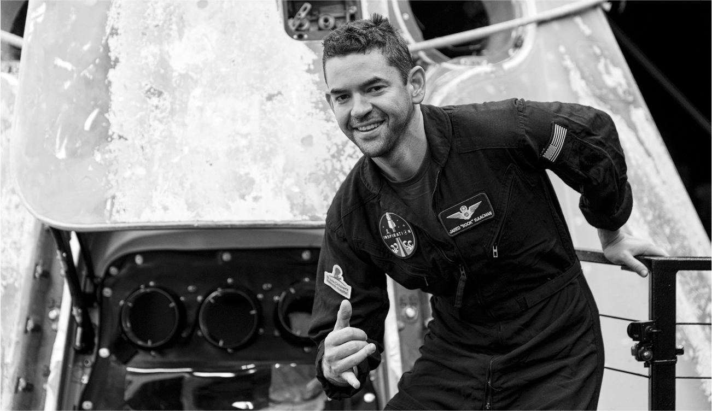
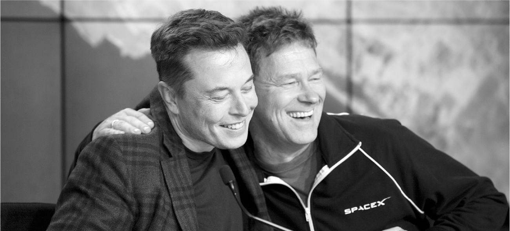

# Chapter 62: Inspiration4: SpaceX, September 2021

# 62 Inspiration4 SpaceX, September 2021

Jared Isaacman

Musk with Hans Koenigsmann

The July 2021 flights of Branson and Bezos raised a question: Would Musk follow suit and become the third billionaire to launch himself into space? Although he had a strong appetite for the limelight and for risky adventures, he never considered it. He insisted that his mission was about humanity, not himself, which sounded grandiose but contained a kernel of truth. The idea that rockets were billionaire-boys’ toys threatened to give citizen space travel a bad odor.

Instead, for SpaceX’s first civilian flight, he chose a low-key tech entrepreneur and jet pilot named Jared Isaacman, who displayed the quiet humility of a square-jawed adventurer who had proven himself in so many fields that he didn’t need to be brash. Isaacman dropped out of high school at sixteen to work for a payment-processing company, then started his own company, Shift4 Payments, that handled more than $200 billion in payments each year for restaurants and hotel chains. He became an accomplished pilot, performing in air shows and setting a world record by flying around the world in a light jet in sixty-two hours. He then cofounded a company that owned 150 jets and provided training for the military and defense contractors.

Isaacman bought from SpaceX the right to command a three-day flight—named Inspiration4—that would become history’s first private orbital mission. His purpose was to raise money for St. Jude Children’s Research Hospital in Memphis, and he invited a twenty-nine-year-old bone-cancer survivor, Hayley Arceneaux, to join the crew, along with two other civilians.

A week before the scheduled launch, Musk held a two-hour prep call with the SpaceX team. As was customary for manned missions, he gave his standard speech about safety. “I want anyone with any worries or any suggestions to send a note to me directly,” he said.

But he knew that great ventures involve risks, and he also knew—as did Isaacman—that it was important for adventurers to take them. Early in the call they addressed one that had not been made public. “There is a risk that we wanted to brief you on,” one of the flight managers told Musk. “We’re planning to fly higher than a typical Space Station mission and most other human space flight experiences.” Indeed, the SpaceX Dragon capsule would be orbiting at an altitude of 364 miles (585 kilometers). That was the highest orbit for any human crew since a Space Shuttle mission to service the Hubble Space Telescope in 1999. “The risk is actually a big one involving orbital debris,” the manager said.

Orbital debris is the junk floating in space from defunct spacecraft, satellites, and other human-made objects. By the time of the Inspiration4 launch, there were 129 million pieces in space that were too small to track. Several spacecraft had been damaged by them. The mission’s super-high altitude made things worse; these flotsam and jetsam persist for longer times in higher altitudes, where there is less drag causing them to burn up or fall to Earth. “We’re worried that penetration of the cabin by a piece of debris or damage to the heat shields could compromise the vehicle during reentry,” the briefer said.

Hans Koenigsmann, who was being nudged by Musk into retirement, had been replaced as the vice president for flight reliability by Bill Gerstenmaier, a crusty former NASA official known as Gerst. He described to Musk the reliability team’s recommendation for reducing the risk: change the way the Dragon capsule was pointed as it orbited the Earth, which would decrease its exposure to debris. Too much of a change would cause the radiators to get too cold, but they had come to a consensus on how to balance these two risks. With the original pointing, the risk of a debris strike would be about 1 in 700. The new pointing would decrease the risk to about 1 in 2,000. But he then showed a slide with a stark warning: “There is *significant* uncertainty in the predicted risk.” Musk approved the plan.

Gerstenmaier went on to note that there might be an even safer approach: flying lower. “There are potential orbits in lower altitudes,” he said, “including going down to one hundred ninety kilometers.” They had already figured out how to do this reduced height and make it to the landing site as planned.

“Why aren’t we doing that?” Musk asked.

“The customer wanted to go higher than the International Space Station,” Gerstenmaier explained, referring to Isaacman. “He really wanted to go for the highest he could. We briefed him on all this orbital debris stuff. He and his crew understand the risk and accept it.”

“Okay, great,” replied Musk, who respected people willing to take risks. “I think that’s fair, as long he’s fully informed.”

Later, when I asked why he had not opted for the lower altitude, Isaacman said, “If we’re going to go to the moon again, and we’re going to go to Mars, we’ve got to get a little outside our comfort zone.”

---

The last time civilians were launched toward orbit was the 1986 Space Shuttle *Challenger* mission carrying teacher Christa McAuliffe, which exploded a minute after takeoff. Grimes felt that was a psychic wound for America that needed to be healed, and Inspiration4 would do that. So she took on the role of “chief spell master,” casting good-luck charms on the rocket before it launched.

As usual during tense moments, Musk diverted his mind by thinking about the future. Sitting in the control room next to Kiko Dontchev, who was trying to focus on the countdown, he asked questions about the Starship system being built in Boca Chica and how to convince engineers to move there from Florida.

Hans Koenigsmann was attending his last launch. After working for twenty years at SpaceX, beginning with the hardy cadre that launched the original Falcon 1 flights on Kwaj, Musk had eased him out after the report he wrote about disobeying FAA weather orders. After the Inspiration4 rocket ascended, he went over and awkwardly hugged Musk to say goodbye. “I worried that I would get a little upset or emotional,” Koenigsmann says. “I had been there longer than anyone else.” They talked for a few minutes about how important this civilian mission would be to the history of space exploration. As Koenigsmann started to leave, Musk turned to his phone to check his Twitter feed. Grimes nudged him. “It’s his last mission,” she said.

“I know,” Musk replied, then looked up at Koenigsmann and nodded.

“I was not offended by it,” Koenigsmann says. “Musk cares a lot, but he’s not emotionally nurturing.”

---

“Congratulations to [@elonmusk](http://www.twitter.com/elonmusk) and the [@SpaceX](http://www.twitter.com/SpaceX) team on their successful Inspiration4 launch last night,” Bezos tweeted. “Another step towards a future where space is accessible to all of us.” Musk replied politely but succinctly, “Thank you.”

Isaacman was so thrilled that he offered $500 million for three future flights, which would aim at going to an even higher orbit and doing a spacewalk in a new suit designed by SpaceX. He also asked for the right to be the first private customer on Starship when it was ready.

Other potential customers also tried to reserve flights. One of them, a promoter of mixed martial arts fights, wanted to do a zero-gravity match in space. Musk laughingly considered that possibility one evening over drinks in Boca Chica. “We don’t want to do that,” Bill Riley said.

“Why not?” asked Musk. “Gwynne said they’d pay a half-billion dollars.”

“We will lose that in reputation,” replied Sam Patel, the engineer in charge of building Starbase.

“Yeah, it should not be something we do anytime soon.” Musk agreed. “Maybe only after it becomes mundane to go into orbit.”

---

The Inspiration4 mission, launched by a private company for private citizens, heralded a new orbital economy, one that would be filled with entrepreneurial endeavors, commercial satellites, and great adventures. “SpaceX and Elon are an amazing success story,” NASA Administrator Bill Nelson told me the next morning. “There’s synergy between the public sector and the private sector, and it’s all to the good of mankind.”

As Musk processed the significance of the launch, he became philosophical in his *Hitchhiker’s Guide* fashion, ruminating on human endeavor. “Building mass-market electric cars was inevitable,” he said. “It would have happened without me. But becoming a space-faring civilization is not inevitable.” Fifty years earlier, America had sent men to the moon. But since then, there had been no progress. Just the reverse. The Space Shuttle could only do low-Earth orbit, and after it was retired, America couldn’t even do that anymore. “Technology does not automatically progress,” Musk said. “This flight was a great example of how progress requires human agency.”

