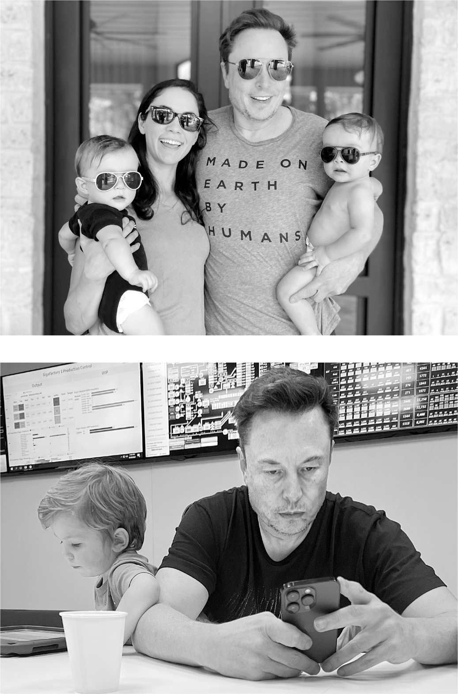

# Chapter 68: Father of the Year: 2021

# 68 Father of the Year 2021

With Shivon, Strider, and Azure; at Tesla with X

## Shivon’s twins

One thing that may have been distracting Musk on Thanksgiving 2021—or driving him to choose to be distracted by the nozzles and valves of the Raptor engine—was that, a week earlier, he had become the father of two more children, a twin boy and girl. The mother was Shivon Zilis, the bright-eyed AI investor he recruited in 2015 to work at OpenAI and who ended up as the top operations manager of Neuralink. She had become his very close friend, intellectual companion, and occasional gaming partner. “It’s been one of the most meaningful friendships of my life, like, by far,” she says. “Soon after I met him I said, ‘I hope we’re friends for life.’ ”

Zilis had been living in Silicon Valley and working at the Neuralink office in Fremont, but she moved to Austin shortly after Musk did, and she was part of his tight-knit social circle. Grimes considered her a friend and occasionally tried to set her up on dates. At the small 2020 party that Musk and Grimes threw for Halloween, a favorite holiday, Zilis was there along with Musk’s energetic SpaceX lieutenant, Mark Juncosa.

Grimes and Zilis connected to opposite facets of Musk’s personality. Grimes is feisty in a fun but also fiery way, often getting into fights with Musk and sharing his attraction to tumult. Zilis, on the contrary, says, “In six years, Elon and I have never, never gotten in a fight, never argued.” That’s a claim that few can make. They talk to each other in a low-key, intellectual way.

Zilis, by her own choice, decided not to get married. But she had “the motherhood bug super hard,” she says. Her maternal impulses were further stoked by Musk’s evangelizing about how important it was for people to have many children. He feared that declining birthrates were a threat to the long-term survival of human consciousness. “People are going to have to revive the idea of having children as a kind of social duty,” he said in a 2014 interview. “Otherwise civilization will just die.” His loyal sister, Tosca, who had become a successful producer of romance films and was based in Atlanta, had never married. Elon encouraged her to have children and, when she agreed, helped her find a clinic, pick out an anonymous sperm donor, and pay for the procedure.

“He really wants smart people to have kids, so he encouraged me to,” Zilis says. When she decided that she was ready, he suggested that he be the sperm donor so that the kids would be genetically his. The idea appealed to her. “If the choice is between an anonymous sperm donor or doing it with the person you admire most in the world, for me that was a pretty fucking easy decision,” she says. “I can’t possibly think of genes I would prefer for my children.” There was another upside: “It seemed like something that would make him very happy.”

Their twins were conceived by in vitro fertilization. Because Neuralink is a privately owned company, it’s unclear how the evolving rules surrounding workplace relationships applied. At the time, the issue didn’t arise because Zilis did not tell people who the biological father was.

One day that October, she led Musk and other top Neuralink executives on a tour of a new facility the company was building in Austin. It included an office and lab in a strip mall near Tesla’s Giga Texas factory and a set of barns nearby to house pigs and sheep used for the chip-implanting experiments. She was visibly pregnant with the twins, though no one there knew that they were also Musk’s. Later, I asked if this made her feel awkward. “No,” she replied, “I was thrilled to be becoming a mother.”

Zilis had a complication at the end of her pregnancy and went into the hospital. The twins were born seven weeks prematurely, but healthy. Musk was listed as the father on the birth certificate, but the children—a boy named Strider Sekhar Sirius and a girl named Azure Astra Alice—were given Zilis’s last name. She assumed that he would not be very involved in parenting them. “I thought he would play a role like a godfather,” she says, “because the dude’s got a lot going on.”

Instead, Musk ended up spending a lot of time with the twins and bonding with them, albeit in his own emotionally distracted way. At least once a week, he would stay at Zilis’s house, feed the kids, and sit on the floor with them while he did his late-evening virtual meetings on Raptor, Starship, and Tesla Autopilot. He was, given his nature, not quite as cuddly as your average dad. “There’s some stuff he just can’t do because he’s emotionally hardwired a bit differently,” Zilis says. “But when he comes in, they light up and have eyes only for him, which lights him up as well.”

## Baby Y

Even though they were in a rough patch in their relationship, Grimes and Musk were having such a great time being co-parents of X that they had decided to have another baby. “I really wanted him to have a daughter so bad,” she says. Because she had had a rough first pregnancy and her very slender body made her prone to complications, they decided to use a surrogate.

That led to an improbably weird and potentially awkward situation worthy of a new-age French farce. When Zilis was in the Austin hospital with complications from her pregnancy, so too was the surrogate mother carrying the baby girl that Musk and Grimes had secretly conceived in vitro. Because the surrogate mother was having a troubled pregnancy, Grimes was staying with her. She was unaware that Zilis was in a nearby room, or that she was pregnant by Musk. Perhaps it is no surprise that Musk decided to fly west that Thanksgiving weekend to deal with the simpler issues of rocket engineering.

When their daughter was born in December, just a few weeks after her twin half-siblings, Musk and Grimes began their drawn-out process of settling on names. At first they called her Sailor Mars, after one of the heroines in the *Sailor Moon* manga, which features female warriors who protect the solar system from evil. It seemed a fitting though not exactly conventional name for a child who might be destined to go to Mars. By April, they decided they needed to give her a less serious name (yes), because “she’s all sparkly and a lot goofier troll,” Grimes said. They settled on Exa Dark Sideræl, but then in early 2023 toyed with changing her name to Andromeda Synthesis Story Musk. For simplicity’s sake, they mainly just called her Y, or sometimes Why?, with a question mark as part of her name. “Elon always says we need to figure out what the question is before we can know the answers to the universe,” Grimes explains, referring to what he learned from *The Hitchhiker’s Guide to the Galaxy*.

When Musk and Grimes brought Y home from the hospital, they introduced her to X. Christiana Musk and other relatives were there, and everybody played on the floor as if they were a conventional family. Musk never said anything about just having twins with Shivon. After an hour of playing and a quick dinner, he scooped up X and took him on his jet to New York, where the toddler sat on his lap at the *Time* magazine ceremony anointing him Person of the Year.

The magazine’s accolade marked a peak in his popularity. In 2021, he became the richest person in the world, SpaceX became the first private company to send a civilian crew into orbit, and Tesla reached a trillion-dollar market value by leading the world’s auto industry in a historic shift into the era of electric vehicles. “Few individuals have had more influence than Musk on life on Earth, and potentially life off Earth too,” *Time*’s editor Ed Felsenthal wrote. The *Financial Times* also named him Person of the Year, stating, “Musk is staking a claim to be the most genuinely innovative entrepreneur of his generation.” In his interview with the paper, Musk stressed the missions that drove his companies. “I’m just trying to get people to Mars, and enable freedom of information with Starlink, accelerate sustainable technology with Tesla, and free people from the drudgery of driving,” he said. “It’s certainly possible that the road to hell to some degree is paved with good intentions—but the road to hell is mostly paved with bad intentions.”

