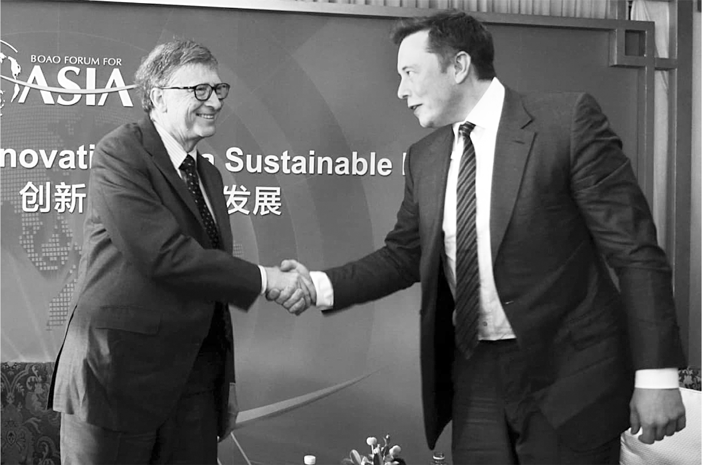

# Chapter 71: Bill Gates: 2022

# 71 Bill Gates 2022

With Gates at the Boao Forum for Asia in Qionghai, China, 2015

[*OceanofPDF.com*](https://oceanofpdf.com)

## The visit

“Hey, I’d love to come see you and talk about philanthropy and climate,” Bill Gates said to Musk when they happened to be at the same meeting in early 2022. Musk’s stock sales had led him, for tax reasons, to put $5.7 billion into a charitable fund he had established. Gates, who was then spending most of his time on philanthropy, had many suggestions he wanted to make.

They’d had friendly interactions a few times in the past, including when Gates brought his son Rory to SpaceX. Musk, who had always liked the Microsoft operating system more than most other techies did, could relate to a guy who had built a company by being hardcore and relentless. They agreed to set up a visit, and Gates, who has a team of schedulers and assistants, said he would have his office call Musk’s scheduler.

“I don’t have a scheduler,” Musk replied. He had decided to get rid of his personal assistant and scheduler because he wanted complete control of his calendar. “Just have your secretary call me directly.” Gates, who thought it was “bizarre” that Musk had no scheduler, felt weird having one of his assistants call Musk, so he did so directly and arranged a time they could meet in Austin.

“Just landed,” Gates texted on the afternoon of March 9, 2022.

“Cool,” replied Musk, who sent Omead Afshar down to the Gigafactory entrance to meet him.

---

In the rarefied fraternity of people who have held the title of richest person on Earth, Musk and Gates have some similarities. Both have analytic minds, an ability to laser-focus, and an intellectual surety that edges into arrogance. Neither suffers fools. All of these traits made it likely they would eventually clash, which is what happened when Musk began giving Gates a tour of the factory.

Gates argued that batteries would never be able to power large semitrucks and that solar energy would not be a major part of solving the climate problem. “I showed him the numbers,” Gates says. “It’s an area where I clearly knew something that he didn’t.” He also gave Musk a hard time on Mars. “I’m not a Mars person,” Gates later told me. “He’s overboard on Mars. I let him explain his Mars thinking to me, which is kind of bizarre thinking. It’s this crazy thing where maybe there’s a nuclear war on Earth and so the people on Mars are there and they’ll come back down and, you know, be alive after we all kill each other.”

Nevertheless, Gates found himself impressed by the factory Musk had built and his detailed knowledge of every machine and process. He also admired SpaceX for deploying a large constellation of Starlink satellites to provide internet from space. “Starlink is the realization of what I tried to do with Teledesic twenty years ago,” he says.

At the end of the tour, the conversation turned to philanthropy. Musk expressed his view that most of it was “bullshit.” There was only a twenty-cent impact for every dollar put in, he estimated. He could do more good for climate change by investing in Tesla.

“Hey, I’m going to show you five projects of a hundred million each,” Gates responded. He listed money for refugees, American schools, an AIDS cure, eradicating some mosquito types through gene drives, and genetically modified seeds that will resist the effects of climate change. Gates is very diligent about philanthropy, and he promised to write for Musk a “super-long description of the ideas.”

---

There was one contentious issue that they had to address. Gates had shorted Tesla stock, placing a big bet that it would go down in value. He turned out to be wrong. By the time he arrived in Austin, he had lost $1.5 billion. Musk had heard about it and was seething. Short-sellers occupied his innermost circle of hell. Gates said he was sorry, but that did not placate Musk. “I apologized to him,” Gates says. “Once he heard I’d shorted the stock, he was super mean to me, but he’s super mean to so many people, so you can’t take it too personally.”

The dispute reflected different mindsets. When I asked Gates why he had shorted Tesla, he explained that he had calculated that the supply of electric cars would get ahead of demand, causing prices to fall. I nodded but still had the same question: Why had he shorted the stock? Gates looked at me as if I had not understood what he just explained and then replied as if the answer was obvious: he thought that by shorting Tesla he could make money.

That way of thinking was alien to Musk. He believed in the mission of moving the world to electric vehicles, and he put all of his available money toward that goal, even when it did not seem like a safe investment. “How can someone say they are passionate about fighting climate change and then do something that reduced the overall investment in the company doing the most?” he asked me a few days after Gates’s visit. “It’s pure hypocrisy. Why make money on the failure of a sustainable energy car company?”

Grimes added her own interpretation: “I imagine it’s a little bit of a dick-measuring contest.”

---

Gates followed up in mid-April, sending Musk the promised paper on philanthropy options that he had personally written. Musk responded by text with a simple question: “Do you still have a half billion dollar short position against Tesla?”

Gates was sitting in the dining room of the Four Seasons hotel in Washington, DC, with his son Rory, who was just starting graduate school. He laughed, showed Rory the text, and asked for his advice on how to answer.

“Just say yes, and then change the subject quickly,” Rory suggested.

Gates tried that. “Sorry to say I haven’t closed it out,” he texted back. “I would like to discuss philanthropy possibilities.”

It didn’t work. “Sorry,” Musk shot back instantly. “I cannot take your philanthropy on climate seriously when you have a massive short position against Tesla, the company doing the most to solve climate change.”

When angry, Musk can get mean, especially on Twitter. He tweeted a picture of Gates in a golf shirt with a bulging belly that made him look almost pregnant. “In case u need to lose a boner fast,” Musk’s comment read.

Gates was truly puzzled about why Musk was upset that he shorted the stock. And Musk was just as puzzled that Gates could find it puzzling. “At this point, I am convinced that he is categorically insane (and an asshole to the core),” Musk texted me right after his exchange with Gates. “I did actually want to like him (sigh).”

For his part, Gates was far more gracious. Later that year, he was at a dinner in Washington, DC, where people were criticizing Musk. “You can feel whatever you want about Elon’s behavior,” Gates said, “but there is no one in our time who has done more to push the bounds of science and innovation than he has.”

## Philanthropy

Musk had shown little interest in philanthropy over the years. He felt that the good he could do for humanity was best accomplished by keeping his money deployed in his companies that pursued energy sustainability, space exploration, and artificial intelligence safety.

A few days after Bill Gates visited him with philanthropy suggestions, Musk sat down at an open table on the mezzanine overlooking the assembly lines at Tesla’s new Giga Texas with Birchall and four estate-planning advisors. Even though he had not been persuaded by Gates to dive into philanthropy, he wanted ideas for funding something that would be more operational than a traditional foundation.

The option Birchall proposed was creating a nonprofit holding company, which is like a business that guides and funds multiple nonprofit companies under its protection. As Birchall explained, the structure would be similar to that of the Howard Hughes Medical Institute. “We’re going to do it like in baby steps,” Birchall told me, “but ultimately it can become a pretty big thing, maybe a full-fledge institute of higher learning.”

Although the concept appealed to Musk, he was not ready to commit. “I’ve got too much else to think about now,” he said as he left the table.

Yes, he did. That day—April 6, 2022—he was preparing for the opening of Giga Texas, and he had spent the morning doing an intense inspection walk on the Model Y assembly line and approving the details of the Giga Rodeo party being planned. It was also the day of his conference call with White House officials on trade, China, and battery subsidies. And then there was the issue that was taking up most of his mind-space that day: an offer he had just accepted, but was having second thoughts about, to join the board of a company whose stock he had been secretly accumulating since January.

[*OceanofPDF.com*](https://oceanofpdf.com)
