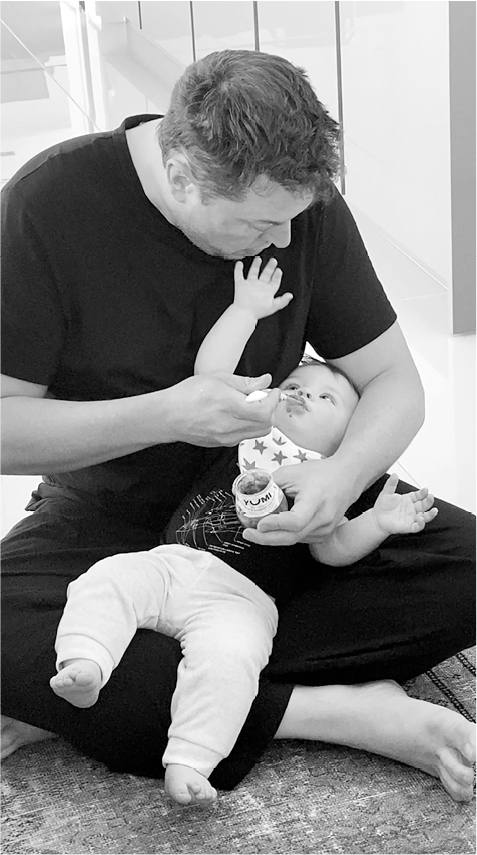
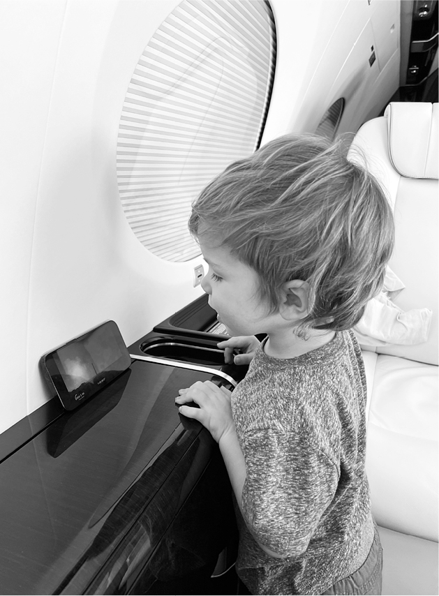
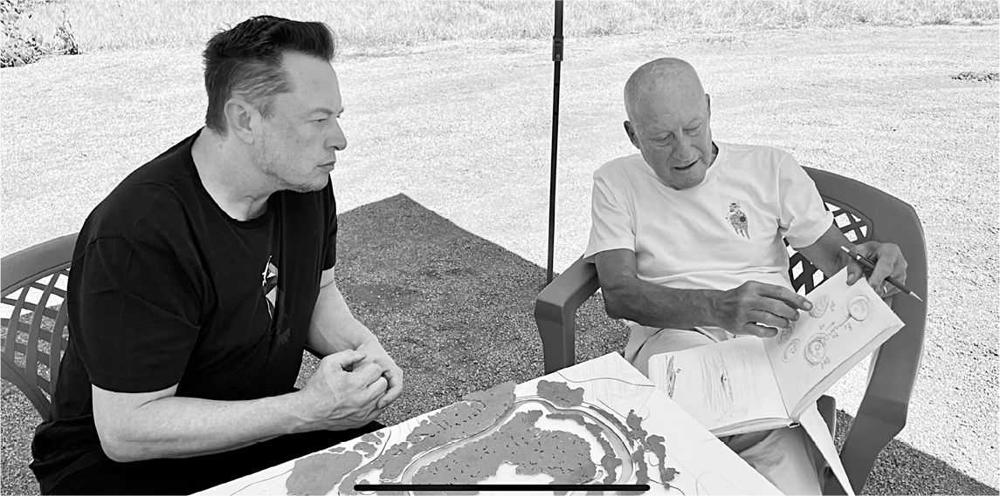

# Chapter 75: Father’s Day: June 2022

# 75 Father’s Day June 2022

Feeding Tau

X watching a rocket launch video on Musk’s plane

With Lord Norman Foster in Austin, dreaming of a house

## All my kids

“Happy Father’s Day. I love all my kids so much.”

On its surface, Musk’s tweet at 2 a.m. on Father’s Day—June 19, 2022—seemed innocuous, even sweet. But lurking beneath the word *all* was a drama. His trans daughter Jenna had just turned eighteen and gone to court in Los Angeles, where she lived with her mother, to change her name officially from Xavier Musk to Vivian Jenna Wilson. She called herself “Jenna,” which was similar to the name that her mother Justine used, Jennifer Wilson, before she met and married Musk. “I no longer live with or wish to be related to my biological father in any way, shape or form,” she declared to the court.

Musk had made peace with Jenna’s transitioning, even though he had not embraced the protocols about listing one’s pronouns. He believed that she was rejecting him because of her political ideology. “It’s full-on communism, and a general sentiment that if you’re rich, you’re evil,” he said.

It was all very jangling for Musk. “We are simultaneously being told that gender differences do not exist and that genders are so profoundly different that irreversible surgery is the only option,” he tweeted that week. “Perhaps someone wiser than me can explain this dichotomy.” Then, almost as a memo to himself as well as a pronouncement, he added, “It is a better world if we are all less judgy.”

Jenna’s rejection made for a painful Father’s Day. “He loves Jenna so much and truly accepts her,” says Grimes, who stayed friendly with her. “I’ve never seen him as heartbroken about anything. I know he’d do anything to be able to see her or have her, like, accept him again.”

Adding to the turmoil was that the secret of the twin children he had with Shivon Zilis was made public. When they were born, they had been given her last name. But Musk’s estrangement from his daughter caused him to want to change that. “When Jenna deleted ‘Musk’ from her name, he was just really sad,” Zilis says. “And he asked me, ‘Hey, would you be open to our twins taking my name?’ ” The court filing they made soon leaked.

That’s when Grimes discovered that Zilis, whom she considered a friend, had given birth to twins with Musk. When she confronted Musk, he simply said Zilis had the right to do what she wanted. Grimes was outraged. By Father’s Day, they were all involved in contentious discussions over such issues as whether Zilis and her twins could spend time with Grimes’s children X and Y. It was a mess.

Musk and Zilis continued to attend weekly Neuralink meetings together without commenting on their parenting status. The way to defuse an awkward situation, he felt, was to joke about it on Twitter. “Doing my best to help the underpopulation crisis,” he tweeted. “A collapsing birth rate is the biggest danger civilization faces by far.”

## Techno Mechanicus Musk

As if Father’s Day 2022 was a multiplayer game, it had yet one other subplot. Secretly, Musk and Grimes had a third child that week, a son named Techno Mechanicus Musk. The boy, who was birthed by a surrogate mother, was nicknamed Tau, after the Greek letter representing the irrational number that is equal to two times pi. Its approximation, 6.28, reflected Musk’s own birthday, June 28.

They kept the existence of this third child private. But Musk was soon bonding with him. On a visit to Grimes’s home when Tau was two months old, he sat on the floor feeding baby food to Tau, who kept reaching up to play with the stubble on his father’s chin. “Tau is so amazing,” Grimes says. “He came out with eyes that could just see so deeply into your soul, with so much knowledge. He looks like a little Spock. He’s definitely a Vulcan.”

A few weeks later, Musk was sitting quietly between meetings at Giga Texas, scrolling through the news on his iPhone, when he saw Lucid Motors’ report of its lame quarterly sales numbers. He laughed for a few minutes, then dashed off a tweet. “I had more kids in Q2 than they made cars!” he wrote. Then he kept laughing loudly to himself. “I mean, I love my own humor, even if others don’t,” he said. “I kill me.”

Around that time, the *Wall Street Journal* started working on a story about an alleged one-night stand that Musk had with the estranged wife of Google cofounder Sergey Brin a few months earlier. The rationale for the story was that it had harmed relations between the two men. Right after the story broke, they were at a party together, and Musk maneuvered himself into a position where he could take a selfie with Brin, which Brin tried to avoid. Musk sent the picture to the *New York Post* to rebut the allegation that they’d had a falling-out. “The amount of attention on me has gone supernova, which super sucks,” he tweeted. “Unfortunately, even trivial articles about me generate a lot of clicks :( Will try my best to be heads down focused on doing useful things for civilization.”

Keeping his head down, however, did not come naturally.

## Sins of the father

Level five of Father’s Day 2022 may have been the spookiest of them all. It involved, alas, his own estranged father, Errol Musk.

In an email to Elon dated “Father’s Day,” Errol wrote, “I’m sitting here freezing cold in a hanger wrapped in blankets and newspapers. There is no electricity. If I’m bothered to write to you like this, you can bother to read it.” That was followed by a rambling screed in which he called Biden a “freak, criminal, pedophile president” who was out to destroy everything that the U.S. stood for, “including you.” Black leaders in South Africa, he said, were engaged in anti-white racism. “With no Whites here, the Blacks will go back to the trees.” Vladimir Putin was “the only world leader talking.” He followed up with a subsequent email showing a picture of a stadium scoreboard saying, “TRUMP WON—F\*\*K Joe Biden,” adding the comment, “This is irrefutable.”

Errol’s letter was startling on so many levels, most notably his racism. But one other aspect would have an unsettling resonance later that year: how conspiratorial he had become. He had gone down the alt-right rabbit holes of labeling Biden a pedophile and praising Putin. And in other posts and emails, he denounced COVID as “a lie,” attacked COVID expert Anthony Fauci, and claimed that the vaccines were deadly, positions Elon would later echo.

His description of his cold and impoverished circumstances was meant as a rebuke to his son for no longer supporting him financially. Up until recently, Elon had been sending, off and on, varying amounts of monthly stipends. This began back in 2010, with payments of $2,000 a month to help Errol support his younger children after his second divorce. Over the years, Elon would occasionally provide more funding, then cut back whenever Errol gave interviews aggrandizing his own role in his son’s success. When Errol had heart surgery in 2015, Elon’s support was temporarily increased to $5,000 a month. But he cut off the funds after learning that Errol had impregnated Jana, the stepdaughter he had raised from age four, whom Elon and Kimbal considered a half-sister.

At the end of March 2022, Errol wrote asking that his stipends be restored. “At 76, I cannot generate income easily,” he wrote. “The alternative for me is starvation and unbearable humiliation or death by suicide. Death by suicide does not worry me, but it should worry you. The truth is too well known. You will be ruined, make no mistake, and people will know who you really are, or have become.” He blamed Elon’s attitude on the “National Socialist, cruel, self-serving and cowardly maternal family background,” adding, “Has the wickedness that was the Haldeman’s prevailed?”

Around the time of Father’s Day, Elon resumed the $2,000 monthly payments. But his financial manager Jared Birchall asked Errol to stop making a series of YouTube videos, titled *Dad of a Genius*, that he had produced with a clinical psychologist. Errol reacted angrily. “My silence to enable the devilish sh,t to continue brewing is not worth $2,000,” he shot back. “It’s also wrong to silence me. I have much to teach people.”

As if following a perverse script, Father’s Day 2022 brought one more complication to this situation. Errol revealed that he had fathered a second child with Jana, a daughter. “The only thing we are on Earth for is to reproduce,” he said. “If I could have another child I would. I can’t see any reason not to.”

## Bonding attempts

Through all of the tumult in his personal life, Musk had one lovely steadying influence: Talulah Riley, the English actress who married him in 2010 and, after a divorce and remarriage, finally left him to return to village England tranquility in 2015. She continued to feel warmly toward him, and Musk felt the same about her, though he was afflicted by preferring extreme heat and cold rather than warmth in relationships.

When a close friend of hers died in 2021, Musk flew to England and spent a day at her house. “We just watched stupid TV and laughed and hung out and he just made me laugh instead of cry,” she says. And amid his personal and Twitter-deal tumults in the early summer of 2022, she flew to Los Angeles and met him for dinner at the Beverly Hills Hotel.

She traveled with her new boyfriend, the young actor Thomas Brodie-Sangster, to publicize a movie they had costarred in, *Pistol*, about the pioneering punk rock band The Sex Pistols. But Brodie-Sangster did not come to the dinner. Instead, Musk and Riley were joined by his four older boys, who had bonded with her over the years. “I can’t get over how completely gorgeous they all are,” she texted me. “Griffin is handsome, hilarious and still an utter charmer, Damian has blossomed into an incredibly sophisticated and beautiful soul, Kai is still a thoroughly decent chap and now so gorgeously geeky, and Saxon’s language development is more than I could have possibly hoped for—we had full and detailed conversations. Except at one point he said, ‘The interesting thing about you and Elon is you have a significant age gap… But you look the same.’ .”

The reunion was very emotional. There was a part of her that still loved Musk. When she got back to her hotel room that night, Brodie-Sangster had to cope with her bursting into tears.

---

Musk reacted to his family turmoil in the summer of 2022 by launching another surge, this one fatherly. He took his four older boys along with Grimes and X to Spain to vacation with James and Elisabeth Murdoch and their children. James, a member of the Tesla board, is the liberal member of the Rupert Murdoch family, and Elisabeth is more so. They provided Musk with a calming personal influence and political counterbalance.

A few weeks later, he and the boys went to Rome, where they were granted an audience with Pope Francis. Musk tweeted out a photo of the meeting, which showed him in an ill-fitting suit, Saxon twisted nervously, and the other boys dressed in black shirts and looking somber. “My suit is tragic,” Musk admitted. When the boys woke up the next day, they were upset that their father had tweeted out the picture. One of them even cried. On a group chat they do with their father, even when traveling together, one asked him to not tweet out pictures of them without their permission. Musk got depressed, dropped off the group chat, and a few minutes later sent word that they were returning to the U.S.

## A house, not a home

Musk realized that it was difficult to have a stable family life if he didn’t have a family home. So amid the domestic drama in the summer of 2022, he started dreaming about a home of his own in Austin. He considered a few houses for sale, but deemed them too expensive. Instead, he decided to build one on a sprawling horse farm, with a tranquil lake, that he had bought right across the Colorado River from Giga Texas. He thought he might use other parts of the property for Neuralink and his other companies.

He walked the property one Saturday night with Grimes and Omead Afshar, who was in charge of building Giga Texas, and they came up with a variety of ideas, including that The Boring Company could dig a tunnel under the river to connect the house and the factory. He also walked the property a few days later with Shivon Zilis. “One thing I’ve been harassing him about, lovingly, is finding a place he can call home,” she says. “He needs a place where his soul resides, and that’s what the horse farm will be for him.”

One hot afternoon in the summer of 2022, Musk sat under a pop-up canopy on the property with Lord Norman Foster, the architect who designed, among other things, the space-age circular headquarters of Apple for Steve Jobs. Foster had flown from London, carrying his sketch pad, to brainstorm with Musk. Sitting at a card table, Musk looked through some of Foster’s sketches, then began free-associating ideas. “It should be like something fell out of space, like a structure from another galaxy landed in the lake,” Musk said.

Birchall, who was with them, Googled images of futuristic buildings, while Foster made more sketches in his notebook. Maybe, Musk suggested, a shard of glass coming out of the lake? The bottom floor could be partly submerged in the water, accessible by a tunnel from another structure on the shore.

I later commented that it did not actually seem like a family home. Musk agreed. “It’s more an art project than a house,” he explained. He put off building it.

