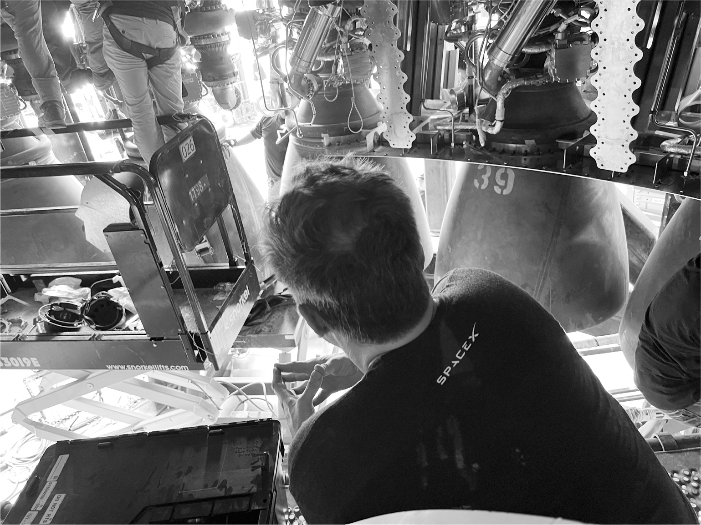

# Chapter 76: Starbase Shake-up: SpaceX, 2022

# 76 Starbase Shake-up SpaceX, 2022

Inspecting the Raptor engines under a Starship booster

## Showing off Starship

Always vigilant against complacency, Musk decided in early 2022 that it was time for another surge in Boca Chica. It had been six months since he had pushed Andy Krebs and the team in south Texas to stack Starship on the launchpad. Now he wanted to have a public presentation of the rocket. This time the two stages would be stacked by Mechazilla’s chopstick arms.

Bill Riley warned that it would be hard to get this done before the end of February, so Musk used Twitter as a forcing mechanism. He tweeted out that there would be a public showing of Starship at 8 p.m. on Thursday, February 10, 2022.

The night of the presentation, he had dinner at Flaps, the funky-casual restaurant for SpaceX employees. Joining him were three of NASA’s top directors, all women: Janet Petro of the Kennedy Space Center at Cape Canaveral, Lisa Watson-Morgan of the Human Landing System Program, and Vanessa Wyche of Johnson Space Center in Houston.

X toddled up to the table and started eating blue cheese dip with a fork. Musk joked that X served as his “cuteness prop.” Petro whispered to me, “I’m suppressing my maternal instincts,” but she finally succumbed and took the fork away from him, handing him a spoon instead.

“He’s fearless,” Musk says. “He could probably use more fear instincts. It’s genetic.” Yes, but it was also the result of the free-range way Musk has brought him up. It’s not in Musk’s nature to be doting.

“Falcon nine,” said X, pointing in the distance.

“No,” his father corrected him. “Starship.”

“Ten, nine, eight,” X said.

“People say he’s so smart to be able to count backwards,” Musk said. “But I’m not sure he can count forward.”

Musk asked the NASA guests whether they had children, and their responses prompted him to give his thoughts once again on how declining birthrates are a threat to the future of human consciousness. “Among my friends, the average number of kids is one,” he said. “Some have zero. I try to set a good example.” He didn’t mention that he’d just had three more children.

The conversation turned to China, which was the only entity that was launching as many orbital missions as SpaceX. NASA itself was not even in the game. “If China gets to the moon before we do again, it will be a Sputnik moment,” he told the NASA directors. “It’s going to be a shock when we wake up and realize they got to the moon while we were suing each other.” He said that when he visits China, he is often asked how that country can be more innovative. “The answer I give is to challenge authority.”

Later that night, a crowd of a few hundred workers, reporters, government officials, and locals gathered in front of the stacked Starship, lit by spotlights. “There have to be things that inspire you, that move your heart,” Musk said in his speech. “Being a space-faring civilization, making science fiction not fiction, is one of those.” During the presentation, I sat on the side with Krebs, who had not yet decided to leave SpaceX, and we talked about how he had survived being in the line of Musk’s fire at this spot seven months earlier. When I asked whether it was worth it, he nodded up at Mechazilla. “Every time I see the tower my heart soars,” he said.

After the presentation, Musk wandered over to a group gathered at the tiki bar behind the main Starbase building. After a few minutes, the Inspiration4 astronaut Jared Isaacman, who had flown his own high-performance jet in for the presentation, joined the group.

Isaacman has a quietly confident humility that relaxes Musk. It was good, he remarked, that Musk decided not to go to space himself after Branson and Bezos did. “That would have been strike three,” he said. It would have looked like billionaire-boys’ narcissism. “We were one strike away from Americans saying ‘Screw space.’ ”

“Yes,” Musk said with a rueful laugh, “it was better to send up four people out of central casting.”

## Jolting the team

The Starlink satellites being built in Seattle were beginning to pile up in July 2022. Falcon 9 rockets were launching from Cape Canaveral at least once a week, each flight carrying about fifty Starlinks into orbit. But Musk had been counting on the mammoth Starship to be regularly launching by then from the pad in Boca Chica. As usual, he had been unrealistic about schedules.

“Do you want me to send a few people down to Boca?” asked Mark Juncosa, who had moved to Seattle to oversee Starlink production.

“Yes,” Musk replied. “You should go there as well.” It was time for a management shake-up. By the beginning of August, Juncosa was sweeping around the assembly-line tents in Boca Chica like a whirlwind, kicking up dust.

Juncosa is blessed with a lot of Musk’s craziness. With his wild hair and even wilder eyes, he jumps around and spins his phone in a way that creates a high-energy field around him. “He is quite charismatic in a goofy, hard-ass way,” Musk says. “He can tell people they are fucking up and their idea sucks, but do it in a way that doesn’t make them mad. He’s my Mark Antony.”

Musk and Juncosa liked the team in Boca Chica, especially Riley and Patel, but felt they were not tough enough. “Bill is a great person, but he has a hard time giving anyone negative feedback and just can’t fire anyone,” Musk told me. SpaceX president Gwynne Shotwell felt the same about Patel, who had overseen the building of the facilities. “Sam works his ass off,” she said, “but he doesn’t know how to give Elon bad news. Sam and Bill are chickens.”

Musk held a video call with the Starship team on August 4 from a conference room at Giga Texas, where he was preparing for the annual Tesla shareholder meeting that afternoon. As they walked him through slides, he got increasingly angry. “These timelines are bullshit, a mega fail,” he explained. “Like, no fucking way these should take so long.” He decreed that they would start having meetings on Starship every night, seven days a week. “We are going to go through the first-principles algorithm every night, questioning requirements and deleting,” he said. “That’s what we did to unfuck the bullshit that was Raptor.”

How soon, he asked, would it take to get a booster onto the launchpad to test the engines? Ten days, he was told. “That’s too long,” he replied. “This is critical for all of human destiny. It’s hard to change destiny. You can’t just do it from nine to five.”

Then he abruptly ended the meeting. “See you guys tonight,” he said to the Boca Chica team. “I’ve got a Tesla shareholder meeting this afternoon, and I haven’t even seen the slides yet.”

## The tiki bar break-in

When Musk arrived in Boca Chica from Austin late that night, after conducting a Tesla shareholder meeting that resembled a fan club convention, he went right to the Starbase conference room, where the team had regathered. It looked like a scene out of *Star Wars*. Musk brought along X, who despite the late hour was fully charged and ran around the table shouting, “Rockets!” Also there was Grimes, who had dyed her hair pink and green. Juncosa had grown an even wilder beard. Shotwell had flown in from Los Angeles to help manage the personnel shake-up; a no-nonsense morning person, she commented that it was past her bedtime. The only other woman among the dozen or so at the table was Shana Diez, an MIT aeronautics engineer who had worked at SpaceX for fourteen years and, having impressed Musk with her plainspoken competence, was now director of Starship engineering. Filling out the table were the other members of the team—Bill Riley, Joe Petrzelka, Andy Krebs, Jake McKenzie—all wearing the standard uniform of jeans and a black T-shirt.

Musk again pushed them to get a booster on the launchpad to test the engines as soon as possible. Ten days would be too long. He was particularly interested in determining how important the heat shields around the engines were. He was always looking for ways to delete parts, especially those that added mass to the booster. “It doesn’t seem like we need shields in all those places,” he said. “I went out there with a flashlight, and the heat shields are blocking things so you can’t see jack shit.”

The meeting meandered, as his tend to do, and before they could agree on a timetable for the tests, they had lapsed into discussing the Quentin Tarantino movie *True Romance*. After more than an hour, Shotwell tried to bring it to a conclusion. “What have we decided?” she asked.

The answer was not exactly clear. Musk was staring off into the distance, thinking. Everyone had seen this trance before. At some point, after processing the information on his own, he would issue a pronouncement. But it was now after 1 a.m., and the engineers gradually drifted away, leaving Musk to think alone.

---

As the participants wandered out of the conference room and into the parking lot, they gravitated around Juncosa, who was spinning his phone, holding court, and clearly not ready to retire to his Airstream trailer for the night. In addition to being pumped up, he knew that the troops were unnerved by the personnel shake-up that was brewing and could use some rallying. Like a high-school team captain who knew just what level of naughtiness was appropriate, he proposed that they break into the nearby employee tiki bar and throw a party. Using a credit card to jimmy the lock, he led a dozen followers into the bar and designated one of them to start pouring beer, Macallan Scotch, and Elijah Craig Small Batch Bourbon. “If we get in trouble, we can blame it all on you, Jake,” he said, pointing at McKenzie, the youngest, shyest, and least likely of them to break into a bar.

Without Musk around, Juncosa was able to loosen everyone up but also impart a few lessons. He made fun of one of them for being hesitant to tell Musk that a testing facility wasn’t going to be ready in time and then danced around him flapping his elbows and making chicken sounds. When a young engineer tried to impress him by describing his adventures as an extreme skier, Juncosa whipped out his phone and showed a video of himself skiing wildly in Alaska as he outran an avalanche.

“Is that really you?” the awed engineer asked.

“Yes,” Juncosa replied. “You got to take risks. You got to *love* taking risks.”

Around that time—3:24 a.m., to be precise—my phone buzzed with a text message from Musk, who was still awake in his little house a mile away. “The prior schedule for the booster was ten days to pad,” it read. “However, I’m 90% sure that we will discover our next showstopper development issue without needing B7 to be complete.”

I showed it to McKenzie to decipher, and he showed it to Juncosa. They became silent for a moment. What it meant was that Musk had processed what he heard in the meeting and decided that they would not wait ten days to move the booster, known as B7, to the launchpad for testing. They would do it before they installed all thirty-three engines. Musk followed up moments later with further details: “One way or another, we are going to put B7 back on the launch mount by midnight tonight or sooner.” In other words, they would do it in one day, not ten days. He had ordered yet another surge.

## High bay

That morning, after a few hours of sleep, Musk went to one of the high bay assembly buildings, wearing his “Occupy Mars” black T-shirt, to watch as Booster 7 was outfitted with Raptor engines. Climbing a steep industrial ladder, he clambered onto a platform beneath the booster. It was crammed with cables, engine parts, tools, swinging chains, and at least forty people working shoulder-to-shoulder as they attached engines and welded shrouds. Musk was the only one not wearing a helmet.

“Why is that part needed?” he asked one of the veteran engineers, Kale Odhner, who took Musk’s presence in stride, giving matter-of-fact answers while continuing his work. Musk’s inspection visits to the assembly areas are so frequent that the workers barely pay attention to him unless he gives them orders or asks a question. “Why can’t that be done faster?” is one of his favorites. Sometimes he just stands and stares in silence for four or five minutes.

After more than an hour, he climbed down from the platform and then ran, lumbering, the two hundred yards across a parking lot to the canteen. “I think he does that so everyone can see how much he’s hustling,” Andy Krebs said. I later asked Musk if that was his reason. “No,” he laughed. “I did it because I forgot to put on sunscreen and didn’t want to get burned.” But then he added, “It’s true that if they see the general out on the battlefield, the troops are going to be motivated. Wherever Napoleon was, that’s where his armies would do best. Even if I don’t do anything but show up, they’ll look at me and say that at least I wasn’t spending all night partying.” Apparently, he had found out about the tiki bar escapade.

---

Shortly after midnight, the deadline Musk had set, a truck with the upright booster started moving the half-mile down the road in Boca Chica from the assembly high bay to the launch site. Grimes drove over from their little house to witness the spectacle with X, who danced around the slowly moving rocket. When the booster got to the launch area and was placed upright on the pad, it made a dramatic scene glistening under an almost-full moon.

All was going well until a line broke loose and hydraulic fluid, a mix of oil and water, started spraying over the area. Everyone got doused, including Grimes and X. She was initially freaked out that it was some toxic chemical, but Musk told her not to worry. “I love the smell of hydraulic fluid in the morning,” he said, echoing a line from *Apocalypse Now*. X likewise was unfazed, even when Grimes rushed him back to the house to bathe. “I feel like he’s developing a higher than average tolerance for danger,” Musk said. Showing only the tiniest bit of self-awareness, he added, “His tolerance for danger is almost problematic, honestly.”

