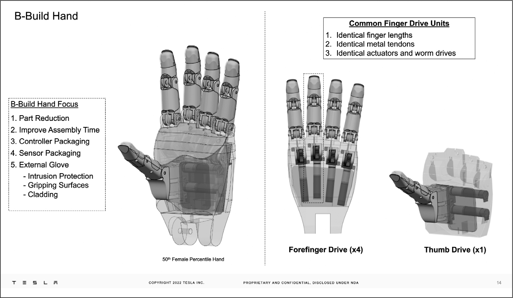
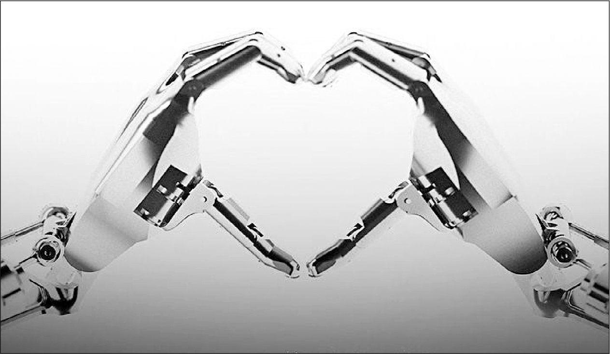

# Chapter 77: Optimus Prime: Tesla, 2021–2022

# 77 Optimus Prime Tesla, 2021–2022

A slide showing components of Optimus’s hand

The robot making a heart, the logo for AI Day 2

## Human touch

When Musk announced his plans to build Optimus in August 2021, an actress dressed in a white body suit tottered around the stage emulating a robot. A few days later, Tesla’s design chief, Franz von Holzhausen, convened a group to begin building the real thing: a robot that could emulate a human.

Musk gave one directive: it was to be a *humanoid* robot. In other words, it was supposed to look like a person rather than a mechanical contraption with wheels or four legs like Boston Dynamics and others were making. Most workspaces and tools are designed to accommodate the way humans do things, so Musk believed that a robot should approximate human forms in order to operate naturally. “We want to make it as human as possible,” von Holzhausen told the ten engineers and designers seated around his conference table. “But we can also add improvements to what humans can do.”

They started with the hand. Von Holzhausen picked up a power drill, and they studied how the fingers and heel of the palm interacted with it. At first it seemed sensible to consider making a hand with four fingers, since the pinky didn’t seem necessary. But in addition to looking creepy, that turned out not to be quite as functional. Instead, they decided to elongate the pinky, so that it was more useful. But they also did one simplification: they could make each finger with two joints, not three.

Another improvement was to make the bottom of the palm longer so that it could wrap around a power tool, relieving the thumb from bearing as much of the load. That would make Optimus’s hand more powerful than a human’s. They also considered even more innovative bionic tactics, such as having strong magnets in the tip of each finger. That idea was rejected; too many devices could get messed up by magnets.

Perhaps the fingers could flap away from the palm, not just toward it? Maybe the wrist should be able to hinge farther back, as well as forward? Everyone at the table started flapping their hands and wrists to see what that would mean. “That would be useful if the robot needed to push against a wall,” said von Holzhausen. “It could do it without putting pressure on the fingers.” Someone suggested that the hand could be made to go so far back that the fingers touched the arm. That would allow the arm to apply pressure to something without the hand even being involved. “Wow,” said von Holzhausen, “but people would get a bit freaked out. Let’s not go that far.”

“Now the challenging part,” von Holzhausen said near the end of the two-hour meeting. “How do we make this sausage look good?” He doled out assignments for what they would show Musk at the weekly review meetings. “Start with figuring out what the fingers will look like and how they will taper, especially since we’re going to elongate the pinky. Elon wants feminine tapers for the fingers.”

## Young Frankenstein

Human bodies, Musk and his engineers discovered, are amazing. For example, at one of the weekly meetings, they discussed how our fingers not only apply pressure to things; they also could feel pressure. How could they best make Optimus’s fingers assess pressure? “We could look at the current in the actuator of the finger joint, which will correlate to the pressure being applied to the tip,” one engineer suggested. Another thought of putting capacitors in the fingertips, like in a touch screen, or perhaps a barometric pressure sensor or chip embedded in rubber, or even a tiny camera inside a gel fingertip. “What are the differences in cost?” von Holzhausen asked. They decided that measuring the pressure using current flow in the actuator of the joint would be most effective because it wouldn’t add parts.

No matter how hectic his schedule, Musk tried to make the weekly Optimus design sessions. For one of them in February, he was at the VIP room in the Miami Marlins’ stadium attending a listening party hosted by Kanye West, known as Ye, for his new album, *Donda 2*. He was standing with rappers French Montana and Rick Ross, eating tacos and talking about cryptocurrency, when he got a text from Omead Afshar reminding him about the 9 p.m. Optimus meeting. Musk dialed in, leaving his phone camera on, unintentionally allowing the Optimus team to witness the party in the background. Members of Ye’s VIP posse gave Musk curious glances as he paced around the room wiggling his fingers and discussing the number of actuators that would be needed to give Optimus’s hands enough dexterity. “It needs to be able to pick up a pencil from any angle,” Musk said. One rapper in the background nodded and started wiggling his fingers.

Sometimes the Optimus meetings rambled on for more than two hours as Musk considered ideas large and small. “Maybe the robots could swap their arms with different tools,” someone suggested. Musk rejected that. At another meeting, he asked whether there should be a screen where the face would be. “It can be display only,” he said. “It doesn’t need to be a touch screen. But you should be able to know what it’s doing from afar.” They decided it was a good idea, but not necessary for the first iteration of Optimus.

The discussions often elicited Musk’s futuristic fantasies. The team prepared a video simulation of Optimus working in a colony on Mars, which led to a lengthy discussion about whether the robots on Mars would be working on their own or under the direction of human supervisors. Von Holzhausen tried to bring things back to Earth. “I think the Mars simulation is fun,” he finally interjected, “but we should do one that shows the robots working in one of our factories, maybe performing the repetitive tasks that no one wants to do.” At another meeting they discussed whether they could put an Optimus in the driver’s seat of a Robotaxi to meet the legal requirements of a car needing a driver. “Do you remember the original *Blade Runner* movie did something like that,” Musk said. “Also the most recent *Cyberpunk* game.” He liked taking the fiction out of science fiction.

Other ideas seemed more influenced by the silly side of Musk’s limbic system. “Maybe we should have the charger cord plug into the butt,” he joked at one point. After a few loud laughs, he rejected the idea. “The giggle factor would be too high,” he said. “For humans, orifices are a big deal.”

“This is reminding me of *Young Frankenstein*,” he said at one point, referring to the Mel Brooks movie parody. “It’s epic.” But that triggered a more serious discussion of how to make sure that the robots did not turn into monsters, which was the original impulse that led Musk into the field of artificial intelligence and robotics. At one meeting he went over the “stop command path,” which would give a human the ultimate power to override a robot. “There can’t be a scenario where somebody could gain access to the mothership and take control of the robots in a way that’s malicious,” he said, ruling out the use of any electronic signals that could be hacked. Citing Asimov’s rules of robotics, he game-planned strategies that would allow humans to prevail over “deadly robot armies.”

---

Even as he envisioned futuristic scenarios, Musk focused on making Optimus a business. By June 2022, the team had completed a simulation of robots carrying boxes around a factory. He liked the fact that, as he put it, “our robots are going to work harder than humans work.” He came to believe that Optimus would become a main driver of Tesla profits. “The Optimus humanoid robot,” he told analysts, “has the potential to be more significant than the vehicle business.”

With these profits in mind, Musk pushed the Optimus team to create a detailed chart of any functionality they wanted and the cost of manufacturing it at scale. For example, one spreadsheet looked at the three ways a human wrist can move: it can wave the hand up and down, move it to the left or right, or rotate. Achieving two of these “degrees of freedom,” the engineers calculated, would mean that each wrist would cost $712. Adding extra actuators to achieve three degrees of freedom would bring the cost to $1,103. Musk marveled as he studied the ways his wrist could move and which muscles were involved. He then said the robot should have the same capability as a human. “The answer is we want the three degrees of freedom, so we have to figure out how we get there more efficiently,” he said. “This is a shitty design. I eyeball it and it looks terrible. Use the damn lift gate actuators from our cars, which we know how to make cheaply.”

Every week he went over the most recent timetables and expressed, often rather strongly, his dissatisfaction. “Pretend we are a startup about to run out of money,” he said at one of these sessions. “Faster. Faster! Please mark anytime a date has slipped. All bad news should be given loudly and often. Good news can be said quietly and once.”

## Walking

One of the most difficult challenges was getting Optimus to walk. X was then almost two and learning to do the same, and Musk kept comparing how humans and machines learn. “At first kids walk flatfooted, then they begin walking on their toes, but they still walk like a monkey,” he said. “It takes them quite a while before they walk like an adult. The gait is rather complicated.”

In March the team opened their weekly meeting with a video celebrating a milestone: “First steps on the ground!” By April they had conquered the next level: getting Optimus to walk while carrying a box. “But we have not been able to coordinate the arms and legs to keep it in balance,” an engineer said. One problem was that the head had to swivel for the robot to see its surroundings. “If we put in several cameras,” Musk suggested, “we won’t need to swivel the head.”

Musk brought some toys, including a robot that could follow a person with its eyes and another that could break-dance, to one of the design reviews in mid-July. He believed that toys could offer lessons; a little model car had inspired him to make real cars using big casting presses, for example, and Legos helped him understand the importance of precision manufacturing. Optimus was standing in the middle of the workshop supported by a gantry. It slowly walked around him and deposited a box it was carrying. Musk then took the joystick controller and guided Optimus to pick up the box and hand it to von Holzhausen. After Optimus finished, Musk gave a gentle push to its chest to see if it would fall over. The stabilizers worked; it stayed upright. Musk nodded appreciatively and shot some video of Optimus. “Whenever Elon pulls out his phone to take a video, you know that you’ve impressed him,” Lars Moravy says.

Afterward, Musk announced that they would hold a public demonstration that would feature Optimus, Full Self-Driving, and Dojo. “In all of these,” he said, “we’re tackling the huge task of creating artificial general intelligence.” The event would be at Tesla’s Palo Alto headquarters on September 30, 2022, and be called AI Day 2. His design team created a logo that showed Optimus touching together its beautifully tapered fingers to form the shape of a heart.

