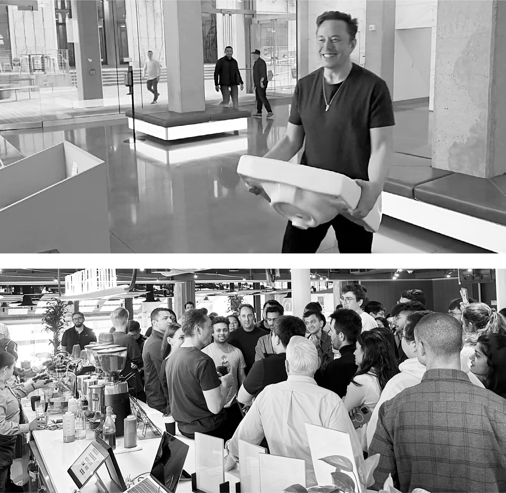

# Chapter 81: “Let that sink in”: Twitter, October 26–27, 2022

# 81 “Let that sink in” Twitter, October 26–27, 2022

Entering Twitter headquarters and visiting the coffee bar on the tenth floor

## Clash of cultures

In the days leading up to his takeover of Twitter at the end of October 2022, Musk’s moods fluctuated wildly. “I am very excited about finally implementing X.com as it should have been done, using Twitter as an accelerant!” he texted me out of the blue at 3:30 one morning. “And, hopefully, helping democracy and civil discourse while doing so.” It could become the combination of financial platform and social network he had envisioned twenty-four years earlier for X.com, and he decided to rebrand it with that name, which he loved. A few days later, he was more somber. “I will need to live at Twitter HQ. This is a super tough situation. Really bumming me out :( Sleep is difficult.”

He scheduled a visit to Twitter headquarters in San Francisco for Wednesday, October 26, to poke around and prepare for the official closing of the deal later that week. Parag Agrawal, Twitter’s mild-mannered CEO, stood in the conference-floor lobby on the second floor, preparing to greet him. “I have a lot of optimism,” he said as he awaited Musk’s entrance. “Elon can inspire people to do things bigger than themselves.” He was being guarded, but I think he believed it. The CFO, Ned Segal, whose tense meeting with Musk in May had gone badly, stood next to him looking more skeptical.

Then Musk burst in carrying a sink and laughing. It was one of those visual puns that amuses him. “Let that sink in!” he exclaimed. “Let’s party on!” Agrawal and Segal smiled.

Musk seemed amazed as he wandered around Twitter’s headquarters, which was in a ten-story Art Deco former merchandise mart built in 1937. It had been renovated in a tech-hip style with coffee bars, yoga studio, fitness room, and game arcades. The cavernous ninth-floor café, with a patio overlooking San Francisco’s City Hall, served free meals ranging from artisanal hamburgers to vegan salads. The signs on the restrooms said, “Gender diversity is welcome here,” and as Musk poked through cabinets filled with stashes of Twitter-branded merchandise, he found T-shirts emblazoned with the words “Stay woke,” which he waved around as an example of the mindset that he believed had infected the company. In the second-floor conference facilities, which Musk commandeered as his base camp, there were long wooden tables filled with earthy snacks and five types of water, including bottles from Norway and cans of Liquid Death. “I drink tap water,” Musk said when offered one.

It was an ominous opening scene. One could smell a culture clash brewing, as if a hardscrabble cowboy had walked into a Starbucks.

The issue was not merely the facilities. Between Twitterland and the Muskverse was a radical divergence in outlook that reflected two different mindsets about the American workplace. Twitter prided itself on being a friendly place where coddling was considered a virtue. “We were definitely very high-empathy, very caring about inclusion and diversity; everyone needs to feel safe here,” says Leslie Berland, who was chief marketing and people officer until she was fired by Musk. The company had instituted a permanent work-from-home option and allowed a mental “day of rest” each month. One of the commonly used buzzwords at the company was “psychological safety.” Care was taken not to discomfort.

Musk let loose a bitter laugh when he heard the phrase “psychological safety.” It made him recoil. He considered it to be the enemy of urgency, progress, orbital velocity. His preferred buzzword was “hardcore.” Discomfort, he believed, was a good thing. It was a weapon against the scourge of complacency. Vacations, flower-smelling, work-life balance, and days of “mental rest” were not his thing. Let that sink in.

## Very hot coffee

That Wednesday afternoon, even though he had not yet closed on his purchase, Musk held product-review meetings. Tony Haile, a British director of product who had been a cofounder of a startup that tried to sell subscriptions to an online news bundle, asked about getting users to pay for journalism. Musk said he liked the idea of having easy small payments a user could make to watch video or read a story. “We want to build a way to have media makers get paid for their work,” he said. He had privately come to the conclusion that Twitter’s biggest competitor was going to be Substack, the online platform that journalists and others were using to publish content and get paid by users.

During a break in the sessions, Musk decided to wander through the building to meet employees. His Twitter sherpa looked nervous and told him that not many people were around because employees liked to work from home. It was a Wednesday mid-afternoon, but the workspaces were almost deserted. Finally, when he got to the tenth-floor espresso bar, he found a couple dozen employees looking hesitant and keeping their distance. With some encouragement from the sherpa, they eventually gathered around.

“Could you put it in the microwave and heat it up to super-hot?” he asked when he got his coffee. “If it’s not super-hot, I chug it too fast.”

Esther Crawford, who led development of early-stage products, was eager to describe her ideas for a wallet on Twitter that could be used for making small payments. Musk suggested that the money in it could be in a high-yield account. “We need to make Twitter the number-one payment system in the world, like I wanted to do at X.com,” he said. “If you have a wallet connected to a money-market account, that’s the key piece that makes the crystal glow.”

Also speaking up, though somewhat reticently, was a young midlevel engineer, born in France, named Ben San Souci. “Can I give you an idea in nineteen seconds?” he asked. It was about ways to crowd-source moderation of hate speech. Musk interjected with his idea for giving each user a slider they could manipulate to determine the intensity of tweets they were shown. “Some will want teddy bears and puppies, others will love combat and say ‘Bring it all on.’ ” It wasn’t quite the point San Souci was making, but when he started to follow up, a woman tried to say something and he did a surprising thing for a tech bro: he deferred to her. She asked the question that was hovering in the air: “Are you going to fire seventy-five percent of us?” Musk laughed and paused. “No, that number didn’t come from me,” he answered. “This unnamed sources bullshit has to stop. But we do face a challenge. We are headed to recession, and revenue is below cost, so we have to find ways to bring in more money or reduce costs.”

It wasn’t exactly a denial. Within three weeks, that 75 percent estimate would turn out to be accurate.

---

When Musk got back down to the second floor from the coffee bar, three of its conference rooms were filling up with a mercenary force of loyal engineers from Tesla and SpaceX who, at Musk’s direction, were combing through Twitter’s code and sketching org charts on the whiteboards to determine which employees were worth keeping. Another two rooms were occupied by his platoon of bankers and lawyers. They seemed girding for battle.

“Have you spoken to Jack?” Gracias asked Musk. Twitter’s cofounder and former CEO Jack Dorsey had been initially supportive of Musk buying the company, but in the past few weeks had become unnerved by the controversy and drama. Musk, he worried, was going to gut his baby. He wasn’t sure he wanted to condone that. More significantly, he was balking at allowing his stock in Twitter to be rolled over into equity in the new Musk-controlled private company. If he didn’t roll over his stock, it could be bad for Musk’s financing plans. Musk had called him almost daily over the past week, reassuring Dorsey that he truly loved Twitter and wouldn’t harm it. Finally, he made a deal with Dorsey: if he rolled over his stock, Musk would pledge to pay him full price in the future if he ever needed the money. “He’s agreed to fully roll,” Musk said. “We are still friends. He worries about liquidity in the future, so I gave him my word at $54.20.”

Late in the afternoon, Agrawal quietly walked into the second-floor lounge area and found Musk. They would be maneuvering like gladiators the next night, but at this moment both feigned casual collegiality.

“Hi,” Agrawal said gently. “How was your day?”

“My brain is full,” Musk answered. “It will take a night of sleep to turn the data into something.”

