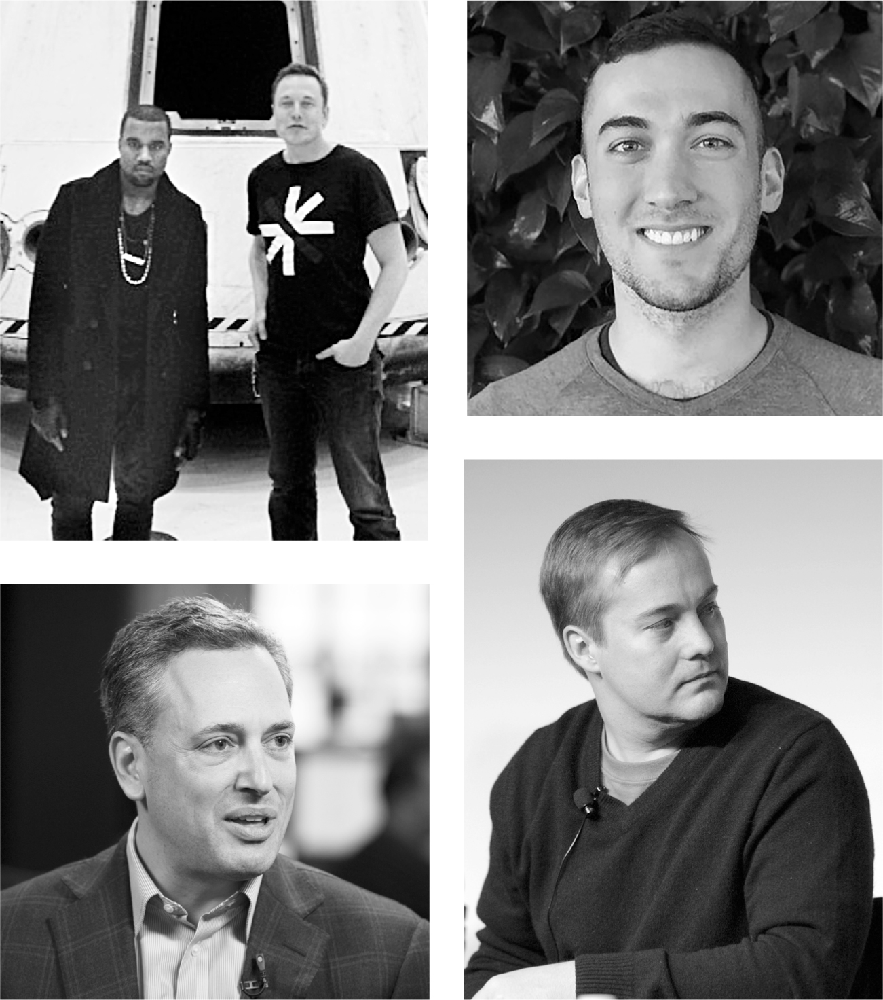

# Chapter 84: Content Moderation: Twitter, October 27–30, 2022

# 84 Content Moderation Twitter, October 27–30, 2022

*Clockwise, from top left:* With Kanye West at SpaceX; Yoel Roth; Jason Calacanis; David Sacks

[*OceanofPDF.com*](https://oceanofpdf.com)

## Council of one

The musician and fashion designer Ye, formerly known as Kanye West, was a friend of Musk, sort of, in that odd way that the word is sometimes applied to celebrity party-pals who share energy and limelight but little intimacy. Musk gave Ye a tour of the SpaceX factory in Los Angeles in 2011. A decade later, Ye paid a visit to Starbase in south Texas and Musk went to his *Donda 2* party in Miami. They had certain traits in common, including being unfiltered, and they were both thought to be half-crazy, though in Ye’s case that description would eventually seem to be only half-right. “Kanye’s belief in himself and his incredible tenacity got him to where he is today,” Musk said in *Time* in 2015. “He fought for his place in the cultural pantheon with a purpose. He’s not afraid of being judged or ridiculed in the process.” Musk could have been describing himself.

Early in October, a few weeks before Musk closed the Twitter deal, Ye and his models wore “White Lives Matter” T-shirts at a fashion show, which spun into a social media firestorm culminating with a tweet from Ye proclaiming, “When I wake up I’m going death con 3 On JEWISH PEOPLE.” Twitter then banned him. A couple of days later, Musk tweeted, “Talked to Ye today & expressed my concerns about his recent tweet, which I think he took to heart.” But the musician remained banned.

Ye’s Twitter saga would end up teaching Musk a series of lessons about the complexity of free speech and the downsides of impulsive policymaking. Alongside the layoff decisions, the issue of content moderation dominated Musk’s first week at Twitter.

He had been waving the banner of free speech, but he was learning that his views were too simplistic. On social media, a lie can travel halfway around the world while the truth is still putting on its shoes. Disinformation was a problem, as were crypto scams, fraud, and hate speech. There was also a financial problem: jittery advertisers did not want their brands to be in a toxic-speech cesspool.

In early October, a few weeks before he was due to take over Twitter, Musk had raised in one of our conversations the idea of creating a content moderation council that would decide these issues. He wanted diverse voices on it from around the world, and he described the type of members he had in mind. “I won’t make any decisions about who to reinstate until the council is up and running,” he told me.

He made that pledge publicly on Friday, October 28, the day after his Twitter purchase closed. “No major content decisions or account reinstatements will happen before that council convenes,” he tweeted. But it was not in his nature to cede control. He had already begun diluting the idea. The council’s opinions would be purely “advisory,” he told me. “I have to make the ultimate calls.” As he wandered among the meeting rooms that afternoon, discussing layoffs and product features, it was clear that he was losing interest in creating the council. When I asked him if he had decided who might be on it, he said, “No, it’s not really a priority now.”

## Yoel Roth

When Musk fired Twitter’s chief legal officer Vijaya Gadde, the task of dealing with content moderation, and the equally difficult task of dealing with Musk, fell to a somewhat academic but cheerful, fresh-faced thirty-five-year-old named Yoel Roth. It was an awkward fit. Roth was a left-leaning Democrat who had left a trail of anti-Republican tweets. “I’ve never donated to a presidential campaign before, but I just gave $100 to Hillary for America,” he posted in 2016, the year after he joined the company’s trust and safety team. “We can’t f—k around anymore.” On election day 2016, he mocked Trump supporters by tweeting, “I’m just saying, we fly over those states that voted for a racist tangerine for a reason.” After Trump became president, he tweeted, “ACTUAL NAZIS IN THE WHITE HOUSE,” and he called Mitch McConnell a “personality-free bag of farts.”

Nevertheless, Roth had a combination of optimism and eagerness that caused him to hope that he could work with Musk. They first met on the crazed Thursday afternoon when Musk was pulling off the flash-closing of his Twitter deal. At 5 p.m., Roth’s phone rang. “Hi, this is Yoni,” the caller said. “Can you please come over to the second floor? We need to talk.” Roth did not know who Yoni was, but he headed through the forlorn Halloween party that was underway and arrived at the big open space of the conference areas where Musk, his bankers, and the musketeers were bustling about.

There he was greeted by Yoni Ramon, a short, energetic, long-haired Tesla information security engineer, originally from Israel. “I’m Israeli myself, so I could tell he was Israeli,” Roth says. “But otherwise I had no idea who he was.”

Musk had given Ramon the task of preventing any disgruntled Twitter employees from sabotaging the service. “Elon is absolutely paranoid, and with reason, that some angry employee is going to disrupt things,” he told me just before Roth arrived. “He’s made it my job to stop it.”

When they sat at a table in the open area, near the buffet of bottled waters, Ramon began by asking Roth, with no explanation, “How do I get access to Twitter’s tools?”

It was still unclear to Roth who this guy was. “There’s a lot of restrictions on who gets access to Twitter tools,” he replied. “There’s a lot of privacy considerations.”

“Well there’s been a corporate transition,” Ramon said. “I work for Elon and we need to secure things. At least show me what the tools look like.”

Roth thought that was reasonable. He pulled out his laptop and showed Ramon the content moderation tools that Twitter used and recommended some measures they could take to guard against an insider threat.

“Can you be trusted?” Ramon suddenly said, looking Roth in the eye. Roth, taken aback by the earnestness, said yes.

“Okay, I’m going to go and get Elon,” Ramon said.

A minute later, Musk emerged from the war room where the deal had just closed, sat at one of the round tables in the lounge, and asked for a demonstration of the security tools. Roth pulled up Musk’s own account and showed what Twitter’s tools could do with it.

“Access to those tools should be restricted to just one person for now,” Musk said.

“I did that yesterday,” Roth replied. “The one person is me.” Musk nodded silently. He seemed to like how Roth was handling things.

He then asked Roth for the names of ten people “you would trust with your life” who should be given access to the highest-level tools. Roth said he would make a list. Musk stared him in the eye. “I mean, trust with your life,” he said. “Because if they do something wrong, they’re fired and you’re fired and your entire team is fired.” Roth thought to himself that he was familiar with how to deal with that type of boss. He nodded and headed back to his office.

## The Bee in his bonnet

The first sign of trouble for Yoel Roth came the next morning, Friday, when he got a text from Yoni Ramon saying that Musk wanted to reinstate the *Babylon Bee*, a conservative humor site that Musk liked. The site had been banned under Twitter’s “misgendering” policy for satirically anointing Rachel Levine, a transgender woman in the Biden administration, “Man of the Year.”

Roth was familiar with Musk’s mercurial reputation, so he expected him to pop some impulsive decision at some point. He thought it would be about Trump, but his request to reinstate the *Babylon Bee* raised the same issue. Roth’s goal was to prevent Musk from doing reinstatements unilaterally in an arbitrary manner. In other words, he was hoping to prevent Musk from being Musk.

Roth had met that morning with Musk’s lawyer, Alex Spiro, who was now managing policy issues. “If you ever need something or anything crazy comes up, call me directly,” Spiro told him. So Roth did.

After explaining Twitter’s misgendering policy, and saying that the *Babylon Bee* refused to delete the offending tweet, Roth said there were three options: keep the *Bee* banned, get rid of the rule against misgendering, or simply reinstate the *Bee* arbitrarily without wringing hands about policies and precedents. Spiro, who knew how Musk operated, chose option three. “Why can’t he just do that?” he asked.

“Well, he can,” Roth conceded. “He bought the company, and he can make whatever decisions he wants.” But that could cause problems. “What do we do when another user does the same thing and our rules are enforced? You have a consistency problem.”

“Okay, then, should we change the policy?” Spiro asked.

“You can do that,” Roth answered. “But you should know this is a major culture war issue.” There was a lot of advertiser concern about how Musk was going to handle content moderation. “If the very first thing that he does is remove Twitter’s hateful conduct policy related to misgendering, I don’t believe it will go well.”

Spiro thought about it, then said, “We need to talk to Elon about this.” As they were leaving the room, Roth got another message. “Elon wants to reinstate Jordan Peterson.” Peterson, a Canadian psychologist and author, had been suspended from Twitter earlier in the year for insisting on referring to a transgender male celebrity as a woman.

Musk stepped out of one of the conference rooms an hour later to meet with Roth and Spiro. They stood in the public snack-bar area with people milling around, which made Roth uncomfortable, but he launched into the issue of random reinstatements. “Well, what about the concept of a presidential pardon?” Musk asked. “That’s in the Constitution, right?”

Roth, who could not tell if he was joking, conceded that Musk had the right to issue random pardons, but asked, “What if somebody else does the same thing?”

“We’re not changing the rules, we’re granting them a pardon,” Musk replied.

“But on social media, it doesn’t exactly work that way,” said Roth. “People test the rules, especially on this issue, and they’re going to want to know if Twitter’s policy has changed.”

Musk paused for a while and decided to back off a bit. He was familiar with the issue. His own child had transitioned. “Look, I want to be clear, I don’t think misgendering people is cool. But it’s not sticks and stones, like if you threaten to kill somebody.”

Roth was again pleasantly surprised. “I actually agreed with him,” he says. “Even though I had a reputation of being the censorship brigade, it was actually my long-standing view that Twitter removed too much speech when there were other, less invasive options available.” Roth put his laptop on a counter to show some ideas he was developing to put warning messages on tweets rather than deleting them or banning users.

Musk nodded enthusiastically. “That sounds like exactly what we should do,” he said. “These problem tweets shouldn’t show up in search. They shouldn’t show up in your timeline, but like, if you navigate to somebody’s profile, maybe you see them.”

For more than a year, Roth had been working on such a plan for downplaying the reach of certain tweets and users. He saw it as a way to avoid banning controversial users outright. “One of the biggest areas I’d love research on is non-removal policy interventions like disabling engagements and de-amplification/visibility filtering,” he wrote in a Slack message to his Twitter team in early 2021. Ironically, when that message emerged as part of Musk’s transparency data dump known as “the Twitter Files” in December 2022, it was seen as a smoking-gun confirmation that conservatives had been subjected to “shadow banning” by liberals at Twitter.

Musk approved Roth’s idea of using “visibility filtering” to de-amplify problematic tweets and users as an alternative to permanent bans. He also agreed to hold off on reinstating the *Babylon Bee* or Jordan Peterson. “Instead,” Roth suggested, “why don’t we take a couple of days to build a version of what this de-amplification system could be.” Musk nodded. “I can do this for you by Monday,” Roth promised.

“Sounds good,” Musk said.

## Sacks and Calacanis

Yoel Roth was having lunch with his husband the next day, a Saturday, when he got a call telling him to come to the office. David Sacks and Jason Calacanis wanted to ask him some questions. “You should do it,” a friend at Twitter advised, knowing the importance of those two. So he drove from Berkeley, where he lived, across the Bay to Twitter headquarters.

Musk was staying that week at Sacks’s five-story house in San Francisco’s Pacific Heights. They had known each other since their days at PayPal. Even back then, Sacks was an outspoken libertarian and free speech advocate. His disdain for wokeness pushed him toward the right, though with a populist-nationalist edge that made him a skeptic of American interventionism.

At a fiftieth birthday dinner for internet entrepreneur and fellow libertarian Sky Dayton in Tuscany in 2021, Sacks and Musk discussed how big tech companies were colluding to restrict free speech online. Sacks had a populist take, arguing that a “speech cartel” of corporate elites was weaponizing censorship to keep down outsiders. Grimes pushed back, but Musk generally sided with Sacks. He had not focused much on speech and censorship until then, but the issue resonated with his growing anti-woke sentiments. When Musk took over Twitter, Sacks became a fixture there, helping to coordinate meetings and offering advice.

His friend and poker buddy Jason Calacanis, with whom he did a weekly podcast, was a Brooklyn-born internet startup jockey and eager-beaver Musk sidekick. He had a boyish enthusiasm that contrasted with Sacks’s dour reticence, and he was more politically moderate. When Musk made his first moves on Twitter in April, Calacanis texted his excitement about helping. “Board member, advisor, whatever… you have my sword,” he wrote. “Put me in the game coach! Twitter CEO is my dream job.” His eagerness occasionally drew a brushback from Musk, such as when he created a financial special purpose vehicle to line up investments in Musk’s Twitter bid. “What is going on with you marketing an SPV to randos?” Musk texted. “This is not ok.” Calacanis apologized and backed off. “This deal has just captured the world’s imagination in an unimaginable way. It’s bonkers…. I’m ride or die brother—I’d jump on a grenade for you.”

---

When Roth arrived at headquarters to see Sacks and Calacanis, a crisis was unfolding. Twitter was being inundated with racist and anti-Semitic posts. Musk had declared his opposition to censorship, and now swarms of trolls and provocateurs were testing the limits. Use of the N-word went up 500 percent in the twelve hours after Musk took control. Unfettered free speech, the new team quickly discovered, had a downside.

Roth knew that Sacks had read the stories about his leftward leanings, so he was surprised at how polite and solicitous he was. They discussed the data about the hateful onslaught and what tools they had to deal with it. Roth explained that most were not from individual users expressing personal opinions; instead, most were the result of organized troll and bot assaults. “It was clearly a coordinated thing,” Roth says, “not just actual people being more racist.”

After about an hour, Musk wandered into the conference room. “So what’s going on with this racist stuff?” he asked.

“It’s a troll campaign,” Roth said.

“Burn that stuff down right away,” Musk said. “Nuke it.” Roth was thrilled. He thought Musk would oppose any attempts at moderation. “Hate speech has no place on Twitter,” Musk continued, as if making a pronouncement for the record. “Can’t do it.”

Calacanis told Roth that he was very good at explaining the situation. “Why don’t you post some tweets about it?” he asked. So Roth posted a thread. “We’ve been focused on addressing the surge in hateful conduct on Twitter,” he wrote. “More than 50,000 tweets repeatedly using a particular slur came from just 300 accounts. Nearly all of these accounts are inauthentic. We’ve taken action to ban the users involved in this trolling campaign.”

Musk retweeted Roth’s posts and added his own that was intended to reassure advertisers who were starting to flee Twitter. “To be super clear,” he tweeted, “we have not yet made any changes to Twitter’s content moderation policies.”

As he does with people he considers his inner circle, Musk began texting Roth regularly with questions and suggestions. Even when a spate of new stories appeared rehashing Roth’s leftist tweets from five years earlier, Musk supported him, both privately and publicly. “He told me that he thought some of my old tweets were funny, and he was genuinely supportive even though a lot of conservatives were calling for my head,” Roth says. Musk even responded to one conservative on Twitter with a defense of Roth. “We’ve all made some questionable tweets, me more than most, but I want to be clear that I support Yoel,” he wrote. “My sense is that he has high integrity, and we are all entitled to our political beliefs.”

Even though Musk had not quite figured out how to pronounce his name (Yo-El), it seemed like this might be the beginning of a beautiful friendship.

[*OceanofPDF.com*](https://oceanofpdf.com)
