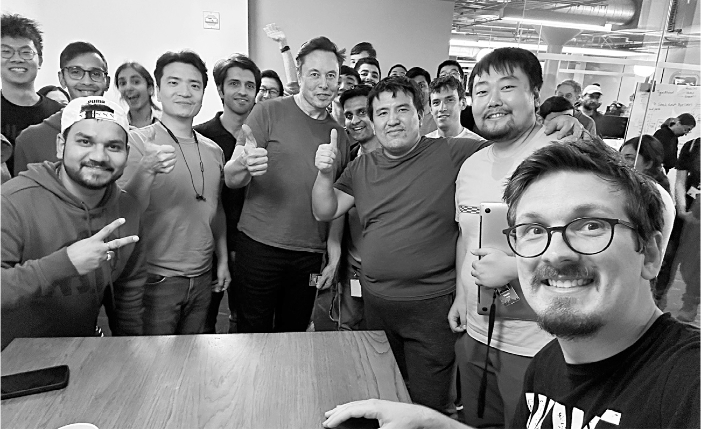

# Chapter 87: All In: Twitter, November 10–18, 2022

# 87 All In Twitter, November 10–18, 2022

Christopher Stanley, far right, taking a selfie with Musk and engineers after a hackathon

Ross Nordeen and James Musk

## Moving in

The Twitter Blue rollout, which Musk thought would be the elixir to save the company, was now on hold, and the collapse of ad sales showed no signs of abating. New rounds of layoffs that would cut staff again were being planned. Those who remained would have to be as maniacally driven as the engineers at Tesla and SpaceX. “I’m a big believer that a small number of exceptional people who are highly motivated can do better than a large number of people who are pretty good and moderately motivated,” he told me at the end of that painful second week at Twitter.

If he wanted the survivors at Twitter to be hardcore, he was going to have to show them how hardcore he could be. He had slept on the floor of his first office at Zip2 in 1995. He had slept on the roof of Tesla’s Nevada battery factory in 2017. He had slept under his desk at the Fremont assembly plant in 2018. It wasn’t because it was truly necessary. He did it because it was in his nature to love the drama, the urgency, and the sense that he was a wartime general who could rally his troops into battle mode. Now it was time for him to sleep at Twitter headquarters.

When he arrived back from a weekend trip to Austin late on the night of Sunday, November 13, he went straight to the Twitter office and commandeered a couch in a seventh-floor library. Steve Davis, his fix-it chief, had come to Twitter to oversee cost-cutting. Along with his wife Nicole Hollander and two-month-old baby, Davis moved into a conference room nearby. Twitter’s cushy headquarters had showers, a kitchen, and a game room. They joked that it was all quite luxurious.

## The second round

As he was flying into San Francisco that Sunday night, Musk called his cousin James and told him that he and his brother Andrew needed to report to duty and meet him at Twitter when he arrived. It was Andrew’s birthday, and they were out to dinner with friends. But they both came in. “People at the company were shit-posting things about Elon, and he said he needed a few of us there he could trust,” James says.

Ross Nordeen, the third musketeer, was already there. He had been in the office all weekend, reviewing the code of Twitter engineers to see who was good and bad. After subsisting mainly on crackers for two weeks, his skinny frame now looked skeletal. That Sunday, he fell asleep in the company’s fifth-floor game room. When he woke up Monday morning and heard that Musk was intent on making more deep cuts, his stomach churned. “I just felt like shit that we were going to fire another eighty percent of the company.” He went to the bathroom and vomited. “I just woke up and puked,” he says. “I had never done that before.”

He walked to his apartment to shower and think things over. “I went out and felt I didn’t want to be here now,” he says. But by noon he decided he would not abandon the team, so he returned. “I didn’t want to let down James.”

---

The musketeers, joined by Dhaval Shroff and other young loyalists, set up a war room, known as “the hot box,” in a stifling tenth-floor windowless room near the big conference room that Musk was now using. They could feel the resentment from many of the Twitter employees, who had dubbed them “the goon squad.” But a handful of dedicated Twitter engineers, such as Ben San Souci, wanted to be part of the new order of battle, and they joined the musketeer team in the floor’s open workspace.

Musk met with the musketeers early that afternoon. “We got a shit-show here,” he told them. “I’d be surprised if there were three hundred excellent engineers in this company.” They needed to cut down to that muscle, which meant firing close to another 80 percent.

There was some pushback. The World Cup was coming up, along with Thanksgiving and its big shopping days. “We can’t afford to go down then,” Yoni Ramon said. James agreed. “I got the sense this could be bad,” he says. Musk got angry. He was adamant that deep cuts were still needed.

The engineers who stayed, he said, had to meet three criteria. They had to be excellent, trustworthy, and driven. The first round of cuts, made the week before, had been designed to weed out those who were not excellent. They agreed that the next priority would be identifying and firing those who were not trustworthy, or more specifically, those who did not seem to be completely loyal to Musk.

The team began going over the Slack messages and social media postings of Twitter employees, focusing on those who had high levels of access to the software stack. “He told us to find the people who might be disgruntled or a threat,” Dhaval says. They searched for keywords, including “Elon,” on the public Slack channel. Musk hung out with them in the hot box, joking about the things they were seeing.

There were occasional moments of amusement. They stumbled across the list of words that were automatically prevented from being trending topics on Twitter. When they got to the word “turdburger,” Musk started laughing so hard that he fell to the floor wheezing. But some of the messages they found, including threats of revenge, inflamed his paranoia. “One guy literally wrote a command that could take down a whole data center and said, ‘I wonder what happens if you run this,’ ” James says. “He posted it.” They immediately cut off his access and fired him.

The messages they read were mainly those in the public portions of Slack, but that still discomforted Ross, who was recovering from his morning nausea. “It seems like we were violating privacy and free speech and all that stuff,” he said later. “They had a culture of shitting on their bosses.” Andrew, who like James was very sensitive to the privacy concerns, said they did not look at private messages. “It’s striking a balance in a company,” he says. “To what extent do you allow dissent?”

Musk did not share these qualms. Unfettered free speech did not extend to the workplace. He told them to root out people who were making very snarky comments. He wanted to rid the workforce of negativity. The team worked past midnight and delivered a list of three dozen malcontents. “Do you want to speak to this person and show them what they’ve said?” James asked. Musk said no. They should be fired. And they were.

## Yes or no?

The next trait Musk wanted to filter for—after excellence and trustworthiness—was drive. For his entire life, he had been hardcore and all in. It was a badge of honor to him. He scorned successful people who liked to take vacations.

James and Ross spent Tuesday thinking of ways to determine which employees were truly driven. Then they saw a post someone had made on Slack. “Please let me go with severance and I will leave,” it said. It dawned on them that they could rely on self-selection. Some people might be happy to work late nights and weekends. But others, understandably, didn’t relish that prospect and were not embarrassed to say so.

James and Ross realized that people were willing, indeed proud to declare what camp they were in. So they suggested to Musk that he give employees the chance to opt out of the new hardcore Twitter. He liked the idea, and Ross engineered a simple form with a button that employees could click to say they wanted to leave on good terms and get three months’ severance. “We were so excited,” James said. “We won’t have to do all this additional firing.”

A couple of hours later, Musk emerged from a meeting and came into the hot box smiling. “I have a great idea,” he said. “We’re flipping it. Don’t make the choice opt-out. Instead, make it opt-in. We want to make it sound like the Shackleton expedition. We want people who declare they are hardcore.”

Musk flew to Delaware late that night to testify in a shareholder lawsuit that challenged his Tesla compensation package. Shortly before 4 a.m. Eastern Time, he tested the opt-in link from the airplane, becoming the first person to say yes to the new Twitter expectations. Then he sent an email to all employees:

> From: Elon Musk
>
> Subj: A Fork in the Road
>
> Date: Nov. 16, 2022
>
> Going forward, to build a breakthrough Twitter 2.0 and succeed in an increasingly competitive world, we will need to be extremely hardcore. This will mean working long hours at high intensity….
>
> If you are sure that you want to be part of the new Twitter, please click yes on the link below. Anyone who has not done so by 5pm ET tomorrow (Thursday) will receive three months of severance.

James and Ross stayed up all night watching the results come in. They put down bets. How many would say yes? James thought it would be 2,000 out of the approximately 3,600 remaining employees. Ross wagered it would be 2,150. Musk chimed in with a low prediction: 1,800 would choose to stay. In the end, 2,492 said yes, a surprisingly high 69 percent of the workforce. Musk’s assistant Jehn Balajadia handed out vodka-spiked Red Bulls to celebrate.

## Code reviews

That Thursday night, a somewhat alarming message went out to Twitter employees. The following day—Friday, November 18—Twitter’s offices would be closed and badge access would be suspended until Monday. The edict came about because of security concerns that the people who had just been fired or had chosen to leave might try to sabotage things. But Musk ignored the email. After working until 1 a.m. Friday morning, he sent out a contradictory message: “Anyone who actually writes software, please report to the 10th floor at 2pm today.” A little later he added, “Please be prepared to do brief code reviews as I’m walking around the office.”

It was confusing. One engineer based in Boston was the only person left on the team in charge of caching important data. He was afraid that if he boarded a plane, the system might go down while he was flying across the country and he’d be unable to fix it. He was also afraid that if he didn’t come in, he would be fired. He flew to San Francisco.

By 2 p.m., almost three hundred engineers had made it to the office, some carrying their suitcases, despite not knowing if their travel was going to be reimbursed. But Musk stayed in meetings all afternoon, ignoring them. There was no food, and by 6 p.m., the engineers were not only irritated but hungry, so Andrew and security engineering director Christopher Stanley went out and got boxes of pizzas. “The mood had gotten edgy by then, and I think Elon was keeping them waiting on purpose,” says Andrew. “The pizza calmed things.”

When Musk finally emerged at 8 p.m., he began what he called “desk-siding,” standing next to the workstations of the young engineers and going over their code. His suggestions, they later said, were sometimes good and at other times shallow. They often involved ways to simplify a process. He also stood with them at whiteboards, where they drew the architecture of the Twitter system. Musk peppered the clusters of engineers with questions. Why does search suck? Why are the ads so irrelevant to user interests? It was well after 1 a.m. when he scooped up X and left.

