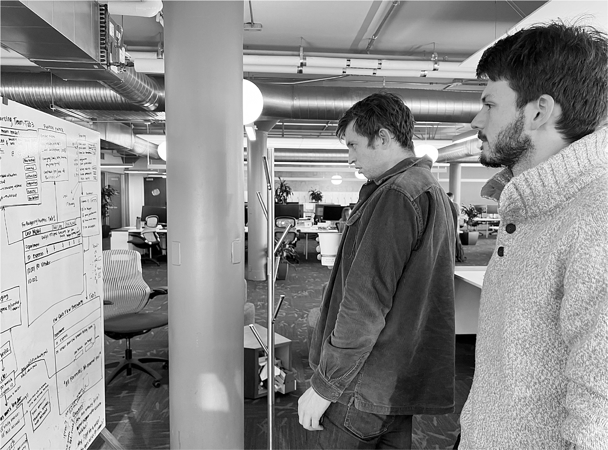

# Chapter 88: Hardcore: Twitter, November 18–30, 2022

# 88 Hardcore Twitter, November 18–30, 2022

James Musk and Ben San Souci

[*OceanofPDF.com*](https://oceanofpdf.com)

## Reinstatements

“Kathy Griffin, Jordan Peterson & Babylon Bee have been reinstated,” Musk tweeted that Friday afternoon, November 18. “Trump decision has not yet been made.” With Yoel Roth and other minders gone, he unilaterally decided to lift the bans not only on the *Bee* and Peterson but also on the progressive comedian Kathy Griffin, who had created an account impersonating Musk and tweeted out parody pronouncements from him.

In making the reinstatements, he announced the “visibility-filtering” policy that he and Roth had devised. “New Twitter policy is freedom of speech, but not freedom of reach,” he wrote. “Negative/hate tweets will be max deboosted & demonetized, so no ads or other revenue to Twitter. You won’t find the tweet unless you specifically seek it out.”

He drew the line at Alex Jones, the conspiracy theorist who claimed that the 2012 Sandy Hook Elementary School shooting was “a giant hoax.” Musk said Jones would stay banned. “My firstborn child died in my arms,” Musk tweeted. “I felt his last heartbeat. I have no mercy for anyone who would use the deaths of children for gain, politics or fame.”

As for Ye, once known as Kanye West, he was still teaching Musk lessons about the complexities of free speech. He appeared on Alex Jones’s podcast and declared, “I love Hitler.” He then posted on Twitter a picture of Musk in a bathing suit being sprayed with a hose by Ari Emanuel, which oozed controlled-by-Jews, anti-Semitic undertones. “Let’s always remember this as my final tweet,” Ye wrote, then posted a swastika inside a Star of David.

“I tried my best,” Musk announced. “Despite that, Ye again violated our rule against incitement to violence. Account will be suspended.”

Then there was the question of whether Donald Trump should be reinstated. “I want to avoid the bullshit disputes about Trump,” Musk had told me a few weeks earlier, emphasizing that his principle had always been to allow free speech only if it was within the bounds of the law. “If he’s engaged in criminal activity—it seems increasingly that he has—that’s not okay,” Musk said. “It’s not free speech to subvert democracy.”

But by November 18—the Friday that he summoned engineers in for code reviews—he was in a feisty mood and ready to reverse himself. James and his musketeers were desperately trying to keep Twitter up and running despite the sudden departure of hundreds of engineers and the strain caused by World Cup videos. The last thing they wanted was another wrench thrown into the system. That is when Musk emerged from a meeting in his glass-walled conference room with Robin Wheeler, who had been hanging on as Twitter’s ad sales chief, and showed James and Ross his iPhone. “Look what I just tweeted,” he said with a mischievous grin.

It was a poll question: “Reinstate former President Trump? Yes. No.” Leaving aside the propriety of lifting the ban on Trump and of letting a free-for-all online poll make the decision, there was the engineering issue. Conducting a poll, where millions of votes would have to be tabulated instantly and populated in real time on user feeds, could push Twitter’s undermanned servers into a meltdown. But Musk relished risk. He wanted to see how fast a car could drive, what happened when you floored it, how close to the sun you could fly. James and Ross were “shitting bricks,” they said, but Musk seemed gleeful.

When the poll closed the next day, more than 15 million users had voted. The tally was close: 51.8 percent to 48.2 percent in favor of reinstating Trump. “The people have spoken,” Musk declared. “Trump will be reinstated. Vox Populi, Vox Dei.”

I asked him right afterward whether he had a sense in advance of how the poll would turn out. No, he said. And if it had gone the other way, would he have kept Trump banned? Yes. “I’m not Trump’s fan. He’s disruptive. He’s the world’s champion of bullshit.”

## Round three

In her meeting with Musk that Friday afternoon, ad sales chief Robin Wheeler told him she was resigning. She had tried to do so a week earlier, at the same time as Yoel Roth, but Musk and Jared Birchall had persuaded her to stay.

Most people, including Ross and James, assumed her resignation was in reaction to Musk’s decision to make unilateral reinstatements and launch a poll about unbanning Trump. But what actually bothered Wheeler more was that Musk was hell-bent on another round of firings, and he demanded that she make a list of who she would let go. Earlier that week, she had stood in front of her sales organization and told them why they should opt in with the “yes” button to be part of the new, demanding Twitter. Now she would have to look some of those same people in the eye, the ones who had said yes, and tell them they were fired.

Musk’s firing and layoff targets kept changing, depending on his mood. At one point he told the musketeers that he wanted to bring the software-writing team down to fifty. At other times that week, he said they should not worry about absolute numbers. “Just make a list of who the really good engineers are and weed out the rest,” he told them.

To facilitate the process, Musk ordered all of Twitter’s software engineers to send him samples of code they had recently written. Over the weekend, Ross worked to get the replies transferred from Musk’s mailbox to his own so that he and James and Dhaval could assess the work. “I have five hundred email submissions in my inbox,” he said wearily on Sunday night. “We’ve somehow got to go through them all tonight to see what engineers should stay.”

Why was Musk doing this? “He believes that a small group of really great generalist engineers can outperform a regular group a hundred times larger,” Ross said. “Like a small battalion of marines that is really tight can do amazing things. And I think he wants to rip the Band-Aid off. He doesn’t want to drag this out.”

Ross, James, and Andrew met with Musk on Monday morning and presented the criteria they had used to assess the submissions. Musk approved the plan and then headed down the stairs with Alex Spiro to the café, where he had hastily called another all-hands employee meeting. As they walked, he asked what he should say if he was questioned about possible additional layoffs. Spiro suggested he deflect the topic, but Musk decided he wanted to say there would be “no more layoffs.” His rationale was that the impending round of exits would be firing people “for cause” because their work was allegedly not good enough, rather than reduction-in-force layoffs, for which people would be due a generous severance. He was making a distinction that most people missed. “There are no more RIFs planned,” he declared at the outset of the meeting, to great applause.

Afterward, he met with a dozen young coders who had been chosen by Ross and James for their excellence. It relaxed him to be talking about engineering, and he drilled down with them on issues such as ways to make video uploads easier. In the future, he told them, the teams at Twitter would be led by engineers like themselves rather than designers and product managers. It was a subtle shift. It reflected his belief that Twitter should be, at its core, a software engineering company, led by people with a feel for coding, rather than a media and consumer-product company, led by people with a feel for human relationships and desires.

## Why so demanding?

The final round of firing notices went out the day before Thanksgiving. “Hi, As a result of the recent code review exercise, it has been determined that your code is not satisfactory, and we regret to inform you that your employment with Twitter will be terminated effective immediately.” Fifty engineers were let go, their passwords and access immediately cut off.

The three rounds of layoffs and firings were so scattershot that it was initially hard to tally up the toll. When the dust settled, about 75 percent of the Twitter workforce had been cut. There were just under eight thousand employees when Musk took over on October 27. By mid-December, there were just over two thousand.

Musk had wrought one of the greatest shifts in corporate culture ever. Twitter had gone from being among the most nurturing workplaces, replete with free artisanal meals and yoga studios and paid rest days and concern for “psychological safety,” to the other extreme. He did it not only for cost reasons. He preferred a scrappy, hard-driven environment where rabid warriors felt psychological danger rather than comfort.

Sometimes that meant he broke things, and it looked like it was possible he would do so with Twitter. A hashtag #twitterdeathwatch began trending. Tech and media pundits wrote their farewells to the service, assuming it would disappear any hour. Even Musk laughingly admitted that he thought it might collapse. He showed me a gif of a flaming dumpster rolling down a road and admitted, “Some days I wake up and look at Twitter to see if it’s still working.” But every morning when he checked, it was running. It made it through record traffic during the World Cup. More than that, with its kernel of driven engineers, it began to innovate and add features faster than it ever had before.

Zoë Schiffer, Casey Newton, and Alex Heath at *The Verge* and *New York Magazine* had produced some well-reported, hair-raising insider stories about the turmoil at Twitter. They showed how Musk had broken “the company culture that built Twitter into one of the world’s most influential social networks.” But they also noted that the dire predictions many of their colleagues had made did not come to pass. “In some ways, Musk was vindicated,” they wrote. “Twitter was less stable now, but the platform survived and mostly functioned even with the majority of employees gone. He had promised to right-size a bloated company, and now it operated on minimal head count.”

It was not always a pretty sight. Musk’s method, as it had been since the Falcon 1 rocket, was to iterate fast, take risks, be brutal, accept some flameouts, then try again. “We were changing the engines while the plane was spiraling out of control,” he says of Twitter. “It’s a miracle we survived.”

## Apple visit

“Apple has mostly stopped advertising on Twitter,” Musk tweeted at the end of November. “Do they hate free speech in America?”

That evening, Musk had one of his regular long phone conversations with his mentor and investor Larry Ellison, who was then living mainly on Lanai, the island he owned in Hawaii. Ellison, who had been a mentor of Steve Jobs, gave Musk a piece of advice: he should not get into a fight with Apple. It was the one company that Twitter could not afford to alienate. Apple was a major advertiser. More importantly, Twitter could not survive unless it continued to be available in the iPhone’s App Store.

In some ways, Musk was like Steve Jobs, a brilliant but abrasive taskmaster with a reality-distortion field who could drive his employees crazy but also drive them to do things they thought were impossible. He could be confrontational, with both colleagues and competitors. Tim Cook, who took over Apple in 2011, was different. He was calm, coolly disciplined, and disarmingly polite. Although he could be steely when warranted, he avoided unnecessary confrontations. Whereas Jobs and Musk seemed drawn to drama, Cook had an instinct for defusing it. He had a steady moral compass.

“Tim doesn’t want any animosity,” a mutual friend told Musk. That was not the type of information that would usually have moved Musk out of warrior mode, but he realized that being at war with Apple was not a great idea. “I thought, well, I don’t want any animosity either,” Musk says. “So I’m like, cool, I will go visit him at the Apple headquarters.”

There was another incentive. “I was looking for an excuse to visit the Apple headquarters, because I heard it was incredible,” he says. The huge circular building of bespoke curved glass surrounding a serene pond had been designed, under Jobs’s close supervision, by the British architect Norman Foster, who had met with Musk in Austin to discuss building him a home.

Musk emailed Cook directly, and they agreed to meet that Wednesday. When Musk arrived at Apple headquarters in Cupertino, the Apple staff’s first impression was that he looked like someone who hadn’t slept well for weeks. They went into Cook’s conference room for a one-on-one session that lasted just over an hour. It began with them swapping supply-chain horror stories. Ever since the debacle of the Roadster production process, Musk had a deep appreciation for the difficulty of supply-chain management, and he considered, rightly, that Cook was the master. “I don’t think very many people could have done a better job than Tim has,” Musk says.

On advertising issues, they reached a détente. Cook explained that protecting the trust surrounding the Apple brand was his highest priority. The company did not want its ads to be in a toxic swamp filled with hate, misinformation, and unsafe content. But he promised that Apple was not ending its ads on Twitter, nor did it have any plans to pull Twitter off the App Store. When Musk raised the 30 percent cut that Apple extracted from any App Store sale, Cook explained how that went down to 15 percent over time.

Musk was partly mollified, at least for the moment, but there was still the issue that Yoel Roth had warned him about: Apple’s unwillingness to share data about purchases or customer information. That would make it far harder for Musk to pursue his vision of adding X.com financial services to Twitter. It was an issue that was being fought in the American courts as well as by regulators in Europe, and Musk decided not to force the question at his meeting with Cook. “That’s a future battle that we will have to fight,” he says, “or at least a conversation that Tim and I will need to have.”

When the meeting was over, Cook walked Musk to the apricot trees and serenity pond in the middle of the circular campus that Jobs had envisioned. Musk pulled out his iPhone to take a video. “Thanks [@tim\_cook](http://www.twitter.com/tim_cook) for taking me around Apple’s beautiful HQ,” he tweeted as soon as he got back into his car. “We resolved the misunderstanding about Twitter potentially being removed from the App Store. Tim was clear that Apple never considered doing so.”

[*OceanofPDF.com*](https://oceanofpdf.com)
