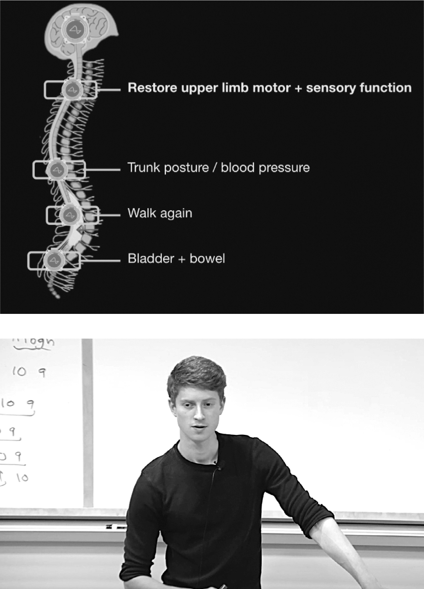

# Chapter 89: Miracles: Neuralink, November 2022

# 89 Miracles Neuralink, November 2022

A slide showing the goal and Jeremy Barenholtz

## Cures

When Musk moved to Texas, followed by Shivon Zilis, he decided to open a Neuralink facility in Austin in addition to the one in Fremont, California. The Austin office and lab were in a strip-mall building with a sign saying “Hatchet Alley” on the door. It had been an axe-throwing venue and bowling alley. Zilis retrofitted it to include open workspaces, labs, a glass-enclosed conference room, and a long coffee bar in the center. A few miles away was a set of barns for the pigs and sheep that were used in experiments.

During a visit to the pig barns in late 2021, Musk became impatient with the pace of work at Neuralink. It had implanted a chip into the brain of a monkey and taught it to play *Pong* telepathically, but so far that had mainly served to get Neuralink a lot of views on YouTube rather than transforming humanity. “Guys, this is a little hard to explain to people in a way that really grabs them,” he said as they walked around. “A paralyzed person might someday use their mind to move a cursor on a computer, and that’s kind of cool, especially for someone like a Stephen Hawking. But it’s not enough. It’s hard to get most people excited by that.”

That’s when Musk started pushing the idea of using Neuralink to enable paralyzed people to actually use their limbs again. A chip in the brain could send signals to the relevant muscles, bypassing any spinal-cord blockage or neurological malfunction. As soon as he got back to Hatchet Alley from the pig barn, he gathered his top Austin team, with their colleagues in Fremont dialing in, to announce this new additional mission. “Getting someone in a wheelchair to walk again, people will get it right away,” he said. “It’s a gut-punch idea, a fucking bold thing. And a good thing.”

Musk made weekly visits to the Neuralink labs for review meetings. During one of them, in August 2022, lead engineer Jeremy Barenholtz waited at the coffee bar for the meeting to begin. He had graduated from Stanford with a master’s in computer science systems a year earlier, but with his rusty-red cowlick and wispy facial hair, he could still pass for a middle-school science-fair contestant. “Elon felt that controlling a computer with your mind is nice, but it doesn’t have the same limbic resonance as making paralyzed people walk again,” he said. “So we’ve been focused on a plan for that.” He walked me through the different muscle-stimulation methods and ventured into a discussion of why he believes that signals in the brain are propagated by the chemical diffusion of charged molecules rather than electromagnetic waves, as conventional theory has it.

When Musk finished sending emails and tweets on his phone, a dozen young engineers gathered in the conference room, all of them, including Zilis, wearing black T-shirts, as he always did. Barenholtz passed around a sample of hydrogel that resembled the soft tissues of a brain cortex and showed a video of two experimental pigs, named Captain and Tennille, moving their legs in response to electrical signals. “We have to be able to distinguish between pain reactions and muscle actuation, otherwise it’s simply, ‘You can walk again but in agony,’ ” Musk said. “But it does show we’re not breaking the laws of physics in trying to enable people to walk again, which would be just insanely mind blowing, Jesus-level stuff.”

When he asked what other miracles they might aim for, Barenholtz suggested audio and visual stimulation—in other words, enabling the deaf to hear and the blind to see. “The easiest would be fixing deafness through cochlear stimulation,” he said. “Vision is super interesting. To get really high-fidelity vision, you need a lot of channels.”

“We can give people crazy vision, you know?” Musk added. “Want to see infrared? Ultraviolet? How about radio waves or radar? Yeah, that one’s cool for augmentation.”

Then he broke into his laugh. “I was rewatching *Life of Brian*,” he said, referring to the Monty Python movie. He recounted the scene where a beggar complains that Jesus cured him of leprosy, making it harder for him to make a living begging: “I was hopping along, minding my own business, all of a sudden, up he comes, cures me! One minute I’m a leper with a trade, next minute my livelihood’s gone. Not so much as a by-your-leave! ‘You’re cured, mate.’ Bloody do-gooder.”

## The presentation

By the end of September, Musk was impatient again. He had been pushing Zilis and Barenholtz to hold a public event to show off their progress, but they said they weren’t ready. At one of his weekly review sessions, his face went dark. “If we don’t accelerate, we’re not going to achieve much in our lifetimes,” he warned. Then he decreed a date for the presentation: Wednesday, November 30. As it turned out, that was the same day he visited Tim Cook at Apple.

When Musk arrived that night, there were two hundred chairs set up in Neuralink’s Fremont facility. One of Musk’s favorite podcasters, Lex Fridman, had come in for the event, as had Justin Roiland of the animated TV show *Rick and Morty*. The three musketeers—James, Andrew, and Ross—had not been invited, but they were able to get in through a back door.

Musk wanted the presentation to show off both his ultimate ambitions and his more immediate goals. “My prime motivation with Neuralink,” he told the audience, “is to create a generalized input-output device that could interface with every aspect of your brain.” In other words, it would be the ultimate mind-meld of humans and machine, thus guarding against artificial intelligence machines running amok. “Even if AI is benevolent, how do we make sure that we get to go along with the ride?”

Then he unveiled the new shorter-term missions that he had set for Neuralink. “The first is restoring vision,” he said. “Even if someone was born blind, we believe we can allow them to see.” Next, he talked about paralysis. “As miraculous as it may sound, we’re confident that it is possible to restore full-body functionality to someone who has a severed spinal cord.” The presentation lasted three hours. He stuck around until 1 a.m., partying with his engineers. It was, he later said, a welcome break from the “dumpster fire” at Twitter.

