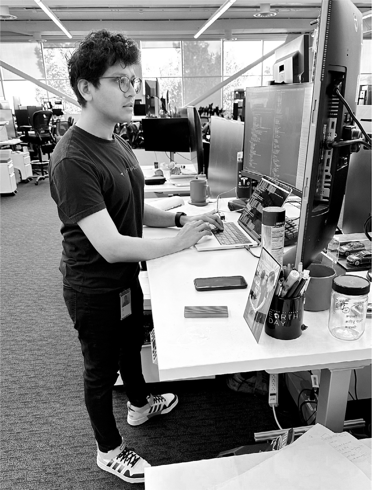

# Chapter 93: AI for Cars: Tesla, 2022–2023

# 93 AI for Cars Tesla, 2022–2023

Dhaval Shroff and his Tesla desk

[*OceanofPDF.com*](https://oceanofpdf.com)

## Cars that learn from humans

“It’s like ChatGPT, but for cars,” Dhaval Shroff told Musk. He was comparing his project at Tesla to the artificial intelligence chatbot that had just been released by OpenAI, the lab that Musk had cofounded with Sam Altman in 2015. For almost a decade, Musk had been working on various forms of artificial intelligence, including self-driving cars, Optimus the robot, and the Neuralink brain-machine interface. Shroff’s project involved the latest machine-learning frontier: devising a self-driving car system that would learn from human behavior. “We process an enormous amount of data on how real humans acted in a complex driving situation, and then we train a computer’s neural network to mimic that.”

Musk had asked to meet with Shroff—who had occasionally served as a fourth musketeer with James, Andrew, and Ross—because he was thinking about persuading him to leave Tesla’s Autopilot team and come work at Twitter. Shroff was hoping to avoid that by convincing Musk of the crucial importance, to Tesla and to the world, of the project he was working on, a “learn-from-humans” component to Tesla’s self-driving software that they were calling “the neural network path planner.”

Their meeting was scheduled for a day that turned out to be so wildly crammed with plot lines that it would seem too contrived if it were part of a screenplay: Friday, December 2, 2022, which was when the first set of Twitter Files was due to be posted by Matt Taibbi. Shroff arrived at Twitter headquarters that morning, as requested, but Musk, who had just come back from unveiling the Cybertruck in Nevada, apologized. He had forgotten that he was due to fly to New Orleans to meet with President Macron to talk about European content moderation regulations. He asked Shroff to come back that evening. As he was waiting for Macron, Musk sent Shroff texts pushing their meeting later. “I’m going to be delayed by four hours,” Musk texted at one point. “Do you mind waiting?” That’s also when he texted Bari Weiss and Nellie Bowles out of the blue asking them to fly up to San Francisco and meet him that night to help with the Twitter Files.

When Musk arrived back in San Francisco late that night, he finally got a chance to sit down with Shroff, who explained the details of the neural network planner project he was working on. “I think it’s super important that I continue doing what I’m doing,” Shroff said. Listening to him, Musk got excited again about the project and agreed. In the future, he realized, Tesla was going to be not just a car company and not just a clean-energy company. With Full Self-Driving and the Optimus robot and the Dojo machine-learning supercomputer, it was going to be an artificial intelligence company—one that operated not only in the virtual world of chatbots but also in the physical real world of factories and roads. He was already thinking about hiring a group of AI experts to compete with OpenAI, and Tesla’s neural network planning team would complement their work.

---

For years, Tesla’s Autopilot system relied on a rules-based approach. It took visual data from a car’s cameras and identified such things as lane markings, pedestrians, vehicles, traffic signals, and anything else in range of the eight cameras. Then the software applied a set of rules, such as *Stop when the light is red*; *Go when it’s green*; *Stay in the middle of the lane markers*; *Don’t cross double-yellow lines into incoming traffic*; *Proceed through an intersection only when there are no cars coming fast enough to hit you*; and so on. Tesla’s engineers manually wrote and updated hundreds of thousands of lines of C++ code to apply these rules to complex situations.

The neural network planner project that Shroff was working on would add a new layer. “Instead of determining the proper path of the car based only on rules,” Shroff says, “we determine the car’s proper path by also relying on a neural network that learns from millions of examples of what humans have done.” In other words, it’s human imitation. Faced with a situation, the neural network chooses a path based on what humans have done in thousands of similar situations. It’s like the way humans learn to speak and drive and play chess and eat spaghetti and do almost everything else; we might be given a set of rules to follow, but mainly we pick up the skills by observing how other people do them. It was the approach to machine learning envisioned by Alan Turing in his 1950 paper, “Computing Machinery and Intelligence.”

Tesla had one of the world’s largest supercomputers to train neural networks. It was powered by graphics processing units (GPUs) made by the chipmaker Nvidia. Musk’s goal for 2023 was to transition to using Dojo, the supercomputer that Tesla was building from the ground up, to use video data to train the AI system. With chips and infrastructure designed in-house by Tesla’s AI team, it has nearly eight exaflops (1018 operations per second) of processing power, making it the world’s most powerful computer for that purpose. It would be used for both self-driving software and for Optimus the robot. “It’s interesting to work on them together,” Musk says. “They are both trying to navigate the world.”

By early 2023, the neural network planner project had analyzed 10 million frames of video collected from the cars of Tesla customers. Does that mean it would merely be as good as the average of human drivers? “No, because we only use data from humans when they handled a situation well,” Shroff explains. Human labelers, many of them based in Buffalo, New York, assessed the videos and gave them grades. Musk told them to look for things “a five-star Uber driver would do,” and those were the videos used to train the computer.

Musk regularly walked through Tesla’s Palo Alto building, where the Autopilot engineers sat in an open workspace, and he would kneel down next to them for impromptu discussions. One day Shroff showed him the progress they were making. Musk was impressed, but he had a question: Was this whole new approach truly needed? Might it be a bit of overkill? One of his maxims was that you should never use a cruise missile to kill a fly; just use a flyswatter. Was using a neural network to plan paths an unnecessarily complicated way to deal with a few very unlikely edge cases?

Shroff showed Musk instances where a neural network planner would work better than a rules-based approach. The demo had a road littered with trash cans, fallen traffic cones, and random debris. A car guided by the neural network planner was able to skitter around the obstacles, crossing the lane lines and breaking some rules as necessary. “Here’s what happens when we move from rules-based to network-path-based,” Shroff told him. “The car will never get into a collision if you turn this thing on, even in unstructured environments.” It was the type of leap into the future that excited Musk. “We should do a James Bond–style demonstration,” he said, “where there are bombs exploding on all sides and a UFO is falling from the sky while the car speeds through without hitting anything.”

Machine-learning systems generally need a goal or metric that guides them as they train themselves. Musk, who liked to manage by decreeing what metrics should be paramount, gave them their lodestar: the number of miles that cars with Tesla Full Self-Driving were able to travel without a human intervening. “I want the latest data on miles per intervention to be the starting slide at each of our meetings,” he decreed. “If we’re training AI, what do we optimize? The answer is higher miles between interventions.” He told them to make it like a video game where they could see their score every day. “Video games without a score are boring, so it will be motivating to watch each day as the miles per intervention increases.”

Members of the team installed massive eighty-five-inch television monitors in their workspace that displayed in real time how many miles the FSD cars were driving on average without interventions. Whenever they would see a type of intervention recurring—such as drivers grabbing the wheel during a lane change or a merge or a turn into a complex intersection—they would work with both the rules and the neural network planner to make a fix. They put a gong near their desks, and whenever they successfully solved a problem causing an intervention, they got to bang the gong.

## An AI test drive

By mid-April 2023, it was time for Musk to put this new neural network planner to the test. He took it for a drive through Palo Alto. Shroff and the Autopilot team had configured a car to rely on software that had been trained by the neural network to imitate human drivers. The software had only a bare minimum of traditional rules-based code.

Musk sat in the driver’s seat next to Ashok Elluswamy, Tesla’s director of Autopilot software. Shroff got in the back with the two other members of his team, Matt Bauch and Chris Payne. The trio had been working at adjoining desks at Tesla for eight years, and they all lived within blocks of each other in San Francisco. On their desks, where most people have a picture of their family, they each had identical pictures of the three of them posing together at a Halloween party. James Musk had been the fourth member of their team, until his uncle took over Twitter and redeployed him there, the fate Shroff had avoided.

As they prepared to leave the parking lot at Tesla’s Palo Alto office complex, Musk selected a location on the map for the car to go, clicked on Full Self-Driving, and took his hands off the wheel. When the car turned onto the main road, the first scary challenge arose: a bicyclist was heading their way. “We were all holding our breath, because cyclists can be unpredictable,” Shroff says. But Musk was unconcerned and didn’t try to grab the wheel. On its own, the car yielded. “It felt exactly like what a human driver would do,” says Shroff.

Shroff and his two teammates explained in detail how the FSD software they were using had been trained on millions of video clips collected from the cameras on customers’ cars. The result was a software stack that was much simpler than the traditional one based on thousands of rules coded by humans. “It runs ten times faster and it could eventually allow for the deletion of 300,000 lines of code,” Shroff said. Bauch said it was like an AI bot playing a really boring video game. Musk let out his laughing snort. Then, as the car wove on its own through traffic, he pulled out his phone and started tweeting.

For twenty-five minutes, the car drove on fast roads and neighborhood streets, handling complex turns and avoiding cyclists, pedestrians, and pets. Musk never touched the wheel. Only a couple of times did he intervene by tapping the accelerator when he thought the car was being overly cautious, such as when it was too deferential at a four-way stop sign. At one point the car conducted a maneuver that he thought was better than he would have done. “Oh wow,” he said, “even my human neural network failed here, but the car did the right thing.” He was so pleased that he started whistling Mozart’s “A Little Night Music” serenade in G major.

“Amazing work guys,” Musk said at the end. “This is really impressive.” They all then went to the weekly meeting of the Autopilot team, where twenty guys, almost all in black T-shirts, sat around a conference table to hear the verdict. Many had not believed that the neural network project would work. Musk declared that he was now a believer and they should move a lot of resources to push it forward.

During the discussion, Musk latched on to a key fact the team had discovered: the neural network did not work well until it had been trained on at least a million video clips, and it started getting really good after one-and-a-half million clips. This gave Tesla a huge advantage over other car and AI companies. It had a fleet of almost two million Teslas around the world collecting billions of video frames per day. “We are uniquely positioned to do this,” Elluswamy said at the meeting.

The ability to collect and analyze vast flows of real-time data would be crucial to all forms of AI, from self-driving cars to Optimus robots to ChatGPT–like bots. And Musk now had two powerful gushers of real-time data, the video from self-driving cars and the billions of postings each week on Twitter. He told the Autopilot meeting that he had just made a major purchase of 10,000 more GPU data-processing chips for use at Twitter, and he announced that he would hold more frequent meetings on the potentially more powerful Dojo chips being designed at Tesla. He also ruefully admitted that his impulsive Christmastime caper of gutting Twitter’s Sacramento data center was a mistake.

Listening in on the meeting was a superstar AI engineer. Musk had just that week hired him for a secret new project he was about to launch.

[*OceanofPDF.com*](https://oceanofpdf.com)
