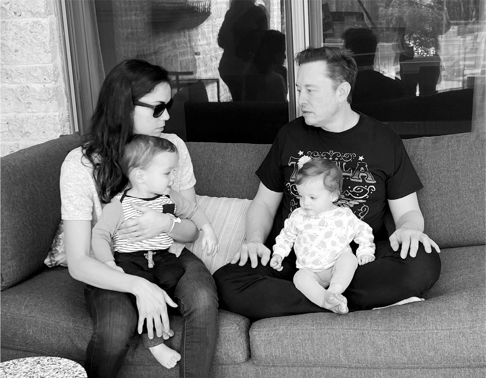

# Chapter 94: AI for Humans: X.AI, 2023

# 94 AI for Humans X.AI, 2023

In Austin with Shivon Zilis and their twins, Strider and Azure

## The great race

Technology revolutions usually start with little fanfare. No one woke up one morning in 1760 and shouted, “OMG, the Industrial Revolution has just begun!” Even the Digital Revolution chugged away for many years in the background, with hobbyists cobbling together personal computers to show off at geeky gatherings such as the Homebrew Computer Club, before people noticed that the world was being fundamentally transformed. But the Artificial Intelligence Revolution was different. Within a few weeks in the spring of 2023, millions of tech-aware and then ordinary folks noticed that a transformation was happening with head-snapping speed that would change the nature of work, learning, creativity, and the tasks of daily life.

For a decade, Musk had been worried about the danger that artificial intelligence could someday run amok—develop a mind of its own, so to speak—and threaten humanity. When Google cofounder Larry Page dismissed his concerns, calling him a “specist” for favoring the human species over other forms of intelligence, it destroyed their friendship. Musk tried to prevent Page and Google from purchasing DeepMind, the company formed by AI pioneer Demis Hassabis. When that failed, he formed a competing lab, a nonprofit called OpenAI, with Sam Altman in 2015.

Humans can be pricklier than machines, and Musk eventually split with Altman, left the board of OpenAI, and lured away its high-profile engineer Andrej Karpathy to lead the Autopilot team at Tesla. Altman then formed a for-profit arm of OpenAI, got a $13 billion investment from Microsoft, and recruited Karpathy back.

Among the products that OpenAI developed was a bot called ChatGPT that was trained on large internet data sets to answer questions posed by users. When Altman and his team showed an early version of it to Bill Gates in June 2022, he said he would not be interested until it could do something like pass an advance-placement biology exam. “I thought that would make them go away for two or three years,” he says. Instead, they were back in three months. Altman, Microsoft CEO Satya Nadella, and others came to dinner at his house to show him a new version, called GPT-4, and Gates bombarded it with biology questions. “It was mind-blowing,” Gates says. He then asked what it would say to a father with a sick child. “It gave this very careful excellent answer that was perhaps better than any of us in the room might have given.”

In March 2023, OpenAI released GPT-4 to the public. Google then released a rival chatbot named Bard. The stage was thus set for a competition between OpenAI-Microsoft and DeepMind-Google to create products that could chat with humans in a natural way and perform an endless array of text-based intellectual tasks.

Musk worried that these chatbots and AI systems, especially in the hands of Microsoft and Google, could become politically indoctrinated, perhaps even infected by what he called the woke-mind virus. He also feared that self-learning AI systems might turn hostile to the human species. And on a more immediate level, he worried that chatbots could be trained to flood Twitter with disinformation, biased reporting, and financial scams. All of those things were already being done by humans, of course. But the ability to deploy thousands of weaponized chatbots would make the problem two or three orders of magnitude worse.

His compulsion to ride to the rescue kicked in. The two-way competition between OpenAI and Google needed, he thought, a third gladiator, one that would focus on AI safety and preserving humanity. He was resentful that he had founded and funded OpenAI but was now left out of the fray. AI was the biggest storm brewing. And there was no one more attracted to a storm than Musk.

In February 2023, he invited—perhaps a better word is “summoned”—Sam Altman to meet with him at Twitter and asked him to bring the founding documents for OpenAI. Musk challenged him to justify how he could legally transform a nonprofit funded by donations into a for-profit that could make millions. Altman tried to show that it was all legitimate, and he insisted that he personally was not a shareholder or cashing in. He also offered Musk shares in the new company, which Musk declined.

Instead, Musk unleashed a barrage of attacks on OpenAI and Altman. “OpenAI was created as an open-source (which is why I named it ‘Open’ AI), non-profit company to serve as a counterweight to Google, but now it has become a closed source, maximum-profit company effectively controlled by Microsoft,” he said. “I’m still confused as to how a non-profit to which I donated $100M somehow became a $30B market cap for-profit. If this is legal, why doesn’t everyone do it?” He called AI “the most powerful tool that mankind has ever created,” and then lamented that it was “now in the hands of a ruthless corporate monopoly.”

Altman was pained. Unlike Musk, he is sensitive and nonconfrontational. He was not making any money off of OpenAI, and he felt that Musk had not drilled down enough into the complexity of the issue of AI safety. However, he did feel that Musk’s criticisms came from a sincere concern. “He’s a jerk,” Altman told Kara Swisher. “He has a style that is not a style that I’d want to have for myself. But I think he does really care, and he is feeling very stressed about what the future’s going to look like for humanity.”

## Musk’s data streams

The fuel for AI is data. The new chatbots were being trained on massive amounts of information, such as billions of pages on the internet and other documents. Google and Microsoft, with their search engines and cloud services and access to emails, had huge gushers of data to help train these systems.

What could Musk bring to the party? One asset was the Twitter feed, which included more than a trillion tweets posted over the years, five hundred million added each day. It was humanity’s hive mind, the world’s most timely data set of real-life human conversations, news, interests, trends, arguments, and lingo. Plus it was a great training ground for a chatbot to test how real humans react to its responses. The value of this data feed was not something Musk considered when buying Twitter. “It was a side benefit, actually, that I realized only after the purchase,” he says.

Twitter had rather loosely permitted other companies to make use of this data stream. In January, Musk convened a series of late-night meetings in his Twitter conference room to work out ways to charge for it. “It’s a monetization opportunity,” he told the engineers. It was also a way to restrict Google and Microsoft from using this data to improve their AI chatbots.

There was another data trove that Musk had: the 160 billion frames *per day* of video that Tesla received and processed from the cameras on its cars. This data was different from the text-based documents that informed chatbots. It was video data of humans navigating in real-world situations. It could help create AI for physical robots, not just text-generating chatbots.

The holy grail of artificial general intelligence was building machines that could operate like humans in physical spaces, such as factories and offices and on the surface of Mars, not just wow us with disembodied chatting. Tesla and Twitter together could provide the data sets and the processing capability for both approaches: teaching machines to navigate in physical space and to answer questions in natural language.

## The Ides of March

“What can be done to make AI safe?” Musk asked. “I keep wrestling with that. What actions can we take to minimize AI danger and assure that human consciousness survives?”

He was sitting cross-legged and barefoot on the poolside patio of the Austin house of Shivon Zilis, the Neuralink executive who was the mother of two of his children and who had been his intellectual companion on artificial intelligence since the founding of OpenAI eight years earlier. Their twins, Strider and Azure, now sixteen months old, were sitting on their laps. Musk was still on his intermittent-fasting diet; for his late brunch, he had doughnuts, which he had begun eating regularly. Zilis made coffee and then put his in the microwave to get it superhot so he wouldn’t chug it too fast.

A week earlier, Musk had texted me, “There are a few important things I would like to talk to you about. Can only be done in person.” When I asked where and when he wanted to meet, he answered, “The Ides of March in Austin.”

I was baffled and, admittedly, a bit worried. Should I beware? It turned out that he wanted to talk about issues he was facing in the future, and the first on his mind was AI. We had to leave our phones in the house while we sat outside, because, he said, someone could use them to monitor our conversation. But he later agreed that I could use what he said about AI in the book.

He spoke in a low monotone punctuated by bouts of almost manic laughter. The amount of human intelligence, he noted, was leveling off, because people were not having enough children. Meanwhile, the amount of computer intelligence was going up exponentially, like Moore’s Law on steroids. At some point, biological brainpower would be dwarfed by digital brainpower.

In addition, new AI machine-learning systems could ingest information on their own and teach themselves how to generate outputs, even upgrade their own code and capabilities. The term “singularity” was used by the mathematician John von Neumann and the sci-fi writer Vernor Vinge to describe the moment when artificial intelligence could forge ahead on its own at an uncontrollable pace and leave us mere humans behind. “That could happen sooner than we expected,” Musk said in an ominous, flat tone.

For a moment I was struck by the oddness of the scene. We were sitting on a suburban patio by a tranquil backyard swimming pool on a sunny spring day, with two bright-eyed twins learning to toddle, as Musk somberly speculated about the window of opportunity for building a sustainable human colony on Mars before an AI apocalypse destroyed Earthly civilization. It made me recall the words of Sam Teller on his second day working for Musk, when he attended a SpaceX board meeting: “They’re sitting around seriously discussing plans to build a city on Mars and what people will wear there, and everyone’s just acting like this is a totally normal conversation.”

Musk lapsed into one of his long silences. He was, as Shivon called it, “batch processing,” referring to the way an old-fashioned computer would cue up a number of tasks and run them sequentially when it had enough processing power available. “I can’t just sit around and do nothing,” he finally said softly. “With AI coming, I’m sort of wondering whether it’s worth spending that much time thinking about Twitter. Sure, I could probably make it the biggest financial institution in the world. But I have only so many brain cycles and hours in the day. I mean, it’s not like I need to be richer or something.”

I started to speak, but he knew what I was going to ask. “So what should my time be spent on?” he said. “Getting Starship launched. Getting to Mars is now far more pressing.” He paused again, then added, “Also, I need to focus on making AI safe. That’s why I’m starting an AI company.”

## X.AI

Musk dubbed his new company X.AI and personally recruited Igor Babuschkin, a leading AI researcher at Google’s DeepMind unit, to be the chief engineer. X.AI would initially house some of its new employees at Twitter. But it would be necessary, said Musk, to turn it into an independent startup, like Neuralink. He was having some trouble recruiting AI scientists because the new frenzy about the field meant that anyone with experience could command starting bonuses of a million dollars or more. “It will be easier to get them if they can become founders of a new company and get equity in it,” he explained.

I calculated that would mean he would be running six companies: Tesla, SpaceX and its Starlink unit, Twitter, The Boring Company, Neuralink, and X.AI. That was three times as many as Steve Jobs (Apple, Pixar) at his peak.

He admitted that he was starting off way behind OpenAI in creating a chatbot that could give natural-language responses to questions. But Tesla’s work on self-driving cars and Optimus the robot put it way ahead in creating the type of AI needed to navigate in the physical world. This meant that his engineers were actually ahead of OpenAI in creating full-fledged artificial general intelligence, which requires both abilities. “Tesla’s real-world AI is underrated,” he said. “Imagine if Tesla and OpenAI had to swap tasks. They would have to make Self-Driving, and we would have to make large language-model chatbots. Who wins? We do.”

In April, Musk assigned Babuschkin and his team three major goals. The first was to make an AI bot that could write computer code. A programmer could begin typing in any coding language, and the X.AI bot would auto-complete the task for the most likely action they were trying to take. The second product would be a chatbot competitor to OpenAI’s GPT series, one that used algorithms and trained on data sets that would assure its political neutrality.

The third goal that Musk gave the team was even grander. His overriding mission had always been to assure that AI developed in a way that helped guarantee that human consciousness endured. That was best achieved, he thought, by creating a form of artificial general intelligence that could “reason” and “think” and pursue “truth” as its guiding principle. You should be able to give it big tasks, such as “Build a better rocket engine.”

Someday, Musk hoped, it would be able to take on even grander and more existential questions. It would be “a maximum truth-seeking AI. It would care about understanding the universe, and that would probably lead it to want to preserve humanity, because we are an interesting part of the universe.” That sounded vaguely familiar, and then I realized why. He was embarking on a mission similar to the one chronicled in the formative (perhaps too formative?) bible of his childhood years, the one that pulled him out of his adolescent existential depression, *The Hitchhiker’s Guide to the Galaxy*, which featured a supercomputer designed to figure out the “Answer to The Ultimate Question of Life, the Universe, and Everything.”

