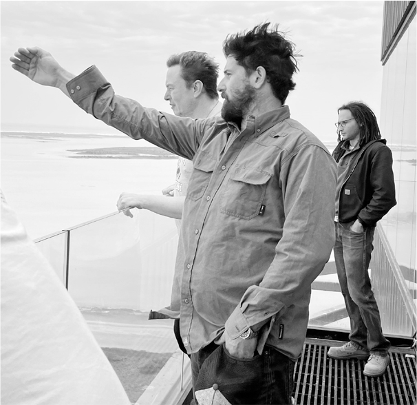
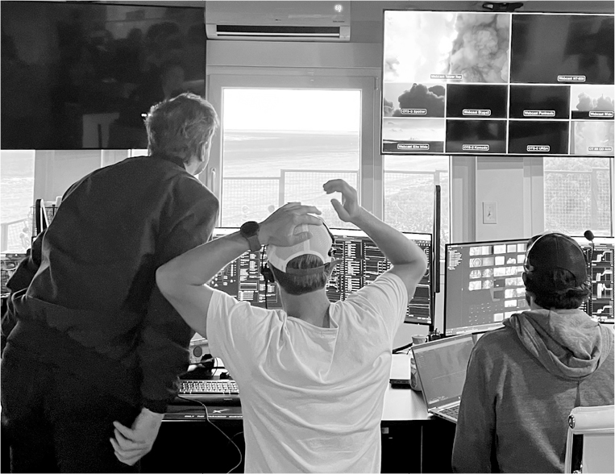
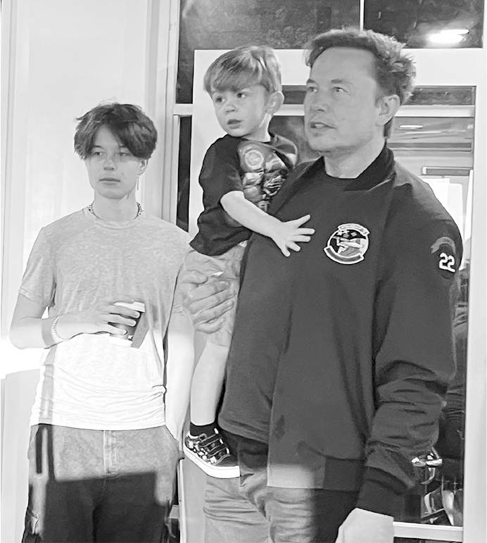
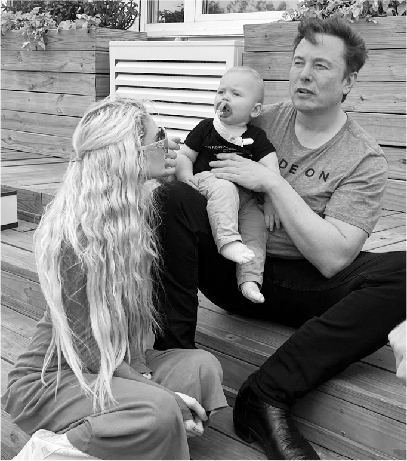

# Chapter 95: The Starship Launch: SpaceX, April 2023

# 95 The Starship Launch SpaceX, April 2023

Musk, Juncosa, and McKenzie atop a high bay in Boca Chica

Watching the Starship launch from the control room

With Griffin and X in the control room

With Grimes and Tau outside the control room

[*OceanofPDF.com*](https://oceanofpdf.com)

## Risky business

“My stomach is twisted in knots,” Musk told Mark Juncosa as they stood on the balcony atop the 265-foot-tall high-bay assembly building at Starbase. “It always happens before a big launch. I have PTSD from the failures on Kwaj.”

It was April 2023, time for the experimental launch of Starship. When he arrived in south Texas, Musk did what he often did before a major rocket launch, including his first one seventeen years earlier: he retreated into the future. He peppered Juncosa with ideas and edicts for replacing Starbase’s four football-field-size assembly tents with a mammoth factory building that could make rockets at a rate of more than one a month. They should start constructing the factory right away, along with a new village of solar-roofed homes for workers. Creating a rocket like Starship was hard, but he knew that the more important step was being able to churn it out at scale. It would eventually take a fleet of a thousand to sustain a human colony on Mars. “My biggest concern is our trajectory. Are we on a trajectory to get to Mars before civilization crumbles?”

When the other engineers joined them for a three-hour pre-launch review in the conference room atop the high bay, Musk gave them a pep talk. “It’s worth keeping in mind as you go through all the tribulations that the thing you’re working on is the coolest fucking thing on Earth. By a lot. What’s the second coolest? This is far cooler than whatever is the second coolest.”

The talk then turned to the topic of risk. The dozen or so regulatory agencies that had to approve the flight test did not share Musk’s love of it. The engineers briefed him on all the safety reviews and requirements they had endured. “Getting the license was existentially soul-sucking,” Juncosa said. Shana Diez and Jake McKenzie provided details. “My fucking brain is hurting,” Musk said, holding his head. “I’m trying to figure out how we get humanity to Mars with all this bullshit.”

He processed in silence for two minutes, and when he emerged from his trance, he was philosophical. “This is how civilizations decline. They quit taking risks. And when they quit taking risks, their arteries harden. Every year there are more referees and fewer doers.” That’s why America could no longer build things like high-speed rail or rockets that go to the moon. “When you’ve had success for too long, you lose the desire to take risks.”

## “An awesome day”

The countdown that Monday was aborted with forty seconds left because of a valve problem, and the launch was rescheduled for three days later, April 20. Was the 4/20 date intentional, yet another reference to the 420 dope-smoking meme, along the lines of his $420 offer to take Tesla private and $54.20 offer to buy Twitter? In fact, it was mainly guided by weather predictions and readiness, but it amused Musk, who had been saying for weeks that the 4/20 date was “fated.” The filmmaker Jonah Nolan, who was documenting the mission, had a maxim that the most ironic outcome is the most likely. Musk added his corollary: “The most entertaining outcome is the most likely.”

Musk had flown to Miami after the aborted first countdown to speak to an advertising conference and reassure them about his plans for Twitter. He arrived back in Boca Chica just after midnight on April 20, slept for three hours, then had some Red Bull and got to the launch control room at 4:30 a.m., four hours before the scheduled liftoff. Forty engineers and flight operations officers, many wearing “Occupy Mars!” T-shirts, sat in rows of consoles in a heat-shielded building with a view across the wetlands to the launchpad six miles away. At dawn, Grimes arrived with X, Y, and their new baby boy, Techno Mechanicus, known as Tau.

A half-hour before the scheduled launch, Juncosa came out to the deck and briefed Musk on an issue that had been detected by one of the sensors. Musk processed it for a few seconds and then declared, “I don’t think that would be an actual risk.” Juncosa did a quick jig, said “Perfect!,” and darted back into the control room. Musk soon followed and took his seat at a front-row console, whistling Beethoven’s “Ode to Joy.”

After a brief pause at T-minus-forty-seconds to make final assessments, Musk gave a nod and the countdown proceeded. At ignition, the flames from the booster’s thirty-three Raptors could be seen out of the control room window and on a dozen monitors. The rocket lifted very slowly. “Holy shit, it’s going up!” Musk shouted, then leaped from his chair and ran outside onto the deck in time to hear the deep-rumbling boom from the blastoff. For more than three minutes, the rocket lifted into the air and rose out of sight.

But when Musk went back inside, it was clear on the monitors that the rocket was wobbling. Two of the engines had started up poorly in the seconds before launch, and a command had been sent to shut them down. That left thirty-one engines on the booster, which would have been enough to complete the mission. But thirty seconds into the flight, two more engines on the rim of the booster blew out due to fuel bleeding from an open valve, and the fire started to spread to adjacent engine bays. The rocket kept climbing, but it was clear by then that it was not going to get into orbit. Protocols required that they intentionally blow it up over water, where it would not be a danger. Musk nodded to the launch director, who sent a “destruct signal” to the rocket three minutes and ten seconds into the flight. Forty-eight seconds later, the video feed from the rocket went black, just as had happened on the first three launches from Kwaj. Once again, the team got to use the slightly ironic phrase “rapid unscheduled disassembly” to describe what had happened.

As they rewatched the videos of the launch, it was clear that the blasts of the Raptor engines had shattered the base of the launchpad, sending huge chunks of concrete into the air. Some of the engines may have been struck by the debris.

Musk, as usual, had been willing to take some risks. When building the pad in 2020, he had decided not to dig a flame trench beneath the launch mount, like most pads have, that would divert the blast from the engines. “This could turn out to be a mistake,” he had said at the time. In addition, in early 2023 the launchpad team had started building a big steel plate that would go on top of the launch mount’s foundation and be cooled by gushers of water. But it turned out not to be ready by the time of the launch, and Musk had calculated, based on data from static-fire tests, that the high-density concrete would survive.

Like the decision to forgo slosh baffles on the early version of the Falcon 1, taking these risks turned out to be a mistake. It’s unlikely that NASA or Boeing, with their stay-safe approach, would have made those decisions. But Musk believed in a fail-fast approach to building rockets. Take risks. Learn by blowing things up. Revise. Repeat. “We don’t want to design to eliminate every risk,” he said. “Otherwise, we will never get anywhere.”

He had declared beforehand that he would consider the experimental launch a success if the rocket cleared the pad, rose high enough to blow up out of sight, and provided a lot of useful new information and data. It accomplished those goals. Nevertheless, it had exploded. Most of the public would consider it a flaming failure. And for a moment, as he stared at the monitor, Musk seemed subdued.

But the rest of the control room began applauding. They were jubilant at what they had achieved and what they had learned. Musk finally stood up, put his hands above his head, and turned to the room. “Nicely done guys,” he said. “Success. Our goal was to get clear of the pad and explode out of sight, and we did. There’s too much that can go wrong to get to orbit the first time. This is an awesome day.”

---

That evening, a hundred or so SpaceX employees and friends gathered at the Tiki Bar at Starbase for a semi-celebratory party featuring slow-roasted suckling pig and dancing. Behind the bandstand were some older Starships, their stainless steel reflecting the lights from the party, with Mars, bright and red, rising as if on cue in the night sky just above them.

On one side of the lawn, Gwynne Shotwell talked to Hans Koenigsmann, the fourth employee of SpaceX, who had brought her to meet Musk twenty-one years earlier. Koenigsmann, a veteran of the Kwaj launches, had flown to south Texas on his own to watch this one as a spectator. He had not seen Musk since the Inspiration4 launch in 2021, when he was being eased out of the company. He thought about going over to say hello but decided against it. “Elon is not one for looking back and being sentimental,” he said. “He’s not good at that type of empathy.”

Musk and Grimes sat at one of the picnic tables with his mother, Maye, who had arrived late the night before after celebrating her seventy-fifth birthday in New York. She reminisced about how her parents had flown the family to explore South Africa’s Kalahari Desert every year when she was a child. Elon took after them, she said, one generation of risk-seekers passing along the trait to the next.

X wandered over to one of the fire pits, and when Musk gently tried to pull him away, he squirmed and squealed, not happy to be restrained. So Musk let him go. “One day when I was young, my parents warned me against playing with fire,” he recalled. “So I took a box of matches behind a tree and started lighting them.”

## “Molded out of faults”

The explosion of Starship was emblematic of Musk, a fitting metaphor for his compulsion to aim high, act impulsively, take wild risks, and accomplish amazing things—but also to blow things up and leave smoldering debris in his wake while cackling maniacally. His life had long been an admixture of historically transforming achievements along with wild flameouts, broken promises, and arrogant impulses. Both his accomplishments and his failures were epic. That made him revered by fanboys and reviled by critics, each side exhibiting the feverish fervor of the hyperpolarized Age of Twitter.

Driven since childhood by demons and heroic compulsions, he stoked the controversies by making inflammatory political pronouncements and picking unnecessary fights. Completely possessed at times, he regularly propelled himself to the Kármán line of craziness, the blurry border that separates vision from hallucination. His life had too few flame diverters.

In these regards, the launch had been part of a typical week, one filled with a willingness to embrace the type of risks seldom taken in mature industries or by mature CEOs.

* On a Tesla earnings call that week, he doubled down on his strategy of cutting prices in order to increase sales volume, and once again he predicted, as he had every year since 2016, that Full Self-Driving would be ready within a year.
* At the ad sales conference he attended in Miami that week, the person who interviewed him onstage, NBC Universal’s advertising chief Linda Yaccarino, made a surprising private suggestion: she could be the person he was seeking to run Twitter. They had never met before, but ever since he bought Twitter, she had been pursuing him by text and phone to convince him to come to the conference. “We had a similar vision of what Twitter could become, and I wanted to help him, which led to me stalking him to let me interview him in Miami,” she says. She arranged a dinner for him that night with a dozen top advertisers, and he stayed for four hours. He realized that she might be a perfect fit; she was wickedly smart, eager for the job, understood advertising and subscription revenues, and had the right down-to-earth spunkiness to smooth relationships, like Gwynne Shotwell did at SpaceX. But he didn’t want to cede too much control. “I would still have to work at Twitter,” he told her, which was a polite way of saying that he would still be in charge. She told him to think about it as a relay race. “You build the product, you pass the baton to me, and I execute and sell it.” He would end up offering her the title of Twitter CEO, with him remaining executive chairman and chief technology officer.
* On the morning of the launch, he barreled ahead at Twitter with his plan to remove the identity-verification blue check marks that had been bestowed on celebrities, journalists, and other notables. Only those who had signed up to pay a subscription fee, which few had, would be able to keep them. He acted out of an overly righteous sense of moral fairness rather than considering what would make the service best for users, and it detonated paroxysms of knicker-twisting indignation among the Twitterati about who did or did not desire or deserve check marks.
* Over at Neuralink that week, a final round of animal studies was completed and the company started working with the Food and Drug Administration to allow chips to be implanted into the brains of human test subjects. The approval would come four weeks later. Musk urged them to hold public demonstrations of their progress. “We want to bring the public in on everything we’re doing,” he told the team. “Then they will support us. That’s why we live-streamed the Starship launch, even knowing it was likely to explode at some point.”
* After another test drive at Tesla, he declared that he was now convinced they should go all in on AI by using the neural network path planner being developed by Dhaval Shroff and his teammates, which learns from video clips how to imitate a good human driver. He told them to create one integrated neural network for Full Self-Driving. Just like ChatGPT can predict the next words in a conversation, FSD’s AI system should take in images from a car’s cameras and predict the next actions for the steering wheel and pedals.
* A SpaceX Dragon capsule departed the International Space Station and splashed down safely off the Florida coast. It was still the only American craft that could go up to the Space Station and return, as it had done a month earlier with four astronauts, including one from Russia and one from Japan, as it would do again four weeks later.

Do the audaciousness and hubris that drive him to attempt epic feats excuse his bad behavior, his callousness, his recklessness? The times he’s an asshole? The answer is no, of course not. One can admire a person’s good traits and decry the bad ones. But it’s also important to understand how the strands are woven together, sometimes tightly. It can be hard to remove the dark ones without unraveling the whole cloth. As Shakespeare teaches us, all heroes have flaws, some tragic, some conquered, and those we cast as villains can be complex. Even the best people, he wrote, are “molded out of faults.”

During launch week, Antonio Gracias and some other friends talked to Musk about the need to restrain his impetuous and destructive instincts. If he was going to lead a new era of space exploration, they said, he needed to be more elevated, to be above the fray politically. They recalled the time Gracias made him put his phone in a hotel safe overnight, with Gracias punching in the code so Musk couldn’t get it out to tweet during the wee hours; Musk woke up at 3 a.m. and summoned hotel security to open the safe. After the launch, he displayed a touch of self-awareness. “I’ve shot myself in the foot so often I ought to buy some Kevlar boots,” he joked. Perhaps, he ruminated, Twitter should have an impulse-control delay button.

It was a pleasing concept: an impulse-control button that could defuse Musk’s tweets as well as all of his dark impulsive actions and demon-mode eruptions that leave rubble in his wake. But would a restrained Musk accomplish as much as a Musk unbound? Is being unfiltered and untethered integral to who he is? Could you get the rockets to orbit or the transition to electric vehicles without accepting all aspects of him, hinged and unhinged? Sometimes great innovators are risk-seeking man-children who resist potty training. They can be reckless, cringeworthy, sometimes even toxic. They can also be crazy. Crazy enough to think they can change the world.

With Grimes and Maye after the launch

[*OceanofPDF.com*](https://oceanofpdf.com)
